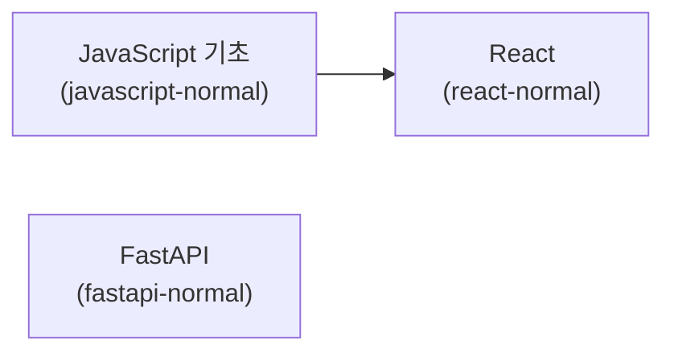

# Dev Learning with Claude Code

Claude Code를 활용하여 생성한 개발 학습 자료 레포지토리입니다.

## 학습 로드맵



> **프론트엔드 트랙**: `javascript-normal` → `react-normal` 순서로 학습하세요.
> **백엔드 트랙**: `fastapi-normal`은 독립적으로 학습할 수 있습니다.

---

## 학습 자료 목록

| 과정 | 난이도 | 대상 | 설명 |
|------|--------|------|------|
| [javascript-normal](./javascript-normal/) | ⭐ ~ ⭐⭐⭐ | React 학습을 위한 JavaScript 입문자 | JavaScript 필수 기초 (3개 챕터) |
| [react-normal](./react-normal/) | ⭐ ~ ⭐⭐⭐ | JavaScript 기초를 마친 프론트엔드 입문자 | React 핵심 개념과 실전 프로젝트 (7개 챕터) |
| [fastapi-normal](./fastapi-normal/) | ⭐ ~ ⭐⭐⭐ | Python 중급자, 웹 API 입문자 | REST API 구축을 위한 핵심 개념과 실습 (11개 챕터) |

---

### JavaScript (Normal) — 3개 챕터

| 챕터 | 주제 | 섹션 |
|------|------|------|
| Ch01 | JavaScript 기본 문법 | 변수와 데이터 타입, 조건문과 반복문 |
| Ch02 | 함수와 객체 | 함수 선언과 활용, 객체와 배열, 배열 메서드 |
| Ch03 | 모던 JavaScript | ES6+ 핵심 문법, 비동기 프로그래밍, 모듈 시스템 |

### React (Normal) — 7개 챕터

| 챕터 | 주제 | 섹션 |
|------|------|------|
| Ch01 | React 시작하기 | React 소개, 개발 환경 설정 |
| Ch02 | JSX와 컴포넌트 | JSX 문법, 함수 컴포넌트 |
| Ch03 | Props와 State | Props 전달, State와 이벤트 |
| Ch04 | 리스트와 폼 | 리스트 렌더링, 폼 입력 처리 |
| Ch05 | Hooks 기초 | useEffect, useRef |
| Ch06 | 컴포넌트 설계 패턴 | 컴포넌트 합성, 커스텀 Hook |
| Ch07 | 실전 프로젝트 | API 연동, Todo 앱 |

### FastAPI (Normal) — 11개 챕터

| 챕터 | 주제 | 섹션 |
|------|------|------|
| Ch01 | FastAPI 시작하기 | 설치, 첫 번째 앱, 개발 서버 |
| Ch02 | 경로/쿼리 매개변수 | 경로 매개변수, 쿼리 매개변수, 매개변수 검증 |
| Ch03 | 요청 본문 | Pydantic 모델, 중첩 모델, 폼/파일 처리 |
| Ch04 | 응답 처리 | 응답 모델, 상태 코드, 에러 처리 |
| Ch05 | 의존성 주입 | 기본 의존성, 클래스 의존성, 중첩 의존성 |
| Ch06 | 미들웨어와 CORS | 미들웨어 기본, CORS 설정, 커스텀 미들웨어 |
| Ch07 | 데이터베이스 연동 | SQLAlchemy 설정, CRUD 구현, 관계 매핑 |
| Ch08 | 인증과 보안 | OAuth2/JWT, 비밀번호 해싱, 보호된 라우트 |
| Ch09 | 비동기 프로그래밍 | async/await 기본, 비동기 I/O, 백그라운드 작업 |
| Ch10 | 로깅 | 로깅 기본, 구조화된 로깅, 로깅 설정 |
| Ch11 | 예외 처리 | 예외 계층, 전역 핸들러, 에러 미들웨어 |

---

## 레포지토리 구조

```
├── javascript-normal/                # JavaScript 기초 (React 선행 학습)
│   ├── ch01-basics/
│   ├── ch02-functions-objects/
│   ├── ch03-modern-js/
│   ├── resources/
│   └── README.md
├── react-normal/                     # React 핵심 개념
│   ├── ch01-getting-started/
│   ├── ch02-jsx-components/
│   ├── ...
│   ├── ch07-project/
│   ├── resources/
│   └── README.md
├── fastapi-normal/                   # FastAPI REST API
│   ├── ch01-getting-started/
│   ├── ...
│   ├── ch08-auth-security/
│   ├── ch09-async-programming/
│   ├── ch10-logging/
│   ├── ch11-exception-handling/
│   ├── resources/
│   └── README.md
└── README.md
```

각 섹션은 동일한 구조를 따릅니다:

```
secXX-topic/
├── concept.md          # 개념 설명
├── exercise.md         # 연습 문제
├── exercise.{js,jsx,py}  # 풀이용 스켈레톤 코드
└── solution.{js,jsx,py}  # 정답 코드
```

## 학습 방법

각 섹션별로 아래 순서를 따릅니다.

1. `concept.md`를 읽고 핵심 개념을 이해한다
2. `exercise.md`의 연습 문제를 읽는다
3. 스켈레톤 코드(`exercise.*`)를 직접 완성해본다
4. 막히면 정답 코드(`solution.*`)를 참고한다
5. `resources/glossary.md`에서 용어를 복습한다

## 생성 도구

이 학습 자료는 [Claude Code](https://docs.anthropic.com/en/docs/claude-code)를 사용하여 생성되었습니다.
