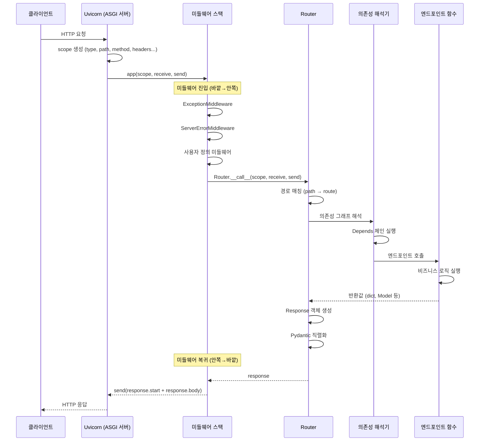
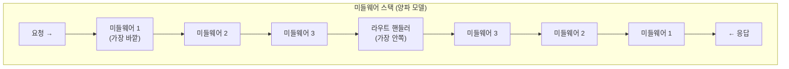

# 챕터 01: ASGI 아키텍처와 FastAPI 내부 구조

> **난이도**: ⭐⭐⭐ (3/5)
> **예상 학습 시간**: 3~4시간
> **사전 요구사항**: FastAPI 기본 사용법, Python 비동기 프로그래밍 기초

---

## 학습 목표

1. ASGI 프로토콜의 명세(scope, receive, send)를 정확히 이해한다
2. FastAPI → Starlette → ASGI 계층 구조를 분석할 수 있다
3. 요청/응답 생명주기를 내부 수준에서 추적할 수 있다
4. 미들웨어 스택의 양파 모델을 이해하고 커스텀 미들웨어를 설계할 수 있다
5. 라우팅 내부 동작(경로 매칭 알고리즘)을 파악한다
6. 순수 ASGI 애플리케이션을 직접 작성할 수 있다

---

## 1. ASGI 프로토콜 명세

### 1.1 WSGI의 한계와 ASGI의 등장

WSGI(Web Server Gateway Interface)는 동기 프로토콜로, 요청 하나당 스레드 하나를 점유한다. WebSocket, HTTP/2, 장기 폴링 같은 비동기 패턴을 지원하지 못하는 근본적 한계가 있다.

ASGI(Asynchronous Server Gateway Interface)는 이를 해결하기 위해 설계된 비동기 프로토콜이다.

### 1.2 ASGI 애플리케이션의 시그니처

```python
async def application(scope: dict, receive: Callable, send: Callable) -> None:
    ...
```

세 가지 매개변수의 역할:

| 매개변수 | 타입 | 역할 |
|---------|------|------|
| `scope` | `dict` | 연결에 대한 메타데이터 (HTTP 메서드, 경로, 헤더 등) |
| `receive` | `async callable` | 클라이언트로부터 메시지를 수신하는 코루틴 |
| `send` | `async callable` | 클라이언트에게 메시지를 전송하는 코루틴 |

### 1.3 Scope 상세 구조

HTTP 요청의 scope 예시:

```python
{
    "type": "http",                    # 프로토콜 타입 (http, websocket, lifespan)
    "asgi": {"version": "3.0"},        # ASGI 버전
    "http_version": "1.1",             # HTTP 버전
    "method": "GET",                   # HTTP 메서드
    "path": "/api/users",             # 요청 경로
    "root_path": "",                   # SCRIPT_NAME에 해당
    "query_string": b"page=1",         # 쿼리 문자열 (바이트)
    "headers": [                       # 헤더 목록 (바이트 튜플)
        (b"host", b"localhost:8000"),
        (b"content-type", b"application/json"),
    ],
    "server": ("localhost", 8000),     # 서버 주소
    "client": ("127.0.0.1", 54321),   # 클라이언트 주소
}
```

> **핵심**: scope는 연결 수준의 정보이다. HTTP에서는 요청당 하나의 scope가 생성되지만, WebSocket에서는 연결 전체가 하나의 scope를 공유한다.

### 1.4 Receive와 Send 메시지

**HTTP 요청 본문 수신 (receive)**:
```python
{
    "type": "http.request",
    "body": b"...",          # 본문 청크
    "more_body": True/False  # 추가 데이터 존재 여부
}
```

**HTTP 응답 전송 (send)**:
```python
# 1단계: 응답 헤더 전송
{
    "type": "http.response.start",
    "status": 200,
    "headers": [(b"content-type", b"application/json")],
}

# 2단계: 응답 본문 전송
{
    "type": "http.response.body",
    "body": b'{"key": "value"}',
    "more_body": False,  # 스트리밍 시 True
}
```

> **주의사항**: `http.response.start`는 반드시 `http.response.body` 전에 한 번만 전송해야 한다. 순서를 어기면 프로토콜 위반이다.

---

## 2. Starlette 기반 구조 분석

### 2.1 계층 구조

```
FastAPI (라우팅 데코레이터, OpenAPI 생성, 의존성 주입)
  └── Starlette (Request/Response 추상화, 라우팅, 미들웨어)
        └── ASGI (scope, receive, send 원시 프로토콜)
              └── Uvicorn/Hypercorn (ASGI 서버)
```

### 2.2 FastAPI 클래스의 상속 체인

```python
# FastAPI 소스 코드 (간략화)
class FastAPI(Starlette):
    def __init__(self, ...):
        super().__init__(...)
        self.router = APIRouter()  # Starlette의 Router가 아닌 확장 버전

    def add_api_route(self, path, endpoint, ...):
        """OpenAPI 스키마 생성 + 의존성 주입 + 타입 검증을 추가"""
        ...
```

FastAPI가 Starlette 위에 추가하는 핵심 기능:

| 기능 | Starlette | FastAPI |
|------|-----------|---------|
| 라우팅 | `Route`, `Router` | `APIRoute`, `APIRouter` |
| 요청 검증 | 수동 처리 | Pydantic 자동 검증 |
| 응답 직렬화 | 수동 처리 | `response_model` 자동 직렬화 |
| API 문서 | 없음 | OpenAPI 자동 생성 |
| 의존성 주입 | 없음 | `Depends` 시스템 |

### 2.3 ASGI 호출 흐름 추적

```python
# FastAPI.__call__이 호출되는 과정
# 1. Uvicorn이 ASGI 앱을 호출
await app(scope, receive, send)

# 2. FastAPI(Starlette).__call__
#    → self.middleware_stack(scope, receive, send)

# 3. 미들웨어 스택 순회 (바깥 → 안쪽)
#    → ExceptionMiddleware
#      → ServerErrorMiddleware
#        → 사용자 정의 미들웨어들
#          → Router.__call__

# 4. Router가 경로 매칭 후 엔드포인트 호출
#    → APIRoute.handle(scope, receive, send)
#      → request = Request(scope, receive, send)
#      → 의존성 해석
#      → 엔드포인트 함수 실행
#      → Response 생성 및 send 호출
```

---

## 3. 요청/응답 생명주기 상세 분석



### 3.1 생명주기 단계별 상세

1. **연결 수립**: Uvicorn이 소켓에서 연결을 수락하고 HTTP 파싱
2. **Scope 생성**: 요청 메타데이터를 딕셔너리로 구성
3. **ASGI 호출**: `app(scope, receive, send)` 실행
4. **미들웨어 진입**: 등록된 순서대로 바깥에서 안쪽으로 진행
5. **라우팅**: 경로 매칭 알고리즘으로 적절한 Route 결정
6. **의존성 해석**: Depends 그래프를 토폴로지 정렬 후 실행
7. **검증**: Pydantic으로 경로/쿼리/본문 파라미터 검증
8. **엔드포인트 실행**: 사용자 정의 함수 호출
9. **응답 직렬화**: 반환값을 JSON으로 직렬화
10. **미들웨어 복귀**: 안쪽에서 바깥으로 역순 진행
11. **전송**: send를 통해 응답 바이트 전송

---

## 4. 미들웨어 스택 동작 방식 (양파 모델)

### 4.1 양파 모델 개념



미들웨어는 양파의 층(layer)처럼 동작한다:
- **요청**: 바깥 → 안쪽 (등록 순서)
- **응답**: 안쪽 → 바깥 (등록 역순)
- 각 미들웨어는 요청 전/후에 로직을 실행할 수 있다

### 4.2 미들웨어 등록 순서와 실행 순서

```python
app = FastAPI()

# 등록 순서 (위→아래)
app.add_middleware(MiddlewareA)  # 가장 바깥
app.add_middleware(MiddlewareB)
app.add_middleware(MiddlewareC)  # 가장 안쪽 (라우터에 가까움)

# 실행 순서:
# 요청:  A.before → B.before → C.before → 핸들러
# 응답:  C.after  → B.after  → A.after  → 클라이언트
```

> **주의사항**: FastAPI에서 `add_middleware`는 스택의 맨 위에 추가하므로, 마지막에 등록한 미들웨어가 가장 안쪽에서 실행된다. 이 점이 직관에 반할 수 있으므로 주의해야 한다.

### 4.3 두 가지 미들웨어 구현 방식

**방식 1: BaseHTTPMiddleware (고수준)**
```python
from starlette.middleware.base import BaseHTTPMiddleware

class TimingMiddleware(BaseHTTPMiddleware):
    async def dispatch(self, request, call_next):
        start = time.time()
        response = await call_next(request)  # 다음 미들웨어 호출
        response.headers["X-Time"] = str(time.time() - start)
        return response
```

**방식 2: 순수 ASGI 미들웨어 (저수준, 더 높은 성능)**
```python
class TimingMiddlewareASGI:
    def __init__(self, app):
        self.app = app

    async def __call__(self, scope, receive, send):
        if scope["type"] != "http":
            await self.app(scope, receive, send)
            return

        start = time.time()

        async def send_wrapper(message):
            if message["type"] == "http.response.start":
                headers = list(message.get("headers", []))
                duration = str(time.time() - start).encode()
                headers.append((b"x-time", duration))
                message["headers"] = headers
            await send(message)

        await self.app(scope, receive, send_wrapper)
```

> **성능 팁**: `BaseHTTPMiddleware`는 내부적으로 전체 응답 본문을 메모리에 버퍼링한다. 대용량 스트리밍 응답에서는 순수 ASGI 미들웨어가 훨씬 효율적이다.

---

## 5. 라우팅 내부 동작

### 5.1 경로 매칭 알고리즘

Starlette의 라우터는 등록된 경로를 순서대로 검사한다 (선형 탐색):

```python
# Starlette Router 내부 (간략화)
class Router:
    async def __call__(self, scope, receive, send):
        for route in self.routes:
            match, child_scope = route.matches(scope)
            if match == Match.FULL:
                scope.update(child_scope)
                await route.handle(scope, receive, send)
                return
        # 매칭 실패 → 404
```

### 5.2 경로 파라미터 파싱

```python
# "/users/{user_id}/posts/{post_id}" 경로의 내부 처리:
# 1. 정규식 변환: r"^/users/(?P<user_id>[^/]+)/posts/(?P<post_id>[^/]+)$"
# 2. 타입 변환: FastAPI가 타입 힌트에 따라 자동 변환
#    - user_id: int → int("123")
#    - post_id: int → int("456")
```

### 5.3 매칭 우선순위

```python
# 고정 경로가 동적 경로보다 우선한다
@app.get("/users/me")       # 먼저 매칭 시도
@app.get("/users/{user_id}")  # 위가 실패하면 이것 시도

# 등록 순서가 중요하다!
# 잘못된 순서:
@app.get("/users/{user_id}")  # "me"도 이것에 매칭됨!
@app.get("/users/me")         # 도달 불가능
```

---

## 6. 커스텀 ASGI 애플리케이션 만들기

### 6.1 순수 ASGI 라우터

```python
async def custom_router(scope, receive, send):
    """수동 라우팅을 구현한 ASGI 애플리케이션"""
    path = scope["path"]
    method = scope["method"]

    routes = {
        ("GET", "/"): handle_root,
        ("GET", "/health"): handle_health,
        ("POST", "/echo"): handle_echo,
    }

    handler = routes.get((method, path))
    if handler:
        await handler(scope, receive, send)
    else:
        await send_404(scope, receive, send)
```

### 6.2 ASGI 앱을 FastAPI에 마운트

```python
from fastapi import FastAPI
from starlette.routing import Mount

app = FastAPI()

# 순수 ASGI 앱을 특정 경로에 마운트
app.mount("/legacy", custom_asgi_app)
```

---

## 정리표

| 개념 | 핵심 포인트 |
|------|------------|
| ASGI 시그니처 | `async def app(scope, receive, send)` |
| scope | 연결 메타데이터 딕셔너리 (type, path, method, headers 등) |
| receive | 클라이언트 → 서버 메시지 수신 코루틴 |
| send | 서버 → 클라이언트 메시지 전송 코루틴 |
| FastAPI 상속 | `FastAPI` → `Starlette` → ASGI 호환 |
| 미들웨어 양파 모델 | 요청: 바깥→안쪽, 응답: 안쪽→바깥 |
| BaseHTTPMiddleware | 간편하지만 응답 본문 버퍼링 발생 |
| 순수 ASGI 미들웨어 | 고성능이지만 저수준 처리 필요 |
| 경로 매칭 | 선형 탐색, 등록 순서 중요 |

---

## 다음 단계

- **챕터 02**: Pydantic v2의 고급 패턴을 학습하여 FastAPI의 자동 검증/직렬화를 깊이 이해한다
- 실습에서 순수 ASGI 앱, 커스텀 미들웨어, 라우팅 동작을 직접 구현해본다
- Uvicorn의 소스 코드를 읽어보면 ASGI 서버의 내부 동작을 더 깊이 이해할 수 있다
