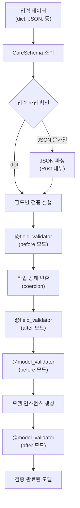

# 챕터 02: 고급 Pydantic 패턴

> **난이도**: ⭐⭐⭐ (3/5)
> **예상 학습 시간**: 3~4시간
> **사전 요구사항**: Pydantic 기본 사용법, Python 제네릭, 타입 힌트

---

## 학습 목표

1. Pydantic v2의 내부 아키텍처(pydantic-core, Rust 기반)를 이해한다
2. 커스텀 validator 체인(@field_validator, @model_validator)을 설계할 수 있다
3. 제네릭 모델(Generic[T])로 재사용 가능한 스키마를 만들 수 있다
4. 판별 합집합(Discriminated Union)으로 다형성 응답을 처리할 수 있다
5. 커스텀 직렬화와 성능 최적화 기법을 적용할 수 있다
6. JSON Schema 생성과 OpenAPI 연동 원리를 파악한다

---

## 1. Pydantic v2 아키텍처

### 1.1 내부 구조

Pydantic v2는 핵심 검증 로직을 Rust로 작성된 `pydantic-core`에 위임한다.

```
Pydantic v2 (Python)
  ├── 모델 정의 (BaseModel, 데코레이터)
  ├── JSON Schema 생성
  ├── 직렬화 인터페이스
  └── pydantic-core (Rust, PyO3)
       ├── CoreSchema (검증 규칙 트리)
       ├── SchemaValidator (검증 실행기)
       └── SchemaSerializer (직렬화 실행기)
```

### 1.2 검증 파이프라인



### 1.3 CoreSchema 이해

```python
from pydantic import BaseModel

class User(BaseModel):
    name: str
    age: int

# CoreSchema 확인
print(User.__pydantic_core_schema__)
# → 내부적으로 Rust가 사용하는 검증 규칙 트리
```

> **핵심**: Pydantic v2는 모델 클래스 생성 시(메타클래스 단계) CoreSchema를 한 번 컴파일한다. 이후 모든 검증은 이 컴파일된 스키마를 재사용하므로 v1 대비 5~50배 빠르다.

---

## 2. 커스텀 Validator

### 2.1 @field_validator

필드 단위 검증을 수행한다. `mode` 매개변수로 실행 시점을 제어한다.

```python
from pydantic import BaseModel, field_validator

class Product(BaseModel):
    name: str
    price: float
    discount_rate: float = 0.0

    @field_validator("name")
    @classmethod
    def validate_name(cls, v: str) -> str:
        """이름은 비어있을 수 없고 100자 이내여야 한다"""
        if not v.strip():
            raise ValueError("이름은 비어있을 수 없습니다")
        if len(v) > 100:
            raise ValueError("이름은 100자를 초과할 수 없습니다")
        return v.strip()

    @field_validator("price", mode="before")
    @classmethod
    def validate_price(cls, v) -> float:
        """문자열 가격도 허용하되 음수는 거부"""
        if isinstance(v, str):
            v = float(v.replace(",", ""))
        if v < 0:
            raise ValueError("가격은 음수일 수 없습니다")
        return v
```

### 2.2 mode="before" vs mode="after"

| 모드 | 실행 시점 | 입력값 | 용도 |
|------|----------|--------|------|
| `before` | 타입 변환 전 | 원시 입력값 (Any) | 전처리, 형 변환 |
| `after` | 타입 변환 후 | 변환된 타입 값 | 비즈니스 규칙 검증 |
| `wrap` | 내부 검증 래핑 | 원시 입력값 + handler | 조건부 검증 |
| `plain` | 기본 검증 대체 | 원시 입력값 | 완전한 커스텀 검증 |

### 2.3 @model_validator

모델 전체 수준의 검증을 수행한다. 필드 간 관계를 검증할 때 사용한다.

```python
from pydantic import BaseModel, model_validator

class DateRange(BaseModel):
    start_date: str
    end_date: str

    @model_validator(mode="after")
    def validate_date_range(self) -> "DateRange":
        """종료일은 시작일 이후여야 한다"""
        if self.end_date < self.start_date:
            raise ValueError(
                f"종료일({self.end_date})은 "
                f"시작일({self.start_date}) 이후여야 합니다"
            )
        return self

    @model_validator(mode="before")
    @classmethod
    def preprocess(cls, data: dict) -> dict:
        """before 모드에서는 원시 딕셔너리를 받는다"""
        if isinstance(data, dict):
            # 날짜 형식 정규화 등의 전처리
            for key in ("start_date", "end_date"):
                if key in data and isinstance(data[key], str):
                    data[key] = data[key].strip()
        return data
```

---

## 3. 제네릭 모델 (Generic[T])

### 3.1 기본 제네릭 모델

```python
from typing import TypeVar, Generic, Optional
from pydantic import BaseModel

T = TypeVar("T")

class ApiResponse(BaseModel, Generic[T]):
    """모든 API 응답에 사용할 수 있는 제네릭 래퍼"""
    success: bool
    data: Optional[T] = None
    error: Optional[str] = None
    metadata: dict = {}

# 사용 예시
class User(BaseModel):
    id: int
    name: str

# 타입이 지정된 응답
response: ApiResponse[User] = ApiResponse(
    success=True,
    data=User(id=1, name="홍길동"),
)

# 리스트 응답
list_response: ApiResponse[list[User]] = ApiResponse(
    success=True,
    data=[User(id=1, name="홍길동")],
)
```

### 3.2 제네릭 페이지네이션

```python
class PaginatedResponse(BaseModel, Generic[T]):
    """제네릭 페이지네이션 응답"""
    items: list[T]
    total: int
    page: int
    page_size: int
    has_next: bool
    has_prev: bool

    @model_validator(mode="after")
    def validate_pagination(self) -> "PaginatedResponse[T]":
        """페이지네이션 일관성 검증"""
        total_pages = (self.total + self.page_size - 1) // self.page_size
        if self.page > total_pages and self.total > 0:
            raise ValueError("페이지 번호가 총 페이지 수를 초과합니다")
        return self
```

### 3.3 FastAPI에서의 제네릭 모델 활용

```python
from fastapi import FastAPI

app = FastAPI()

@app.get("/users", response_model=PaginatedResponse[User])
async def list_users(page: int = 1, size: int = 10):
    """OpenAPI 문서에 PaginatedResponse[User] 스키마가 자동 생성된다"""
    ...
```

> **핵심**: 제네릭 모델은 OpenAPI 스키마에서도 올바르게 타입이 반영된다. `PaginatedResponse[User]`와 `PaginatedResponse[Product]`는 서로 다른 스키마로 생성된다.

---

## 4. 판별 합집합 (Discriminated Union)

### 4.1 기본 합집합의 문제점

```python
from typing import Union

class Cat(BaseModel):
    type: str = "cat"
    meow_volume: int

class Dog(BaseModel):
    type: str = "dog"
    bark_volume: int

# 기본 Union: 모든 타입을 순서대로 시도 (비효율적)
Pet = Union[Cat, Dog]
```

기본 Union은 왼쪽 타입부터 순서대로 검증을 시도하므로, 마지막 타입을 찾으려면 모든 이전 타입의 검증을 실패해야 한다.

### 4.2 판별 합집합

```python
from typing import Annotated, Literal, Union
from pydantic import BaseModel, Field

class Cat(BaseModel):
    type: Literal["cat"]
    meow_volume: int

class Dog(BaseModel):
    type: Literal["dog"]
    bark_volume: int

class Bird(BaseModel):
    type: Literal["bird"]
    wing_span: float

# 판별 합집합: type 필드로 즉시 올바른 타입을 결정
Pet = Annotated[
    Union[Cat, Dog, Bird],
    Field(discriminator="type"),
]
```

### 4.3 성능 비교

| 방식 | 타입 수 N | 검증 복잡도 |
|------|----------|------------|
| 기본 Union | N | O(N) - 순차 시도 |
| 판별 합집합 | N | O(1) - 직접 조회 |

> **성능 팁**: 5개 이상의 타입이 포함된 Union에서는 반드시 판별 합집합을 사용해야 한다. 그렇지 않으면 검증 성능이 선형으로 저하된다.

---

## 5. model_serializer와 커스텀 직렬화

### 5.1 직렬화 제어

```python
from pydantic import BaseModel, field_serializer, model_serializer
from datetime import datetime

class Event(BaseModel):
    name: str
    start_time: datetime
    end_time: datetime
    secret_key: str

    @field_serializer("start_time", "end_time")
    def serialize_datetime(self, v: datetime) -> str:
        """datetime을 한국 시간 형식으로 직렬화"""
        return v.strftime("%Y년 %m월 %d일 %H:%M")

    @field_serializer("secret_key")
    def mask_secret(self, v: str) -> str:
        """민감 정보 마스킹"""
        return v[:4] + "****"
```

### 5.2 model_serializer (전체 모델 직렬화 제어)

```python
class CompactUser(BaseModel):
    first_name: str
    last_name: str
    email: str

    @model_serializer
    def serialize_model(self) -> dict:
        """전체 직렬화 형태를 커스터마이징"""
        return {
            "full_name": f"{self.first_name} {self.last_name}",
            "contact": self.email,
        }
```

### 5.3 모드별 직렬화

```python
class FlexibleModel(BaseModel):
    data: dict

    def model_dump_json_compact(self) -> str:
        """공백 없는 컴팩트 JSON"""
        return self.model_dump_json(indent=None)

    def model_dump_filtered(self, exclude_none: bool = True) -> dict:
        """None 값 제외"""
        return self.model_dump(exclude_none=exclude_none)
```

---

## 6. 성능 최적화

### 6.1 model_validate vs __init__

```python
import time

class User(BaseModel):
    name: str
    age: int

# 방법 1: 생성자 (검증 포함)
user = User(name="홍길동", age=30)

# 방법 2: model_validate (동일하지만 명시적)
user = User.model_validate({"name": "홍길동", "age": 30})

# 방법 3: model_construct (검증 건너뜀 - 신뢰할 수 있는 데이터에만!)
user = User.model_construct(name="홍길동", age=30)
```

| 방법 | 검증 | 성능 | 용도 |
|------|------|------|------|
| `User(...)` | O | 보통 | 일반적 사용 |
| `model_validate()` | O | 보통 | dict/JSON 입력 |
| `model_validate_json()` | O | 빠름 | JSON 문자열 직접 파싱 (Rust) |
| `model_construct()` | X | 가장 빠름 | DB에서 읽은 신뢰 데이터 |

### 6.2 TypeAdapter

모델 클래스 없이도 Pydantic의 검증/직렬화를 사용할 수 있다.

```python
from pydantic import TypeAdapter

# 간단한 타입에 대한 검증기
int_list_adapter = TypeAdapter(list[int])
result = int_list_adapter.validate_python(["1", "2", "3"])
# → [1, 2, 3] (문자열을 int로 변환)

# JSON 직접 검증
result = int_list_adapter.validate_json(b'[1, 2, 3]')

# 복잡한 타입도 가능
from typing import Union
adapter = TypeAdapter(Union[int, str])
```

> **성능 팁**: `TypeAdapter`는 `BaseModel`을 생성하지 않으므로 단순 타입 검증에서는 오버헤드가 적다. 리스트나 딕셔너리의 대량 검증에 적합하다.

### 6.3 JSON Schema 생성과 OpenAPI

```python
# 모델에서 JSON Schema 생성
schema = User.model_json_schema()
# {
#   "title": "User",
#   "type": "object",
#   "properties": {
#     "name": {"title": "Name", "type": "string"},
#     "age": {"title": "Age", "type": "integer"}
#   },
#   "required": ["name", "age"]
# }

# FastAPI는 이 스키마를 OpenAPI 문서에 자동 포함
# /openapi.json 에서 확인 가능
```

---

## 정리표

| 개념 | 핵심 포인트 |
|------|------------|
| pydantic-core | Rust 기반 고성능 검증 엔진, CoreSchema로 컴파일 |
| @field_validator | 필드 단위 검증, before/after/wrap/plain 모드 |
| @model_validator | 모델 전체 검증, 필드 간 관계 검증에 사용 |
| Generic[T] | 재사용 가능한 제네릭 스키마, OpenAPI에 타입 반영 |
| 판별 합집합 | discriminator로 O(1) 타입 결정 |
| model_construct | 검증 건너뛰기 (신뢰 데이터 전용) |
| model_validate_json | Rust에서 직접 JSON 파싱 (최고 성능) |
| TypeAdapter | 모델 클래스 없이 타입 검증/직렬화 |
| field_serializer | 필드별 직렬화 커스터마이징 |
| model_serializer | 모델 전체 직렬화 형태 변경 |

---

## 주의사항

1. `model_construct`는 검증을 완전히 건너뛰므로, 외부 입력에는 절대 사용하지 말 것
2. `@field_validator`의 `mode="before"`에서는 입력값의 타입이 보장되지 않으므로 방어 코딩 필요
3. 제네릭 모델의 타입 매개변수는 런타임에 소거(erasure)되지 않고 Pydantic이 추적한다
4. 순환 참조 모델은 `model_rebuild()`를 호출해야 한다
5. 판별 합집합의 판별자 필드는 `Literal` 타입이어야 한다

---

## 다음 단계

- **챕터 03**: 고급 의존성 주입 패턴을 학습하여 검증된 모델을 효율적으로 주입하는 방법을 익힌다
- 실습에서 커스텀 validator, 제네릭 모델, 판별 합집합을 직접 구현해본다
- Pydantic 공식 문서의 "Performance Tips" 섹션도 참고할 것
