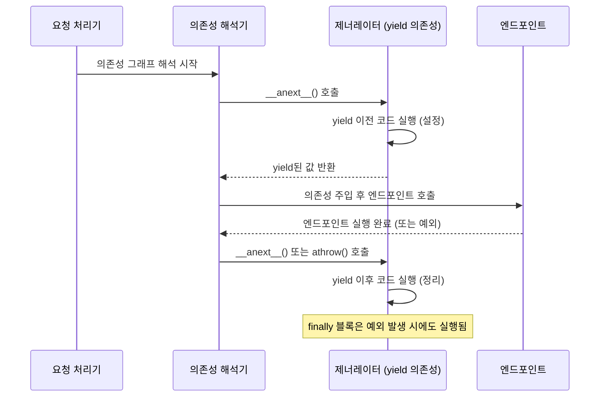
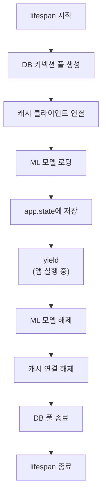
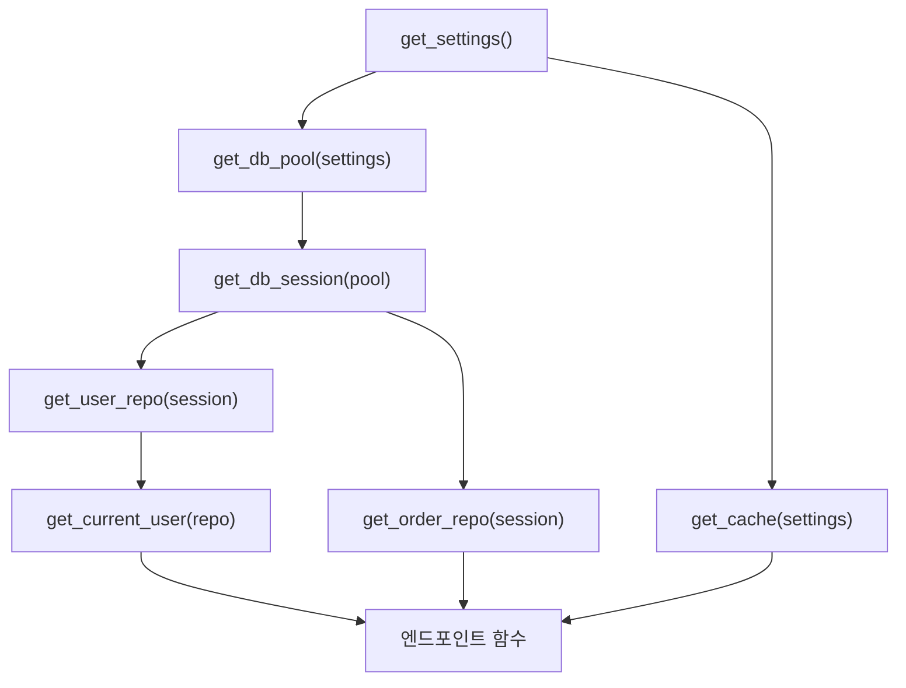

# 챕터 03: 고급 의존성 주입과 생명주기

> **난이도**: ⭐⭐⭐⭐ (4/5)
> **예상 학습 시간**: 4~5시간
> **사전 요구사항**: FastAPI 기본 의존성 주입, Python 제너레이터, async/await

---

## 학습 목표

1. yield 의존성의 내부 동작과 리소스 정리 보장 메커니즘을 이해한다
2. 비동기 컨텍스트 매니저를 의존성으로 활용할 수 있다
3. lifespan 이벤트로 앱 수준의 리소스를 관리할 수 있다
4. 의존성 스코프와 캐싱 전략을 설계할 수 있다
5. 테스트에서 의존성 오버라이드를 효과적으로 활용할 수 있다
6. 의존성 그래프를 분석하고 최적화할 수 있다

---

## 1. yield 의존성 심화

### 1.1 기본 동작 원리

`yield` 의존성은 Python의 제너레이터를 활용하여 "설정 → 사용 → 정리" 패턴을 구현한다.

```python
from fastapi import Depends

async def get_db_session():
    session = create_session()   # 설정 (Setup)
    try:
        yield session             # 사용 (Use) - 엔드포인트에 주입
    finally:
        await session.close()    # 정리 (Teardown) - 항상 실행 보장
```

### 1.2 내부 동작 분석



### 1.3 예외 처리와 정리 보장

```python
async def get_db():
    db = SessionLocal()
    try:
        yield db
    except Exception as exc:
        # 엔드포인트에서 발생한 예외를 여기서 받을 수 있다
        await db.rollback()
        raise  # 예외를 다시 발생시켜 FastAPI가 처리하게 한다
    finally:
        # 정상이든 예외이든 항상 실행된다
        await db.close()
```

> **핵심**: `yield` 이후의 코드(특히 `finally` 블록)는 엔드포인트가 예외를 발생시키더라도 반드시 실행된다. 이것이 리소스 누수를 방지하는 핵심 메커니즘이다.

### 1.4 yield 의존성 vs 컨텍스트 매니저

```python
# 방법 1: yield 의존성
async def get_resource():
    resource = await acquire_resource()
    try:
        yield resource
    finally:
        await release_resource(resource)

# 방법 2: contextlib.asynccontextmanager
from contextlib import asynccontextmanager

@asynccontextmanager
async def managed_resource():
    resource = await acquire_resource()
    try:
        yield resource
    finally:
        await release_resource(resource)

# 방법 2를 의존성으로 사용
async def get_resource_cm():
    async with managed_resource() as resource:
        yield resource
```

---

## 2. 비동기 컨텍스트 매니저와 의존성

### 2.1 기존 컨텍스트 매니저를 의존성으로 변환

```python
import httpx

async def get_http_client():
    """httpx 클라이언트를 의존성으로 제공"""
    async with httpx.AsyncClient(
        timeout=30.0,
        limits=httpx.Limits(max_connections=100),
    ) as client:
        yield client
```

### 2.2 다중 리소스 의존성

```python
async def get_transaction():
    """DB 트랜잭션과 캐시를 함께 관리하는 의존성"""
    db = SessionLocal()
    cache = await get_cache_connection()
    try:
        yield {"db": db, "cache": cache}
        await db.commit()
    except Exception:
        await db.rollback()
        raise
    finally:
        await db.close()
        await cache.close()
```

---

## 3. lifespan 이벤트

### 3.1 개념

`lifespan`은 FastAPI 애플리케이션의 시작과 종료 시 실행되는 코드를 정의한다. 데이터베이스 커넥션 풀, ML 모델, 캐시 클라이언트 등 앱 수준의 리소스를 관리한다.

```python
from contextlib import asynccontextmanager
from fastapi import FastAPI

@asynccontextmanager
async def lifespan(app: FastAPI):
    # 시작 시 실행 (yield 이전)
    print("서버 시작: 리소스 초기화")
    app.state.db_pool = await create_pool()
    app.state.cache = await connect_cache()

    yield  # 앱이 실행되는 동안 대기

    # 종료 시 실행 (yield 이후)
    print("서버 종료: 리소스 정리")
    await app.state.db_pool.close()
    await app.state.cache.close()

app = FastAPI(lifespan=lifespan)
```

### 3.2 lifespan vs on_event (레거시)

```python
# 레거시 방식 (더 이상 권장하지 않음)
@app.on_event("startup")
async def startup():
    ...

@app.on_event("shutdown")
async def shutdown():
    ...

# 새로운 방식 (lifespan) - 장점:
# 1. 리소스의 설정/정리가 하나의 함수에 응집
# 2. yield 패턴으로 정리가 보장됨
# 3. app.state를 통한 명시적 상태 공유
```

### 3.3 lifespan에서 공유 리소스 관리



---

## 4. 의존성 스코프와 캐싱 전략

### 4.1 요청 스코프 캐싱

FastAPI는 동일 요청 내에서 같은 의존성 함수가 여러 번 호출되면 자동으로 캐싱한다.

```python
async def get_current_user():
    """이 함수는 같은 요청 내에서 한 번만 실행된다"""
    user = await fetch_user_from_token()
    return user

@app.get("/profile")
async def profile(
    user=Depends(get_current_user),      # 첫 번째 호출: 실행
    user2=Depends(get_current_user),     # 두 번째 호출: 캐시된 값 반환
):
    assert user is user2  # True! 같은 객체
```

### 4.2 use_cache 매개변수

```python
from fastapi import Depends

# 캐싱 비활성화: 매번 새로운 값 생성
@app.get("/random")
async def random_endpoint(
    val1=Depends(get_random, use_cache=False),
    val2=Depends(get_random, use_cache=False),
):
    # val1 != val2 (서로 다른 값)
    ...
```

### 4.3 의존성 스코프 패턴

| 스코프 | 생명주기 | 구현 방법 | 용도 |
|--------|----------|-----------|------|
| 요청 스코프 | 단일 요청 | `Depends()` (기본) | DB 세션, 현재 사용자 |
| 앱 스코프 | 앱 전체 | `lifespan` + `app.state` | 커넥션 풀, 설정 |
| 세션 스코프 | 사용자 세션 | 커스텀 미들웨어 | 세션 데이터 |
| 트랜잭션 스코프 | 비즈니스 트랜잭션 | 중첩 의존성 | 원자적 연산 |

---

## 5. 의존성 오버라이드 패턴

### 5.1 테스트용 의존성 오버라이드

```python
from fastapi.testclient import TestClient

# 실제 의존성
async def get_db():
    db = ProductionDatabase()
    try:
        yield db
    finally:
        await db.close()

# 테스트용 오버라이드
async def get_test_db():
    db = InMemoryDatabase()
    try:
        yield db
    finally:
        db.clear()

# 오버라이드 적용
app.dependency_overrides[get_db] = get_test_db

client = TestClient(app)
response = client.get("/users")  # InMemoryDatabase 사용

# 정리
app.dependency_overrides.clear()
```

### 5.2 pytest 픽스처와의 통합

```python
import pytest
from fastapi.testclient import TestClient

@pytest.fixture
def client():
    """테스트용 클라이언트 픽스처"""
    app.dependency_overrides[get_db] = get_test_db
    app.dependency_overrides[get_current_user] = lambda: fake_user

    with TestClient(app) as c:
        yield c

    app.dependency_overrides.clear()

def test_list_users(client):
    response = client.get("/users")
    assert response.status_code == 200
```

### 5.3 계층적 오버라이드

```python
# 의존성 체인: get_settings → get_db → get_user_repo
# 중간 의존성만 오버라이드해도 하위 체인이 영향을 받음

async def get_settings():
    return Settings()

async def get_db(settings=Depends(get_settings)):
    return Database(settings.db_url)

async def get_user_repo(db=Depends(get_db)):
    return UserRepository(db)

# get_db만 오버라이드하면 get_user_repo도 테스트 DB를 사용
app.dependency_overrides[get_db] = get_test_db
```

---

## 6. 의존성 그래프 분석

### 6.1 의존성 그래프 시각화



### 6.2 의존성 해석 순서

FastAPI는 의존성 그래프를 토폴로지 정렬하여 올바른 순서로 실행한다:

1. 리프 노드 의존성부터 실행 (의존하는 것이 없는 것)
2. 자식 의존성이 모두 해석된 후 부모 의존성 실행
3. 동일 수준의 의존성은 동시 실행 가능 (asyncio.gather)

### 6.3 순환 의존성 감지

```python
# 순환 의존성은 FastAPI 시작 시 에러를 발생시킨다
async def dep_a(b=Depends(dep_b)):  # dep_b에 의존
    ...

async def dep_b(a=Depends(dep_a)):  # dep_a에 의존 → 순환!
    ...
```

### 6.4 의존성 최적화

```python
# 나쁜 예: 불필요한 중복 의존성 체인
@app.get("/profile")
async def profile(
    user=Depends(get_current_user),
    db=Depends(get_db),  # get_current_user 내부에서 이미 get_db 사용
):
    ...

# 좋은 예: 의존성 재사용
@app.get("/profile")
async def profile(user=Depends(get_current_user)):
    # user에서 필요한 정보를 직접 얻거나,
    # get_current_user가 db 세션을 포함하도록 설계
    ...
```

---

## 정리표

| 개념 | 핵심 포인트 |
|------|------------|
| yield 의존성 | 설정→yield→정리 패턴, finally로 정리 보장 |
| 예외 처리 | yield 후에도 예외 발생 시 finally 실행됨 |
| lifespan | 앱 수준 리소스의 시작/종료 관리, on_event 대체 |
| app.state | lifespan에서 초기화한 리소스의 저장 공간 |
| 요청 스코프 캐싱 | 동일 요청 내 같은 의존성은 한 번만 실행 |
| use_cache=False | 매번 새로운 의존성 인스턴스 생성 |
| dependency_overrides | 테스트 시 의존성을 대체하는 딕셔너리 |
| 토폴로지 정렬 | 의존성 그래프의 실행 순서 결정 |

---

## 주의사항

1. `yield` 의존성에서 `yield` 이후에 응답을 수정할 수 없다 (이미 클라이언트에 전송됨)
2. `lifespan`에서 발생하는 예외는 서버 시작 자체를 실패시킨다
3. `dependency_overrides`는 전역 상태이므로 테스트 간 격리에 주의해야 한다
4. yield 의존성 내에서 BackgroundTask에 의존하면 정리 시점이 꼬일 수 있다
5. 의존성 그래프가 깊어지면 성능 오버헤드가 발생할 수 있다

---

## 다음 단계

- **챕터 04**: 비동기 프로그래밍 심화를 학습하여 의존성 내 비동기 패턴을 최적화한다
- 실습에서 커넥션 풀 의존성, lifespan 리소스, 테스트 격리를 직접 구현해본다
- SQLAlchemy async session + FastAPI 의존성 통합 패턴도 연습해볼 것
