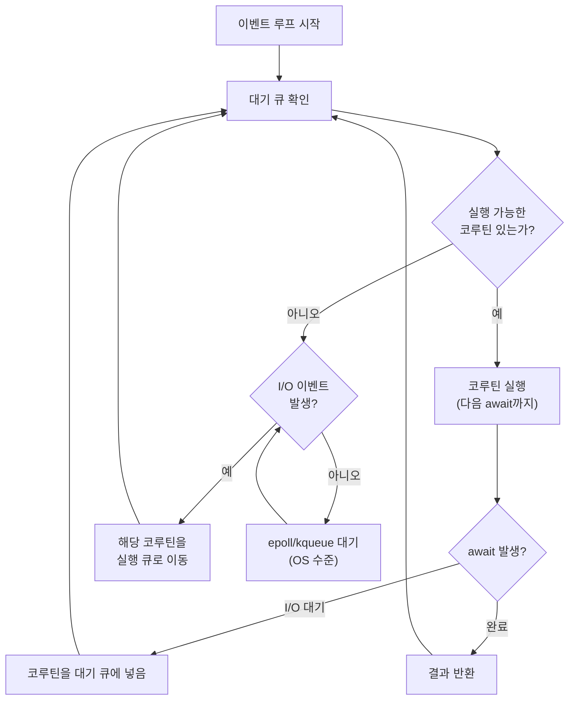
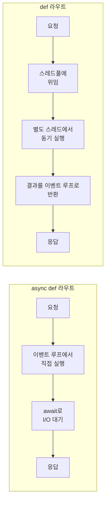
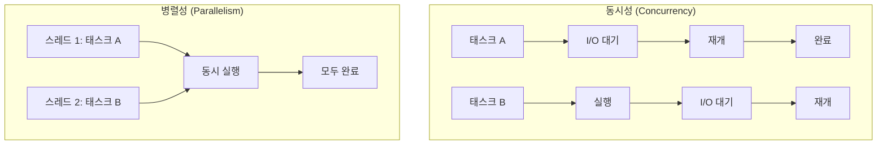

# 챕터 04: 비동기 프로그래밍 심화

> **난이도**: ⭐⭐⭐⭐ (4/5)
> **예상 학습 시간**: 4~5시간
> **사전 요구사항**: Python async/await 기초, asyncio 기본 이해

---

## 학습 목표

1. asyncio 이벤트 루프의 내부 동작을 이해한다
2. 코루틴 스케줄링과 태스크의 차이를 파악한다
3. `asyncio.gather` vs `asyncio.create_task`를 올바르게 사용할 수 있다
4. 블로킹 코드를 비동기 환경에서 안전하게 실행할 수 있다
5. FastAPI에서 `async def` vs `def` 라우트의 내부 차이를 이해한다
6. 동시성과 병렬성의 차이를 FastAPI 맥락에서 구분할 수 있다

---

## 1. asyncio 이벤트 루프 내부 동작

### 1.1 이벤트 루프란?

이벤트 루프는 단일 스레드에서 여러 비동기 작업을 스케줄링하는 핵심 메커니즘이다.



### 1.2 코루틴의 실행 모델

```python
# 코루틴은 await를 만나면 이벤트 루프에 제어를 양보한다
async def fetch_data():
    print("A: 시작")          # 1. 즉시 실행
    data = await http_get()   # 2. I/O 대기 → 제어 양보
    print("B: 데이터 수신")    # 3. I/O 완료 후 재개
    return data               # 4. 완료
```

> **핵심**: 코루틴은 `await`를 만나면 "여기서 잠시 멈추고 다른 작업을 해도 됩니다"라고 이벤트 루프에 알린다. 이벤트 루프는 그 시간에 다른 코루틴을 실행한다.

### 1.3 단일 스레드의 의미

```python
import asyncio

counter = 0

async def increment():
    global counter
    # 이 두 줄 사이에 다른 코루틴이 끼어들 수 없다!
    temp = counter
    counter = temp + 1
    # await가 없으므로 원자적으로 실행된다

# asyncio는 단일 스레드이므로 경쟁 조건(race condition)이 없다
# (await 사이에서만 컨텍스트 스위칭이 발생)
```

> **주의사항**: 하지만 `await` 사이에서는 다른 코루틴이 실행될 수 있으므로, `await` 전후로 공유 상태를 수정하면 경쟁 조건이 발생할 수 있다.

---

## 2. 코루틴 스케줄링과 태스크

### 2.1 코루틴 vs 태스크

| 구분 | 코루틴 (Coroutine) | 태스크 (Task) |
|------|-------------------|---------------|
| 정의 | `async def` 함수의 호출 결과 | `asyncio.create_task(coro)`의 결과 |
| 실행 시점 | `await`할 때 실행 시작 | 생성 즉시 스케줄링됨 |
| 동시성 | 순차 실행 | 동시 실행 |
| 취소 | 불가 | `task.cancel()` 가능 |

```python
import asyncio

async def slow_operation(name: str, seconds: float):
    print(f"{name}: 시작")
    await asyncio.sleep(seconds)
    print(f"{name}: 완료")
    return f"{name} 결과"

# 순차 실행 (약 3초)
async def sequential():
    result1 = await slow_operation("A", 1)
    result2 = await slow_operation("B", 2)
    return [result1, result2]

# 동시 실행 (약 2초)
async def concurrent():
    task1 = asyncio.create_task(slow_operation("A", 1))
    task2 = asyncio.create_task(slow_operation("B", 2))
    result1 = await task1
    result2 = await task2
    return [result1, result2]
```

### 2.2 asyncio.gather

```python
# gather: 여러 코루틴을 동시에 실행하고 결과를 모두 기다림
results = await asyncio.gather(
    slow_operation("A", 1),
    slow_operation("B", 2),
    slow_operation("C", 1.5),
)
# results = ["A 결과", "B 결과", "C 결과"]
# 총 소요 시간: ~2초 (가장 느린 것 기준)
```

### 2.3 gather vs create_task

```python
# gather: 모든 결과가 필요할 때
# - 모든 코루틴이 완료될 때까지 기다림
# - 결과를 입력 순서대로 반환
# - return_exceptions=True로 예외도 결과로 받기 가능
results = await asyncio.gather(
    coro1(), coro2(), coro3(),
    return_exceptions=True,  # 예외도 결과 리스트에 포함
)

# create_task: 개별 결과/취소가 필요할 때
# - 생성 즉시 스케줄링
# - 개별적으로 await/cancel 가능
# - 더 세밀한 제어 가능
task = asyncio.create_task(coro())
# ... 다른 작업 ...
try:
    result = await asyncio.wait_for(task, timeout=5.0)
except asyncio.TimeoutError:
    task.cancel()
```

---

## 3. 스레드풀 실행기 (run_in_executor)

### 3.1 블로킹 코드의 문제

```python
import time

# 이 함수는 이벤트 루프를 2초간 블로킹한다!
async def bad_endpoint():
    time.sleep(2)  # 블로킹! 다른 모든 요청이 멈춤
    return {"result": "bad"}

# 올바른 방법: run_in_executor로 스레드풀에서 실행
import asyncio

async def good_endpoint():
    loop = asyncio.get_event_loop()
    result = await loop.run_in_executor(
        None,  # 기본 스레드풀 사용
        time.sleep,  # 블로킹 함수
        2,  # 인자
    )
    return {"result": "good"}
```

### 3.2 동기 라이브러리를 비동기로 래핑

```python
import asyncio
from functools import partial
from concurrent.futures import ThreadPoolExecutor

# 전용 스레드풀 생성 (풀 크기 제어)
cpu_pool = ThreadPoolExecutor(max_workers=4, thread_name_prefix="cpu")

async def run_sync(func, *args, **kwargs):
    """동기 함수를 비동기로 실행하는 헬퍼"""
    loop = asyncio.get_event_loop()
    return await loop.run_in_executor(
        cpu_pool,
        partial(func, *args, **kwargs),
    )

# 사용 예시
def heavy_computation(data: list) -> float:
    """CPU 바운드 동기 함수"""
    return sum(x ** 2 for x in data)

async def endpoint():
    result = await run_sync(heavy_computation, list(range(1000000)))
    return {"result": result}
```

---

## 4. async def vs def 라우트의 차이

### 4.1 FastAPI의 내부 처리

```python
from fastapi import FastAPI

app = FastAPI()

# async def: 이벤트 루프에서 직접 실행
@app.get("/async")
async def async_endpoint():
    await asyncio.sleep(1)  # 이벤트 루프 블로킹하지 않음
    return {"type": "async"}

# def: 스레드풀에서 실행 (run_in_executor 자동 적용)
@app.get("/sync")
def sync_endpoint():
    time.sleep(1)  # 스레드풀에서 실행되므로 이벤트 루프 블로킹하지 않음
    return {"type": "sync"}
```



### 4.2 언제 어떤 것을 사용해야 하는가?

| 상황 | 권장 | 이유 |
|------|------|------|
| I/O 바운드 (DB, HTTP, 파일) | `async def` + `await` | 가장 효율적 |
| 순수 동기 라이브러리 사용 | `def` | FastAPI가 자동으로 스레드풀 위임 |
| CPU 바운드 경량 작업 | `def` | 스레드풀에서 실행 |
| CPU 바운드 중량 작업 | `async def` + `run_in_executor` | 전용 풀로 제어 |
| async 라이브러리 사용 | `async def` | async 문맥 필요 |

> **주의**: `async def` 내에서 `time.sleep()` 같은 블로킹 호출을 하면 전체 서버가 멈출 수 있다. 반드시 `await asyncio.sleep()` 또는 `run_in_executor`를 사용해야 한다.

---

## 5. 블로킹 코드 방지 전략

### 5.1 일반적인 블로킹 함수 목록

```python
# 다음 함수들은 async def 내에서 직접 호출하면 안 된다:
time.sleep(n)              # → asyncio.sleep(n)
requests.get(url)          # → httpx.AsyncClient.get(url)
open("file").read()        # → aiofiles.open("file")
os.listdir(path)           # → run_in_executor
hashlib.pbkdf2_hmac(...)   # → run_in_executor (CPU 바운드)
subprocess.run(...)        # → asyncio.create_subprocess_exec()
```

### 5.2 블로킹 감지

```python
import asyncio
import logging

# 이벤트 루프의 슬로우 콜백 경고 활성화
loop = asyncio.get_event_loop()
loop.slow_callback_duration = 0.1  # 0.1초 이상 블로킹 시 경고

# 디버그 모드에서 자동 감지
# uvicorn main:app --loop asyncio --log-level debug
```

---

## 6. 동시성 vs 병렬성 in FastAPI

### 6.1 개념 비교



| 구분 | 동시성 | 병렬성 |
|------|--------|--------|
| 스레드 | 단일 | 다중 |
| 적합한 작업 | I/O 바운드 | CPU 바운드 |
| FastAPI 구현 | `asyncio` (이벤트 루프) | `ProcessPoolExecutor` |
| GIL 영향 | 무관 (I/O 시 해제됨) | 영향 있음 (프로세스 풀 필요) |

### 6.2 CPU 바운드 작업의 병렬 처리

```python
from concurrent.futures import ProcessPoolExecutor
import asyncio

# 프로세스 풀 (GIL 우회)
process_pool = ProcessPoolExecutor(max_workers=4)

def cpu_intensive_task(n: int) -> int:
    """CPU 바운드 함수 (별도 프로세스에서 실행)"""
    return sum(i * i for i in range(n))

async def parallel_endpoint():
    loop = asyncio.get_event_loop()
    # 프로세스 풀에서 실행 → 진정한 병렬 처리
    result = await loop.run_in_executor(
        process_pool,
        cpu_intensive_task,
        10_000_000,
    )
    return {"result": result}
```

### 6.3 세마포어로 동시성 제한

```python
import asyncio

# 동시에 최대 5개의 외부 API 호출만 허용
api_semaphore = asyncio.Semaphore(5)

async def call_external_api(url: str):
    async with api_semaphore:
        # 이 블록 내에서는 최대 5개의 코루틴만 동시 실행
        async with httpx.AsyncClient() as client:
            response = await client.get(url)
            return response.json()
```

---

## 7. 스트리밍 응답

### 7.1 async generator를 사용한 스트리밍

```python
from fastapi.responses import StreamingResponse
import asyncio

async def generate_data():
    """비동기 제너레이터로 데이터를 점진적으로 생성"""
    for i in range(100):
        await asyncio.sleep(0.1)
        yield f"data: {i}\n\n"

@app.get("/stream")
async def stream_endpoint():
    return StreamingResponse(
        generate_data(),
        media_type="text/event-stream",
    )
```

---

## 정리표

| 개념 | 핵심 포인트 |
|------|------------|
| 이벤트 루프 | 단일 스레드에서 코루틴을 스케줄링 |
| await | 코루틴이 이벤트 루프에 제어를 양보하는 지점 |
| asyncio.gather | 여러 코루틴을 동시 실행, 모든 결과 대기 |
| asyncio.create_task | 코루틴을 즉시 스케줄링, 개별 제어 가능 |
| run_in_executor | 블로킹 함수를 스레드/프로세스 풀에서 실행 |
| async def 라우트 | 이벤트 루프에서 직접 실행 (블로킹 주의) |
| def 라우트 | FastAPI가 자동으로 스레드풀에서 실행 |
| Semaphore | 동시 실행 코루틴 수 제한 |
| StreamingResponse | async generator로 점진적 응답 전송 |

---

## 주의사항

1. `async def` 내에서 `time.sleep()`, `requests.get()` 등 블로킹 호출 금지
2. `asyncio.gather`에서 하나가 실패하면 나머지도 취소됨 (`return_exceptions=True`로 방지)
3. `create_task`로 만든 태스크는 await하지 않으면 GC에 의해 소멸될 수 있음
4. 프로세스 풀은 데이터 직렬화 오버헤드가 있으므로 소량 데이터에는 비효율적
5. Uvicorn의 `--workers` 옵션은 프로세스 수준의 병렬성을 제공

---

## 다음 단계

- **챕터 05**: 고급 보안 패턴을 학습하여 비동기 인증/인가 시스템을 구축한다
- 실습에서 외부 API 동시 호출, CPU 바운드 작업, 세마포어, 스트리밍을 직접 구현해본다
- `aiofiles`, `aiocache`, `motor` (MongoDB) 등 비동기 라이브러리도 탐색해볼 것
