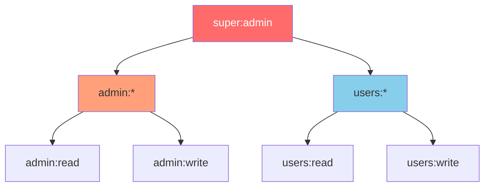
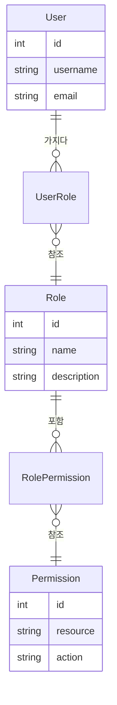
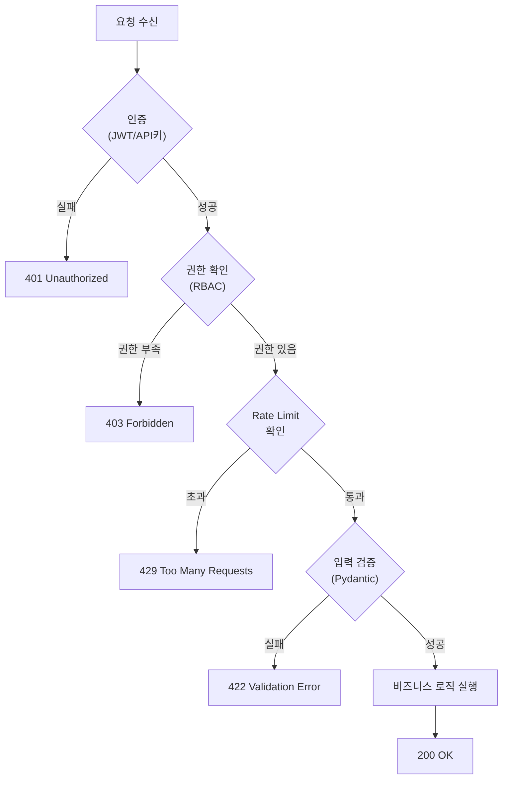

# 챕터 05: 고급 보안 패턴

> **난이도**: ⭐⭐⭐⭐ (4/5)
> **예상 학습 시간**: 4~5시간
> **사전 요구사항**: JWT 기본 이해, OAuth2 개념, FastAPI 의존성 주입

---

## 학습 목표

1. OAuth2 스코프를 활용한 세분화된 권한 관리를 구현할 수 있다
2. 역할 기반 접근 제어(RBAC) 시스템을 설계할 수 있다
3. API 키 인증 전략을 구현하고 보안을 강화할 수 있다
4. 보안 헤더를 설정하여 일반적인 웹 공격을 방어할 수 있다
5. Rate Limiting으로 API 남용을 방지할 수 있다
6. CSRF 방어와 보안 모범 사례를 적용할 수 있다

---

## 1. OAuth2 스코프 (세분화된 권한 관리)

### 1.1 스코프란?

OAuth2 스코프는 토큰이 접근할 수 있는 리소스의 범위를 제한하는 메커니즘이다. 예를 들어, "읽기 전용" 토큰과 "읽기+쓰기" 토큰을 구분할 수 있다.

```python
from fastapi import FastAPI, Depends, Security
from fastapi.security import OAuth2PasswordBearer, SecurityScopes

# 스코프 정의
oauth2_scheme = OAuth2PasswordBearer(
    tokenUrl="token",
    scopes={
        "users:read": "사용자 정보 읽기",
        "users:write": "사용자 정보 수정",
        "admin:read": "관리자 데이터 읽기",
        "admin:write": "관리자 데이터 수정",
    },
)
```

### 1.2 스코프 검증 의존성

```python
async def get_current_user(
    security_scopes: SecurityScopes,
    token: str = Depends(oauth2_scheme),
):
    """토큰에서 사용자를 추출하고, 요구되는 스코프를 검증"""
    # 토큰 디코딩
    payload = decode_jwt(token)
    token_scopes = payload.get("scopes", [])

    # 요구 스코프 확인
    for scope in security_scopes.scopes:
        if scope not in token_scopes:
            raise HTTPException(
                status_code=403,
                detail=f"권한 부족: '{scope}' 스코프가 필요합니다",
                headers={"WWW-Authenticate": f'Bearer scope="{security_scopes.scope_str}"'},
            )

    return user

# 엔드포인트에서 스코프 요구
@app.get("/users", dependencies=[Security(get_current_user, scopes=["users:read"])])
async def list_users():
    ...
```

### 1.3 스코프 계층 구조



---

## 2. 역할 기반 접근 제어 (RBAC)

### 2.1 RBAC 설계



### 2.2 RBAC 구현 패턴

```python
from enum import Enum

class Permission(str, Enum):
    """리소스:동작 형태의 권한"""
    USERS_READ = "users:read"
    USERS_CREATE = "users:create"
    USERS_UPDATE = "users:update"
    USERS_DELETE = "users:delete"
    ORDERS_READ = "orders:read"
    ORDERS_CREATE = "orders:create"
    ADMIN_PANEL = "admin:panel"

class Role(str, Enum):
    VIEWER = "viewer"
    EDITOR = "editor"
    ADMIN = "admin"
    SUPER_ADMIN = "super_admin"

# 역할별 권한 매핑
ROLE_PERMISSIONS: dict[Role, set[Permission]] = {
    Role.VIEWER: {
        Permission.USERS_READ,
        Permission.ORDERS_READ,
    },
    Role.EDITOR: {
        Permission.USERS_READ,
        Permission.USERS_CREATE,
        Permission.USERS_UPDATE,
        Permission.ORDERS_READ,
        Permission.ORDERS_CREATE,
    },
    Role.ADMIN: {
        # EDITOR의 모든 권한 + 관리자 권한
        *ROLE_PERMISSIONS[Role.EDITOR],
        Permission.USERS_DELETE,
        Permission.ADMIN_PANEL,
    },
}
```

### 2.3 권한 검사 의존성

```python
def require_permission(*permissions: Permission):
    """특정 권한을 요구하는 의존성 팩토리"""
    async def permission_checker(
        current_user: User = Depends(get_current_user),
    ) -> User:
        user_permissions = get_user_permissions(current_user.role)
        for perm in permissions:
            if perm not in user_permissions:
                raise HTTPException(
                    status_code=403,
                    detail=f"권한 부족: {perm.value}",
                )
        return current_user
    return permission_checker

# 사용
@app.delete(
    "/users/{user_id}",
    dependencies=[Depends(require_permission(Permission.USERS_DELETE))],
)
async def delete_user(user_id: int):
    ...
```

---

## 3. API 키 인증 전략

### 3.1 API 키 위치

| 위치 | 보안 수준 | 장점 | 단점 |
|------|----------|------|------|
| 쿼리 파라미터 | 낮음 | 간편함 | URL 로그에 노출 |
| 헤더 (X-API-Key) | 중간 | 표준적 | CORS 설정 필요 |
| 헤더 (Authorization) | 높음 | OAuth 호환 | Bearer 접두사 필요 |

### 3.2 구현

```python
from fastapi.security import APIKeyHeader, APIKeyQuery

# 헤더 기반
api_key_header = APIKeyHeader(name="X-API-Key", auto_error=False)

# 쿼리 파라미터 기반 (폴백)
api_key_query = APIKeyQuery(name="api_key", auto_error=False)

async def get_api_key(
    header_key: str = Depends(api_key_header),
    query_key: str = Depends(api_key_query),
) -> str:
    """헤더 또는 쿼리 파라미터에서 API 키를 추출"""
    key = header_key or query_key
    if not key:
        raise HTTPException(status_code=401, detail="API 키가 필요합니다")

    # 키 검증 (해시 비교로 타이밍 공격 방지)
    if not verify_api_key(key):
        raise HTTPException(status_code=403, detail="유효하지 않은 API 키")

    return key
```

### 3.3 API 키 보안 모범 사례

```python
import secrets
import hashlib
import hmac

def generate_api_key() -> tuple[str, str]:
    """API 키 생성: (평문 키, 해시된 키)"""
    raw_key = secrets.token_urlsafe(32)
    hashed_key = hashlib.sha256(raw_key.encode()).hexdigest()
    return raw_key, hashed_key

def verify_api_key(provided_key: str, stored_hash: str) -> bool:
    """타이밍 공격에 안전한 키 비교"""
    provided_hash = hashlib.sha256(provided_key.encode()).hexdigest()
    return hmac.compare_digest(provided_hash, stored_hash)
```

> **핵심**: API 키는 평문으로 저장하지 않고, 해시만 저장한다. 비교 시 `hmac.compare_digest`를 사용하여 타이밍 공격(timing attack)을 방지한다.

---

## 4. 보안 헤더

### 4.1 주요 보안 헤더

```python
from starlette.middleware.base import BaseHTTPMiddleware

class SecurityHeadersMiddleware(BaseHTTPMiddleware):
    async def dispatch(self, request, call_next):
        response = await call_next(request)

        # XSS 방지
        response.headers["X-Content-Type-Options"] = "nosniff"
        response.headers["X-XSS-Protection"] = "1; mode=block"

        # 클릭재킹 방지
        response.headers["X-Frame-Options"] = "DENY"

        # HTTPS 강제 (HSTS)
        response.headers["Strict-Transport-Security"] = (
            "max-age=31536000; includeSubDomains"
        )

        # Content Security Policy
        response.headers["Content-Security-Policy"] = (
            "default-src 'self'; "
            "script-src 'self'; "
            "style-src 'self' 'unsafe-inline'"
        )

        # 참조 정보 제한
        response.headers["Referrer-Policy"] = "strict-origin-when-cross-origin"

        return response
```

### 4.2 보안 헤더 설명표

| 헤더 | 용도 | 권장 값 |
|------|------|---------|
| `X-Content-Type-Options` | MIME 스니핑 방지 | `nosniff` |
| `X-Frame-Options` | 클릭재킹 방지 | `DENY` 또는 `SAMEORIGIN` |
| `X-XSS-Protection` | XSS 필터 활성화 | `1; mode=block` |
| `Strict-Transport-Security` | HTTPS 강제 | `max-age=31536000` |
| `Content-Security-Policy` | 리소스 로딩 제어 | 정책에 따라 설정 |
| `Referrer-Policy` | 참조 정보 제한 | `strict-origin-when-cross-origin` |

---

## 5. Rate Limiting (요청 빈도 제한)

### 5.1 알고리즘 비교

| 알고리즘 | 동작 방식 | 장점 | 단점 |
|---------|----------|------|------|
| 고정 윈도우 | 시간 창 단위로 카운트 | 간단 | 경계 시점에 2배 요청 가능 |
| 슬라이딩 윈도우 | 요청 시점 기준 추적 | 정확 | 메모리 사용량 큼 |
| 토큰 버킷 | 일정 속도로 토큰 생성 | 버스트 허용 | 구현 복잡 |
| 누출 버킷 | 일정 속도로 요청 처리 | 안정적 속도 | 버스트 불허 |

### 5.2 슬라이딩 윈도우 구현

```python
import time
from collections import defaultdict

class SlidingWindowRateLimiter:
    def __init__(self, max_requests: int, window_seconds: int):
        self.max_requests = max_requests
        self.window_seconds = window_seconds
        self._requests: dict[str, list[float]] = defaultdict(list)

    def is_allowed(self, client_id: str) -> bool:
        now = time.time()
        window_start = now - self.window_seconds

        # 윈도우 밖의 오래된 요청 제거
        self._requests[client_id] = [
            t for t in self._requests[client_id] if t > window_start
        ]

        if len(self._requests[client_id]) >= self.max_requests:
            return False

        self._requests[client_id].append(now)
        return True
```

### 5.3 Rate Limit 응답 헤더

```python
# RFC 6585 기반 Rate Limit 헤더
response.headers["X-RateLimit-Limit"] = str(max_requests)
response.headers["X-RateLimit-Remaining"] = str(remaining)
response.headers["X-RateLimit-Reset"] = str(reset_timestamp)
response.headers["Retry-After"] = str(retry_after_seconds)
```

---

## 6. CSRF 방어

### 6.1 CSRF 토큰 패턴

```python
import secrets

class CSRFProtection:
    def __init__(self):
        self._tokens: dict[str, float] = {}  # 토큰: 만료 시간

    def generate_token(self, session_id: str) -> str:
        """세션에 바인딩된 CSRF 토큰 생성"""
        token = secrets.token_hex(32)
        self._tokens[token] = time.time() + 3600  # 1시간 유효
        return token

    def validate_token(self, token: str) -> bool:
        """CSRF 토큰 검증"""
        if token not in self._tokens:
            return False
        if time.time() > self._tokens[token]:
            del self._tokens[token]
            return False
        del self._tokens[token]  # 일회용
        return True
```

### 6.2 SameSite 쿠키

```python
from fastapi.responses import JSONResponse

response = JSONResponse(content={"message": "ok"})
response.set_cookie(
    key="session",
    value=session_token,
    httponly=True,      # JavaScript 접근 차단
    secure=True,        # HTTPS에서만 전송
    samesite="strict",  # 크로스사이트 요청에서 쿠키 미전송
    max_age=3600,
)
```

---

## 7. 보안 모범 사례

### 7.1 비밀번호 저장

```python
# passlib 또는 bcrypt 사용
from passlib.context import CryptContext

pwd_context = CryptContext(schemes=["bcrypt"], deprecated="auto")

def hash_password(password: str) -> str:
    return pwd_context.hash(password)

def verify_password(plain: str, hashed: str) -> bool:
    return pwd_context.verify(plain, hashed)
```

### 7.2 JWT 보안 체크리스트

| 항목 | 설명 |
|------|------|
| 짧은 만료 시간 | Access Token: 15~30분 |
| Refresh Token | 별도 토큰으로 갱신 |
| 알고리즘 명시 | `algorithms=["HS256"]` 고정 |
| 비밀 키 길이 | 최소 256비트 |
| 페이로드 최소화 | 민감 정보 제외 |
| 토큰 블랙리스트 | 로그아웃 시 무효화 |
| audience/issuer | 토큰 수신자/발행자 검증 |

### 7.3 RBAC 구조



---

## 정리표

| 개념 | 핵심 포인트 |
|------|------------|
| OAuth2 스코프 | 토큰의 접근 범위를 제한, Security() 데코레이터 |
| RBAC | 역할 → 권한 매핑, 의존성 팩토리로 구현 |
| API 키 | 해시 저장, hmac.compare_digest로 비교 |
| 보안 헤더 | HSTS, CSP, X-Frame-Options 등 미들웨어로 추가 |
| Rate Limiting | 슬라이딩 윈도우/토큰 버킷, 429 응답 |
| CSRF | 토큰 기반, SameSite 쿠키 |
| 비밀번호 | bcrypt/argon2, 절대 평문 저장 금지 |
| JWT | 짧은 만료, Refresh Token, 블랙리스트 |

---

## 주의사항

1. JWT 비밀 키를 소스 코드에 하드코딩하지 말 것 (환경 변수 사용)
2. Rate Limiting은 분산 환경에서 Redis 등 공유 저장소 필요
3. CORS와 보안 헤더 설정이 충돌할 수 있으므로 테스트 필수
4. API 키는 발급 시에만 평문을 노출하고, 이후에는 해시만 저장
5. 보안은 계층적으로 적용해야 한다 (인증 → 인가 → Rate Limit → 입력 검증)

---

## 다음 단계

- 다음 챕터에서는 미들웨어 고급 패턴, 백그라운드 태스크, 배포 전략을 학습한다
- 실습에서 OAuth2 + RBAC, API 키 + Rate Limiting을 직접 구현해본다
- OWASP Top 10과 FastAPI 보안 가이드도 함께 참고할 것
