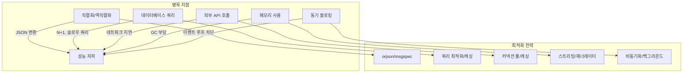
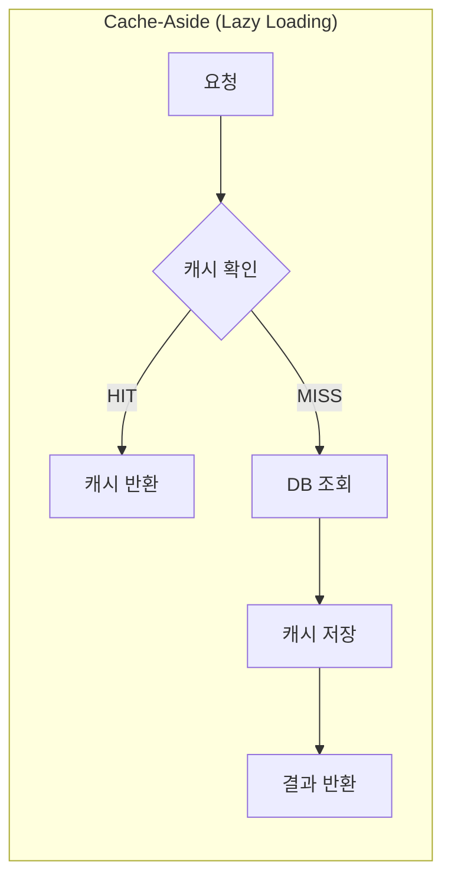
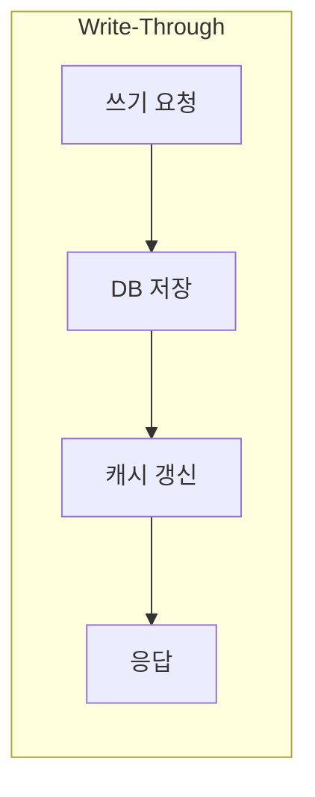
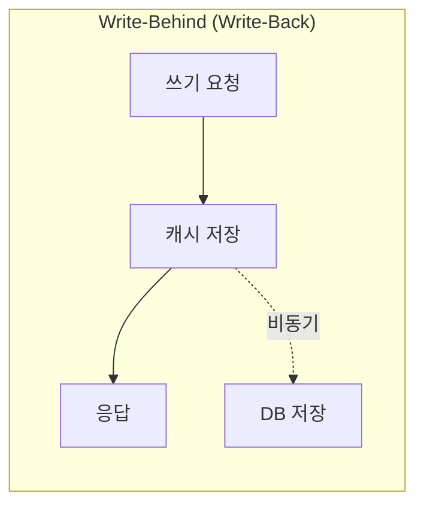
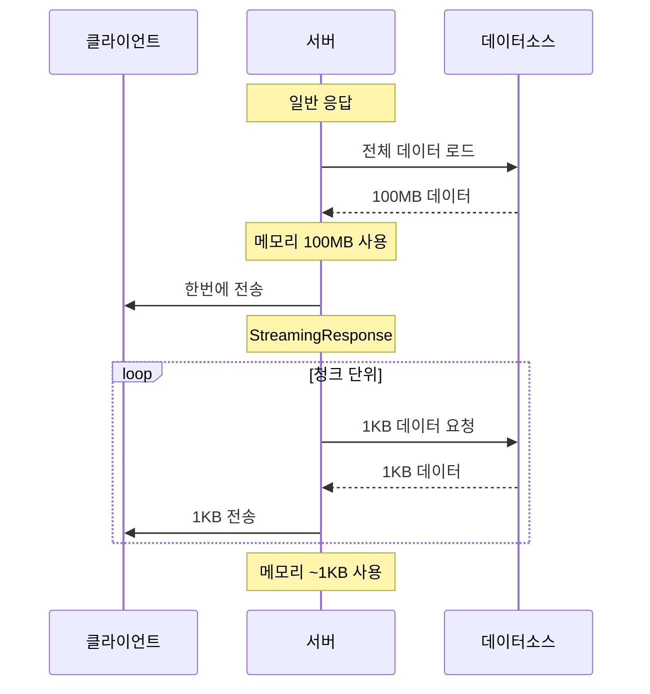

# 챕터 07: 성능 최적화와 캐싱

> **난이도**: ⭐⭐⭐⭐⭐ (5/5)
> **예상 학습 시간**: 5~6시간
> **사전 요구사항**: FastAPI 비동기, 데이터베이스 최적화, HTTP 캐싱 헤더 기본

---

## 학습 목표

이 챕터를 완료하면 다음을 할 수 있습니다:

1. FastAPI 애플리케이션의 성능 병목을 체계적으로 분석한다
2. Redis 기반 캐싱 레이어를 설계하고 구현한다
3. HTTP 캐싱 헤더(ETag, Cache-Control)를 적절히 활용한다
4. StreamingResponse로 대용량 데이터를 효율적으로 전송한다
5. 프로파일링 도구로 병목 지점을 정확히 찾아낸다
6. orjson/msgspec으로 직렬화 성능을 극대화한다

---

## 1. FastAPI 성능 병목 분석 방법론

### 1.1 성능 병목의 주요 원인



### 1.2 성능 측정 단계

1. **벤치마킹**: 현재 성능 기준선 설정 (wrk, k6, locust)
2. **프로파일링**: 병목 지점 식별 (cProfile, py-spy, yappi)
3. **최적화**: 가장 큰 병목부터 개선
4. **검증**: 벤치마킹으로 개선 효과 확인
5. **반복**: 다음 병목으로 이동

```bash
# wrk로 벤치마킹 예시
wrk -t12 -c400 -d30s http://localhost:8000/api/items

# k6 스크립트 예시
k6 run --vus 100 --duration 30s script.js

# py-spy로 실시간 프로파일링
py-spy top --pid <PID>
py-spy record -o profile.svg --pid <PID>
```

---

## 2. Redis 캐싱 레이어 설계

### 2.1 캐싱 전략 비교







| 전략 | 읽기 성능 | 쓰기 성능 | 일관성 | 적합한 경우 |
|------|----------|----------|--------|------------|
| Cache-Aside | 높음 (HIT 시) | 보통 | 약함 | 읽기가 많은 API |
| Write-Through | 높음 | 낮음 | 강함 | 읽기/쓰기 균형 |
| Write-Behind | 높음 | 매우 높음 | 약함 | 쓰기가 많은 경우 |

### 2.2 캐시 키 설계 원칙

```python
# 좋은 캐시 키 패턴
"users:{user_id}"              # 단일 엔티티
"users:list:{page}:{size}"     # 목록 (페이징)
"users:{user_id}:posts"        # 관계 데이터
"search:users:{hash(query)}"   # 검색 결과

# 네임스페이스로 그룹화 -> 일괄 무효화 가능
"v1:users:*"                   # 버전 + 리소스
```

### 2.3 캐시 무효화 전략

| 전략 | 설명 | 장점 | 단점 |
|------|------|------|------|
| TTL | 일정 시간 후 자동 만료 | 구현 간단 | 기간 동안 stale 데이터 |
| 이벤트 기반 | 데이터 변경 시 즉시 무효화 | 높은 일관성 | 구현 복잡 |
| 버전 기반 | 데이터 버전 변경 시 새 키 사용 | 간단 + 일관성 | 오래된 키 잔존 |

---

## 3. HTTP 캐싱 헤더

### 3.1 ETag (Entity Tag)

```python
import hashlib

@app.get("/items/{item_id}")
async def get_item(item_id: int, request: Request):
    item = await get_item_from_db(item_id)

    # ETag 생성: 데이터 해시
    etag = hashlib.md5(item.json().encode()).hexdigest()

    # 클라이언트 ETag와 비교
    if request.headers.get("if-none-match") == etag:
        return Response(status_code=304)  # Not Modified

    return JSONResponse(
        content=item.dict(),
        headers={"ETag": etag}
    )
```

### 3.2 Cache-Control

```python
from fastapi.responses import JSONResponse

@app.get("/static-data")
async def get_static_data():
    data = {"version": "1.0"}
    return JSONResponse(
        content=data,
        headers={
            "Cache-Control": "public, max-age=3600",  # 1시간 캐싱
            "Vary": "Accept-Encoding",
        }
    )

@app.get("/private-data")
async def get_private_data():
    data = {"user_balance": 10000}
    return JSONResponse(
        content=data,
        headers={
            "Cache-Control": "private, no-cache",  # 프록시 캐싱 금지
        }
    )
```

---

## 4. StreamingResponse로 대용량 데이터 전송

### 4.1 동작 원리

일반 응답은 전체 데이터를 메모리에 로드한 후 전송합니다. `StreamingResponse`는 데이터를 청크 단위로 생성하면서 전송하므로 메모리 사용량이 일정합니다.



### 4.2 구현 패턴

```python
from fastapi.responses import StreamingResponse
import csv
import io

async def generate_csv():
    """대용량 CSV 데이터를 청크 단위로 생성"""
    # 헤더 행
    buffer = io.StringIO()
    writer = csv.writer(buffer)
    writer.writerow(["id", "name", "value"])
    yield buffer.getvalue()
    buffer.truncate(0)
    buffer.seek(0)

    # 데이터 행 (배치 단위로 생성)
    for batch_start in range(0, 1000000, 1000):
        for i in range(batch_start, min(batch_start + 1000, 1000000)):
            writer.writerow([i, f"item_{i}", i * 1.5])
        yield buffer.getvalue()
        buffer.truncate(0)
        buffer.seek(0)

@app.get("/export/csv")
async def export_csv():
    return StreamingResponse(
        generate_csv(),
        media_type="text/csv",
        headers={"Content-Disposition": "attachment; filename=export.csv"}
    )
```

---

## 5. 프로파일링 도구

### 5.1 도구 비교

| 도구 | 타입 | 오버헤드 | 용도 |
|------|------|---------|------|
| cProfile | 결정적 | 높음 | 개발 중 함수별 시간 분석 |
| py-spy | 샘플링 | 매우 낮음 | 프로덕션 실시간 분석 |
| yappi | 결정적 | 중간 | 멀티스레드/코루틴 분석 |
| line_profiler | 라인 단위 | 높음 | 특정 함수 상세 분석 |

### 5.2 미들웨어 기반 프로파일링

```python
import cProfile
import pstats
from io import StringIO

class ProfilingMiddleware:
    """개발 환경에서 요청별 프로파일링"""

    def __init__(self, app):
        self.app = app

    async def __call__(self, scope, receive, send):
        if scope["type"] != "http":
            return await self.app(scope, receive, send)

        # ?profile=1 파라미터가 있을 때만 프로파일링
        query_string = scope.get("query_string", b"").decode()
        if "profile=1" not in query_string:
            return await self.app(scope, receive, send)

        profiler = cProfile.Profile()
        profiler.enable()
        await self.app(scope, receive, send)
        profiler.disable()

        # 결과 출력
        stream = StringIO()
        stats = pstats.Stats(profiler, stream=stream)
        stats.sort_stats("cumulative")
        stats.print_stats(20)
        print(stream.getvalue())
```

---

## 6. 직렬화 최적화

### 6.1 orjson vs 표준 json

```python
import orjson
from fastapi.responses import ORJSONResponse

# FastAPI 기본 설정에서 orjson 사용
app = FastAPI(default_response_class=ORJSONResponse)

# orjson은 표준 json 대비 약 3~10배 빠름
# datetime, UUID, numpy 등 추가 타입 지원
```

### 6.2 성능 비교

| 라이브러리 | JSON 인코딩 | JSON 디코딩 | 메모리 사용 |
|-----------|------------|------------|------------|
| json (표준) | 1x (기준) | 1x (기준) | 1x (기준) |
| orjson | ~6x 빠름 | ~3x 빠름 | ~0.7x |
| msgspec | ~8x 빠름 | ~4x 빠름 | ~0.5x |
| ujson | ~3x 빠름 | ~2x 빠름 | ~0.9x |

### 6.3 msgspec 활용

```python
import msgspec

# msgspec Struct: Pydantic 대비 매우 빠른 직렬화
class ItemResponse(msgspec.Struct):
    id: int
    name: str
    price: float

# 인코딩
data = ItemResponse(id=1, name="테스트", price=100.0)
encoded = msgspec.json.encode(data)  # bytes

# 디코딩
decoded = msgspec.json.decode(encoded, type=ItemResponse)
```

---

## 7. 벤치마킹 도구

### 7.1 wrk 사용법

```bash
# 기본 벤치마크
wrk -t4 -c100 -d30s http://localhost:8000/api/items

# 결과 예시:
# Running 30s test @ http://localhost:8000/api/items
#   4 threads and 100 connections
#   Thread Stats   Avg      Stdev     Max   +/- Stdev
#     Latency    12.34ms    5.67ms  89.12ms   75.23%
#     Req/Sec     2.01k   234.56     2.89k    68.45%
#   240,123 requests in 30.00s, 45.67MB read
# Requests/sec:   8004.10
# Transfer/sec:      1.52MB
```

### 7.2 핵심 지표

| 지표 | 의미 | 목표값 (일반적) |
|------|------|---------------|
| Requests/sec | 초당 처리량 | > 1000 |
| Latency (avg) | 평균 응답 시간 | < 100ms |
| Latency (p99) | 99% 응답 시간 | < 500ms |
| Error Rate | 에러 비율 | < 0.1% |

---

## 성능 최적화 체크리스트

```
[직렬화]
  [ ] orjson 또는 msgspec 사용
  [ ] 불필요한 필드 제외 (response_model_exclude)
  [ ] 대용량 응답에 StreamingResponse 사용

[데이터베이스]
  [ ] N+1 문제 해결 (selectinload)
  [ ] 커넥션 풀 적절히 설정
  [ ] 인덱스 최적화
  [ ] 슬로우 쿼리 로깅

[캐싱]
  [ ] Redis 캐싱 레이어 적용
  [ ] HTTP 캐싱 헤더 설정 (ETag, Cache-Control)
  [ ] 캐시 무효화 전략 수립

[비동기]
  [ ] 동기 블로킹 코드 제거
  [ ] 외부 API 호출에 httpx 사용
  [ ] CPU 바운드 작업은 ProcessPoolExecutor

[인프라]
  [ ] Gunicorn 워커 수 최적화
  [ ] 리버스 프록시 (Nginx) 정적 파일 서빙
  [ ] Gzip 압축 활성화
```

---

## 정리

| 개념 | 핵심 포인트 |
|------|------------|
| 캐싱 전략 | Cache-Aside가 가장 범용적, TTL + 이벤트 기반 무효화 병행 |
| Redis | 캐시 키 네임스페이스 설계, 일괄 무효화 고려 |
| HTTP 캐싱 | ETag으로 조건부 요청, Cache-Control로 프록시 제어 |
| StreamingResponse | 대용량 데이터에 필수, 메모리 사용 일정 |
| 직렬화 | orjson은 6배, msgspec은 8배 빠름 |
| 프로파일링 | py-spy로 프로덕션 분석, cProfile로 개발 중 상세 분석 |

---

## 다음 단계

- **챕터 08**: WebSocket과 실시간 통신으로 서버 푸시 기반 시스템을 구축합니다
- Redis Cluster 운영과 고가용성 설정을 학습하면 프로덕션에 더 가깝습니다
- APM(Application Performance Monitoring) 도구 (Datadog, New Relic) 도입을 고려하세요
