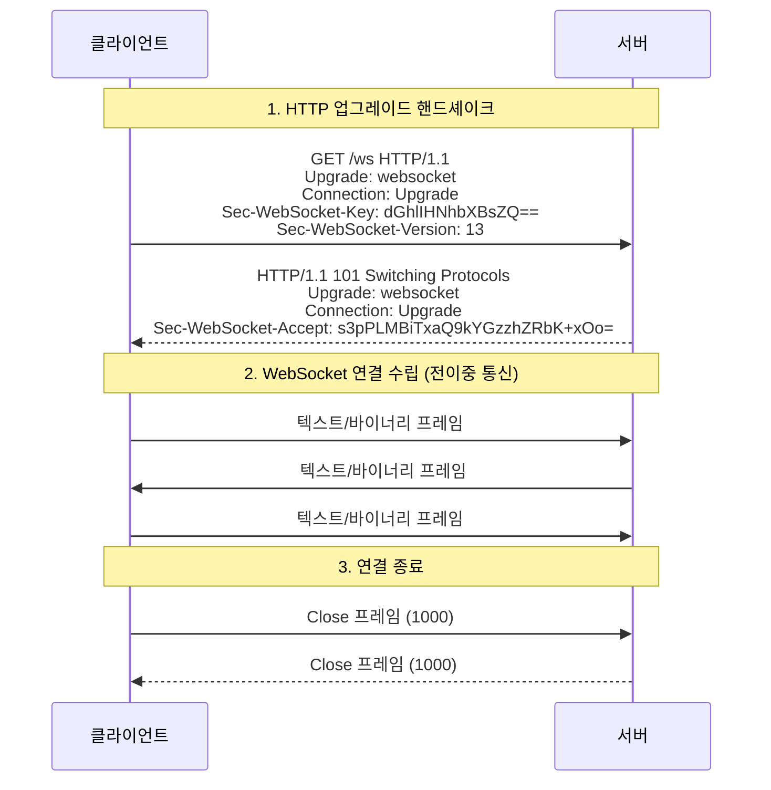
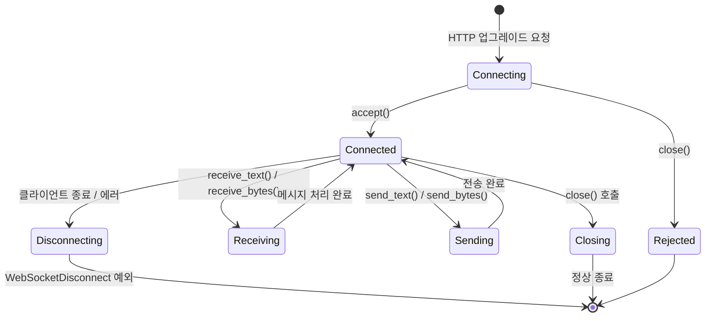
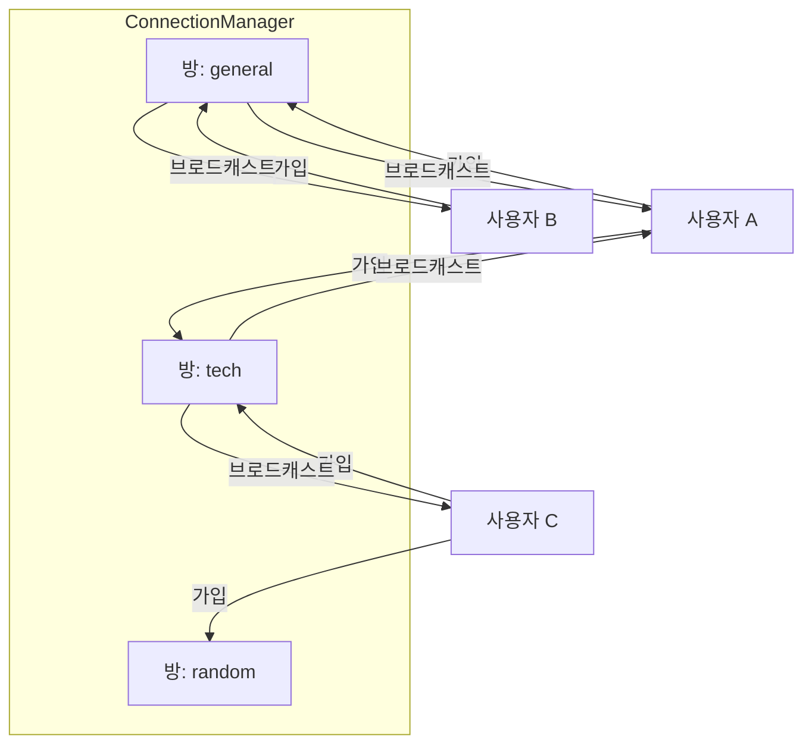
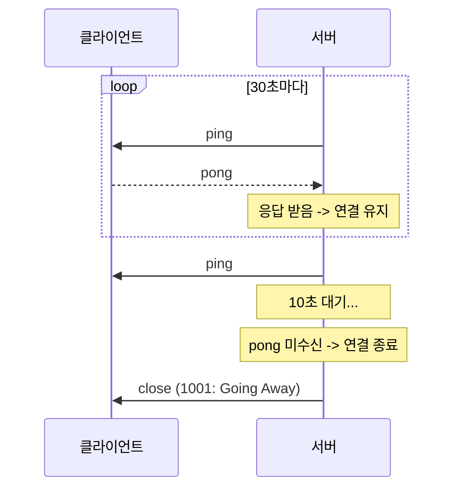

# 챕터 08: WebSocket과 실시간 통신

> **난이도**: ⭐⭐⭐⭐ (4/5)
> **예상 학습 시간**: 4~5시간
> **사전 요구사항**: FastAPI 기본, 비동기 프로그래밍, HTTP 프로토콜 이해

---

## 학습 목표

이 챕터를 완료하면 다음을 할 수 있습니다:

1. WebSocket 프로토콜의 내부 동작(핸드셰이크, 프레임)을 이해한다
2. FastAPI에서 WebSocket 생명주기를 완전히 제어한다
3. ConnectionManager 패턴으로 연결을 효율적으로 관리한다
4. 방(Room) 시스템과 브로드캐스트를 구현한다
5. SSE(Server-Sent Events)와 WebSocket을 적절히 선택한다
6. 하트비트와 재연결 전략을 구현한다
7. 인증된 WebSocket 연결을 구현한다

---

## 1. WebSocket 프로토콜 상세

### 1.1 HTTP vs WebSocket

| 특성 | HTTP | WebSocket |
|------|------|-----------|
| 통신 방향 | 단방향 (요청-응답) | 양방향 (전이중) |
| 연결 | 매 요청마다 새 연결 | 하나의 연결 유지 |
| 오버헤드 | 높음 (헤더 반복) | 낮음 (프레임 헤더 2~14바이트) |
| 서버 푸시 | 불가 (폴링 필요) | 가능 |
| 적합한 경우 | CRUD API, 정적 콘텐츠 | 채팅, 게임, 실시간 대시보드 |

### 1.2 WebSocket 핸드셰이크



### 1.3 WebSocket 프레임 구조

```
 0                   1                   2                   3
 0 1 2 3 4 5 6 7 8 9 0 1 2 3 4 5 6 7 8 9 0 1 2 3 4 5 6 7 8 9 0 1
+-+-+-+-+-------+-+-------------+-------------------------------+
|F|R|R|R| opcode|M| Payload len |    Extended payload length    |
|I|S|S|S|  (4)  |A|     (7)     |             (16/64)           |
|N|V|V|V|       |S|             |   (if payload len==126/127)   |
| |1|2|3|       |K|             |                               |
+-+-+-+-+-------+-+-------------+ - - - - - - - - - - - - - - - +
|     Masking-key (if MASK set to 1)                            |
+-------------------------------+-------------------------------+
|                    Payload Data                                |
+---------------------------------------------------------------+
```

- **FIN**: 최종 프레임 여부 (1비트)
- **opcode**: 프레임 타입 (텍스트=0x1, 바이너리=0x2, 종료=0x8, Ping=0x9, Pong=0xA)
- **MASK**: 클라이언트->서버 프레임은 항상 마스킹 (1비트)
- **Payload len**: 0~125바이트면 7비트, 126이면 추가 16비트, 127이면 추가 64비트

---

## 2. FastAPI WebSocket 생명주기

### 2.1 생명주기 다이어그램



### 2.2 기본 WebSocket 엔드포인트

```python
from fastapi import FastAPI, WebSocket, WebSocketDisconnect

app = FastAPI()

@app.websocket("/ws")
async def websocket_endpoint(websocket: WebSocket):
    # 1. 연결 수락
    await websocket.accept()

    try:
        while True:
            # 2. 메시지 수신 (블로킹 대기)
            data = await websocket.receive_text()

            # 3. 메시지 처리 및 응답
            await websocket.send_text(f"받은 메시지: {data}")

    except WebSocketDisconnect:
        # 4. 연결 종료 처리
        print("클라이언트 연결 종료")
```

### 2.3 주의사항: receive와 send의 동시성

```python
# ❌ 잘못된 패턴: send 중에 receive를 놓침
while True:
    data = await ws.receive_text()  # 여기서 블로킹
    await heavy_processing(data)     # 이 동안 다른 메시지를 받지 못함
    await ws.send_text(result)

# ✅ 올바른 패턴: 별도 태스크로 분리
async def reader(ws: WebSocket, queue: asyncio.Queue):
    while True:
        data = await ws.receive_text()
        await queue.put(data)

async def writer(ws: WebSocket, queue: asyncio.Queue):
    while True:
        data = await queue.get()
        result = await process(data)
        await ws.send_text(result)

# 두 태스크를 동시 실행
await asyncio.gather(reader(ws, queue), writer(ws, queue))
```

---

## 3. ConnectionManager 패턴

### 3.1 기본 구현

```python
class ConnectionManager:
    """WebSocket 연결 관리자"""

    def __init__(self):
        self.active_connections: list[WebSocket] = []

    async def connect(self, websocket: WebSocket):
        await websocket.accept()
        self.active_connections.append(websocket)

    def disconnect(self, websocket: WebSocket):
        self.active_connections.remove(websocket)

    async def send_personal(self, message: str, websocket: WebSocket):
        await websocket.send_text(message)

    async def broadcast(self, message: str):
        """모든 연결에 메시지 전송"""
        for connection in self.active_connections:
            await connection.send_text(message)
```

### 3.2 안전한 브로드캐스트

```python
async def broadcast(self, message: str):
    """연결 오류가 있는 클라이언트를 안전하게 처리"""
    disconnected = []
    for connection in self.active_connections:
        try:
            await connection.send_text(message)
        except Exception:
            disconnected.append(connection)

    # 끊어진 연결 정리
    for conn in disconnected:
        self.active_connections.remove(conn)
```

---

## 4. 브로드캐스트와 방(Room) 시스템

### 4.1 방 시스템 구조



### 4.2 방 기반 ConnectionManager

```python
from collections import defaultdict

class RoomConnectionManager:
    def __init__(self):
        self.rooms: dict[str, set[WebSocket]] = defaultdict(set)
        self.user_rooms: dict[WebSocket, set[str]] = defaultdict(set)

    async def join_room(self, websocket: WebSocket, room: str):
        self.rooms[room].add(websocket)
        self.user_rooms[websocket].add(room)

    async def leave_room(self, websocket: WebSocket, room: str):
        self.rooms[room].discard(websocket)
        self.user_rooms[websocket].discard(room)
        if not self.rooms[room]:
            del self.rooms[room]

    async def broadcast_to_room(self, room: str, message: str, exclude: WebSocket = None):
        for ws in self.rooms.get(room, set()):
            if ws != exclude:
                try:
                    await ws.send_text(message)
                except Exception:
                    pass
```

---

## 5. SSE (Server-Sent Events) 비교

### 5.1 WebSocket vs SSE

| 특성 | WebSocket | SSE |
|------|-----------|-----|
| 통신 방향 | 양방향 | 서버 -> 클라이언트 (단방향) |
| 프로토콜 | ws:// / wss:// | HTTP (표준) |
| 자동 재연결 | 직접 구현 | 브라우저 내장 |
| 바이너리 | 지원 | 텍스트만 |
| 프록시 호환 | 낮음 | 높음 |
| 적합한 경우 | 채팅, 게임 | 알림, 실시간 피드 |

### 5.2 SSE 구현

```python
from fastapi.responses import StreamingResponse

async def event_generator():
    while True:
        data = await get_notification()
        yield f"event: notification\ndata: {json.dumps(data)}\n\n"
        await asyncio.sleep(1)

@app.get("/sse/notifications")
async def sse_notifications():
    return StreamingResponse(
        event_generator(),
        media_type="text/event-stream",
        headers={"Cache-Control": "no-cache", "Connection": "keep-alive"}
    )
```

---

## 6. 하트비트와 재연결 전략

### 6.1 하트비트 메커니즘



### 6.2 서버 측 하트비트 구현

```python
async def heartbeat(websocket: WebSocket, interval: int = 30, timeout: int = 10):
    """하트비트 태스크: 주기적으로 ping을 보내고 pong 응답을 확인"""
    while True:
        try:
            await asyncio.sleep(interval)
            pong_waiter = await websocket.send_json({"type": "ping"})
            # 타임아웃 내에 pong을 기대
        except Exception:
            break  # 연결 종료
```

---

## 7. 인증된 WebSocket 연결

### 7.1 인증 방법

WebSocket은 HTTP 핸드셰이크 시 쿠키와 쿼리 파라미터를 전달할 수 있지만, 커스텀 헤더는 일부 클라이언트에서 지원하지 않습니다.

| 방법 | 설명 | 보안 |
|------|------|------|
| 쿼리 파라미터 | `ws://host/ws?token=xxx` | 낮음 (URL 로깅) |
| 쿠키 | 세션 쿠키로 인증 | 중간 |
| 첫 메시지 | 연결 후 첫 메시지로 토큰 전송 | 높음 |
| 티켓 방식 | HTTP로 1회용 티켓 발급 -> WS 연결 | 높음 |

### 7.2 티켓 방식 구현 (권장)

```python
import secrets

ticket_store: dict[str, dict] = {}  # ticket -> user_info

@app.post("/ws/ticket")
async def create_ticket(user: User = Depends(get_current_user)):
    """1회용 WebSocket 연결 티켓 발급"""
    ticket = secrets.token_urlsafe(32)
    ticket_store[ticket] = {
        "user_id": user.id,
        "created_at": time.time(),
    }
    return {"ticket": ticket}

@app.websocket("/ws")
async def ws_endpoint(websocket: WebSocket, ticket: str):
    """티켓으로 인증된 WebSocket 연결"""
    user_info = ticket_store.pop(ticket, None)  # 1회용: 사용 후 삭제
    if not user_info or time.time() - user_info["created_at"] > 30:
        await websocket.close(code=4001)
        return
    await websocket.accept()
    ...
```

---

## 주의사항

1. **연결 수 제한**: WebSocket은 서버 리소스를 지속적으로 점유합니다. 최대 연결 수를 제한하세요
2. **메시지 크기 제한**: 큰 바이너리 데이터는 REST API로 전송하고, WebSocket은 알림만
3. **에러 처리**: `WebSocketDisconnect` 예외를 반드시 처리하세요
4. **스케일 아웃**: 여러 서버 인스턴스에서는 Redis Pub/Sub으로 메시지를 공유해야 합니다
5. **프록시 설정**: Nginx 리버스 프록시에서 WebSocket 업그레이드를 허용해야 합니다

```nginx
# Nginx WebSocket 프록시 설정
location /ws {
    proxy_pass http://backend;
    proxy_http_version 1.1;
    proxy_set_header Upgrade $http_upgrade;
    proxy_set_header Connection "upgrade";
    proxy_read_timeout 86400;
}
```

---

## 정리

| 개념 | 핵심 포인트 |
|------|------------|
| WebSocket 프로토콜 | HTTP 업그레이드로 전이중 연결, 프레임 단위 통신 |
| 생명주기 | accept -> receive/send 루프 -> disconnect 처리 |
| ConnectionManager | 연결 목록 관리, 안전한 브로드캐스트, 방 시스템 |
| SSE vs WebSocket | SSE는 단방향 서버 푸시, WebSocket은 양방향 |
| 하트비트 | 주기적 ping/pong으로 끊어진 연결 감지 |
| 인증 | 티켓 방식이 가장 안전, 쿼리 파라미터는 URL 노출 위험 |

---

## 다음 단계

- **챕터 09**: 마이크로서비스 아키텍처에서 WebSocket을 여러 서비스에 걸쳐 확장하는 방법을 학습합니다
- Redis Pub/Sub을 사용한 멀티 인스턴스 WebSocket 메시지 동기화를 연습하세요
- Socket.IO와 같은 고수준 프로토콜 레이어와의 비교도 도움이 됩니다
