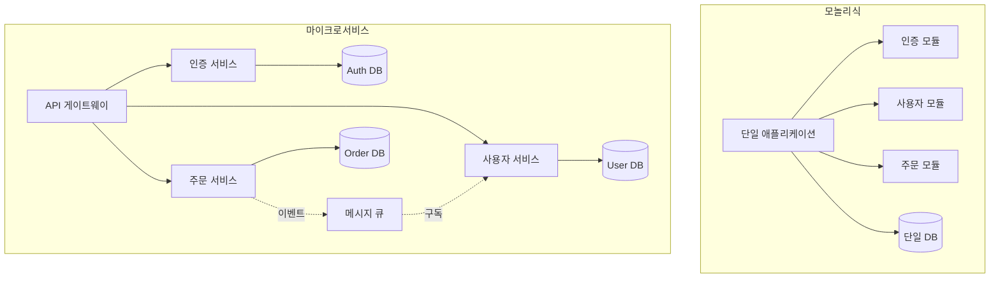
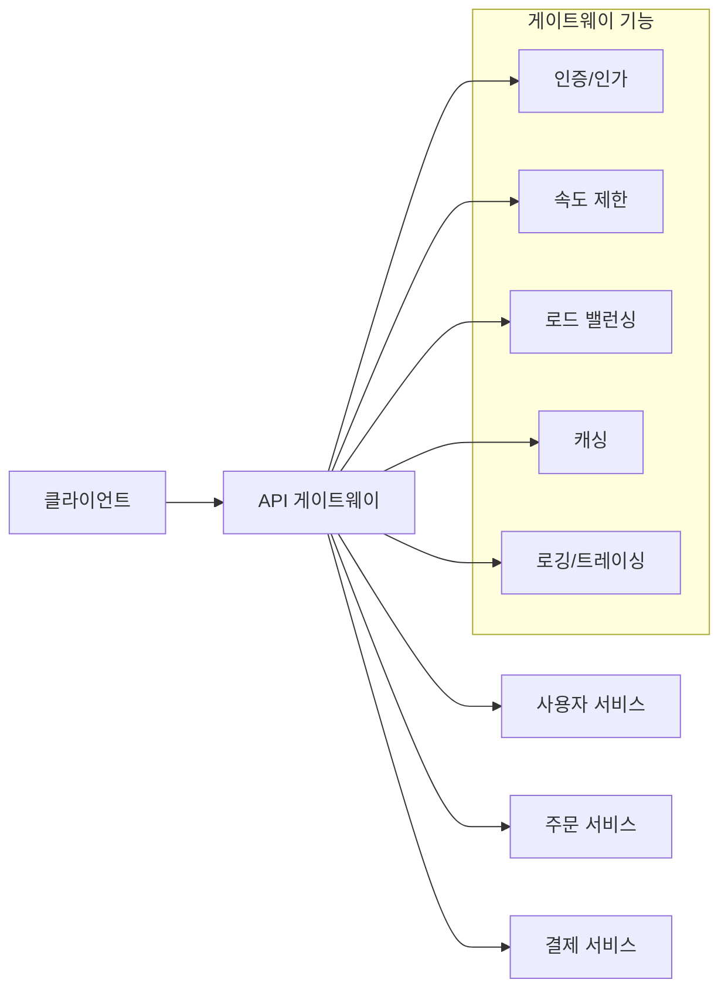
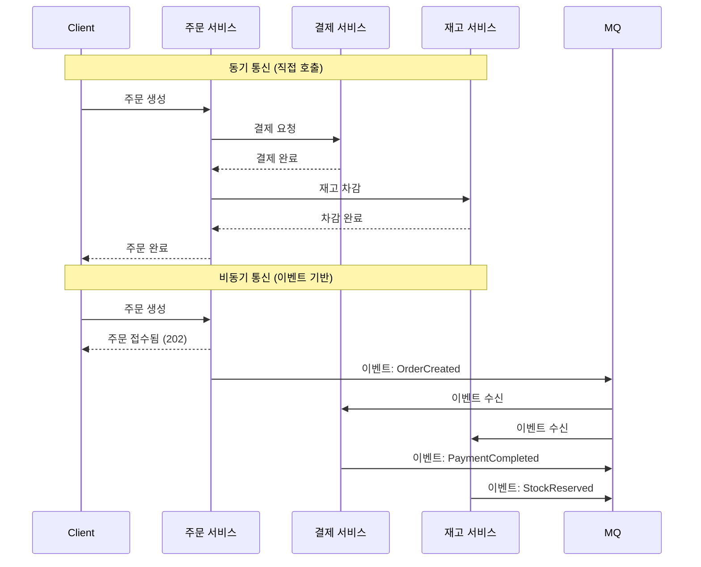
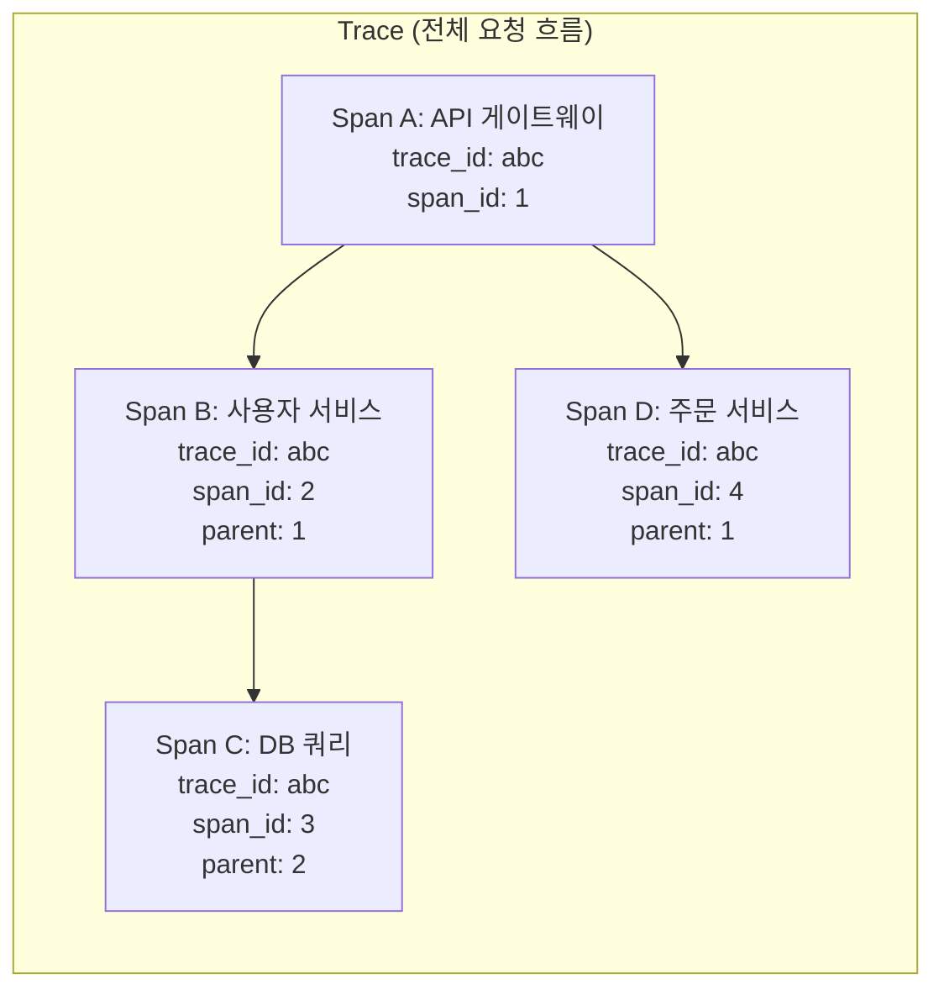
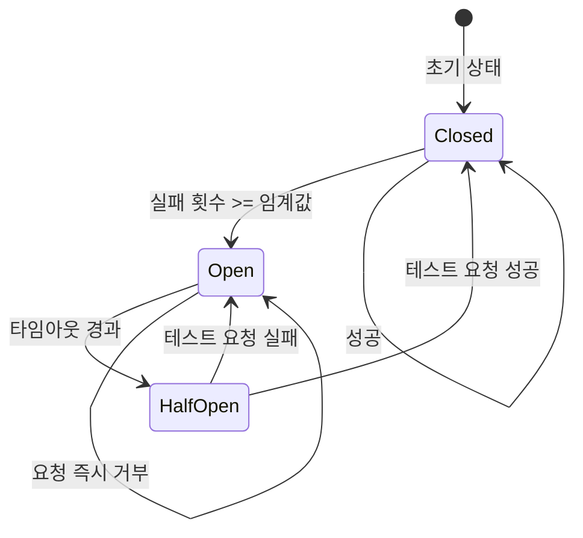

# 챕터 09: 마이크로서비스와 확장 구조

> **난이도**: ⭐⭐⭐⭐⭐ (5/5)
> **예상 학습 시간**: 5~6시간
> **사전 요구사항**: FastAPI 전반, 비동기 프로그래밍, HTTP/네트워킹 기본, 분산 시스템 개념

---

## 학습 목표

이 챕터를 완료하면 다음을 할 수 있습니다:

1. FastAPI 서브 애플리케이션으로 모듈화된 아키텍처를 구성한다
2. API 버전 관리 전략을 적용한다
3. API 게이트웨이 패턴을 구현한다
4. 이벤트 기반 아키텍처를 설계하고 간단한 Pub/Sub을 구현한다
5. 서비스 간 통신 패턴(httpx, gRPC)을 이해한다
6. 분산 트레이싱 개념과 OpenTelemetry를 이해한다
7. 헬스 체크와 서비스 디스커버리를 구현한다

---

## 1. 마이크로서비스 아키텍처 개요

### 1.1 모놀리식 vs 마이크로서비스



### 1.2 마이크로서비스 도입 기준

| 기준 | 모놀리식 | 마이크로서비스 |
|------|---------|--------------|
| 팀 규모 | 1~5명 | 5명 이상, 여러 팀 |
| 배포 빈도 | 낮음 | 서비스별 독립 배포 |
| 확장성 요구 | 균일한 부하 | 서비스별 다른 부하 |
| 기술 스택 | 단일 | 서비스별 최적 기술 |
| 복잡성 허용 | 낮음 | 높음 (네트워크, 분산) |

---

## 2. FastAPI 서브 애플리케이션 (app.mount)

### 2.1 기본 구조

```python
from fastapi import FastAPI

# 메인 앱
app = FastAPI(title="메인 애플리케이션")

# 서브 앱들
auth_app = FastAPI(title="인증 서비스")
user_app = FastAPI(title="사용자 서비스")
order_app = FastAPI(title="주문 서비스")

# 서브 앱 마운트
app.mount("/auth", auth_app)
app.mount("/users", user_app)
app.mount("/orders", order_app)

# 결과 URL:
# /auth/login -> auth_app의 /login
# /users/me -> user_app의 /me
# /orders/123 -> order_app의 /123
```

### 2.2 서브 앱의 특성

- 각 서브 앱은 독립적인 OpenAPI 스키마를 가집니다
- 미들웨어, 이벤트 핸들러, 의존성이 서브 앱에 독립적입니다
- Swagger UI: `/auth/docs`, `/users/docs` 등 별도 접근 가능
- 나중에 별도 서비스로 분리하기 쉽습니다

---

## 3. API 버전 관리 전략

### 3.1 버전 관리 방법

| 방법 | 예시 | 장점 | 단점 |
|------|------|------|------|
| URL 경로 | `/api/v1/users` | 명확, 구현 간단 | URL 변경 필요 |
| 쿼리 파라미터 | `/users?version=2` | URL 구조 유지 | 누락 시 기본 버전 |
| HTTP 헤더 | `Accept: application/vnd.api.v2+json` | URL 깔끔 | 구현 복잡 |
| 콘텐츠 협상 | `Accept-Version: 2` | 유연함 | 브라우저 테스트 불편 |

### 3.2 URL 기반 버전 관리 (권장)

```python
from fastapi import APIRouter

# 버전별 라우터
v1_router = APIRouter(prefix="/api/v1", tags=["v1"])
v2_router = APIRouter(prefix="/api/v2", tags=["v2"])

@v1_router.get("/users/{user_id}")
async def get_user_v1(user_id: int):
    """v1: 기본 사용자 정보"""
    return {"id": user_id, "name": "홍길동"}

@v2_router.get("/users/{user_id}")
async def get_user_v2(user_id: int):
    """v2: 확장된 사용자 정보"""
    return {"id": user_id, "name": "홍길동", "email": "hong@test.com", "role": "admin"}

app.include_router(v1_router)
app.include_router(v2_router)
```

### 3.3 하위 호환성 원칙

```
1. 필드 추가는 안전 (기존 클라이언트는 무시)
2. 필드 삭제는 위험 (기존 클라이언트 오류 가능)
3. 필드 타입 변경은 위험 (int -> str 등)
4. 필수 필드 추가는 위험 (기존 요청 실패)
5. 엔드포인트 삭제 시 최소 6개월 Deprecated 기간
```

---

## 4. API 게이트웨이 패턴

### 4.1 게이트웨이 아키텍처



### 4.2 게이트웨이 역할

| 역할 | 설명 |
|------|------|
| 라우팅 | 요청을 적절한 서비스로 전달 |
| 인증/인가 | 중앙 집중식 인증 처리 |
| 속도 제한 | 서비스별/사용자별 요청 제한 |
| 응답 집계 | 여러 서비스 응답을 합쳐서 반환 |
| 프로토콜 변환 | REST -> gRPC 변환 등 |
| 캐싱 | 공통 응답 캐싱 |
| 로깅 | 중앙 집중식 로깅/트레이싱 |

---

## 5. 이벤트 기반 아키텍처

### 5.1 동기 vs 비동기 서비스 통신



### 5.2 이벤트 패턴

| 패턴 | 설명 | 사용 시기 |
|------|------|----------|
| Pub/Sub | 발행자가 이벤트 발행, 구독자가 수신 | 느슨한 결합, 1:N 통신 |
| Event Sourcing | 상태를 이벤트 시퀀스로 저장 | 감사 로그, 시간 여행 |
| CQRS | 읽기/쓰기 모델 분리 | 높은 읽기 성능 필요 |
| Saga | 분산 트랜잭션 관리 | 여러 서비스 걸친 트랜잭션 |

---

## 6. 서비스 간 통신

### 6.1 httpx를 사용한 비동기 HTTP 통신

```python
import httpx

# 서비스 간 통신 클라이언트
class ServiceClient:
    def __init__(self, base_url: str, timeout: float = 5.0):
        self.client = httpx.AsyncClient(
            base_url=base_url,
            timeout=timeout,
            limits=httpx.Limits(
                max_connections=100,
                max_keepalive_connections=20,
            ),
        )

    async def get(self, path: str, **kwargs):
        response = await self.client.get(path, **kwargs)
        response.raise_for_status()
        return response.json()

    async def close(self):
        await self.client.aclose()
```

### 6.2 gRPC 개요

gRPC는 HTTP/2 기반의 고성능 RPC 프레임워크입니다:

```
장점:
- 바이너리 직렬화 (Protocol Buffers) -> JSON 대비 10배 빠름
- HTTP/2 멀티플렉싱 -> 단일 연결로 여러 요청
- 양방향 스트리밍
- 코드 생성 (proto 파일 -> 서버/클라이언트 코드)

단점:
- 브라우저에서 직접 호출 불가 (grpc-web 필요)
- 디버깅이 어려움 (바이너리 포맷)
- 학습 곡선
```

---

## 7. 분산 트레이싱

### 7.1 트레이싱 개념



### 7.2 OpenTelemetry 기본

```python
# Trace ID와 Span ID를 HTTP 헤더로 전파
# 표준 헤더: traceparent, tracestate (W3C Trace Context)

# 헤더 형식:
# traceparent: 00-{trace_id}-{span_id}-{flags}
# 예: traceparent: 00-0af7651916cd43dd8448eb211c80319c-b7ad6b7169203331-01
```

---

## 8. 헬스 체크와 서비스 디스커버리

### 8.1 헬스 체크 레벨

| 레벨 | 엔드포인트 | 확인 항목 |
|------|-----------|----------|
| Liveness | `/health/live` | 프로세스가 살아있는지 |
| Readiness | `/health/ready` | 요청을 처리할 수 있는지 |
| Startup | `/health/startup` | 초기화가 완료되었는지 |

```python
@app.get("/health/live")
async def liveness():
    """쿠버네티스 Liveness Probe: 프로세스 생존 확인"""
    return {"status": "alive"}

@app.get("/health/ready")
async def readiness():
    """쿠버네티스 Readiness Probe: 서비스 준비 완료 확인"""
    checks = {
        "database": await check_db(),
        "cache": await check_cache(),
    }
    all_healthy = all(checks.values())
    return {"status": "ready" if all_healthy else "not_ready", "checks": checks}
```

### 8.2 서비스 디스커버리 패턴

| 패턴 | 설명 | 예시 |
|------|------|------|
| 클라이언트 측 | 클라이언트가 서비스 레지스트리 조회 | Consul, Eureka |
| 서버 측 | 로드 밸런서가 라우팅 | Kubernetes Service |
| DNS 기반 | DNS로 서비스 주소 해석 | CoreDNS |

---

## 서킷 브레이커 패턴

### 동작 원리



| 상태 | 동작 |
|------|------|
| Closed (정상) | 모든 요청 통과, 실패 카운터 추적 |
| Open (차단) | 모든 요청 즉시 거부 (서비스 보호) |
| Half-Open (테스트) | 제한된 요청만 통과하여 복구 확인 |

---

## 주의사항

1. **분산 시스템의 오류**: 네트워크는 항상 실패할 수 있습니다. 타임아웃과 재시도를 반드시 설정하세요
2. **데이터 일관성**: 서비스 간 강한 일관성보다 최종 일관성(Eventual Consistency)을 선호하세요
3. **서킷 브레이커**: 연쇄 장애 방지를 위해 반드시 적용하세요
4. **모니터링**: 분산 시스템에서는 중앙 집중식 로깅과 트레이싱이 필수입니다
5. **API 계약**: 서비스 간 API 계약(스키마)을 명확히 정의하고 버전을 관리하세요

---

## 정리

| 개념 | 핵심 포인트 |
|------|------------|
| 서브 애플리케이션 | `app.mount()`로 모듈화, 독립적 Swagger |
| API 버전 관리 | URL 경로 방식 권장, 하위 호환성 유지 |
| API 게이트웨이 | 인증, 라우팅, 속도 제한, 응답 집계 |
| 이벤트 기반 | Pub/Sub으로 느슨한 결합, 비동기 처리 |
| 서비스 통신 | httpx 비동기, gRPC 고성능 |
| 분산 트레이싱 | trace_id로 전체 흐름 추적 |
| 서킷 브레이커 | Open/Closed/Half-Open 상태 전이 |
| 헬스 체크 | Liveness/Readiness/Startup 분리 |

---

## 다음 단계

- **챕터 10**: 이 아키텍처를 Docker와 CI/CD로 프로덕션에 배포하는 방법을 학습합니다
- Kubernetes 환경에서의 서비스 메시(Istio, Linkerd) 학습을 추천합니다
- 실제 메시지 큐(RabbitMQ, Kafka) 연동을 연습하면 좋습니다
