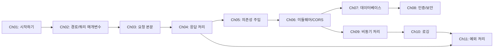

# FastAPI 학습 커리큘럼 (Normal)

> **대상**: Python 중급자, 웹 API 개발에 관심이 있는 개발자
> **난이도**: 1 ~ 3 / 5
> **학습 목적**: FastAPI를 활용한 RESTful API 설계 및 구현 능력 습득

---

## 학습 로드맵

---

## 커리큘럼 개요

| 챕터 | 제목 | 난이도 | 핵심 키워드 |
|------|------|--------|------------|
| 01 | FastAPI 시작하기 | ⭐ (1/5) | 설치, 첫 앱, 개발 서버 |
| 02 | 경로 매개변수와 쿼리 매개변수 | ⭐ (1/5) | Path, Query, 타입 변환 |
| 03 | 요청 본문과 Pydantic 모델 | ⭐⭐ (2/5) | Pydantic, BaseModel, 유효성 검사 |
| 04 | 응답 모델과 상태 코드 | ⭐⭐ (2/5) | response_model, HTTPException |
| 05 | 의존성 주입 | ⭐⭐ (2/5) | Depends, 재사용, 계층 구조 |
| 06 | 미들웨어와 CORS | ⭐⭐⭐ (3/5) | 미들웨어, CORS, GZip |
| 07 | 데이터베이스 연동 | ⭐⭐⭐ (3/5) | SQLAlchemy, CRUD, 관계 |
| 08 | 인증과 보안 | ⭐⭐⭐ (3/5) | OAuth2, JWT, 비밀번호 해싱 |
| 09 | 비동기 프로그래밍 | ⭐⭐ ~ ⭐⭐⭐ (2~3/5) | async/await, asyncio, BackgroundTasks |
| 10 | 로깅 | ⭐⭐ ~ ⭐⭐⭐ (2~3/5) | logging, 구조화된 로그, dictConfig |
| 11 | 예외 처리 | ⭐⭐⭐ (3/5) | AppException, 전역 핸들러, 에러 미들웨어 |

---

## 챕터 상세

### 챕터 01: FastAPI 시작하기
- **학습 목표**: FastAPI를 설치하고 첫 번째 API 서버를 실행할 수 있다
- **핵심 개념**: 가상환경, pip 설치, FastAPI 인스턴스, Uvicorn 개발 서버
- **실습 내용**: Hello World API 작성 및 자동 문서(Swagger UI) 확인
- **섹션**: 3개 (설치 환경 설정, 첫 번째 앱, 개발 서버 활용)

### 챕터 02: 경로 매개변수와 쿼리 매개변수
- **학습 목표**: URL 경로와 쿼리 문자열에서 데이터를 추출하고 검증할 수 있다
- **핵심 개념**: 경로 매개변수, 쿼리 매개변수, 타입 변환, 기본값
- **실습 내용**: 상품 목록/상세 API 구현
- **섹션**: 3개 (경로 매개변수, 쿼리 매개변수, 매개변수 검증)

### 챕터 03: 요청 본문과 Pydantic 모델
- **학습 목표**: Pydantic 모델을 사용하여 요청 본문을 정의하고 검증할 수 있다
- **핵심 개념**: BaseModel, 필드 검증, 중첩 모델, 폼/파일 업로드
- **실습 내용**: 사용자 등록 API 구현
- **섹션**: 3개 (Pydantic 기본, 중첩 모델, 폼/파일 처리)

### 챕터 04: 응답 모델과 상태 코드
- **학습 목표**: 응답 데이터를 체계적으로 관리하고 적절한 상태 코드를 반환할 수 있다
- **핵심 개념**: response_model, status_code, HTTPException, 커스텀 응답
- **실습 내용**: 에러 처리가 포함된 CRUD API 구현
- **섹션**: 3개 (응답 모델, 상태 코드, 에러 처리)

### 챕터 05: 의존성 주입
- **학습 목표**: FastAPI의 Depends를 활용하여 재사용 가능한 로직을 설계할 수 있다
- **핵심 개념**: Depends, 함수 의존성, 클래스 의존성, 중첩 의존성
- **실습 내용**: 공통 페이지네이션, DB 세션 의존성 구현
- **섹션**: 3개 (기본 의존성, 클래스 의존성, 중첩 의존성)

### 챕터 06: 미들웨어와 CORS
- **학습 목표**: 미들웨어를 작성하고 CORS를 설정할 수 있다
- **핵심 개념**: HTTP 미들웨어, CORS, 요청/응답 가로채기
- **실습 내용**: 요청 로깅 미들웨어, CORS 설정
- **섹션**: 3개 (미들웨어 기본, CORS 설정, 커스텀 미들웨어)

### 챕터 07: 데이터베이스 연동
- **학습 목표**: SQLAlchemy를 사용하여 FastAPI와 데이터베이스를 연동할 수 있다
- **핵심 개념**: SQLAlchemy, 세션 관리, CRUD 패턴, 관계 매핑
- **실습 내용**: 게시판 API (게시글/댓글 CRUD)
- **섹션**: 3개 (SQLAlchemy 설정, CRUD 구현, 관계 매핑)

### 챕터 08: 인증과 보안
- **학습 목표**: JWT 기반 인증을 구현하고 보호된 엔드포인트를 만들 수 있다
- **핵심 개념**: OAuth2, JWT 토큰, 비밀번호 해싱, 보호된 라우트
- **실습 내용**: 회원가입/로그인/인증 API 구현
- **섹션**: 3개 (OAuth2/JWT, 비밀번호 해싱, 보호된 라우트)

### 챕터 09: 비동기 프로그래밍
- **학습 목표**: FastAPI의 비동기 처리 방식을 이해하고 async/await를 활용할 수 있다
- **핵심 개념**: async/await, asyncio, 이벤트 루프, BackgroundTasks
- **실습 내용**: 비동기 엔드포인트 작성, 동시 실행, 백그라운드 작업 구현
- **섹션**: 3개 (async/await 기본, 비동기 I/O 작업, 백그라운드 작업)

### 챕터 10: 로깅
- **학습 목표**: Python logging 모듈을 활용하여 체계적인 로깅 시스템을 구축할 수 있다
- **핵심 개념**: Logger, Handler, Formatter, 구조화된 로그, dictConfig
- **실습 내용**: JSON 로깅, request_id 추적, 환경별 로그 설정
- **섹션**: 3개 (로깅 기본, 구조화된 로깅, 로깅 설정)

### 챕터 11: 예외 처리
- **학습 목표**: 애플리케이션 레벨의 예외 처리 아키텍처를 설계하고 구현할 수 있다
- **핵심 개념**: 커스텀 예외 계층, 전역 에러 핸들러, 에러 미들웨어, trace_id
- **실습 내용**: AppException 설계, 표준 에러 응답, 다중 방어선 구현
- **섹션**: 3개 (예외 계층 구조, 전역 에러 핸들러, 에러 미들웨어)

---

## 학습 방법 안내

1. 각 섹션의 `concept.md`를 먼저 읽습니다.
2. 코드 예제를 직접 실행해봅니다.
3. `exercise.md`의 문제를 읽고 `exercise.py`를 완성합니다.
4. 막히면 `solution.py`를 참고합니다.
5. `resources/glossary.md`에서 용어를 확인합니다.

---

## 참고 자료

- 공식 문서: https://fastapi.tiangolo.com/
- 추가 학습 자료: `resources/references.md` 참조
- 용어 사전: `resources/glossary.md` 참조
