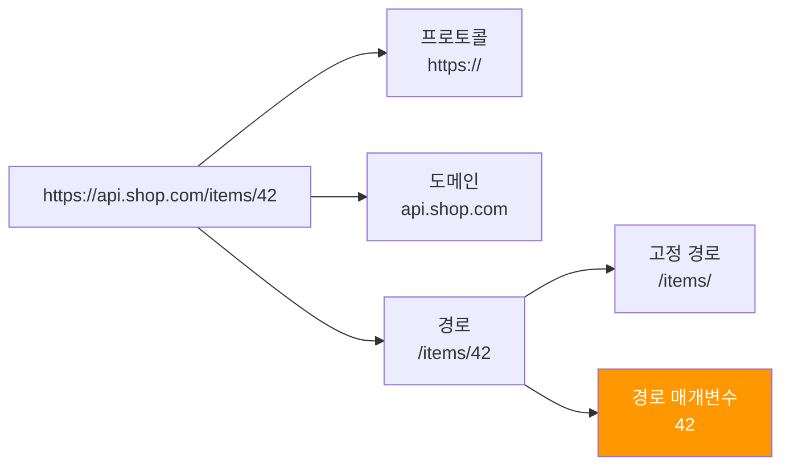
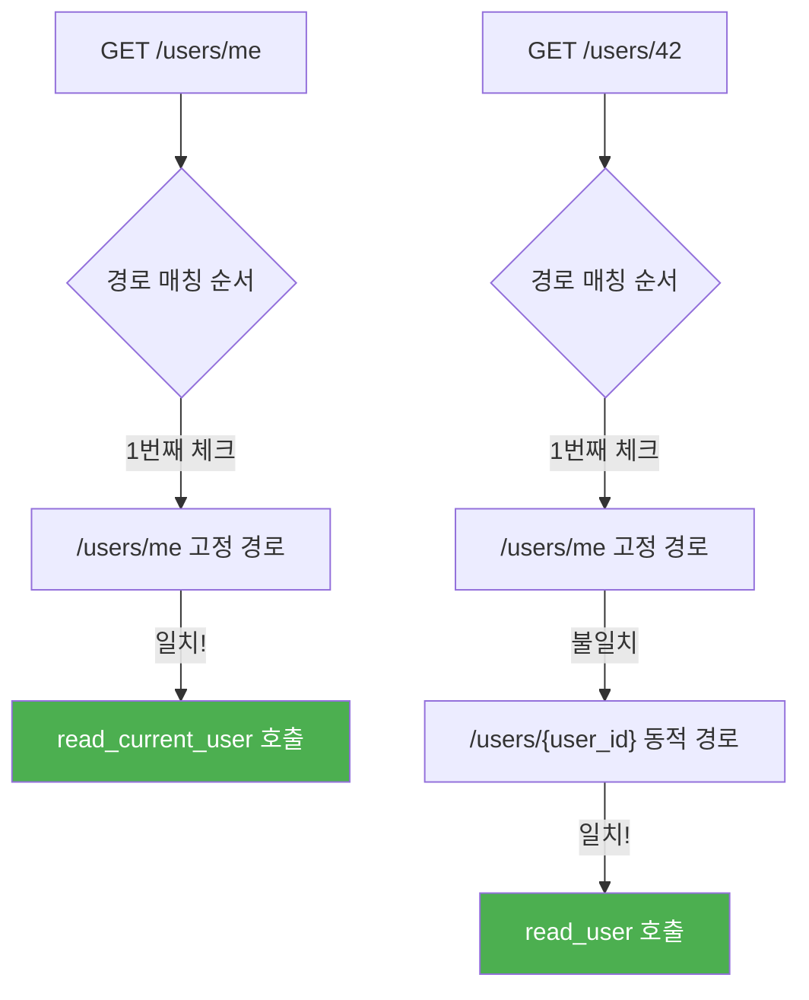
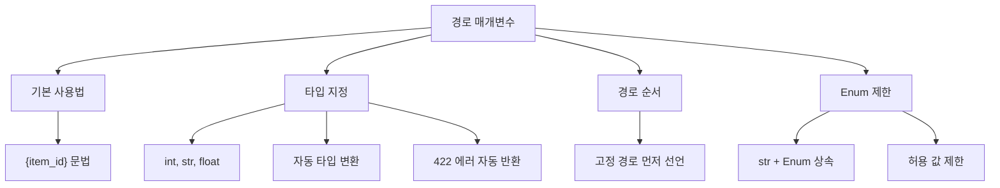

# 섹션 01: 경로 매개변수 (Path Parameters)

> **난이도**: ⭐ (1/5)
> **선수 지식**: Ch01 FastAPI 시작하기 완료
> **학습 목표**: 경로 매개변수를 정의하고 타입을 지정할 수 있다

---

## 1. 핵심 개념

### 경로 매개변수란?

URL 경로의 일부를 변수로 사용하여 동적인 값을 받아오는 방법입니다.
FastAPI에서는 Python의 포맷 문자열과 동일한 `{변수명}` 문법을 사용합니다.

```
GET /users/42       -> user_id = 42
GET /users/100      -> user_id = 100
GET /items/laptop   -> item_name = "laptop"
```

### URL 구조 분해



---

## 2. 기본 사용법

### 2.1 가장 간단한 경로 매개변수

```python
from fastapi import FastAPI

app = FastAPI()


@app.get("/items/{item_id}")
async def read_item(item_id):
    """상품 상세 조회 API"""
    return {"item_id": item_id}
```

- `{item_id}`: URL 경로에서 해당 위치의 값을 변수로 캡처합니다.
- 함수 매개변수 `item_id`와 경로의 `{item_id}`는 **이름이 동일**해야 합니다.
- 타입을 지정하지 않으면 **문자열(str)** 로 처리됩니다.

### 2.2 타입 지정 (타입 변환)

FastAPI는 Python의 타입 힌트를 사용하여 **자동 타입 변환**을 수행합니다.

```python
@app.get("/items/{item_id}")
async def read_item(item_id: int):
    """item_id를 정수로 자동 변환합니다."""
    return {"item_id": item_id}
```

**동작 방식:**

| 요청 URL | item_id 값 | 타입 | 결과 |
|----------|-----------|------|------|
| `/items/42` | `42` | `int` | 정상 응답 |
| `/items/hello` | - | - | 422 에러 (유효성 검사 실패) |
| `/items/3.14` | - | - | 422 에러 (정수가 아님) |

타입 변환에 실패하면 FastAPI는 자동으로 **422 Unprocessable Entity** 에러를 반환합니다.

```json
{
    "detail": [
        {
            "type": "int_parsing",
            "loc": ["path", "item_id"],
            "msg": "Input should be a valid integer, unable to parse string as an integer",
            "input": "hello"
        }
    ]
}
```

### 2.3 여러 경로 매개변수

하나의 경로에 여러 매개변수를 사용할 수 있습니다.

```python
@app.get("/users/{user_id}/items/{item_id}")
async def read_user_item(user_id: int, item_id: int):
    """특정 사용자의 특정 상품을 조회합니다."""
    return {"user_id": user_id, "item_id": item_id}
```

요청: `GET /users/1/items/42` -> `{"user_id": 1, "item_id": 42}`

---

## 3. 경로 순서의 중요성

### 고정 경로 vs 동적 경로

FastAPI는 경로를 **선언된 순서대로** 매칭합니다. 따라서 고정 경로는 반드시 동적 경로보다 **먼저** 선언해야 합니다.

```python
# 올바른 순서
@app.get("/users/me")
async def read_current_user():
    """현재 로그인한 사용자 정보를 반환합니다."""
    return {"user_id": "현재 사용자"}


@app.get("/users/{user_id}")
async def read_user(user_id: int):
    """특정 사용자 정보를 반환합니다."""
    return {"user_id": user_id}
```



**주의**: 순서를 뒤바꾸면 `/users/me` 요청이 `{user_id}`에 매칭되어 "me"라는 문자열이 `user_id`로 전달됩니다.

```python
# 잘못된 순서 - /users/me가 동적 경로에 먼저 매칭됨!
@app.get("/users/{user_id}")
async def read_user(user_id: int):
    return {"user_id": user_id}


@app.get("/users/me")  # 이 경로는 절대 실행되지 않음!
async def read_current_user():
    return {"user_id": "현재 사용자"}
```

---

## 4. Enum을 사용한 경로 매개변수 제한

### 4.1 Enum 클래스 정의

Python의 `Enum`을 사용하면 경로 매개변수에 **허용되는 값을 제한**할 수 있습니다.

```python
from enum import Enum
from fastapi import FastAPI

app = FastAPI()


class Category(str, Enum):
    """상품 카테고리 Enum"""
    electronics = "electronics"
    clothing = "clothing"
    food = "food"


@app.get("/items/category/{category_name}")
async def read_category_items(category_name: Category):
    """카테고리별 상품 목록을 조회합니다."""
    return {
        "category": category_name.value,
        "message": f"{category_name.value} 카테고리의 상품 목록입니다"
    }
```

**핵심 포인트:**

1. `str`과 `Enum`을 **동시에 상속**해야 합니다. (`class Category(str, Enum)`)
   - `str`을 상속해야 API 문서에서 문자열로 올바르게 표시됩니다.
2. Enum에 정의되지 않은 값이 들어오면 **422 에러**가 자동으로 반환됩니다.
3. `.value` 속성으로 실제 문자열 값에 접근합니다.

### 4.2 Enum 사용 시 동작

| 요청 URL | 결과 |
|----------|------|
| `/items/category/electronics` | `{"category": "electronics", ...}` |
| `/items/category/clothing` | `{"category": "clothing", ...}` |
| `/items/category/books` | 422 에러 (허용되지 않는 값) |

### 4.3 Swagger UI에서의 Enum

Swagger UI(`/docs`)에서 Enum 매개변수는 **드롭다운 목록**으로 표시됩니다.
사용자가 허용된 값만 선택할 수 있어 편리합니다.

---

## 5. 코드 예제: 상품 상세 조회 API

```python
from enum import Enum
from fastapi import FastAPI

app = FastAPI()


# 상품 카테고리 Enum 정의
class ProductCategory(str, Enum):
    electronics = "electronics"
    clothing = "clothing"
    food = "food"


# 더미 상품 데이터
fake_items_db = {
    1: {"name": "노트북", "price": 1500000, "category": "electronics"},
    2: {"name": "티셔츠", "price": 25000, "category": "clothing"},
    3: {"name": "사과", "price": 3000, "category": "food"},
}


@app.get("/items/{item_id}")
async def read_item(item_id: int):
    """상품 ID로 상품을 조회합니다."""
    if item_id in fake_items_db:
        return fake_items_db[item_id]
    return {"error": "상품을 찾을 수 없습니다"}


@app.get("/items/category/{category}")
async def read_items_by_category(category: ProductCategory):
    """카테고리별 상품을 조회합니다."""
    result = []
    for item_id, item in fake_items_db.items():
        if item["category"] == category.value:
            result.append({"id": item_id, **item})
    return {"category": category.value, "items": result}
```

---

## 6. 주의 사항

| 주의 사항 | 설명 |
|----------|------|
| 경로 순서 | 고정 경로(`/users/me`)를 동적 경로(`/users/{user_id}`) 보다 먼저 선언하세요 |
| 이름 일치 | 경로의 `{변수명}`과 함수 매개변수 이름이 동일해야 합니다 |
| 타입 힌트 | 타입을 지정하면 자동 변환과 유효성 검사가 수행됩니다 |
| Enum 상속 | `str`과 `Enum`을 동시에 상속해야 합니다 |

---

## 7. 정리



| 개념 | 핵심 내용 |
|------|----------|
| `{변수명}` 문법 | URL 경로의 일부를 함수 매개변수로 전달 |
| 타입 변환 | `item_id: int`로 선언하면 자동 변환 및 검증 |
| 경로 순서 | 고정 경로를 동적 경로보다 먼저 선언 |
| Enum 사용 | 허용되는 값을 제한하여 입력 안전성 확보 |

---

**다음 섹션**: [sec02-query-params - 쿼리 매개변수](../sec02-query-params/concept.md)
