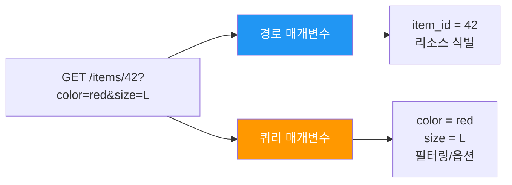
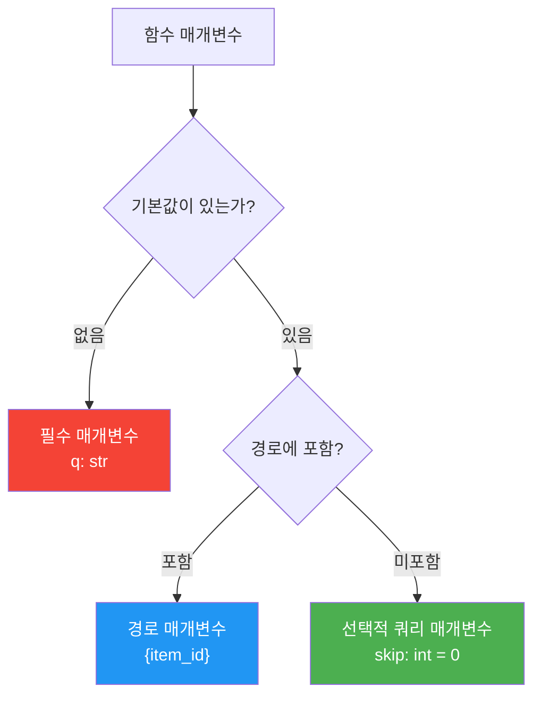
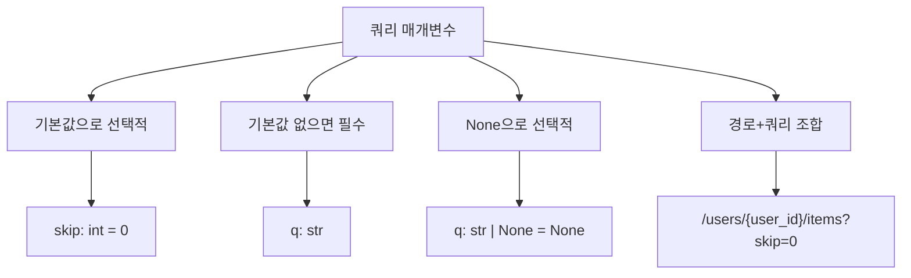

# 섹션 02: 쿼리 매개변수 (Query Parameters)

> **난이도**: ⭐ (1/5)
> **선수 지식**: sec01-path-params 완료
> **학습 목표**: 쿼리 매개변수를 정의하고 선택/필수를 구분할 수 있다

---

## 1. 핵심 개념

### 쿼리 매개변수란?

URL에서 `?` 뒤에 `key=value` 형태로 전달되는 매개변수입니다.
여러 개의 쿼리 매개변수는 `&`로 연결합니다.

```
GET /items?skip=0&limit=10&q=노트북
           ├────┤ ├───────┤ ├─────┤
           skip=0  limit=10  q=노트북
```

### 경로 매개변수 vs 쿼리 매개변수



| 구분 | 경로 매개변수 | 쿼리 매개변수 |
|------|-------------|-------------|
| 위치 | URL 경로 안 (`/items/{id}`) | `?` 뒤 (`?key=value`) |
| 용도 | 리소스 식별 | 필터링, 정렬, 페이지네이션 |
| 필수 여부 | 항상 필수 | 선택 또는 필수 |
| 예시 | `/users/42` | `?skip=0&limit=10` |

---

## 2. 기본 사용법

### 2.1 쿼리 매개변수 자동 인식

FastAPI에서 함수 매개변수가 경로에 포함되지 않으면 자동으로 **쿼리 매개변수**로 인식됩니다.

```python
from fastapi import FastAPI

app = FastAPI()

# 더미 상품 데이터
fake_items_db = [
    {"name": "노트북"},
    {"name": "마우스"},
    {"name": "키보드"},
    {"name": "모니터"},
    {"name": "헤드셋"},
]


@app.get("/items")
async def read_items(skip: int = 0, limit: int = 10):
    """상품 목록을 페이지네이션하여 조회합니다."""
    return fake_items_db[skip : skip + limit]
```

- `skip`과 `limit`은 경로(`/items`)에 포함되지 않으므로 **쿼리 매개변수**입니다.
- 기본값이 있으므로 **선택적** 매개변수입니다.

**요청 예시:**

| 요청 URL | skip | limit | 결과 |
|----------|------|-------|------|
| `/items` | 0 (기본값) | 10 (기본값) | 전체 목록 |
| `/items?skip=2` | 2 | 10 (기본값) | 3번째부터 |
| `/items?skip=0&limit=2` | 0 | 2 | 처음 2개 |
| `/items?limit=3` | 0 (기본값) | 3 | 처음 3개 |

### 2.2 타입 변환

경로 매개변수와 마찬가지로, 쿼리 매개변수도 **타입 힌트에 따라 자동 변환**됩니다.

```python
@app.get("/items")
async def read_items(skip: int = 0, limit: int = 10):
    # skip과 limit은 자동으로 int로 변환됩니다
    # ?skip=abc 같은 잘못된 값은 422 에러를 발생시킵니다
    return fake_items_db[skip : skip + limit]
```

---

## 3. 선택적 매개변수 (Optional)

### 3.1 기본값을 사용한 선택적 매개변수

기본값을 지정하면 해당 매개변수는 **선택적**이 됩니다.

```python
@app.get("/items")
async def read_items(skip: int = 0, limit: int = 10):
    """skip과 limit은 선택적입니다 (기본값이 있으므로)."""
    return fake_items_db[skip : skip + limit]
```

### 3.2 None을 기본값으로 사용

`None`을 기본값으로 사용하면, 값이 전달되지 않았을 때를 구분할 수 있습니다.

```python
@app.get("/items")
async def read_items(
    skip: int = 0,
    limit: int = 10,
    q: str | None = None,
):
    """q는 선택적 검색 키워드입니다."""
    results = fake_items_db[skip : skip + limit]
    if q:
        # 검색 키워드가 있으면 필터링
        results = [item for item in results if q in item["name"]]
    return results
```

**참고**: Python 3.9 이하에서는 `str | None` 대신 `Optional[str]`을 사용합니다.

```python
from typing import Optional

# Python 3.9 이하 호환
async def read_items(q: Optional[str] = None):
    ...

# Python 3.10 이상
async def read_items(q: str | None = None):
    ...
```

---

## 4. 필수 쿼리 매개변수

### 4.1 기본값이 없으면 필수

기본값을 지정하지 않은 매개변수는 **필수**가 됩니다.

```python
@app.get("/items/search")
async def search_items(q: str):
    """q는 필수 쿼리 매개변수입니다."""
    return {"query": q, "message": f"'{q}' 검색 결과"}
```

| 요청 URL | 결과 |
|----------|------|
| `/items/search?q=노트북` | 정상 응답 |
| `/items/search` | 422 에러 (q가 누락됨) |

### 4.2 필수와 선택 매개변수 혼합

```python
@app.get("/items/search")
async def search_items(
    q: str,                        # 필수: 기본값 없음
    category: str | None = None,   # 선택: 기본값이 None
    skip: int = 0,                 # 선택: 기본값이 0
    limit: int = 10,               # 선택: 기본값이 10
):
    """필수와 선택 매개변수를 혼합하여 사용합니다."""
    return {
        "query": q,
        "category": category,
        "skip": skip,
        "limit": limit,
    }
```



---

## 5. 경로 매개변수와 쿼리 매개변수 조합

하나의 엔드포인트에서 경로 매개변수와 쿼리 매개변수를 함께 사용할 수 있습니다.

```python
@app.get("/users/{user_id}/items")
async def read_user_items(
    user_id: int,                  # 경로 매개변수: {user_id}에 매칭
    skip: int = 0,                 # 쿼리 매개변수: 경로에 없으므로
    limit: int = 10,               # 쿼리 매개변수: 경로에 없으므로
    q: str | None = None,          # 쿼리 매개변수: 경로에 없으므로
):
    """특정 사용자의 아이템 목록을 조회합니다."""
    return {
        "user_id": user_id,
        "skip": skip,
        "limit": limit,
        "q": q,
    }
```

**요청 예시:**
```
GET /users/42/items?skip=0&limit=5&q=노트북
-> user_id=42, skip=0, limit=5, q="노트북"
```

FastAPI는 매개변수의 이름이 경로에 포함되어 있으면 **경로 매개변수**, 그렇지 않으면 **쿼리 매개변수**로 자동 분류합니다.

---

## 6. 불리언(bool) 쿼리 매개변수

FastAPI는 불리언 타입의 쿼리 매개변수를 유연하게 처리합니다.

```python
@app.get("/items")
async def read_items(
    skip: int = 0,
    limit: int = 10,
    include_hidden: bool = False,
):
    """include_hidden이 True이면 숨겨진 상품도 포함합니다."""
    return {"skip": skip, "limit": limit, "include_hidden": include_hidden}
```

**참(True)으로 인식되는 값들:**
- `?include_hidden=true`
- `?include_hidden=True`
- `?include_hidden=1`
- `?include_hidden=yes`
- `?include_hidden=on`

**거짓(False)으로 인식되는 값들:**
- `?include_hidden=false`
- `?include_hidden=False`
- `?include_hidden=0`
- `?include_hidden=no`
- `?include_hidden=off`

---

## 7. 코드 예제: 상품 목록 API (페이지네이션)

```python
from fastapi import FastAPI

app = FastAPI()

# 더미 상품 데이터베이스
fake_items_db = [
    {"id": 1, "name": "노트북", "price": 1500000, "category": "전자제품"},
    {"id": 2, "name": "마우스", "price": 35000, "category": "전자제품"},
    {"id": 3, "name": "키보드", "price": 89000, "category": "전자제품"},
    {"id": 4, "name": "티셔츠", "price": 25000, "category": "의류"},
    {"id": 5, "name": "청바지", "price": 55000, "category": "의류"},
    {"id": 6, "name": "사과", "price": 3000, "category": "식품"},
    {"id": 7, "name": "바나나", "price": 2000, "category": "식품"},
    {"id": 8, "name": "모니터", "price": 450000, "category": "전자제품"},
    {"id": 9, "name": "헤드셋", "price": 120000, "category": "전자제품"},
    {"id": 10, "name": "운동화", "price": 89000, "category": "의류"},
]


@app.get("/items")
async def list_items(
    skip: int = 0,
    limit: int = 10,
    q: str | None = None,
    category: str | None = None,
):
    """
    상품 목록을 조회합니다.

    - skip: 건너뛸 항목 수 (기본값: 0)
    - limit: 반환할 최대 항목 수 (기본값: 10)
    - q: 검색 키워드 (선택)
    - category: 카테고리 필터 (선택)
    """
    results = fake_items_db

    # 카테고리 필터링
    if category:
        results = [item for item in results if item["category"] == category]

    # 키워드 검색
    if q:
        results = [item for item in results if q in item["name"]]

    # 페이지네이션 적용
    paginated = results[skip : skip + limit]

    return {
        "total": len(results),
        "skip": skip,
        "limit": limit,
        "items": paginated,
    }
```

---

## 8. 정리



| 개념 | 핵심 내용 |
|------|----------|
| 자동 인식 | 경로에 없는 매개변수는 쿼리 매개변수 |
| 기본값 | 기본값이 있으면 선택적, 없으면 필수 |
| Optional | `str \| None = None`으로 선택적 매개변수 정의 |
| 타입 변환 | 타입 힌트에 따라 자동 변환 및 검증 |
| bool 타입 | true/false, 1/0, yes/no 등 유연하게 처리 |

---

**이전 섹션**: [sec01-path-params - 경로 매개변수](../sec01-path-params/concept.md)
**다음 섹션**: [sec03-param-validation - 매개변수 검증](../sec03-param-validation/concept.md)
