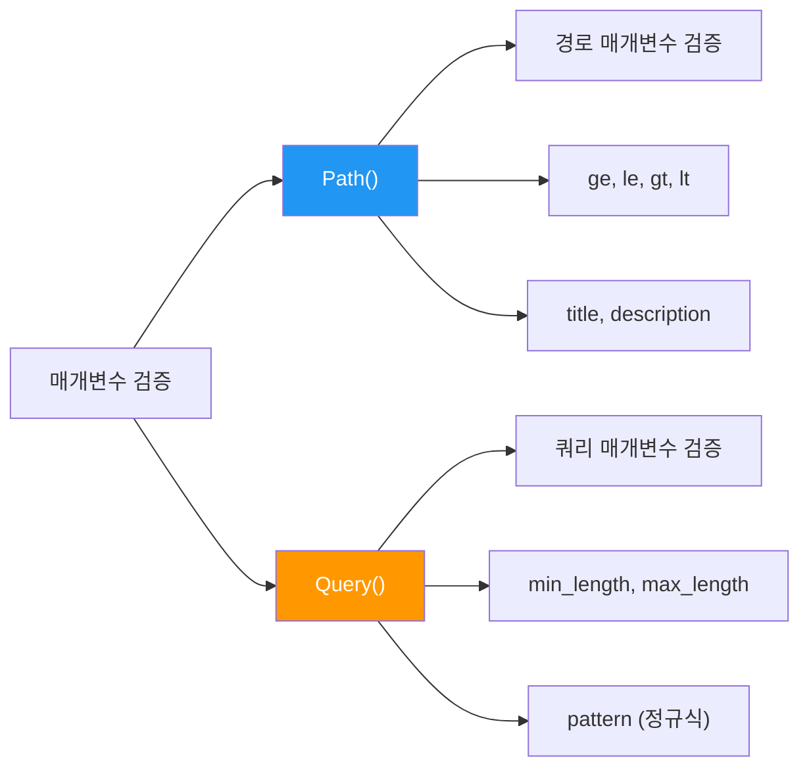
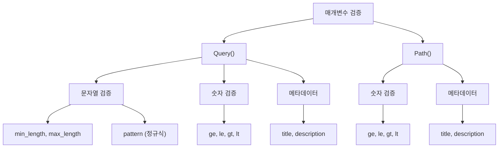

# 섹션 03: 매개변수 검증 (Parameter Validation)

> **난이도**: ⭐⭐ (2/5)
> **선수 지식**: sec01, sec02 완료
> **학습 목표**: Path()와 Query()를 사용하여 매개변수에 검증 규칙을 추가할 수 있다

---

## 1. 핵심 개념

### 왜 검증이 필요한가?

타입 힌트만으로는 "1 이상 100 이하의 정수" 또는 "3글자 이상 50글자 이하의 문자열" 같은 **세밀한 조건**을 표현할 수 없습니다.
FastAPI의 `Path()`와 `Query()`를 사용하면 이러한 검증 규칙을 선언적으로 정의할 수 있습니다.

```python
# 타입 힌트만으로는 부족한 경우
async def read_item(item_id: int):  # 음수도 허용됨!
    ...

# Path()를 사용하면 세밀한 검증 가능
async def read_item(item_id: int = Path(ge=1)):  # 1 이상만 허용
    ...
```

### Path()와 Query()



---

## 2. Query() - 쿼리 매개변수 검증

### 2.1 기본 사용법

```python
from fastapi import FastAPI, Query

app = FastAPI()


@app.get("/items")
async def read_items(
    q: str | None = Query(default=None, min_length=3, max_length=50),
):
    """검색 키워드는 3글자 이상 50글자 이하여야 합니다."""
    return {"q": q}
```

`Query()`의 주요 매개변수:

| 매개변수 | 설명 | 예시 |
|---------|------|------|
| `default` | 기본값 (None이면 선택적, 미지정이면 필수) | `default=None` |
| `min_length` | 최소 문자열 길이 | `min_length=3` |
| `max_length` | 최대 문자열 길이 | `max_length=50` |
| `pattern` | 정규표현식 패턴 | `pattern="^[a-zA-Z]+$"` |
| `ge` | 이상 (greater than or equal) | `ge=0` |
| `le` | 이하 (less than or equal) | `le=100` |
| `gt` | 초과 (greater than) | `gt=0` |
| `lt` | 미만 (less than) | `lt=100` |
| `title` | API 문서에 표시될 제목 | `title="검색어"` |
| `description` | API 문서에 표시될 설명 | `description="상품명 검색"` |

### 2.2 문자열 길이 검증

```python
@app.get("/items")
async def read_items(
    q: str = Query(min_length=2, max_length=100),
):
    """
    검색어 길이 제한:
    - 최소 2글자 이상
    - 최대 100글자 이하
    - 기본값이 없으므로 필수 매개변수
    """
    return {"q": q}
```

| 요청 | 결과 |
|------|------|
| `/items?q=ab` | 정상 (2글자) |
| `/items?q=a` | 422 에러 (1글자, 최소 2글자 미달) |
| `/items?q=` | 422 에러 (0글자) |
| `/items` | 422 에러 (필수 매개변수 누락) |

### 2.3 정규표현식 패턴 검증

```python
@app.get("/items")
async def read_items(
    q: str | None = Query(
        default=None,
        min_length=2,
        pattern="^[가-힣a-zA-Z0-9 ]+$",
    ),
):
    """한글, 영문, 숫자, 공백만 허용합니다."""
    return {"q": q}
```

**참고**: FastAPI 0.95 이전 버전에서는 `pattern` 대신 `regex`를 사용합니다.

### 2.4 숫자 범위 검증 (쿼리)

```python
@app.get("/items")
async def read_items(
    skip: int = Query(default=0, ge=0),
    limit: int = Query(default=10, ge=1, le=100),
):
    """
    - skip: 0 이상
    - limit: 1 이상 100 이하
    """
    return {"skip": skip, "limit": limit}
```

| 매개변수 | 유효 범위 | ge=0, le=100 의미 |
|---------|----------|------------------|
| `ge=0` | 0 이상 | 0, 1, 2, ... (음수 불가) |
| `le=100` | 100 이하 | ..., 99, 100 (101 이상 불가) |
| `gt=0` | 0 초과 | 1, 2, 3, ... (0 불가) |
| `lt=100` | 100 미만 | ..., 98, 99 (100 불가) |

### 2.5 Query()와 기본값

```python
# 방법 1: 기본값이 있는 선택적 매개변수
q: str | None = Query(default=None, min_length=3)

# 방법 2: 필수 매개변수 (기본값 없음)
q: str = Query(min_length=3)

# 방법 3: 명시적으로 필수 표시 (Ellipsis 사용)
q: str = Query(..., min_length=3)  # ...은 "필수"를 의미
```

---

## 3. Path() - 경로 매개변수 검증

### 3.1 기본 사용법

```python
from fastapi import FastAPI, Path

app = FastAPI()


@app.get("/items/{item_id}")
async def read_item(
    item_id: int = Path(title="상품 ID", ge=1),
):
    """item_id는 1 이상의 정수여야 합니다."""
    return {"item_id": item_id}
```

### 3.2 숫자 범위 검증

```python
@app.get("/items/{item_id}")
async def read_item(
    item_id: int = Path(
        title="상품 ID",
        description="조회할 상품의 고유 식별자",
        ge=1,          # 1 이상
        le=10000,      # 10000 이하
    ),
):
    """상품 ID는 1 이상 10000 이하의 정수입니다."""
    return {"item_id": item_id}
```

| 요청 URL | 결과 |
|----------|------|
| `/items/1` | 정상 |
| `/items/10000` | 정상 |
| `/items/0` | 422 에러 (1 미만) |
| `/items/10001` | 422 에러 (10000 초과) |

### 3.3 Path()와 title/description

`title`과 `description`은 API 자동 문서(Swagger UI)에 표시됩니다.

```python
@app.get("/users/{user_id}")
async def read_user(
    user_id: int = Path(
        title="사용자 ID",
        description="조회할 사용자의 고유 식별자입니다. 1 이상의 정수를 입력하세요.",
        ge=1,
    ),
):
    return {"user_id": user_id}
```

---

## 4. Path()와 Query() 함께 사용

### 4.1 기본 조합

```python
from fastapi import FastAPI, Path, Query

app = FastAPI()


@app.get("/items/{item_id}")
async def read_item(
    item_id: int = Path(title="상품 ID", ge=1, le=10000),
    q: str | None = Query(default=None, min_length=2, max_length=50),
    verbose: bool = Query(default=False),
):
    """
    경로 매개변수와 쿼리 매개변수를 함께 사용합니다.

    - item_id: 1~10000 범위의 정수 (경로)
    - q: 2~50글자 검색어 (쿼리, 선택)
    - verbose: 상세 정보 포함 여부 (쿼리, 선택)
    """
    result = {"item_id": item_id}
    if q:
        result["q"] = q
    if verbose:
        result["detail"] = "상세 정보가 포함되었습니다"
    return result
```

### 4.2 매개변수 순서 문제

Python에서는 기본값이 없는 매개변수가 기본값이 있는 매개변수보다 **먼저** 와야 합니다.
하지만 `Path()`는 항상 필수(경로에 있으므로)이기 때문에, 순서 문제가 발생할 수 있습니다.

```python
# 문제: q(필수)가 item_id(Path) 뒤에 오면 SyntaxError는 아니지만 혼란스러움
@app.get("/items/{item_id}")
async def read_item(
    q: str,                                    # 필수 쿼리
    item_id: int = Path(title="상품 ID", ge=1), # 경로 (기본값이 있는 것처럼 보임)
):
    return {"item_id": item_id, "q": q}
```

**해결 방법**: `*`를 사용하여 키워드 전용 인자로 만듭니다.

```python
@app.get("/items/{item_id}")
async def read_item(
    *,                                          # 이후 매개변수는 키워드 전용
    item_id: int = Path(title="상품 ID", ge=1),
    q: str,
):
    return {"item_id": item_id, "q": q}
```

---

## 5. 코드 예제: 검증이 적용된 상품 API

```python
from fastapi import FastAPI, Path, Query

app = FastAPI()

# 더미 데이터
fake_items_db = {
    1: {"name": "노트북", "price": 1500000, "stock": 10},
    2: {"name": "마우스", "price": 35000, "stock": 50},
    3: {"name": "키보드", "price": 89000, "stock": 30},
}


@app.get("/items/{item_id}")
async def read_item(
    *,
    item_id: int = Path(
        title="상품 ID",
        description="조회할 상품의 고유 ID (1~10000)",
        ge=1,
        le=10000,
    ),
    q: str | None = Query(
        default=None,
        title="검색 키워드",
        min_length=2,
        max_length=50,
    ),
):
    """
    상품을 조회합니다.

    - 상품 ID는 1 이상 10000 이하의 정수
    - 검색 키워드는 2~50글자 (선택사항)
    """
    result = {}
    if item_id in fake_items_db:
        result = fake_items_db[item_id]
    else:
        result = {"error": "상품을 찾을 수 없습니다"}

    if q:
        result["searched_for"] = q

    return result


@app.get("/items")
async def list_items(
    skip: int = Query(
        default=0,
        title="건너뛸 항목 수",
        ge=0,
    ),
    limit: int = Query(
        default=10,
        title="반환 항목 수",
        ge=1,
        le=100,
    ),
    min_price: int | None = Query(
        default=None,
        title="최소 가격",
        ge=0,
    ),
    max_price: int | None = Query(
        default=None,
        title="최대 가격",
        ge=0,
    ),
    name: str | None = Query(
        default=None,
        title="상품명 검색",
        min_length=1,
        max_length=100,
    ),
):
    """
    상품 목록을 조회합니다 (검증 규칙 적용).

    - skip: 0 이상
    - limit: 1~100 범위
    - min_price: 0 이상 (선택)
    - max_price: 0 이상 (선택)
    - name: 1~100글자 (선택)
    """
    items = list(fake_items_db.values())

    if name:
        items = [item for item in items if name in item["name"]]
    if min_price is not None:
        items = [item for item in items if item["price"] >= min_price]
    if max_price is not None:
        items = [item for item in items if item["price"] <= max_price]

    return {"items": items[skip : skip + limit], "total": len(items)}
```

---

## 6. 검증 에러 응답 형식

검증에 실패하면 FastAPI는 자동으로 **422 Unprocessable Entity** 응답을 반환합니다.

```json
{
    "detail": [
        {
            "type": "greater_than_equal",
            "loc": ["path", "item_id"],
            "msg": "Input should be greater than or equal to 1",
            "input": "0",
            "ctx": {"ge": 1}
        }
    ]
}
```

에러 응답의 구조:
- `type`: 검증 에러 유형
- `loc`: 에러가 발생한 위치 (`["path", "변수명"]` 또는 `["query", "변수명"]`)
- `msg`: 사람이 읽을 수 있는 에러 메시지
- `input`: 입력된 값
- `ctx`: 검증 조건의 컨텍스트 정보

---

## 7. 주의 사항

| 주의 사항 | 설명 |
|----------|------|
| `Path()`는 항상 필수 | 경로 매개변수는 URL의 일부이므로 항상 값이 있어야 합니다 |
| `Query()`의 기본값 | `default=None`이면 선택적, 기본값 없으면 필수 |
| `...` (Ellipsis) | `Query(...)`는 "기본값 없음 = 필수"를 명시적으로 표현 |
| `pattern` vs `regex` | FastAPI 0.95+ 에서는 `pattern`, 이전 버전은 `regex` |
| `*` 사용 | 매개변수 순서 문제를 해결하기 위해 `*`를 첫 번째 인자로 사용 |

---

## 8. 정리



| 개념 | 핵심 내용 |
|------|----------|
| `Query()` | 쿼리 매개변수에 검증 규칙 추가 |
| `Path()` | 경로 매개변수에 검증 규칙 추가 |
| 숫자 검증 | `ge`, `le`, `gt`, `lt`로 범위 제한 |
| 문자열 검증 | `min_length`, `max_length`, `pattern`으로 길이/형식 제한 |
| 메타데이터 | `title`, `description`으로 API 문서 보강 |
| 422 에러 | 검증 실패 시 자동으로 상세한 에러 응답 반환 |

---

**이전 섹션**: [sec02-query-params - 쿼리 매개변수](../sec02-query-params/concept.md)
**다음 챕터**: Ch03 - 요청 본문과 Pydantic 모델
