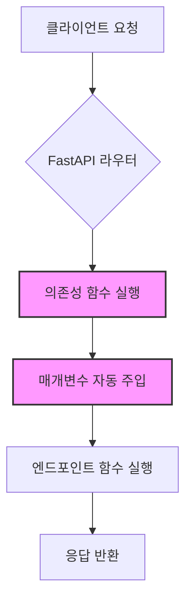

# Ch05: 의존성 주입 (Dependency Injection)

> **난이도**: ⭐⭐ (2/5) ~ ⭐⭐⭐ (3/5)
> **선수 지식**: Ch04 응답 모델과 상태 코드 완료
> **예상 학습 시간**: 2~3시간

---

## 개요

FastAPI의 **의존성 주입(Dependency Injection)** 시스템은 프레임워크의 핵심 기능 중 하나입니다.
의존성 주입을 활용하면 공통 로직을 한 곳에서 정의하고, 여러 엔드포인트에서 재사용할 수 있습니다.

### 의존성 주입이란?

```
"내가 필요한 것을 직접 만들지 않고, 외부에서 주입받는 것"
```

예를 들어, 여러 엔드포인트에서 동일한 페이지네이션 로직이 필요하다면,
매번 `skip`과 `limit` 매개변수를 반복해서 작성하는 대신 의존성 함수로 한 번만 정의하면 됩니다.

---

## 왜 의존성 주입이 중요한가?

### 1. 코드 재사용 (Code Reuse)
- 공통 로직(페이지네이션, 인증, DB 세션 등)을 한 번 작성하고 여러 곳에서 사용
- 중복 코드를 획기적으로 줄일 수 있음

### 2. 테스트 용이성 (Testability)
- 의존성을 교체(오버라이드)하여 테스트 시 Mock 객체를 주입 가능
- 실제 DB 대신 테스트용 DB를 쉽게 연결할 수 있음

### 3. 관심사 분리 (Separation of Concerns)
- 엔드포인트 함수는 비즈니스 로직에만 집중
- 인증, DB 연결, 데이터 검증 등은 의존성에게 위임
- 코드의 가독성과 유지보수성이 향상

### 4. 자동 문서화
- 의존성의 매개변수가 Swagger UI에 자동으로 반영
- 별도 설정 없이 API 문서가 정확하게 생성됨

---

## 의존성 주입 흐름



---

## 섹션 목록

| 섹션 | 제목 | 난이도 | 핵심 내용 |
|------|------|--------|----------|
| sec01 | [기본 의존성](./sec01-basic-depends/concept.md) | ⭐⭐ (2/5) | `Depends()`, 함수 의존성, 매개변수 자동 주입 |
| sec02 | [클래스 의존성](./sec02-class-depends/concept.md) | ⭐⭐ (2/5) | 클래스 기반 의존성, `__init__`, Callable |
| sec03 | [중첩 의존성](./sec03-nested-depends/concept.md) | ⭐⭐⭐ (3/5) | 의존성 체인, 라우터 의존성, yield 의존성 |

---

## 학습 순서

```
sec01-basic-depends --> sec02-class-depends --> sec03-nested-depends
```

1. **sec01-basic-depends**: `Depends()`를 사용하여 함수 의존성의 기본 개념을 학습합니다.
2. **sec02-class-depends**: 클래스를 의존성으로 활용하여 더 구조화된 의존성을 만듭니다.
3. **sec03-nested-depends**: 의존성 안에서 다른 의존성을 사용하는 중첩 구조를 학습합니다.

각 섹션에서:
1. `concept.md`를 읽고 개념을 이해합니다.
2. `exercise.md`의 문제를 확인합니다.
3. `exercise.py`에서 TODO를 완성합니다.
4. `python exercise.py`로 테스트를 실행합니다.
5. 막히면 `solution.py`를 참고합니다.

---

## 이 챕터를 마치면 할 수 있는 것

- `Depends()`를 사용하여 공통 로직을 재사용 가능한 의존성으로 만들 수 있다
- 클래스 기반 의존성을 활용하여 설정 가능한 의존성을 구현할 수 있다
- 의존성 체인을 구성하여 DB 세션 -> 리포지토리 -> 서비스 계층을 설계할 수 있다
- `yield`를 사용하여 리소스 정리가 포함된 의존성을 작성할 수 있다
- 라우터 수준에서 공통 의존성을 설정할 수 있다
