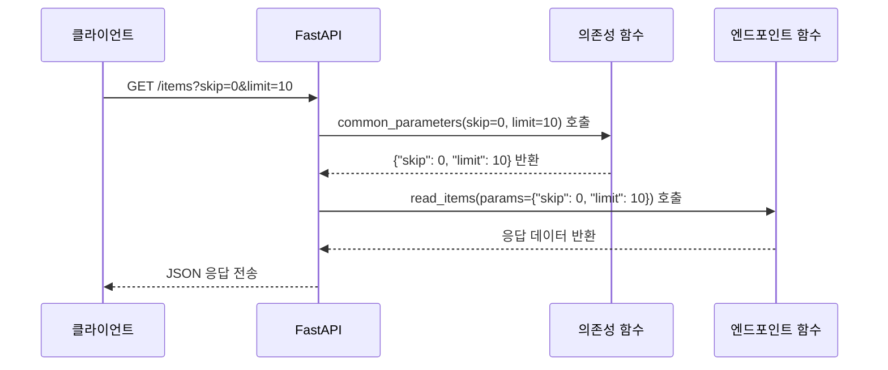

# sec01: 기본 의존성 (Basic Depends)

> **난이도**: ⭐⭐ (2/5)
> **선수 지식**: Ch04 응답 모델과 상태 코드 완료
> **예상 학습 시간**: 30~40분

---

## 학습 목표

- `Depends()`를 사용하여 공통 로직을 재사용할 수 있다
- 의존성 함수가 어떻게 매개변수를 자동으로 주입받는지 이해한다
- 여러 엔드포인트에서 동일한 의존성을 공유하는 방법을 익힌다

---

## 핵심 개념

### 1. Depends란?

`Depends()`는 FastAPI에서 의존성 주입을 수행하는 핵심 함수입니다.
엔드포인트 함수의 매개변수에 `Depends(의존성_함수)`를 지정하면,
FastAPI가 자동으로 해당 함수를 호출하고 결과를 주입합니다.

```python
from fastapi import Depends

# 의존성 함수 정의
def get_db():
    """데이터베이스 세션을 반환하는 의존성"""
    db = DatabaseSession()
    return db

# 엔드포인트에서 의존성 사용
@app.get("/items")
def read_items(db = Depends(get_db)):
    # db에는 get_db()의 반환값이 자동으로 주입됨
    return db.query(Item).all()
```

### 2. 함수 의존성 (Function Dependency)

가장 기본적인 형태의 의존성은 **일반 함수**입니다.
의존성 함수는 엔드포인트 함수와 동일한 방식으로 매개변수를 받을 수 있습니다.

```python
from fastapi import FastAPI, Depends, Query

app = FastAPI()

# 의존성 함수: 쿼리 매개변수를 받아서 딕셔너리로 반환
def common_parameters(
    skip: int = Query(default=0, ge=0, description="건너뛸 항목 수"),
    limit: int = Query(default=10, ge=1, le=100, description="조회할 항목 수"),
):
    """공통 페이지네이션 매개변수"""
    return {"skip": skip, "limit": limit}

@app.get("/items")
def read_items(params: dict = Depends(common_parameters)):
    # params = {"skip": 0, "limit": 10} (기본값)
    return {"params": params}

@app.get("/users")
def read_users(params: dict = Depends(common_parameters)):
    # 같은 의존성을 다른 엔드포인트에서도 재사용!
    return {"params": params}
```

### 3. 매개변수 자동 주입

의존성 함수의 매개변수는 **엔드포인트 함수의 매개변수처럼** 동작합니다.
즉, 쿼리 매개변수, 경로 매개변수, 헤더 등을 의존성 함수에서도 받을 수 있습니다.

```python
from fastapi import Header

def verify_api_key(x_api_key: str = Header()):
    """API 키 검증 의존성"""
    if x_api_key != "secret-key":
        raise HTTPException(status_code=403, detail="잘못된 API 키")
    return x_api_key

@app.get("/protected")
def protected_route(api_key: str = Depends(verify_api_key)):
    return {"message": "인증 성공", "api_key": api_key}
```

### 4. 의존성 캐싱

같은 요청 내에서 동일한 의존성이 여러 번 사용되면, FastAPI는 기본적으로 **한 번만 실행**하고
결과를 캐싱합니다. 이를 통해 불필요한 중복 호출을 방지합니다.

```python
def get_current_user():
    """현재 사용자 조회 (한 번만 실행됨)"""
    print("사용자 조회 중...")  # 한 번만 출력됨
    return {"user_id": 1, "name": "홍길동"}

def check_permission(user = Depends(get_current_user)):
    """권한 확인 - get_current_user를 사용"""
    return user

@app.get("/profile")
def get_profile(
    user = Depends(get_current_user),         # get_current_user 호출
    permission = Depends(check_permission),    # 내부에서 get_current_user 재사용 (캐싱됨)
):
    return user
```

> **참고**: 캐싱을 비활성화하려면 `Depends(get_current_user, use_cache=False)`를 사용합니다.

---

## 의존성 주입 흐름



---

## Depends 없이 vs Depends 사용 비교

### Before: 코드 중복

```python
@app.get("/items")
def read_items(skip: int = 0, limit: int = 10):
    return fake_items[skip : skip + limit]

@app.get("/users")
def read_users(skip: int = 0, limit: int = 10):
    return fake_users[skip : skip + limit]

@app.get("/orders")
def read_orders(skip: int = 0, limit: int = 10):
    return fake_orders[skip : skip + limit]
# skip, limit 매개변수가 3번 반복됨!
```

### After: Depends로 재사용

```python
def common_pagination(skip: int = 0, limit: int = 10):
    return {"skip": skip, "limit": limit}

@app.get("/items")
def read_items(pagination: dict = Depends(common_pagination)):
    return fake_items[pagination["skip"] : pagination["skip"] + pagination["limit"]]

@app.get("/users")
def read_users(pagination: dict = Depends(common_pagination)):
    return fake_users[pagination["skip"] : pagination["skip"] + pagination["limit"]]

@app.get("/orders")
def read_orders(pagination: dict = Depends(common_pagination)):
    return fake_orders[pagination["skip"] : pagination["skip"] + pagination["limit"]]
# 페이지네이션 로직은 한 곳에서만 관리!
```

---

## 주의사항

1. **의존성 함수는 `async`도 가능합니다**: `async def get_db():`처럼 비동기 함수도 의존성으로 사용 가능
2. **의존성 함수의 반환값은 자유롭습니다**: `dict`, `list`, 커스텀 객체 등 무엇이든 반환 가능
3. **Depends()의 인자는 Callable이어야 합니다**: 함수, 클래스, 또는 `__call__` 메서드가 있는 객체

---

## 다음 단계

- `exercise.md`를 확인하고 연습 문제를 풀어보세요.
- 다음 섹션: [sec02-class-depends](../sec02-class-depends/concept.md) - 클래스 기반 의존성
