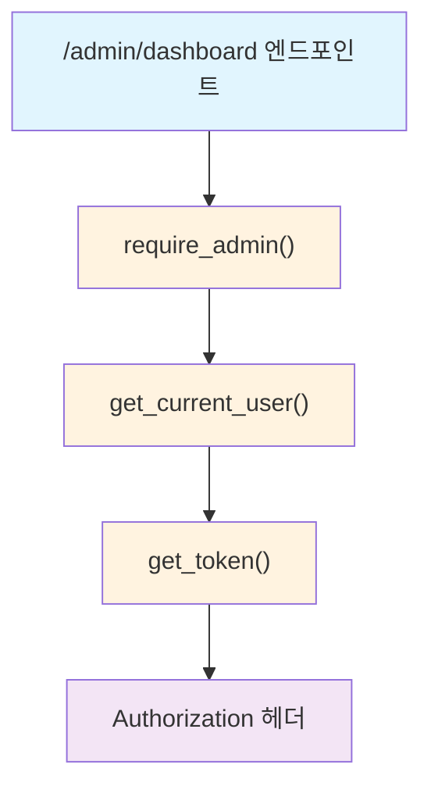
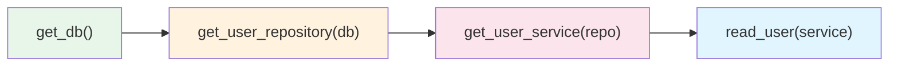
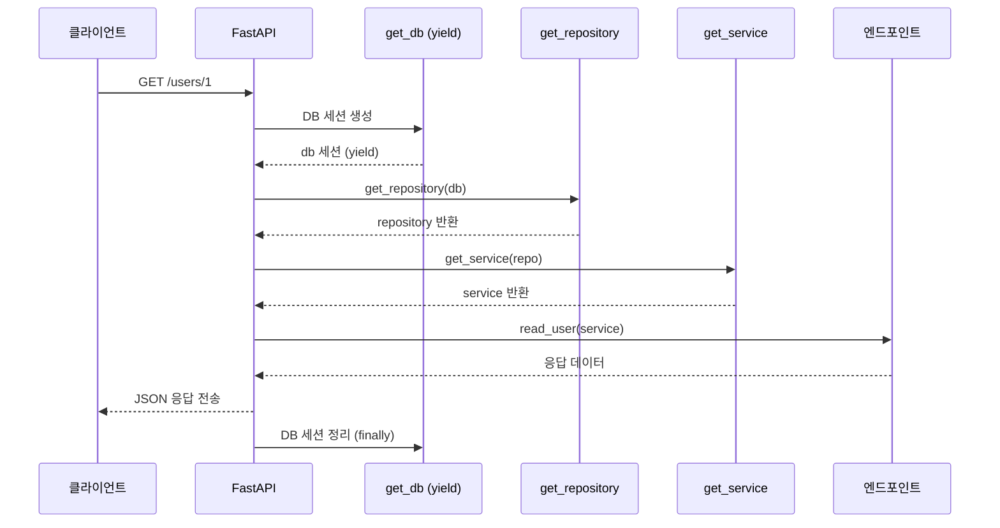

# sec03: 중첩 의존성 (Nested Dependencies)

> **난이도**: ⭐⭐⭐ (3/5)
> **선수 지식**: sec02 클래스 의존성 완료
> **예상 학습 시간**: 40~50분

---

## 학습 목표

- 의존성 안에서 다른 의존성을 사용하는 중첩 구조를 구성할 수 있다
- 라우터 수준에서 공통 의존성을 설정할 수 있다
- `yield`를 사용하여 리소스 정리가 포함된 의존성을 작성할 수 있다

---

## 핵심 개념

### 1. 중첩 의존성 (Nested Dependencies)

의존성 함수(또는 클래스) 내부에서 또 다른 의존성을 사용할 수 있습니다.
이를 통해 **의존성 체인(Dependency Chain)**을 구성할 수 있습니다.

```python
from fastapi import FastAPI, Depends, Header, HTTPException

app = FastAPI()

# 1단계: 토큰 추출 의존성
def get_token(authorization: str = Header()):
    """Authorization 헤더에서 토큰을 추출"""
    if not authorization.startswith("Bearer "):
        raise HTTPException(status_code=401, detail="잘못된 인증 형식")
    return authorization.replace("Bearer ", "")

# 2단계: 사용자 조회 의존성 (1단계에 의존)
def get_current_user(token: str = Depends(get_token)):
    """토큰을 검증하고 현재 사용자를 반환"""
    # 토큰 검증 로직 (실제로는 JWT 디코딩 등)
    if token != "valid-token":
        raise HTTPException(status_code=401, detail="유효하지 않은 토큰")
    return {"user_id": 1, "username": "홍길동", "role": "admin"}

# 3단계: 관리자 확인 의존성 (2단계에 의존)
def require_admin(user: dict = Depends(get_current_user)):
    """현재 사용자가 관리자인지 확인"""
    if user.get("role") != "admin":
        raise HTTPException(status_code=403, detail="관리자 권한이 필요합니다")
    return user

@app.get("/admin/dashboard")
def admin_dashboard(admin: dict = Depends(require_admin)):
    # 의존성 체인: get_token -> get_current_user -> require_admin
    return {"message": f"환영합니다, {admin['username']} 관리자님!"}
```

### 2. 의존성 트리 (Dependency Tree)

중첩 의존성은 트리 구조를 형성합니다. FastAPI는 이 트리를 자동으로 해석하고,
필요한 순서대로 의존성을 실행합니다.



**실행 순서**: `get_token()` -> `get_current_user()` -> `require_admin()` -> 엔드포인트 함수

### 3. 실전 패턴: DB 세션 -> 리포지토리 -> 서비스

실무에서 가장 많이 사용되는 중첩 의존성 패턴입니다:

```python
# 1단계: DB 세션 의존성
def get_db():
    """데이터베이스 세션을 생성하고 반환"""
    db = SessionLocal()
    try:
        yield db  # yield로 세션 제공
    finally:
        db.close()  # 요청 완료 후 세션 정리

# 2단계: 리포지토리 의존성 (DB 세션에 의존)
def get_user_repository(db = Depends(get_db)):
    """사용자 리포지토리를 반환"""
    return UserRepository(db)

# 3단계: 서비스 의존성 (리포지토리에 의존)
def get_user_service(repo = Depends(get_user_repository)):
    """사용자 서비스를 반환"""
    return UserService(repo)

@app.get("/users/{user_id}")
def read_user(user_id: int, service = Depends(get_user_service)):
    # 의존성 체인: get_db -> get_user_repository -> get_user_service
    return service.get_user(user_id)
```



### 4. yield 의존성 (리소스 정리)

`yield`를 사용하면 의존성에서 **리소스 정리(cleanup)** 로직을 작성할 수 있습니다.
`yield` 전의 코드는 요청 처리 전에 실행되고, `yield` 후의 코드는 응답 전송 후에 실행됩니다.

```python
def get_db_session():
    """DB 세션을 생성하고, 요청 완료 후 자동으로 닫는 의존성"""
    print("1. DB 세션 생성")
    db = DatabaseSession()

    try:
        yield db  # <- 여기서 엔드포인트 함수가 실행됨
        print("3. 트랜잭션 커밋")
        db.commit()
    except Exception:
        print("3. 트랜잭션 롤백")
        db.rollback()
        raise
    finally:
        print("4. DB 세션 종료")
        db.close()

@app.get("/items")
def read_items(db = Depends(get_db_session)):
    print("2. 엔드포인트 실행")
    return db.query(Item).all()

# 실행 순서:
# 1. DB 세션 생성
# 2. 엔드포인트 실행
# 3. 트랜잭션 커밋 (또는 롤백)
# 4. DB 세션 종료
```

### 5. 라우터 수준 의존성 (Router Dependencies)

`APIRouter`나 `app`에 의존성을 설정하면, 해당 라우터의 모든 엔드포인트에 자동으로 적용됩니다.

```python
from fastapi import APIRouter

# 라우터에 공통 의존성 설정
admin_router = APIRouter(
    prefix="/admin",
    tags=["관리자"],
    dependencies=[Depends(require_admin)],  # 모든 엔드포인트에 적용
)

@admin_router.get("/users")
def list_users():
    # require_admin 의존성이 자동으로 적용됨
    return [{"id": 1, "name": "홍길동"}]

@admin_router.get("/settings")
def get_settings():
    # require_admin 의존성이 자동으로 적용됨
    return {"theme": "dark"}

app.include_router(admin_router)
```

> **참고**: 라우터 수준 의존성의 반환값은 엔드포인트 함수에서 접근할 수 없습니다.
> 주로 인증/권한 확인처럼 **검증만 수행하는** 의존성에 사용됩니다.

### 6. 앱 전역 의존성

앱 인스턴스에 의존성을 설정하면 모든 엔드포인트에 적용됩니다:

```python
app = FastAPI(
    dependencies=[Depends(verify_api_key)],  # 모든 엔드포인트에 적용
)
```

---

## 의존성 체인 전체 흐름



---

## 주의사항

1. **순환 의존성 주의**: A -> B -> A 같은 순환 구조는 에러를 발생시킵니다.
2. **yield 의존성은 하나의 값만 yield**: 일반 제너레이터처럼 여러 값을 yield할 수 없습니다.
3. **중첩이 너무 깊으면 복잡해질 수 있음**: 3~4단계 이내로 유지하는 것이 좋습니다.
4. **의존성 캐싱**: 같은 요청 내에서 동일한 의존성은 캐싱됩니다. 중첩 의존성에서도 마찬가지입니다.

---

## 다음 단계

- `exercise.md`를 확인하고 연습 문제를 풀어보세요.
- 다음 챕터: Ch06 미들웨어와 CORS
