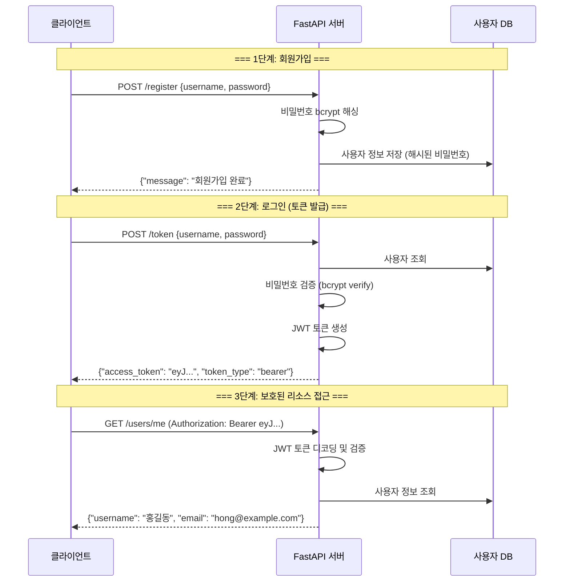

# 섹션 03: 보호된 라우트

> **난이도**: ⭐⭐⭐ (3/5)
> **선수 지식**: sec01 (OAuth2와 JWT), sec02 (비밀번호 해싱) 완료
> **학습 목표**: 인증이 필요한 API 엔드포인트를 구현할 수 있다

---

## 핵심 개념

이 섹션에서는 sec01(JWT)과 sec02(비밀번호 해싱)에서 배운 내용을 통합하여
**완전한 인증 시스템**을 구현합니다.

### 전체 인증 흐름



---

### 1. OAuth2PasswordRequestForm

FastAPI는 로그인 폼 데이터를 처리하기 위한 내장 클래스를 제공합니다.

```python
from fastapi.security import OAuth2PasswordRequestForm

@app.post("/token")
async def login(form_data: OAuth2PasswordRequestForm = Depends()):
    # form_data.username: 사용자명
    # form_data.password: 비밀번호
    ...
```

`OAuth2PasswordRequestForm`은 다음 필드를 자동으로 파싱합니다:

| 필드 | 타입 | 설명 |
|------|------|------|
| `username` | str | 사용자명 (필수) |
| `password` | str | 비밀번호 (필수) |
| `scope` | str | 권한 범위 (선택) |
| `grant_type` | str | 인증 방식 (선택, 기본값: "password") |

> **참고**: `OAuth2PasswordRequestForm`은 JSON이 아니라 **폼 데이터(form-data)**를 받습니다.
> Content-Type이 `application/x-www-form-urlencoded`여야 합니다.

---

### 2. get_current_user 의존성

**핵심 패턴**: 토큰에서 사용자 정보를 추출하는 의존성 함수를 만듭니다.
이 함수를 보호된 엔드포인트에 주입하면, 인증되지 않은 요청은 자동으로 차단됩니다.

```python
from fastapi import Depends, HTTPException, status
from fastapi.security import OAuth2PasswordBearer

oauth2_scheme = OAuth2PasswordBearer(tokenUrl="token")


async def get_current_user(token: str = Depends(oauth2_scheme)):
    """
    토큰에서 현재 사용자를 추출하는 의존성 함수.

    흐름:
    1. OAuth2PasswordBearer가 Authorization 헤더에서 토큰을 추출
    2. JWT 토큰을 디코딩하여 사용자 정보 획득
    3. 사용자가 존재하는지 DB에서 확인
    4. 사용자 정보를 반환 (또는 401 에러)
    """
    # 인증 실패 시 반환할 에러
    credentials_exception = HTTPException(
        status_code=status.HTTP_401_UNAUTHORIZED,
        detail="자격 증명을 확인할 수 없습니다",
        headers={"WWW-Authenticate": "Bearer"},
    )

    # 토큰 디코딩
    payload = decode_access_token(token)
    if payload is None:
        raise credentials_exception

    # 페이로드에서 사용자 식별자 추출
    username: str = payload.get("sub")
    if username is None:
        raise credentials_exception

    # DB에서 사용자 조회
    user = get_user_from_db(username)
    if user is None:
        raise credentials_exception

    return user
```

---

### 3. 보호된 라우트 (Protected Routes)

`get_current_user`를 의존성으로 주입하면 해당 엔드포인트는 **자동으로 인증 필수**가 됩니다.

```python
@app.get("/users/me")
async def read_users_me(current_user: dict = Depends(get_current_user)):
    """인증된 사용자만 접근 가능한 엔드포인트"""
    return current_user


@app.get("/users/me/items")
async def read_own_items(current_user: dict = Depends(get_current_user)):
    """현재 로그인한 사용자의 아이템 목록"""
    return {"owner": current_user["username"], "items": ["아이템1", "아이템2"]}
```

인증되지 않은 요청 시 자동으로 다음과 같은 응답이 반환됩니다:

```json
{
  "detail": "Not authenticated"
}
```

HTTP 상태 코드: `401 Unauthorized`

---

### 4. 전체 통합 코드 예제

아래는 회원가입, 로그인, 보호된 엔드포인트를 모두 포함한 완전한 예제입니다.

```python
"""FastAPI 인증 시스템 전체 예제"""
from datetime import datetime, timedelta, timezone
from fastapi import Depends, FastAPI, HTTPException, status
from fastapi.security import OAuth2PasswordBearer, OAuth2PasswordRequestForm
from jose import jwt, JWTError
from passlib.context import CryptContext
from pydantic import BaseModel

# --- 앱 설정 ---
app = FastAPI(title="인증 시스템 예제")

# --- 보안 설정 ---
SECRET_KEY = "학습용-비밀키-실제-운영에서는-환경변수를-사용하세요"
ALGORITHM = "HS256"
ACCESS_TOKEN_EXPIRE_MINUTES = 30

pwd_context = CryptContext(schemes=["bcrypt"], deprecated="auto")
oauth2_scheme = OAuth2PasswordBearer(tokenUrl="token")

# --- 가상 데이터베이스 ---
# 실제 운영에서는 PostgreSQL, MySQL 등의 데이터베이스를 사용합니다.
fake_users_db: dict = {}


# --- 모델 ---
class UserCreate(BaseModel):
    username: str
    email: str
    password: str


class Token(BaseModel):
    access_token: str
    token_type: str


# --- 유틸리티 함수 ---
def hash_password(password: str) -> str:
    return pwd_context.hash(password)


def verify_password(plain_password: str, hashed_password: str) -> bool:
    return pwd_context.verify(plain_password, hashed_password)


def create_access_token(data: dict, expires_delta: timedelta | None = None) -> str:
    to_encode = data.copy()
    expire = datetime.now(timezone.utc) + (expires_delta or timedelta(minutes=30))
    to_encode.update({"exp": expire})
    return jwt.encode(to_encode, SECRET_KEY, algorithm=ALGORITHM)


def get_user_from_db(username: str) -> dict | None:
    return fake_users_db.get(username)


# --- 의존성 ---
async def get_current_user(token: str = Depends(oauth2_scheme)) -> dict:
    credentials_exception = HTTPException(
        status_code=status.HTTP_401_UNAUTHORIZED,
        detail="자격 증명을 확인할 수 없습니다",
        headers={"WWW-Authenticate": "Bearer"},
    )
    try:
        payload = jwt.decode(token, SECRET_KEY, algorithms=[ALGORITHM])
        username: str = payload.get("sub")
        if username is None:
            raise credentials_exception
    except JWTError:
        raise credentials_exception

    user = get_user_from_db(username)
    if user is None:
        raise credentials_exception

    return user


# --- 엔드포인트 ---
@app.post("/register")
async def register(user: UserCreate):
    """회원가입"""
    if user.username in fake_users_db:
        raise HTTPException(status_code=400, detail="이미 존재하는 사용자입니다")

    fake_users_db[user.username] = {
        "username": user.username,
        "email": user.email,
        "hashed_password": hash_password(user.password),
    }
    return {"message": f"{user.username}님, 회원가입이 완료되었습니다"}


@app.post("/token", response_model=Token)
async def login(form_data: OAuth2PasswordRequestForm = Depends()):
    """로그인 (토큰 발급)"""
    user = get_user_from_db(form_data.username)
    if user is None or not verify_password(form_data.password, user["hashed_password"]):
        raise HTTPException(
            status_code=status.HTTP_401_UNAUTHORIZED,
            detail="사용자명 또는 비밀번호가 올바르지 않습니다",
            headers={"WWW-Authenticate": "Bearer"},
        )

    access_token = create_access_token(
        data={"sub": user["username"]},
        expires_delta=timedelta(minutes=ACCESS_TOKEN_EXPIRE_MINUTES),
    )
    return {"access_token": access_token, "token_type": "bearer"}


@app.get("/users/me")
async def read_users_me(current_user: dict = Depends(get_current_user)):
    """현재 로그인한 사용자 정보 조회 (보호된 엔드포인트)"""
    return {
        "username": current_user["username"],
        "email": current_user["email"],
    }
```

---

### 5. Swagger UI에서 인증 테스트

FastAPI의 자동 문서(`/docs`)에서 인증을 테스트할 수 있습니다.

1. 브라우저에서 `http://localhost:8000/docs`를 엽니다.
2. `/register` 엔드포인트에서 회원가입을 합니다.
3. 오른쪽 상단의 **"Authorize"** 버튼을 클릭합니다.
4. `username`과 `password`를 입력하고 **"Authorize"**를 클릭합니다.
5. `/users/me` 엔드포인트를 테스트합니다. (토큰이 자동으로 포함됩니다)

```
Swagger UI에서의 인증 흐름:

[Authorize 버튼] → [로그인 폼 입력] → [토큰 자동 저장]
                                         ↓
                               [이후 모든 요청에 토큰 자동 포함]
                                         ↓
                               [보호된 엔드포인트 접근 가능]
```

---

### 6. TestClient로 인증 테스트

```python
from fastapi.testclient import TestClient

client = TestClient(app)

# 1. 회원가입
response = client.post("/register", json={
    "username": "testuser",
    "email": "test@example.com",
    "password": "testpass123"
})
assert response.status_code == 200

# 2. 로그인 (토큰 발급)
response = client.post("/token", data={
    "username": "testuser",
    "password": "testpass123"
})
assert response.status_code == 200
token = response.json()["access_token"]

# 3. 보호된 엔드포인트 접근
response = client.get("/users/me", headers={
    "Authorization": f"Bearer {token}"
})
assert response.status_code == 200
assert response.json()["username"] == "testuser"

# 4. 토큰 없이 접근 시도 (401 에러)
response = client.get("/users/me")
assert response.status_code == 401
```

> **주의**: `/token` 엔드포인트에 로그인 요청을 보낼 때는 `json=`이 아니라 `data=`를 사용합니다.
> 이는 OAuth2PasswordRequestForm이 JSON이 아닌 폼 데이터를 받기 때문입니다.

---

## 주의 사항

### 토큰 저장 위치

```
[클라이언트 측 토큰 저장 방법]

1. HTTP-Only Cookie (권장)
   - XSS 공격으로부터 보호됨
   - 브라우저가 자동으로 포함

2. Authorization Header (API 클라이언트)
   - "Authorization: Bearer <token>"
   - 모바일 앱, API 클라이언트에 적합

3. LocalStorage/SessionStorage (주의 필요)
   - XSS 공격에 취약
   - SPA에서 많이 사용하지만 보안에 주의
```

### 운영 환경 체크리스트

```python
# 1. SECRET_KEY는 환경 변수로 관리
import os
SECRET_KEY = os.getenv("SECRET_KEY")  # 코드에 하드코딩 금지!

# 2. HTTPS 사용 필수
# 토큰이 네트워크를 통해 전송되므로 HTTPS로 암호화해야 합니다.

# 3. 토큰 만료 시간을 짧게 설정
ACCESS_TOKEN_EXPIRE_MINUTES = 15  # 15~30분 권장

# 4. 비밀번호 정책 적용
if len(password) < 8:
    raise HTTPException(status_code=400, detail="비밀번호는 8자 이상이어야 합니다")
```

---

## 정리

| 개념 | 설명 |
|------|------|
| OAuth2PasswordRequestForm | 로그인 폼 데이터 파싱 (username, password) |
| OAuth2PasswordBearer | Authorization 헤더에서 토큰 추출 |
| get_current_user | 토큰 → 사용자 정보 변환 의존성 |
| 보호된 라우트 | `Depends(get_current_user)`로 인증 필수 |
| `/token` 엔드포인트 | 로그인 후 JWT 토큰 발급 |
| `/users/me` 엔드포인트 | 토큰으로 현재 사용자 정보 조회 |
| TestClient | `data=`로 폼 데이터, `headers=`로 토큰 전송 |

---

## 이 챕터 전체 정리

```
Ch08 인증과 보안 - 전체 흐름:

[sec01: JWT 토큰]
  └── 토큰 생성 (jwt.encode)
  └── 토큰 검증 (jwt.decode)

[sec02: 비밀번호 해싱]
  └── 해싱 (pwd_context.hash)
  └── 검증 (pwd_context.verify)

[sec03: 보호된 라우트] ← sec01 + sec02 통합
  └── 회원가입 → 비밀번호 해싱 → DB 저장
  └── 로그인 → 비밀번호 검증 → JWT 발급
  └── API 접근 → JWT 검증 → 사용자 반환
```
