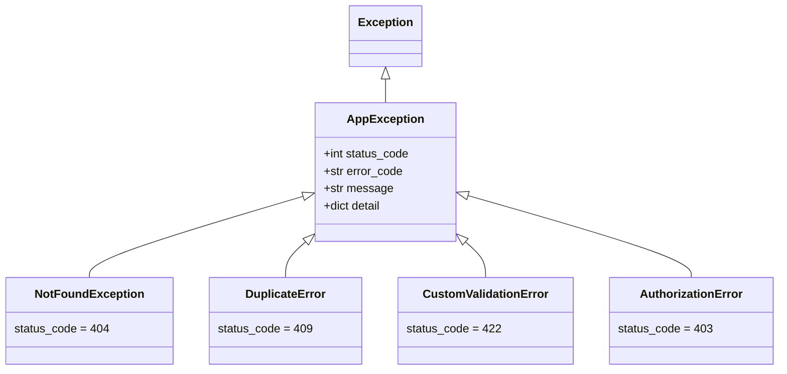

# sec01: 예외 계층 구조 (Exception Hierarchy)

> **난이도**: ⭐⭐⭐ (3/5)
> **선수 지식**: Ch04 HTTPException 기본 사용법 완료
> **예상 학습 시간**: 1~1.5시간

---

## 학습 목표

- `HTTPException`의 한계를 이해하고 커스텀 예외가 필요한 이유를 설명할 수 있다
- `AppException` 기반 클래스를 설계하고 도메인별 예외를 구현할 수 있다
- `ErrorCode` Enum 패턴으로 에러 코드를 체계적으로 관리할 수 있다
- `app.exception_handler()`로 커스텀 예외를 구조화된 JSON으로 변환할 수 있다

---

## 핵심 개념

### 1. 왜 커스텀 예외가 필요한가?

Ch04에서 배운 `HTTPException`은 간단한 에러 처리에는 충분하지만,
실제 프로젝트에서는 다음과 같은 **한계**가 있습니다.

```python
# HTTPException의 한계
from fastapi import HTTPException

# 문제 1: 에러 응답 형식이 제한적
raise HTTPException(status_code=404, detail="사용자를 찾을 수 없습니다")
# -> {"detail": "사용자를 찾을 수 없습니다"}  (단순 문자열)

# 문제 2: 에러 코드 구분 불가
raise HTTPException(status_code=404, detail="사용자를 찾을 수 없습니다")
raise HTTPException(status_code=404, detail="상품을 찾을 수 없습니다")
# -> 클라이언트가 어떤 종류의 404인지 프로그래밍적으로 구분할 수 없음

# 문제 3: 에러 처리 로직이 분산됨
# 모든 엔드포인트에서 동일한 형태의 HTTPException을 반복 작성
```

**커스텀 예외를 사용하면:**

```python
# 구조화된 에러 응답
raise NotFoundException(
    error_code=ErrorCode.USER_NOT_FOUND,
    message="사용자를 찾을 수 없습니다",
    detail={"user_id": 999},
)
# -> {"error_code": "USER_NOT_FOUND", "message": "사용자를 찾을 수 없습니다", "detail": {"user_id": 999}}
```

### 2. AppException 기반 클래스 설계

모든 커스텀 예외의 **부모 클래스**를 만들어 공통 속성을 정의합니다.

```python
class AppException(Exception):
    """애플리케이션 예외 기반 클래스"""

    def __init__(
        self,
        status_code: int = 500,
        error_code: str = "INTERNAL_ERROR",
        message: str = "내부 서버 오류가 발생했습니다",
        detail: dict | None = None,
    ):
        self.status_code = status_code      # HTTP 상태 코드
        self.error_code = error_code        # 도메인별 에러 코드
        self.message = message              # 사용자 표시용 메시지
        self.detail = detail                # 추가 상세 정보
        super().__init__(message)
```

**속성 설명:**

| 속성 | 타입 | 역할 | 예시 |
|------|------|------|------|
| `status_code` | `int` | HTTP 상태 코드 | `404`, `409`, `422` |
| `error_code` | `str` | 에러 종류를 구분하는 코드 | `"USER_NOT_FOUND"` |
| `message` | `str` | 사용자에게 표시할 메시지 | `"사용자를 찾을 수 없습니다"` |
| `detail` | `dict \| None` | 디버깅/상세 정보 | `{"user_id": 999}` |

### 3. 도메인별 예외 클래스

`AppException`을 상속하여 각 도메인에 맞는 예외 클래스를 정의합니다.

```python
class NotFoundException(AppException):
    """리소스를 찾을 수 없음 (404)"""
    def __init__(self, error_code="RESOURCE_NOT_FOUND", message="리소스를 찾을 수 없습니다", detail=None):
        super().__init__(status_code=404, error_code=error_code, message=message, detail=detail)

class DuplicateError(AppException):
    """중복 리소스 (409)"""
    def __init__(self, error_code="DUPLICATE_RESOURCE", message="이미 존재하는 리소스입니다", detail=None):
        super().__init__(status_code=409, error_code=error_code, message=message, detail=detail)

class CustomValidationError(AppException):
    """비즈니스 로직 검증 실패 (422)"""
    def __init__(self, error_code="INVALID_INPUT", message="입력값이 유효하지 않습니다", detail=None):
        super().__init__(status_code=422, error_code=error_code, message=message, detail=detail)

class AuthorizationError(AppException):
    """인가 실패 (403)"""
    def __init__(self, error_code="AUTHORIZATION_FAILED", message="접근 권한이 없습니다", detail=None):
        super().__init__(status_code=403, error_code=error_code, message=message, detail=detail)
```

### 4. 에러 코드 Enum 패턴

에러 코드를 문자열 상수로 사용하면 오타가 발생하기 쉽습니다.
`Enum`을 사용하면 **자동 완성**과 **타입 안전성**을 확보할 수 있습니다.

```python
from enum import Enum

class ErrorCode(str, Enum):
    """에러 코드 열거형"""
    # 사용자 관련
    USER_NOT_FOUND = "USER_NOT_FOUND"
    DUPLICATE_EMAIL = "DUPLICATE_EMAIL"

    # 공통
    INVALID_INPUT = "INVALID_INPUT"
    AUTHORIZATION_FAILED = "AUTHORIZATION_FAILED"
    RESOURCE_NOT_FOUND = "RESOURCE_NOT_FOUND"
    DUPLICATE_RESOURCE = "DUPLICATE_RESOURCE"

# 사용 예시
raise NotFoundException(
    error_code=ErrorCode.USER_NOT_FOUND,  # 자동 완성 지원!
    message="사용자를 찾을 수 없습니다",
)
```

> **`str, Enum`을 사용하는 이유**: JSON 직렬화 시 자동으로 문자열로 변환됩니다.

### 5. 예외 핸들러 등록

커스텀 예외를 JSON 응답으로 변환하는 핸들러를 등록합니다.

```python
from fastapi import FastAPI, Request
from fastapi.responses import JSONResponse

app = FastAPI()

@app.exception_handler(AppException)
async def app_exception_handler(request: Request, exc: AppException):
    """AppException과 모든 하위 클래스를 처리합니다."""
    return JSONResponse(
        status_code=exc.status_code,
        content={
            "error_code": exc.error_code,
            "message": exc.message,
            "detail": exc.detail,
        },
    )
```

> **핵심**: `AppException`에 핸들러를 등록하면 모든 하위 클래스(`NotFoundException`, `DuplicateError` 등)도
> 자동으로 이 핸들러에서 처리됩니다. Python의 예외 상속 구조 덕분입니다.

---

## 예외 계층 구조 다이어그램



---

## HTTPException vs AppException 비교

### Before: HTTPException

```python
@app.get("/users/{user_id}")
def get_user(user_id: int):
    if user_id not in users_db:
        raise HTTPException(status_code=404, detail="사용자를 찾을 수 없습니다")
    return users_db[user_id]

# 응답: {"detail": "사용자를 찾을 수 없습니다"}
# -> 에러 코드 없음, 상세 정보 없음
```

### After: AppException

```python
@app.get("/users/{user_id}")
def get_user(user_id: int):
    if user_id not in users_db:
        raise NotFoundException(
            error_code=ErrorCode.USER_NOT_FOUND,
            message="사용자를 찾을 수 없습니다",
            detail={"user_id": user_id},
        )
    return users_db[user_id]

# 응답: {"error_code": "USER_NOT_FOUND", "message": "사용자를 찾을 수 없습니다", "detail": {"user_id": 999}}
# -> 에러 종류 구분 가능, 상세 정보 포함
```

---

## 주의사항

1. **`CustomValidationError` vs `RequestValidationError`**: Pydantic의 자동 검증 에러(`RequestValidationError`)와 비즈니스 로직 검증 에러(`CustomValidationError`)는 다릅니다. 전자는 FastAPI가 자동으로 발생시키고, 후자는 개발자가 명시적으로 발생시킵니다.
2. **에러 코드는 고유해야 합니다**: 같은 에러 코드가 여러 의미로 사용되면 혼란을 초래합니다.
3. **`detail`은 민감한 정보를 포함하지 않도록 주의하세요**: 프로덕션에서는 내부 에러 메시지를 클라이언트에 노출하지 않는 것이 좋습니다.

---

## 다음 단계

- `exercise.md`를 확인하고 연습 문제를 풀어보세요.
- 다음 섹션: [sec02-global-error-handlers](../sec02-global-error-handlers/concept.md) - 전역 에러 핸들러
