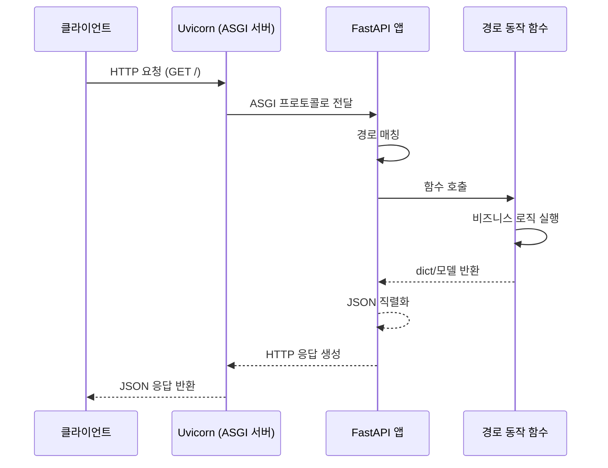

# 챕터 01: FastAPI 소개 및 환경 설정

> **난이도**: ⭐ (1/5)
> **예상 학습 시간**: 30~45분
> **사전 요구사항**: Python 3.9 이상, pip 사용법 기초

---

## 학습 목표

1. FastAPI가 무엇인지 이해하고 다른 프레임워크와의 차이를 설명할 수 있다
2. FastAPI 개발 환경을 설치하고 구성할 수 있다
3. 첫 번째 API 엔드포인트를 작성하고 실행할 수 있다
4. 자동 생성되는 API 문서를 확인하고 활용할 수 있다

---

## 1. FastAPI란?

FastAPI는 **Python 3.7 이상**에서 동작하는 현대적인 고성능 웹 프레임워크입니다.
내부적으로 **Starlette**(웹 계층)과 **Pydantic**(데이터 검증)을 기반으로 구축되었습니다.

### 주요 특징

| 특징 | 설명 |
|------|------|
| **빠른 성능** | Node.js, Go와 대등한 수준의 성능 (Starlette + Uvicorn 기반) |
| **빠른 개발** | 개발 속도 약 200~300% 향상 (공식 문서 기준) |
| **타입 힌트 기반** | Python 타입 힌트를 적극 활용하여 자동 문서화 및 유효성 검증 |
| **자동 문서화** | Swagger UI (/docs)와 ReDoc (/redoc) 자동 생성 |
| **표준 기반** | OpenAPI, JSON Schema 표준 준수 |

### FastAPI의 구성 요소

```
FastAPI = Starlette (웹 프레임워크) + Pydantic (데이터 검증) + 타입 힌트
```

---

## 2. ASGI vs WSGI

FastAPI를 이해하려면 ASGI와 WSGI의 차이를 알아야 합니다.

| 구분 | WSGI | ASGI |
|------|------|------|
| **정식 명칭** | Web Server Gateway Interface | Asynchronous Server Gateway Interface |
| **처리 방식** | 동기(Synchronous) | 비동기(Asynchronous) |
| **대표 프레임워크** | Flask, Django(기본) | FastAPI, Starlette, Django(Channels) |
| **대표 서버** | Gunicorn, uWSGI | Uvicorn, Hypercorn, Daphne |
| **WebSocket 지원** | 불가 | 가능 |
| **동시 요청 처리** | 멀티프로세스/스레드 | 이벤트 루프 기반 |

> **핵심 포인트**: FastAPI는 ASGI 기반이므로 `async/await`를 활용한 비동기 처리가 가능하며, 동기 함수도 자동으로 스레드 풀에서 실행됩니다.

---

## 3. 설치 방법

### 기본 설치

```bash
# FastAPI와 Uvicorn(ASGI 서버)을 함께 설치합니다
pip install fastapi uvicorn

# 또는 모든 선택적 의존성을 포함한 설치
pip install "fastapi[all]"
```

### 가상 환경 권장 설정

```bash
# 프로젝트 디렉토리 생성
mkdir my-fastapi-project
cd my-fastapi-project

# 가상 환경 생성 및 활성화
python -m venv venv
source venv/bin/activate  # macOS/Linux
# venv\Scripts\activate   # Windows

# 패키지 설치
pip install fastapi uvicorn
```

### 설치 확인

```bash
python -c "import fastapi; print(fastapi.__version__)"
```

---

## 4. 첫 번째 API 작성

```python
from fastapi import FastAPI

# FastAPI 애플리케이션 인스턴스 생성
app = FastAPI()

# GET 요청을 처리하는 엔드포인트 정의
@app.get("/")
def read_root():
    return {"message": "안녕하세요! FastAPI에 오신 것을 환영합니다."}
```

### 코드 설명

1. `FastAPI()` — 애플리케이션 인스턴스를 생성합니다
2. `@app.get("/")` — HTTP GET 메서드와 경로 `/`를 연결하는 데코레이터입니다
3. `def read_root()` — 경로 동작 함수(Path Operation Function)입니다
4. `return {"message": ...}` — 딕셔너리를 반환하면 자동으로 JSON 응답이 됩니다

---

## 5. Uvicorn으로 서버 실행

```bash
# 기본 실행
uvicorn main:app

# 개발 모드 (코드 변경 시 자동 재시작)
uvicorn main:app --reload

# 호스트와 포트 지정
uvicorn main:app --reload --host 0.0.0.0 --port 8000
```

| 옵션 | 설명 |
|------|------|
| `main:app` | `main.py` 파일의 `app` 객체를 실행 |
| `--reload` | 코드 변경 감지 시 자동 재시작 (개발용) |
| `--host 0.0.0.0` | 외부 접근 허용 |
| `--port 8000` | 포트 번호 지정 (기본값: 8000) |

---

## 6. 자동 문서화

FastAPI는 코드만 작성하면 다음 두 가지 API 문서를 자동으로 생성합니다.

| 문서 | URL | 설명 |
|------|-----|------|
| **Swagger UI** | `http://localhost:8000/docs` | 인터랙티브 API 문서 (직접 요청 테스트 가능) |
| **ReDoc** | `http://localhost:8000/redoc` | 가독성 높은 API 문서 |

> **팁**: Swagger UI에서 "Try it out" 버튼을 클릭하면 브라우저에서 바로 API를 테스트할 수 있습니다.

---

## 7. 요청-응답 흐름



---

## 주의사항

1. **`--reload` 옵션은 개발 환경에서만 사용하세요.** 운영 환경에서는 성능 저하를 유발합니다.
2. **`app` 변수명은 관례입니다.** 다른 이름을 사용할 수 있지만, `uvicorn` 명령에서 해당 이름을 지정해야 합니다.
3. **Python 3.9 이상을 권장합니다.** 타입 힌트의 최신 문법을 활용하기 위함입니다.

---

## 핵심 정리

| 개념 | 설명 |
|------|------|
| FastAPI | Python 타입 힌트 기반 고성능 ASGI 웹 프레임워크 |
| Uvicorn | FastAPI를 실행하기 위한 ASGI 서버 |
| 경로 동작 | `@app.get("/")` 같은 데코레이터로 정의하는 API 엔드포인트 |
| 자동 문서화 | `/docs` (Swagger UI), `/redoc` (ReDoc) |
| ASGI | 비동기 요청 처리를 지원하는 서버 게이트웨이 인터페이스 |

---

## 다음 단계

다음 챕터에서는 **경로 파라미터와 쿼리 파라미터**를 학습합니다.
URL에서 값을 추출하고, 유효성 검증을 적용하는 방법을 배우게 됩니다.
