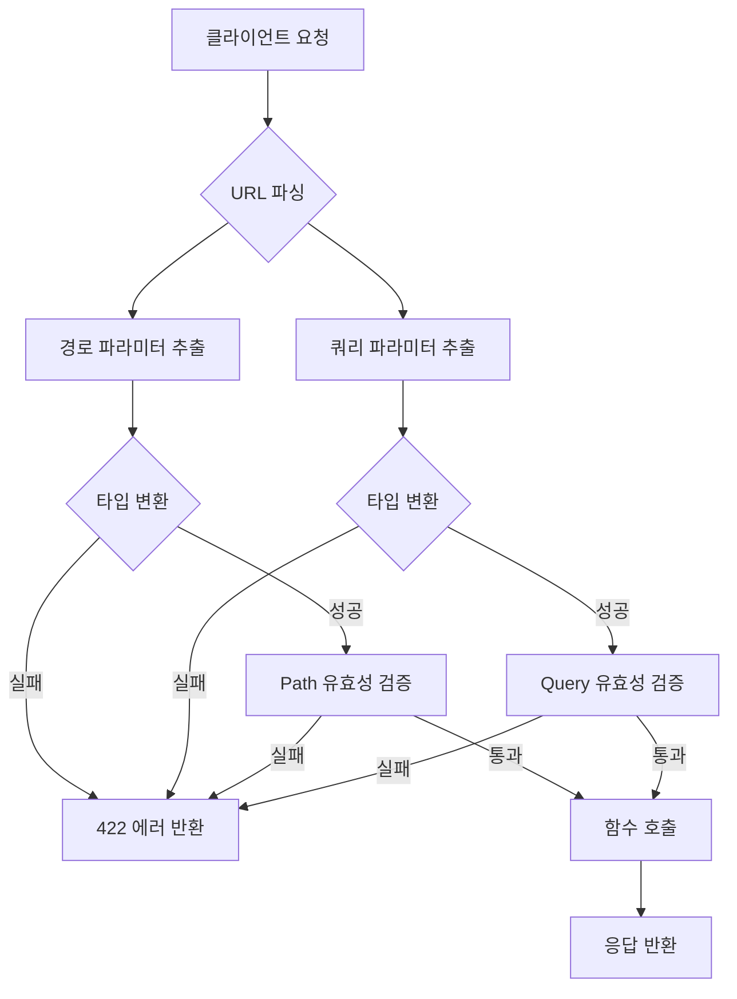

# 챕터 02: 경로 파라미터와 쿼리 파라미터

> **난이도**: ⭐ (1/5)
> **예상 학습 시간**: 40~50분
> **사전 요구사항**: 챕터 01 완료

---

## 학습 목표

1. 경로 파라미터와 쿼리 파라미터의 차이를 이해할 수 있다
2. 파라미터의 타입 자동 변환 원리를 설명할 수 있다
3. Path()와 Query()를 사용하여 유효성 검증을 적용할 수 있다
4. Enum을 활용해 허용 값을 제한할 수 있다
5. 선택적 파라미터와 필수 파라미터를 구분하여 설계할 수 있다

---

## 1. 경로 파라미터 (Path Parameters)

경로 파라미터는 URL 경로의 일부로 전달되는 값입니다. 중괄호 `{}`를 사용하여 정의합니다.

### 기본 사용법

```python
@app.get("/users/{user_id}")
def get_user(user_id: int):
    return {"user_id": user_id}
```

- `{user_id}`는 URL에서 값을 추출합니다
- `user_id: int` 타입 힌트로 **자동 타입 변환**이 이루어집니다
- 잘못된 타입이 전달되면 자동으로 422 에러가 반환됩니다

### 타입 변환 예시

| 요청 URL | 변환 결과 | 성공 여부 |
|----------|----------|-----------|
| `/users/42` | `user_id = 42 (int)` | 성공 |
| `/users/abc` | 변환 실패 | 422 에러 |
| `/users/3.14` | 변환 실패 | 422 에러 |

### 경로 순서의 중요성

```python
# 주의: 고정 경로를 먼저 정의해야 합니다!
@app.get("/users/me")       # 이것이 먼저 와야 합니다
def get_current_user():
    return {"user": "현재 사용자"}

@app.get("/users/{user_id}")  # 이것은 그 다음에 와야 합니다
def get_user(user_id: int):
    return {"user_id": user_id}
```

> **주의**: `/users/{user_id}`가 먼저 정의되면 `/users/me` 요청이 `user_id="me"`로 해석되어 오류가 발생합니다.

---

## 2. 쿼리 파라미터 (Query Parameters)

쿼리 파라미터는 URL 뒤에 `?key=value` 형태로 전달되는 값입니다.
경로 파라미터로 선언되지 않은 함수 파라미터는 자동으로 쿼리 파라미터가 됩니다.

### 기본 사용법

```python
@app.get("/items")
def get_items(skip: int = 0, limit: int = 10):
    return {"skip": skip, "limit": limit}
```

- `GET /items` → `{"skip": 0, "limit": 10}` (기본값 사용)
- `GET /items?skip=5&limit=20` → `{"skip": 5, "limit": 20}`

### 필수 vs 선택적 파라미터

```python
@app.get("/search")
def search(
    keyword: str,              # 필수 (기본값 없음)
    category: str = "all",     # 선택적 (기본값: "all")
    page: int = 1,             # 선택적 (기본값: 1)
):
    return {"keyword": keyword, "category": category, "page": page}
```

| 파라미터 | 기본값 | 필수 여부 |
|----------|--------|-----------|
| `keyword: str` | 없음 | **필수** |
| `category: str = "all"` | `"all"` | 선택적 |
| `page: int = 1` | `1` | 선택적 |

### None 허용 (Optional)

```python
from typing import Optional

@app.get("/items")
def get_items(q: Optional[str] = None):
    # q는 전달되지 않으면 None이 됩니다
    if q:
        return {"q": q, "message": f"'{q}' 검색 결과"}
    return {"message": "전체 목록"}
```

> **참고**: Python 3.10 이상에서는 `Optional[str]` 대신 `str | None`을 사용할 수 있습니다.

---

## 3. 파라미터 유효성 검증

### Path() — 경로 파라미터 검증

```python
from fastapi import Path

@app.get("/items/{item_id}")
def get_item(
    item_id: int = Path(
        ...,                    # ... 은 필수값을 의미합니다
        title="아이템 ID",
        description="조회할 아이템의 고유 번호",
        ge=1,                   # 1 이상 (greater than or equal)
        le=10000,               # 10000 이하 (less than or equal)
    )
):
    return {"item_id": item_id}
```

### Query() — 쿼리 파라미터 검증

```python
from fastapi import Query

@app.get("/search")
def search(
    keyword: str = Query(
        ...,                    # 필수 파라미터
        min_length=2,           # 최소 길이 2
        max_length=50,          # 최대 길이 50
        description="검색 키워드",
    ),
    page: int = Query(
        default=1,              # 기본값 1
        ge=1,                   # 1 이상
        description="페이지 번호",
    ),
):
    return {"keyword": keyword, "page": page}
```

### 검증 옵션 정리

| 옵션 | 타입 | 설명 |
|------|------|------|
| `ge` | 숫자 | 이상 (>=) |
| `gt` | 숫자 | 초과 (>) |
| `le` | 숫자 | 이하 (<=) |
| `lt` | 숫자 | 미만 (<) |
| `min_length` | 문자열 | 최소 문자 수 |
| `max_length` | 문자열 | 최대 문자 수 |
| `pattern` | 문자열 | 정규식 패턴 |
| `title` | 전체 | 문서용 제목 |
| `description` | 전체 | 문서용 설명 |

---

## 4. Enum으로 제한된 값 정의

```python
from enum import Enum

class SortOrder(str, Enum):
    """정렬 순서를 정의하는 열거형"""
    ascending = "asc"
    descending = "desc"
    newest = "newest"

@app.get("/items")
def get_items(sort: SortOrder = SortOrder.newest):
    return {"sort": sort.value}
```

- `GET /items?sort=asc` → 정상
- `GET /items?sort=invalid` → 422 에러 (허용되지 않은 값)
- Swagger UI에서 드롭다운으로 선택 가능

---

## 5. 경로 파라미터와 쿼리 파라미터 조합

```python
@app.get("/users/{user_id}/posts")
def get_user_posts(
    user_id: int = Path(..., ge=1),
    skip: int = Query(default=0, ge=0),
    limit: int = Query(default=10, ge=1, le=100),
    sort: str = Query(default="newest"),
):
    return {
        "user_id": user_id,
        "skip": skip,
        "limit": limit,
        "sort": sort,
    }
```

---

## 6. 파라미터 처리 흐름



---

## 주의사항

1. **경로 순서에 주의하세요.** 고정 경로(`/users/me`)를 동적 경로(`/users/{id}`) 앞에 배치해야 합니다.
2. **`...` (Ellipsis)는 필수값을 의미합니다.** `Path(...)`이면 필수, `Path(default=None)`이면 선택적입니다.
3. **타입 힌트는 반드시 작성하세요.** 타입 힌트가 없으면 자동 변환과 검증이 적용되지 않습니다.
4. **Enum은 `str`을 상속해야 합니다.** `class MyEnum(str, Enum)` 형태로 정의해야 JSON 직렬화가 올바르게 동작합니다.

---

## 핵심 정리

| 구분 | 경로 파라미터 | 쿼리 파라미터 |
|------|--------------|--------------|
| **위치** | URL 경로 안 (`/items/{id}`) | URL 뒤 (`?key=value`) |
| **선언** | 함수 파라미터 + 경로에 `{}` | 함수 파라미터 (경로에 없는 것) |
| **필수 여부** | 항상 필수 | 기본값이 있으면 선택적 |
| **검증 함수** | `Path()` | `Query()` |
| **용도** | 리소스 식별 | 필터링, 페이지네이션, 정렬 |

---

## 다음 단계

다음 챕터에서는 **요청 본문과 Pydantic 모델**을 학습합니다.
POST 요청으로 JSON 데이터를 받아 처리하고, Pydantic을 활용한 강력한 데이터 검증 방법을 배우게 됩니다.
