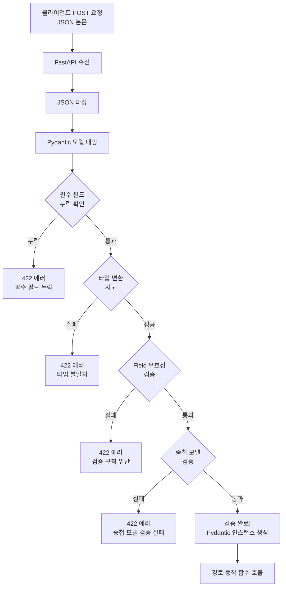

# 챕터 03: 요청 본문과 Pydantic 모델

> **난이도**: ⭐⭐ (2/5)
> **예상 학습 시간**: 50~60분
> **사전 요구사항**: 챕터 01~02 완료

---

## 학습 목표

1. Pydantic BaseModel을 사용하여 요청 본문을 정의할 수 있다
2. Field를 활용한 상세 유효성 검증을 적용할 수 있다
3. 중첩 모델(모델 안에 모델)을 설계할 수 있다
4. 선택적 필드와 기본값을 올바르게 사용할 수 있다
5. model_config로 예제 데이터를 문서에 표시할 수 있다

---

## 1. Pydantic BaseModel 소개

Pydantic은 Python 타입 힌트를 활용한 **데이터 검증 라이브러리**입니다.
FastAPI에서는 요청 본문의 구조를 정의하고 자동으로 검증하는 데 사용됩니다.

### 기본 사용법

```python
from pydantic import BaseModel

class Item(BaseModel):
    name: str
    price: float
    is_available: bool = True  # 기본값이 있으면 선택적 필드
```

### 왜 Pydantic을 사용하는가?

| 기능 | 딕셔너리 | Pydantic 모델 |
|------|----------|---------------|
| **타입 검증** | 수동 | 자동 |
| **자동 변환** | 불가 | 가능 (예: 문자열 "123" → 정수 123) |
| **에러 메시지** | 직접 작성 | 자동 생성 (상세한 에러 정보) |
| **IDE 지원** | 제한적 | 자동 완성, 타입 체크 |
| **API 문서화** | 수동 | 자동 (JSON Schema 생성) |

---

## 2. 요청 본문 정의

함수 파라미터의 타입을 Pydantic 모델로 지정하면, FastAPI는 요청 본문(JSON)을 해당 모델로 자동 파싱합니다.

```python
from fastapi import FastAPI
from pydantic import BaseModel

app = FastAPI()

class UserCreate(BaseModel):
    name: str
    email: str
    age: int

@app.post("/users")
def create_user(user: UserCreate):
    # user는 UserCreate 인스턴스 (자동 파싱 및 검증 완료)
    return {"message": f"{user.name}님이 등록되었습니다", "user": user}
```

### 요청 예시

```bash
curl -X POST http://localhost:8000/users \
  -H "Content-Type: application/json" \
  -d '{"name": "홍길동", "email": "hong@example.com", "age": 25}'
```

### 잘못된 요청 시 자동 에러 응답

```json
// age에 문자열을 보낸 경우
{
    "detail": [
        {
            "type": "int_parsing",
            "loc": ["body", "age"],
            "msg": "Input should be a valid integer",
            "input": "스물다섯"
        }
    ]
}
```

---

## 3. Field를 사용한 상세 유효성 검증

`Field`를 사용하면 각 필드에 대해 더 세밀한 검증 규칙을 적용할 수 있습니다.

```python
from pydantic import BaseModel, Field

class Product(BaseModel):
    name: str = Field(
        ...,                    # 필수 필드
        min_length=1,
        max_length=100,
        description="상품 이름",
        examples=["노트북"],
    )
    price: int = Field(
        ...,
        gt=0,                   # 0보다 큰 값
        description="상품 가격 (원)",
        examples=[1200000],
    )
    description: str = Field(
        default="",
        max_length=500,
        description="상품 설명",
    )
    quantity: int = Field(
        default=0,
        ge=0,                   # 0 이상
        description="재고 수량",
    )
```

### Field 옵션 정리

| 옵션 | 타입 | 설명 |
|------|------|------|
| `...` (Ellipsis) | - | 필수 필드 표시 |
| `default` | any | 기본값 |
| `gt`, `ge`, `lt`, `le` | 숫자 | 값 범위 제한 |
| `min_length`, `max_length` | 문자열 | 길이 제한 |
| `pattern` | 문자열 | 정규식 패턴 |
| `description` | 문자열 | API 문서용 설명 |
| `examples` | 리스트 | API 문서용 예시 값 |

---

## 4. 중첩 모델

모델 안에 다른 모델을 포함시켜 복잡한 데이터 구조를 표현할 수 있습니다.

```python
from typing import List, Optional
from pydantic import BaseModel

class Address(BaseModel):
    city: str
    district: str
    detail: str
    zip_code: str

class UserProfile(BaseModel):
    name: str
    email: str
    address: Address                     # 중첩 모델
    phone_numbers: List[str] = []        # 문자열 리스트
    tags: Optional[List[str]] = None     # 선택적 리스트
```

### 요청 JSON 예시

```json
{
    "name": "홍길동",
    "email": "hong@example.com",
    "address": {
        "city": "서울",
        "district": "강남구",
        "detail": "테헤란로 123",
        "zip_code": "06100"
    },
    "phone_numbers": ["010-1234-5678", "02-123-4567"]
}
```

---

## 5. 선택적 필드와 기본값

```python
from typing import Optional
from pydantic import BaseModel

class UserUpdate(BaseModel):
    """사용자 정보 수정 모델 — 모든 필드가 선택적"""
    name: Optional[str] = None
    email: Optional[str] = None
    age: Optional[int] = None
    bio: Optional[str] = None
```

> **참고**: `Optional[str] = None`은 "이 필드는 전달하지 않아도 되며, 전달하지 않으면 None"이라는 뜻입니다.
> Python 3.10 이상에서는 `str | None = None`으로 작성할 수 있습니다.

### 생성 vs 수정 모델 분리 패턴

```python
class ItemCreate(BaseModel):
    """생성 시: 필수 필드가 많음"""
    name: str
    price: int
    category: str

class ItemUpdate(BaseModel):
    """수정 시: 모든 필드가 선택적"""
    name: Optional[str] = None
    price: Optional[int] = None
    category: Optional[str] = None
```

---

## 6. 예제 데이터 선언 (model_config)

API 문서에서 "Try it out" 시 기본으로 채워지는 예제 데이터를 설정할 수 있습니다.

```python
from pydantic import BaseModel, Field

class UserCreate(BaseModel):
    name: str = Field(..., description="사용자 이름")
    email: str = Field(..., description="이메일 주소")
    age: int = Field(..., ge=0, le=150, description="나이")

    model_config = {
        "json_schema_extra": {
            "examples": [
                {
                    "name": "홍길동",
                    "email": "hong@example.com",
                    "age": 25,
                }
            ]
        }
    }
```

> **Pydantic v2 참고**: v1에서는 `class Config` 내부 클래스를 사용했지만, v2에서는 `model_config` 딕셔너리를 권장합니다.

---

## 7. Pydantic 검증 흐름



---

## 주의사항

1. **모델 클래스명은 PascalCase를 사용하세요.** `UserCreate`, `ItemUpdate` 등 역할을 명확히 표현합니다.
2. **생성(Create)과 수정(Update) 모델을 분리하세요.** 생성 시 필수인 필드가 수정 시에는 선택적일 수 있습니다.
3. **중첩 모델의 깊이를 과도하게 만들지 마세요.** 3단계 이상의 중첩은 가독성을 떨어뜨립니다.
4. **`Optional`과 기본값 `None`은 함께 사용하세요.** `Optional[str]`만 쓰고 기본값을 지정하지 않으면 여전히 필수 필드입니다.
5. **Pydantic v2에서는 `model_config`를 사용하세요.** `class Config`는 하위 호환을 위해 동작하지만 권장되지 않습니다.

---

## 핵심 정리

| 개념 | 설명 |
|------|------|
| `BaseModel` | Pydantic의 기본 모델 클래스, 요청 본문 구조 정의 |
| `Field()` | 개별 필드의 상세 검증 규칙 설정 |
| 중첩 모델 | 모델 안에 다른 모델을 포함하여 복잡한 구조 표현 |
| `Optional[T] = None` | 선택적 필드 (전달하지 않으면 None) |
| `model_config` | API 문서용 예제 데이터 설정 (Pydantic v2) |
| 422 에러 | 유효성 검증 실패 시 자동 반환되는 에러 응답 |

---

## 다음 단계

다음 챕터에서는 **응답 모델과 상태 코드**를 학습합니다.
`response_model`로 응답 데이터를 필터링하고, 적절한 HTTP 상태 코드를 반환하는 방법을 배우게 됩니다.
