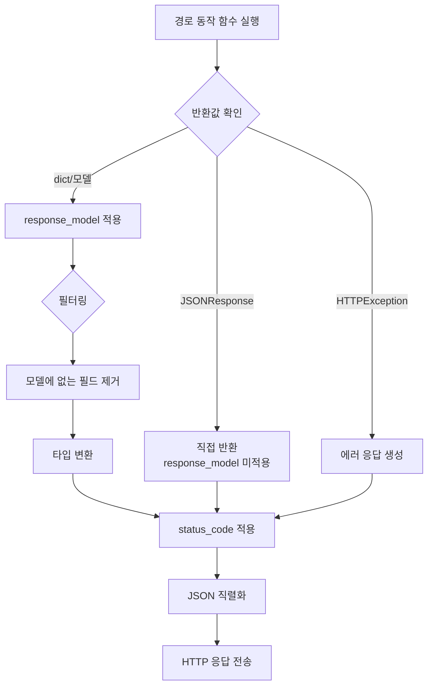

# 챕터 04: 응답 모델과 상태 코드

> **난이도**: ⭐⭐ (2/5)
> **예상 학습 시간**: 50~60분
> **사전 요구사항**: 챕터 01~03 완료

---

## 학습 목표

1. `response_model`을 사용하여 응답 데이터를 필터링할 수 있다
2. 입력 모델과 출력 모델을 분리하는 패턴을 적용할 수 있다
3. 적절한 HTTP 상태 코드를 반환할 수 있다
4. 다중 응답 모델을 정의할 수 있다
5. JSONResponse를 직접 사용하는 방법을 이해할 수 있다

---

## 1. response_model 데코레이터 파라미터

`response_model`은 API의 응답 구조를 정의하고, **반환 데이터를 해당 모델에 맞게 필터링**합니다.

### 기본 사용법

```python
from pydantic import BaseModel
from fastapi import FastAPI

app = FastAPI()

class UserOut(BaseModel):
    id: int
    name: str
    email: str
    # 주의: password는 포함하지 않습니다!

@app.get("/users/{user_id}", response_model=UserOut)
def get_user(user_id: int):
    # 내부에서는 password를 포함한 전체 데이터를 반환하지만,
    # response_model이 UserOut이므로 password는 응답에서 자동 제외됩니다
    return {
        "id": user_id,
        "name": "홍길동",
        "email": "hong@example.com",
        "password": "secret123",  # 이 필드는 응답에 포함되지 않습니다!
    }
```

### response_model의 역할

1. **응답 데이터 필터링**: 모델에 정의되지 않은 필드를 자동 제거합니다
2. **타입 변환**: 반환 데이터를 모델 타입에 맞게 변환합니다
3. **API 문서 생성**: Swagger UI에 응답 스키마를 표시합니다
4. **데이터 보안**: 민감한 정보(비밀번호 등)의 노출을 방지합니다

---

## 2. 응답 필터링 — 내부 데이터 숨기기

### 입력/출력 모델 분리 패턴

```python
class UserCreate(BaseModel):
    """입력 모델 — 사용자 생성 요청"""
    name: str
    email: str
    password: str  # 비밀번호는 입력에서만 사용

class UserResponse(BaseModel):
    """출력 모델 — 비밀번호를 제외한 응답"""
    id: int
    name: str
    email: str
    created_at: str

class UserInDB(BaseModel):
    """내부 모델 — DB에 저장되는 전체 정보"""
    id: int
    name: str
    email: str
    password_hash: str
    created_at: str
```

이 패턴을 사용하면:
- **클라이언트 → 서버**: `UserCreate` (비밀번호 포함)
- **서버 → 클라이언트**: `UserResponse` (비밀번호 제외)
- **서버 내부**: `UserInDB` (해시된 비밀번호 포함)

### response_model_exclude / response_model_include

모델을 별도로 만들지 않고 필드를 선택적으로 제외/포함할 수도 있습니다.

```python
@app.get("/users/{user_id}", response_model=User, response_model_exclude={"password"})
def get_user(user_id: int):
    ...

@app.get("/users/{user_id}/summary", response_model=User, response_model_include={"id", "name"})
def get_user_summary(user_id: int):
    ...
```

> **권장**: 실무에서는 별도의 응답 모델을 만드는 것이 더 명확하고 유지보수하기 쉽습니다.

---

## 3. HTTP 상태 코드

### 주요 상태 코드

| 코드 | 이름 | 용도 |
|------|------|------|
| **200** | OK | 기본 성공 (GET, PUT, PATCH) |
| **201** | Created | 리소스 생성 성공 (POST) |
| **204** | No Content | 삭제 성공 (DELETE, 본문 없음) |
| **400** | Bad Request | 잘못된 요청 |
| **404** | Not Found | 리소스를 찾을 수 없음 |
| **422** | Unprocessable Entity | 유효성 검증 실패 (FastAPI 자동) |
| **500** | Internal Server Error | 서버 내부 오류 |

### FastAPI에서 상태 코드 사용

```python
from fastapi import FastAPI, status

@app.post("/items", status_code=status.HTTP_201_CREATED)
def create_item(item: ItemCreate):
    """리소스 생성 시 201 상태 코드를 반환합니다."""
    return {"id": 1, **item.model_dump()}

@app.delete("/items/{item_id}", status_code=status.HTTP_204_NO_CONTENT)
def delete_item(item_id: int):
    """삭제 성공 시 204 상태 코드를 반환합니다 (본문 없음)."""
    return None  # 204는 응답 본문이 없습니다
```

### 숫자 대신 상수 사용을 권장하는 이유

```python
# 나쁜 예 — 숫자의 의미가 불분명
@app.post("/items", status_code=201)

# 좋은 예 — 의미가 명확
@app.post("/items", status_code=status.HTTP_201_CREATED)
```

---

## 4. 다중 응답 모델

하나의 엔드포인트에서 여러 종류의 응답을 반환할 수 있습니다.

### HTTPException으로 에러 응답

```python
from fastapi import FastAPI, HTTPException, status

@app.get("/items/{item_id}")
def get_item(item_id: int):
    if item_id not in items_db:
        raise HTTPException(
            status_code=status.HTTP_404_NOT_FOUND,
            detail="아이템을 찾을 수 없습니다",
        )
    return items_db[item_id]
```

### responses 파라미터로 문서화

```python
@app.get(
    "/items/{item_id}",
    response_model=ItemResponse,
    responses={
        200: {"description": "아이템 조회 성공"},
        404: {
            "description": "아이템을 찾을 수 없음",
            "content": {
                "application/json": {
                    "example": {"detail": "아이템을 찾을 수 없습니다"}
                }
            },
        },
    },
)
def get_item(item_id: int):
    ...
```

---

## 5. JSONResponse 직접 반환

특별한 경우에 `JSONResponse`를 직접 사용하여 상태 코드와 헤더를 세밀하게 제어할 수 있습니다.

```python
from fastapi.responses import JSONResponse

@app.post("/items")
def create_item(item: ItemCreate):
    new_item = {"id": 1, **item.model_dump()}

    return JSONResponse(
        status_code=status.HTTP_201_CREATED,
        content={"message": "생성 완료", "item": new_item},
        headers={"X-Custom-Header": "custom-value"},
    )
```

> **참고**: `JSONResponse`를 직접 반환하면 `response_model`에 의한 자동 필터링이 적용되지 않으므로 주의하세요.

---

## 6. 응답 처리 파이프라인



---

## 주의사항

1. **`response_model`과 `JSONResponse`를 동시에 사용하면 필터링이 적용되지 않습니다.** `JSONResponse`를 직접 반환하면 `response_model`이 무시됩니다.
2. **204 응답은 본문이 없어야 합니다.** `status_code=204`를 설정하면 `return None`을 사용하세요.
3. **민감 정보는 반드시 응답 모델로 필터링하세요.** 비밀번호, 내부 ID, 토큰 등이 실수로 노출되지 않도록 합니다.
4. **에러 응답에는 `HTTPException`을 사용하세요.** 일반 딕셔너리 반환 대신 적절한 상태 코드를 함께 보내는 것이 REST API 규칙입니다.
5. **`response_model_exclude`보다 별도의 응답 모델 생성을 권장합니다.** 코드가 더 명확해지고 문서화에도 유리합니다.

---

## 핵심 정리

| 개념 | 설명 |
|------|------|
| `response_model` | 응답 데이터 구조를 정의하고 필터링 |
| `status_code` | HTTP 상태 코드 지정 |
| `status.HTTP_201_CREATED` | 상태 코드 상수 (가독성 향상) |
| `HTTPException` | 에러 응답을 발생시키는 예외 |
| `JSONResponse` | 응답을 직접 생성 (세밀한 제어) |
| 입력/출력 모델 분리 | 보안과 명확성을 위한 설계 패턴 |

---

## 다음 단계

다음 챕터에서는 **의존성 주입(Dependency Injection)**을 학습합니다.
`Depends()`를 사용하여 공통 로직을 재사용하고, 인증/인가 체계를 구축하는 방법을 배우게 됩니다.
