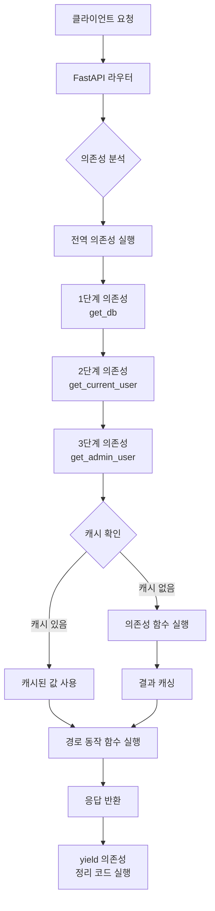

# 챕터 05: 의존성 주입 (Dependency Injection)

> **난이도**: ⭐⭐ (2/5)
> **예상 학습 시간**: 50~60분
> **사전 요구사항**: 챕터 01~04 완료

---

## 학습 목표

1. 의존성 주입(DI)의 개념과 필요성을 이해할 수 있다
2. `Depends()`를 사용하여 함수 의존성을 주입할 수 있다
3. 클래스 기반 의존성을 구현할 수 있다
4. 하위 의존성(의존성의 의존성)을 설계할 수 있다
5. 전역 의존성과 캐싱 동작을 이해할 수 있다

---

## 1. 의존성 주입(DI) 개념

의존성 주입이란 **함수가 필요로 하는 것(의존성)을 외부에서 제공(주입)하는 패턴**입니다.

### DI가 없는 코드 (반복 발생)

```python
@app.get("/items")
def get_items(skip: int = 0, limit: int = 10, token: str = None):
    if not token or token != "valid-token":
        raise HTTPException(status_code=401)
    # 로직...

@app.get("/users")
def get_users(skip: int = 0, limit: int = 10, token: str = None):
    if not token or token != "valid-token":
        raise HTTPException(status_code=401)
    # 동일한 인증 코드 반복!
```

### DI를 사용한 코드 (재사용)

```python
def verify_token(token: str = Query(...)):
    if token != "valid-token":
        raise HTTPException(status_code=401)
    return token

@app.get("/items")
def get_items(token: str = Depends(verify_token)):
    # 인증은 의존성이 처리합니다

@app.get("/users")
def get_users(token: str = Depends(verify_token)):
    # 동일한 의존성을 재사용합니다
```

### DI의 장점

| 장점 | 설명 |
|------|------|
| **코드 재사용** | 공통 로직을 한 곳에서 관리 |
| **관심사 분리** | 인증, 페이지네이션 등을 별도 함수로 분리 |
| **테스트 용이성** | 의존성을 모의(mock) 객체로 교체 가능 |
| **유지보수성** | 공통 로직 변경 시 한 곳만 수정 |

---

## 2. Depends() 함수 사용법

### 함수 의존성

```python
from fastapi import Depends, FastAPI, Query

app = FastAPI()

# 의존성 함수 정의
def common_parameters(
    skip: int = Query(default=0, ge=0),
    limit: int = Query(default=10, ge=1, le=100),
):
    """공통 페이지네이션 파라미터를 처리하는 의존성"""
    return {"skip": skip, "limit": limit}

# 의존성 사용
@app.get("/items")
def get_items(commons: dict = Depends(common_parameters)):
    return {"skip": commons["skip"], "limit": commons["limit"]}

@app.get("/users")
def get_users(commons: dict = Depends(common_parameters)):
    return {"skip": commons["skip"], "limit": commons["limit"]}
```

### 동작 원리

1. FastAPI가 엔드포인트 함수의 파라미터를 분석합니다
2. `Depends(common_parameters)`를 발견하면 `common_parameters` 함수를 호출합니다
3. 의존성 함수의 파라미터도 자동으로 해석됩니다 (Query, Path 등)
4. 의존성 함수의 반환값이 엔드포인트 함수의 파라미터로 전달됩니다

---

## 3. 함수 의존성 vs 클래스 의존성

### 함수 의존성

```python
def get_db_connection():
    """데이터베이스 연결을 반환하는 의존성"""
    db = DatabaseConnection()
    try:
        yield db       # yield를 사용하면 정리(cleanup) 코드를 포함할 수 있습니다
    finally:
        db.close()     # 요청 처리 후 연결을 닫습니다
```

### 클래스 의존성

클래스의 `__init__` 메서드가 의존성 함수 역할을 합니다.

```python
class Pagination:
    """페이지네이션 의존성 클래스"""

    def __init__(
        self,
        page: int = Query(default=1, ge=1),
        page_size: int = Query(default=10, ge=1, le=100),
    ):
        self.page = page
        self.page_size = page_size
        self.skip = (page - 1) * page_size

@app.get("/items")
def get_items(pagination: Pagination = Depends()):
    # Depends()에 인자를 생략하면 타입 힌트(Pagination)를 의존성으로 사용합니다
    return {
        "page": pagination.page,
        "page_size": pagination.page_size,
        "skip": pagination.skip,
    }
```

### 비교

| 구분 | 함수 의존성 | 클래스 의존성 |
|------|-----------|-------------|
| **정의** | 일반 함수 또는 `yield` 함수 | 클래스 (`__init__`) |
| **반환값** | 딕셔너리, 문자열 등 | 클래스 인스턴스 |
| **상태 관리** | 반환값으로만 전달 | 인스턴스 속성으로 관리 |
| **IDE 지원** | 반환 타입 추론 어려움 | 자동 완성 지원 |
| **용도** | 단순 로직, 리소스 관리(yield) | 여러 속성이 필요한 경우 |

---

## 4. 하위 의존성 (의존성의 의존성)

의존성 함수가 다른 의존성을 필요로 할 수 있습니다. FastAPI는 전체 의존성 트리를 자동으로 해결합니다.

```python
def get_db():
    """1단계: 데이터베이스 연결"""
    db = {"connection": "active"}
    return db

def get_current_user(
    token: str = Query(...),
    db: dict = Depends(get_db),  # get_db에 의존
):
    """2단계: 현재 사용자 조회 (DB 의존)"""
    # DB에서 토큰으로 사용자를 찾는 로직
    return {"username": "홍길동", "token": token}

def get_admin_user(
    current_user: dict = Depends(get_current_user),  # get_current_user에 의존
):
    """3단계: 관리자 권한 확인 (현재 사용자에 의존)"""
    if current_user.get("role") != "admin":
        raise HTTPException(status_code=403, detail="관리자 권한이 필요합니다")
    return current_user

@app.get("/admin/dashboard")
def admin_dashboard(admin: dict = Depends(get_admin_user)):
    # get_admin_user → get_current_user → get_db 순서로 해결됩니다
    return {"message": f"환영합니다, {admin['username']}님"}
```

---

## 5. 전역 의존성

특정 의존성을 모든 엔드포인트 또는 특정 라우터에 적용할 수 있습니다.

### 앱 전체에 적용

```python
async def log_request(request: Request):
    """모든 요청을 로깅하는 전역 의존성"""
    print(f"[{datetime.now()}] {request.method} {request.url}")

app = FastAPI(dependencies=[Depends(log_request)])
```

### 특정 라우터에 적용

```python
from fastapi import APIRouter

router = APIRouter(
    prefix="/admin",
    dependencies=[Depends(verify_admin_token)],
)

@router.get("/users")     # /admin/users — verify_admin_token이 자동 적용
def get_users():
    ...
```

---

## 6. 의존성 캐싱

같은 요청 내에서 동일한 의존성이 여러 번 호출되면, **기본적으로 캐시되어 한 번만 실행**됩니다.

```python
def get_db():
    print("DB 연결 생성!")  # 이 줄은 요청당 한 번만 출력됩니다
    return {"connection": "active"}

def get_user(db: dict = Depends(get_db)):
    return {"user": "홍길동"}

def get_settings(db: dict = Depends(get_db)):
    return {"theme": "dark"}

@app.get("/dashboard")
def dashboard(
    user: dict = Depends(get_user),       # get_db 호출
    settings: dict = Depends(get_settings),  # get_db 캐시 사용 (재호출 안 함)
):
    return {"user": user, "settings": settings}
```

### 캐싱 비활성화

```python
# use_cache=False를 설정하면 매번 새로 호출됩니다
def dashboard(
    user: dict = Depends(get_user),
    settings: dict = Depends(get_settings, use_cache=False),
):
    ...
```

---

## 7. DI 호출 체인 다이어그램



---

## 주의사항

1. **의존성 함수의 파라미터도 자동 해석됩니다.** Query, Path, Body 등을 의존성 함수 안에서도 사용할 수 있습니다.
2. **순환 의존성을 피하세요.** A → B → A 형태의 순환 참조는 에러를 발생시킵니다.
3. **`yield` 의존성은 정리(cleanup) 코드에 사용하세요.** DB 연결 해제, 파일 닫기 등에 적합합니다.
4. **`Depends()`에 인자 없이 사용하면 타입 힌트를 의존성으로 사용합니다.** `pagination: Pagination = Depends()`는 `Depends(Pagination)`과 동일합니다.
5. **전역 의존성은 반환값이 필요 없는 경우에 적합합니다.** 로깅, 인증 검사 등의 부수 효과(side effect)용으로 사용합니다.

---

## 핵심 정리

| 개념 | 설명 |
|------|------|
| `Depends()` | 의존성 주입을 선언하는 함수 |
| 함수 의존성 | 일반 함수 또는 `yield` 함수를 의존성으로 사용 |
| 클래스 의존성 | 클래스의 `__init__`을 의존성으로 사용 |
| 하위 의존성 | 의존성이 다른 의존성에 의존하는 체인 구조 |
| 전역 의존성 | 앱 또는 라우터 레벨에서 모든 엔드포인트에 적용 |
| 캐싱 | 같은 요청 내에서 동일 의존성은 한 번만 실행 (기본) |
| `yield` 의존성 | 요청 후 정리 코드를 실행할 수 있는 의존성 |

---

## 다음 단계

다음 챕터에서는 **에러 처리와 예외 핸들러**를 학습합니다.
커스텀 예외를 정의하고, 전역 예외 핸들러를 구성하여 일관된 에러 응답을 반환하는 방법을 배우게 됩니다.
