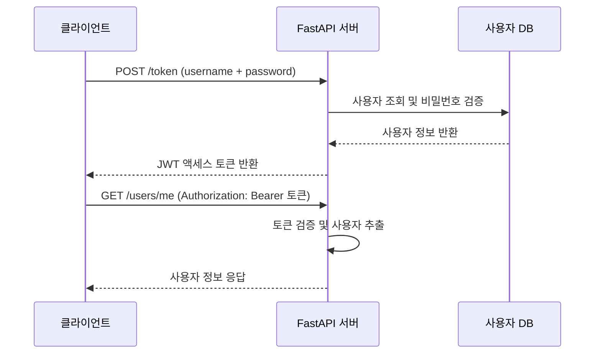
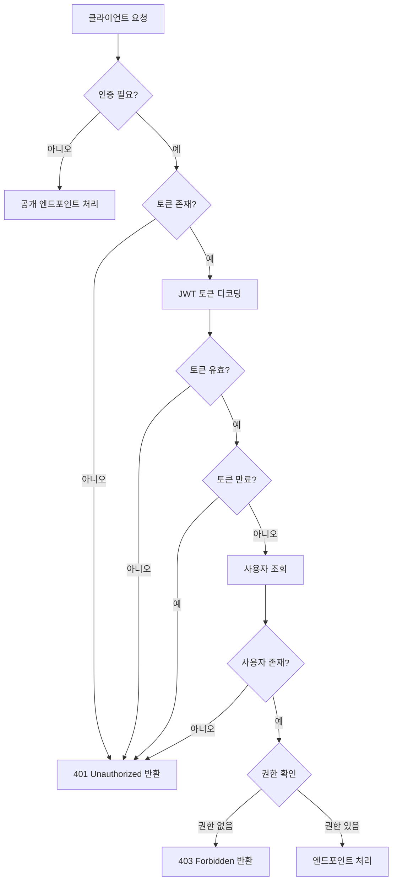

# 챕터 06: 인증과 보안 기초

## 학습 목표

이 챕터를 완료하면 다음을 할 수 있습니다:

1. OAuth2 Password Flow의 동작 원리를 이해한다
2. JWT 토큰을 생성하고 검증할 수 있다
3. 비밀번호를 안전하게 해싱하고 검증할 수 있다
4. 보호된 엔드포인트를 만들어 인증된 사용자만 접근하도록 한다
5. 역할 기반 접근 제어의 기초를 구현할 수 있다

---

## 1. OAuth2 개념 소개 (Password Flow)

OAuth2는 인증과 인가를 위한 업계 표준 프로토콜입니다. 여러 가지 "흐름(Flow)"이 있지만, FastAPI에서 가장 기본적으로 사용하는 것은 **Password Flow**입니다.

### Password Flow 동작 순서



### 핵심 흐름

1. 클라이언트가 사용자명과 비밀번호를 `/token` 엔드포인트로 전송
2. 서버가 자격 증명을 검증하고 JWT 토큰을 발급
3. 클라이언트가 이후 요청에 `Authorization: Bearer <토큰>` 헤더를 포함
4. 서버가 토큰을 검증하여 사용자를 식별

---

## 2. OAuth2PasswordBearer 사용법

FastAPI는 `OAuth2PasswordBearer`라는 보안 유틸리티를 제공합니다. 이것은 **의존성(Dependency)**으로 작동하여 요청 헤더에서 토큰을 자동으로 추출합니다.

```python
from fastapi.security import OAuth2PasswordBearer

# tokenUrl은 토큰을 발급하는 엔드포인트 경로
oauth2_scheme = OAuth2PasswordBearer(tokenUrl="token")

# 이 의존성은 Authorization 헤더에서 Bearer 토큰을 추출합니다
@app.get("/protected")
async def protected_route(token: str = Depends(oauth2_scheme)):
    # token에는 "Bearer " 이후의 실제 토큰 문자열이 들어옵니다
    return {"token": token}
```

**주요 특징:**
- Swagger UI에 자물쇠 아이콘이 자동으로 표시됩니다
- 토큰이 없으면 자동으로 `401 Unauthorized` 응답을 반환합니다
- `OAuth2PasswordRequestForm`과 함께 사용하면 로그인 폼도 자동 생성됩니다

---

## 3. JWT 토큰 (python-jose 라이브러리)

JWT(JSON Web Token)는 JSON 데이터를 안전하게 전송하기 위한 토큰 형식입니다.

### JWT 구조

```
헤더.페이로드.서명
eyJhbGciOiJIUzI1NiJ9.eyJzdWIiOiJ1c2VyMSJ9.서명값
```

| 구성 요소 | 설명 | 예시 |
|----------|------|------|
| 헤더(Header) | 알고리즘 정보 | `{"alg": "HS256"}` |
| 페이로드(Payload) | 사용자 데이터 | `{"sub": "user1", "exp": 1234567890}` |
| 서명(Signature) | 무결성 검증 | 시크릿 키로 생성된 해시 |

### 토큰 생성

```python
from jose import jwt
from datetime import datetime, timedelta

SECRET_KEY = "비밀-키"
ALGORITHM = "HS256"

def create_access_token(data: dict, expires_delta: timedelta = None):
    to_encode = data.copy()
    expire = datetime.utcnow() + (expires_delta or timedelta(minutes=30))
    to_encode.update({"exp": expire})
    encoded_jwt = jwt.encode(to_encode, SECRET_KEY, algorithm=ALGORITHM)
    return encoded_jwt
```

### 토큰 검증

```python
from jose import JWTError, jwt

def verify_token(token: str):
    try:
        payload = jwt.decode(token, SECRET_KEY, algorithms=[ALGORITHM])
        username: str = payload.get("sub")
        if username is None:
            raise ValueError("토큰에 사용자 정보가 없습니다")
        return username
    except JWTError:
        raise ValueError("유효하지 않은 토큰입니다")
```

---

## 4. 비밀번호 해싱 (passlib + bcrypt)

비밀번호는 **절대로** 평문으로 저장하면 안 됩니다. `passlib`과 `bcrypt`를 사용하여 안전하게 해싱합니다.

```python
from passlib.context import CryptContext

# bcrypt 알고리즘 사용, deprecated="auto"는 자동 업그레이드 지원
pwd_context = CryptContext(schemes=["bcrypt"], deprecated="auto")

# 비밀번호 해싱
hashed = pwd_context.hash("mypassword123")
# 결과: $2b$12$LJ3m4ys3Lk0TSwHilr3Mdu...

# 비밀번호 검증
is_valid = pwd_context.verify("mypassword123", hashed)  # True
is_valid = pwd_context.verify("wrongpassword", hashed)   # False
```

> **주의사항:** bcrypt는 의도적으로 느린 알고리즘입니다. 이는 브루트포스 공격을 어렵게 만들기 위한 설계입니다.

---

## 5. 현재 사용자 가져오기 패턴

인증된 사용자를 가져오는 의존성 함수는 FastAPI 보안의 핵심 패턴입니다.

```python
async def get_current_user(token: str = Depends(oauth2_scheme)):
    """토큰에서 현재 사용자를 추출하는 의존성 함수"""
    credentials_exception = HTTPException(
        status_code=status.HTTP_401_UNAUTHORIZED,
        detail="인증 정보를 확인할 수 없습니다",
        headers={"WWW-Authenticate": "Bearer"},
    )
    try:
        payload = jwt.decode(token, SECRET_KEY, algorithms=[ALGORITHM])
        username: str = payload.get("sub")
        if username is None:
            raise credentials_exception
    except JWTError:
        raise credentials_exception

    user = get_user_from_db(username)
    if user is None:
        raise credentials_exception
    return user
```

### 의존성 체이닝

```python
# 기본 사용자 확인 -> 활성 사용자 확인 -> 관리자 확인
async def get_current_active_user(
    current_user: User = Depends(get_current_user)
):
    if current_user.disabled:
        raise HTTPException(status_code=400, detail="비활성 사용자입니다")
    return current_user

async def get_current_admin_user(
    current_user: User = Depends(get_current_active_user)
):
    if current_user.role != "admin":
        raise HTTPException(status_code=403, detail="관리자 권한이 필요합니다")
    return current_user
```

---

## 6. 보호된 엔드포인트 만들기

```python
# 인증 필요 엔드포인트
@app.get("/users/me")
async def read_users_me(current_user: User = Depends(get_current_user)):
    return current_user

# 관리자 전용 엔드포인트
@app.get("/admin/dashboard")
async def admin_dashboard(admin: User = Depends(get_current_admin_user)):
    return {"message": f"관리자 {admin.username}님, 환영합니다"}

# 선택적 인증 (토큰 없어도 접근 가능)
@app.get("/items")
async def read_items(token: str | None = Depends(oauth2_scheme_optional)):
    if token:
        return {"message": "인증된 사용자의 아이템 목록"}
    return {"message": "공개 아이템 목록"}
```

---

## 7. OAuth2 인증 전체 흐름 다이어그램



---

## 주의사항

| 항목 | 설명 |
|------|------|
| SECRET_KEY | 프로덕션에서는 반드시 환경 변수로 관리 |
| 토큰 만료 시간 | 너무 길면 보안 취약, 너무 짧으면 사용자 불편 |
| HTTPS | 프로덕션에서는 반드시 HTTPS 사용 (토큰 탈취 방지) |
| 비밀번호 정책 | 최소 길이, 복잡도 규칙을 적용해야 함 |
| 리프레시 토큰 | 액세스 토큰과 분리하여 더 긴 만료 시간 설정 |

---

## 핵심 정리표

| 개념 | 설명 | 주요 클래스/함수 |
|------|------|-----------------|
| OAuth2PasswordBearer | 토큰 추출 의존성 | `OAuth2PasswordBearer(tokenUrl="token")` |
| JWT 생성 | 토큰 발급 | `jwt.encode(payload, secret, algorithm)` |
| JWT 검증 | 토큰 확인 | `jwt.decode(token, secret, algorithms)` |
| 비밀번호 해싱 | 안전한 저장 | `pwd_context.hash(password)` |
| 비밀번호 검증 | 로그인 확인 | `pwd_context.verify(plain, hashed)` |
| 의존성 체이닝 | 권한 단계 구분 | `Depends(get_current_user)` |

---

## 필요 패키지

```bash
pip install fastapi uvicorn python-jose[cryptography] passlib[bcrypt] python-multipart
```

> `python-multipart`는 `OAuth2PasswordRequestForm`이 폼 데이터를 파싱하는 데 필요합니다.

---

## 다음 단계

챕터 07에서는 **SQLAlchemy를 활용한 데이터베이스 연동**을 학습합니다. 인증 시스템과 데이터베이스를 결합하면 실제 서비스에 가까운 API를 구축할 수 있습니다.
