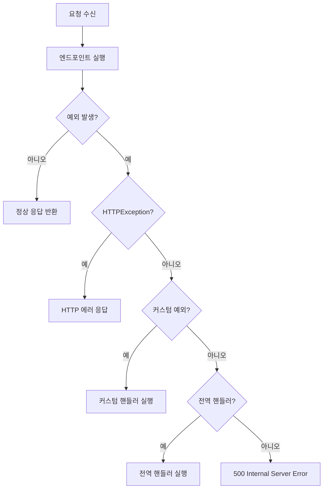
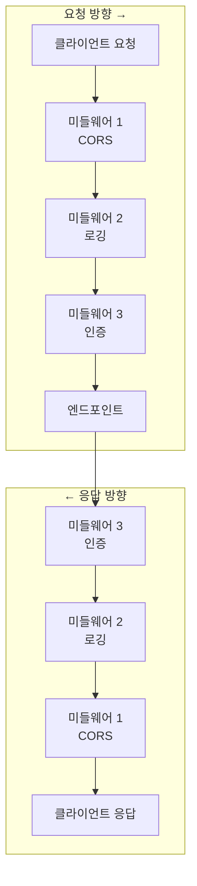

# 챕터 08: 에러 처리와 미들웨어

## 학습 목표

이 챕터를 완료하면 다음을 할 수 있습니다:

1. HTTPException을 활용한 기본 에러 처리를 구현한다
2. 커스텀 예외 클래스와 전역 예외 핸들러를 만든다
3. 미들웨어의 개념과 동작 원리를 이해한다
4. CORS 미들웨어를 설정할 수 있다
5. 커스텀 미들웨어를 작성할 수 있다

---

## 1. HTTPException 사용법

FastAPI에서 에러를 반환하는 가장 기본적인 방법은 `HTTPException`을 사용하는 것입니다.

```python
from fastapi import FastAPI, HTTPException, status

app = FastAPI()

@app.get("/items/{item_id}")
async def read_item(item_id: int):
    if item_id < 0:
        raise HTTPException(
            status_code=status.HTTP_400_BAD_REQUEST,
            detail="아이템 ID는 0 이상이어야 합니다",
        )
    if item_id > 100:
        raise HTTPException(
            status_code=status.HTTP_404_NOT_FOUND,
            detail="아이템을 찾을 수 없습니다",
        )
    return {"item_id": item_id}
```

### 주요 HTTP 상태 코드

| 코드 | 상수 | 의미 |
|------|------|------|
| 400 | `HTTP_400_BAD_REQUEST` | 잘못된 요청 |
| 401 | `HTTP_401_UNAUTHORIZED` | 인증 필요 |
| 403 | `HTTP_403_FORBIDDEN` | 접근 거부 |
| 404 | `HTTP_404_NOT_FOUND` | 리소스 없음 |
| 409 | `HTTP_409_CONFLICT` | 충돌 (중복 등) |
| 422 | `HTTP_422_UNPROCESSABLE_ENTITY` | 유효성 검증 실패 |
| 500 | `HTTP_500_INTERNAL_SERVER_ERROR` | 서버 내부 오류 |

---

## 2. 커스텀 예외 클래스

비즈니스 로직에 맞는 예외 클래스를 정의하면 코드의 가독성과 유지보수성이 향상됩니다.

```python
class ItemNotFoundException(Exception):
    """아이템을 찾을 수 없을 때 발생하는 예외"""
    def __init__(self, item_id: int):
        self.item_id = item_id
        self.message = f"ID {item_id}인 아이템을 찾을 수 없습니다"

class DuplicateItemException(Exception):
    """중복 아이템이 존재할 때 발생하는 예외"""
    def __init__(self, name: str):
        self.name = name
        self.message = f"'{name}' 이름의 아이템이 이미 존재합니다"
```

---

## 3. 전역 예외 핸들러 (@app.exception_handler)

커스텀 예외를 전역적으로 처리하는 핸들러를 등록할 수 있습니다.

```python
from fastapi.responses import JSONResponse

@app.exception_handler(ItemNotFoundException)
async def item_not_found_handler(request, exc: ItemNotFoundException):
    return JSONResponse(
        status_code=404,
        content={
            "error": "NOT_FOUND",
            "message": exc.message,
            "detail": {"item_id": exc.item_id},
        },
    )

# 모든 미처리 예외를 잡는 핸들러
@app.exception_handler(Exception)
async def global_exception_handler(request, exc: Exception):
    return JSONResponse(
        status_code=500,
        content={
            "error": "INTERNAL_SERVER_ERROR",
            "message": "서버 내부 오류가 발생했습니다",
        },
    )
```

### 에러 처리 흐름



---

## 4. 미들웨어 개념과 종류

미들웨어는 **모든 요청과 응답을 가로채서 처리하는 함수**입니다. 요청이 엔드포인트에 도달하기 전, 그리고 응답이 클라이언트에 전달되기 전에 실행됩니다.

### 미들웨어 스택 다이어그램



> **핵심 포인트:** 미들웨어는 양파 껍질처럼 **바깥에서 안으로** 요청을 전달하고, **안에서 바깥으로** 응답을 전달합니다.

### 미들웨어 기본 구조

```python
from starlette.middleware.base import BaseHTTPMiddleware
from starlette.requests import Request

class MyMiddleware(BaseHTTPMiddleware):
    async def dispatch(self, request: Request, call_next):
        # 요청 처리 전 (전처리)
        print(f"요청: {request.method} {request.url}")

        # 다음 미들웨어 또는 엔드포인트 호출
        response = await call_next(request)

        # 응답 처리 후 (후처리)
        print(f"응답: {response.status_code}")

        return response

# 미들웨어 등록
app.add_middleware(MyMiddleware)
```

---

## 5. CORS 미들웨어 설정

**CORS(Cross-Origin Resource Sharing)**는 브라우저에서 다른 도메인의 API를 호출할 때 필요한 보안 메커니즘입니다.

```python
from fastapi.middleware.cors import CORSMiddleware

app.add_middleware(
    CORSMiddleware,
    allow_origins=["http://localhost:3000"],  # 허용할 출처
    allow_credentials=True,                    # 쿠키 전송 허용
    allow_methods=["*"],                       # 허용할 HTTP 메서드
    allow_headers=["*"],                       # 허용할 헤더
)
```

### CORS 설정 옵션

| 옵션 | 설명 | 예시 |
|------|------|------|
| `allow_origins` | 허용할 출처 목록 | `["http://localhost:3000"]` |
| `allow_credentials` | 쿠키 전송 허용 | `True` / `False` |
| `allow_methods` | 허용할 HTTP 메서드 | `["GET", "POST"]` 또는 `["*"]` |
| `allow_headers` | 허용할 헤더 | `["Authorization"]` 또는 `["*"]` |
| `max_age` | 프리플라이트 캐시 시간(초) | `600` |

> **주의:** 프로덕션에서 `allow_origins=["*"]`는 보안상 권장하지 않습니다. 구체적인 도메인을 지정하세요.

---

## 6. 요청 로깅 미들웨어

API 요청과 응답을 로깅하면 디버깅과 모니터링에 매우 유용합니다.

```python
import time
import logging

logger = logging.getLogger("api")

class LoggingMiddleware(BaseHTTPMiddleware):
    async def dispatch(self, request: Request, call_next):
        # 요청 시작 시간 기록
        start_time = time.time()

        # 요청 정보 로깅
        logger.info(f"요청 시작: {request.method} {request.url}")

        # 엔드포인트 처리
        response = await call_next(request)

        # 처리 시간 계산
        process_time = time.time() - start_time

        # 응답 정보 로깅
        logger.info(
            f"요청 완료: {request.method} {request.url} "
            f"- 상태: {response.status_code} "
            f"- 처리 시간: {process_time:.4f}초"
        )

        # 응답 헤더에 처리 시간 추가
        response.headers["X-Process-Time"] = str(process_time)

        return response
```

---

## 주의사항

| 항목 | 설명 |
|------|------|
| 미들웨어 순서 | 등록 순서의 **역순**으로 실행됩니다 (마지막 등록 = 가장 먼저 실행) |
| 전역 핸들러 | `Exception` 핸들러는 디버깅을 어렵게 만들 수 있으므로 주의하세요 |
| 성능 | 미들웨어는 모든 요청에 실행되므로 무거운 작업을 피하세요 |
| CORS | 프리플라이트(OPTIONS) 요청도 처리해야 합니다 |
| 에러 응답 형식 | API 전체에서 일관된 에러 응답 형식을 유지하세요 |

---

## 핵심 정리표

| 개념 | 설명 | 사용법 |
|------|------|--------|
| HTTPException | 기본 HTTP 에러 | `raise HTTPException(status_code=404)` |
| 커스텀 예외 | 비즈니스 로직 예외 | `class MyError(Exception)` |
| 예외 핸들러 | 전역 에러 처리 | `@app.exception_handler(MyError)` |
| BaseHTTPMiddleware | 커스텀 미들웨어 | `class MyMW(BaseHTTPMiddleware)` |
| CORSMiddleware | CORS 설정 | `app.add_middleware(CORSMiddleware, ...)` |

---

## 필요 패키지

```bash
pip install fastapi uvicorn
```

> 미들웨어 관련 클래스들은 FastAPI에 내장된 Starlette에서 제공됩니다.

---

## 다음 단계

챕터 09에서는 **파일 업로드와 폼 데이터** 처리를 학습합니다. 사용자로부터 파일과 폼 데이터를 받아 처리하는 방법을 배웁니다.
