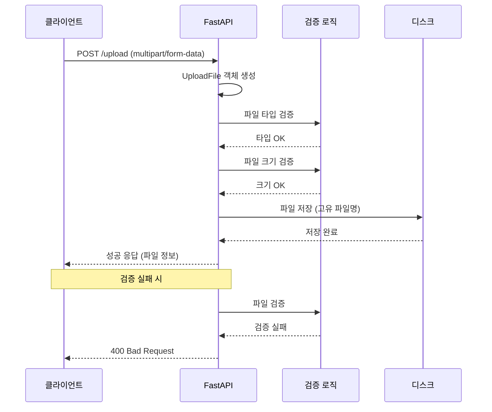
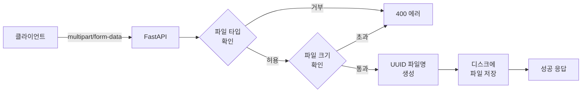

# 챕터 09: 파일 업로드와 폼 데이터

## 학습 목표

이 챕터를 완료하면 다음을 할 수 있습니다:

1. Form 데이터를 받아 처리할 수 있다
2. 단일 및 다중 파일 업로드를 구현할 수 있다
3. 파일 크기와 타입을 검증할 수 있다
4. 업로드된 파일을 서버에 저장할 수 있다
5. 폼 데이터와 파일을 동시에 처리할 수 있다

---

## 1. Form 데이터 처리 (Form())

HTML 폼에서 전송되는 데이터는 JSON이 아닌 `application/x-www-form-urlencoded` 형식입니다. FastAPI에서는 `Form()`을 사용하여 이를 처리합니다.

```python
from fastapi import FastAPI, Form

app = FastAPI()

@app.post("/login")
async def login(
    username: str = Form(...),     # 필수 필드
    password: str = Form(...),     # 필수 필드
    remember: bool = Form(False),  # 선택 필드 (기본값: False)
):
    return {"username": username, "remember": remember}
```

> **주의:** `Form()`을 사용하려면 `python-multipart` 패키지가 필요합니다.

---

## 2. 파일 업로드 (UploadFile)

FastAPI는 `UploadFile` 타입으로 파일 업로드를 처리합니다.

```python
from fastapi import FastAPI, UploadFile, File

@app.post("/upload")
async def upload_file(file: UploadFile = File(...)):
    return {
        "filename": file.filename,         # 원본 파일명
        "content_type": file.content_type,  # MIME 타입 (예: image/png)
        "size": file.size,                  # 파일 크기 (바이트)
    }
```

### UploadFile 주요 속성과 메서드

| 속성/메서드 | 설명 | 예시 |
|------------|------|------|
| `filename` | 원본 파일명 | `"photo.jpg"` |
| `content_type` | MIME 타입 | `"image/jpeg"` |
| `size` | 파일 크기 (바이트) | `1024000` |
| `read()` | 전체 내용 읽기 | `content = await file.read()` |
| `read(size)` | 지정 크기만큼 읽기 | `chunk = await file.read(1024)` |
| `seek(0)` | 읽기 위치 초기화 | `await file.seek(0)` |
| `close()` | 파일 닫기 | `await file.close()` |

### File() vs UploadFile

```python
# File()만 사용: bytes로 받음 (작은 파일에 적합)
@app.post("/upload-bytes")
async def upload_bytes(file: bytes = File(...)):
    return {"size": len(file)}

# UploadFile 사용: 파일 객체로 받음 (큰 파일에 적합, 메모리 효율적)
@app.post("/upload-file")
async def upload_file(file: UploadFile = File(...)):
    content = await file.read()
    return {"size": len(content)}
```

---

## 3. 다중 파일 업로드

```python
from fastapi import FastAPI, UploadFile, File

@app.post("/upload-multiple")
async def upload_multiple_files(
    files: list[UploadFile] = File(..., description="업로드할 파일들")
):
    results = []
    for file in files:
        content = await file.read()
        results.append({
            "filename": file.filename,
            "size": len(content),
            "content_type": file.content_type,
        })
    return {"uploaded_files": results, "total_count": len(results)}
```

---

## 4. 파일 크기/타입 검증

업로드된 파일은 보안을 위해 반드시 검증해야 합니다.

```python
# 허용 파일 타입
ALLOWED_IMAGE_TYPES = {"image/jpeg", "image/png", "image/gif", "image/webp"}
MAX_FILE_SIZE = 5 * 1024 * 1024  # 5MB

async def validate_image(file: UploadFile) -> UploadFile:
    """이미지 파일을 검증하는 함수"""
    # 파일 타입 검증
    if file.content_type not in ALLOWED_IMAGE_TYPES:
        raise HTTPException(
            status_code=400,
            detail=f"허용되지 않는 파일 형식입니다. 허용: {ALLOWED_IMAGE_TYPES}",
        )

    # 파일 크기 검증
    content = await file.read()
    if len(content) > MAX_FILE_SIZE:
        raise HTTPException(
            status_code=400,
            detail=f"파일 크기가 {MAX_FILE_SIZE // 1024 // 1024}MB를 초과합니다",
        )

    # 읽기 위치를 처음으로 되돌림 (다시 읽을 수 있도록)
    await file.seek(0)
    return file
```

---

## 5. 파일 저장 처리

업로드된 파일을 서버 디스크에 저장하는 패턴입니다.

```python
import os
import uuid
from pathlib import Path

UPLOAD_DIR = Path("uploads")
UPLOAD_DIR.mkdir(exist_ok=True)

async def save_upload_file(file: UploadFile, directory: Path = UPLOAD_DIR) -> str:
    """
    업로드된 파일을 저장하고 저장 경로를 반환합니다.
    파일명 충돌을 방지하기 위해 UUID를 사용합니다.
    """
    # 확장자 추출
    ext = os.path.splitext(file.filename)[1]

    # 고유한 파일명 생성
    unique_filename = f"{uuid.uuid4()}{ext}"
    file_path = directory / unique_filename

    # 파일 저장 (청크 단위로 읽어 메모리 효율적으로 저장)
    content = await file.read()
    with open(file_path, "wb") as f:
        f.write(content)

    return str(file_path)
```

---

## 6. 파일 업로드 흐름 다이어그램





---

## 주의사항

| 항목 | 설명 |
|------|------|
| 보안 | 원본 파일명을 그대로 사용하지 마세요 (경로 탐색 공격 위험) |
| 메모리 | 큰 파일은 `UploadFile`을 사용하세요 (`bytes`는 전체가 메모리에 로드됨) |
| 검증 | `content_type`만으로는 부족합니다 (매직 바이트 검증 권장) |
| 저장 경로 | 업로드 디렉토리는 웹 서버의 정적 파일 경로와 분리하세요 |
| 파일명 | UUID 등으로 고유한 파일명을 생성하여 충돌을 방지하세요 |
| 정리 | 오래된 업로드 파일을 주기적으로 정리하는 로직이 필요합니다 |

---

## 핵심 정리표

| 개념 | 설명 | 사용법 |
|------|------|--------|
| Form() | 폼 필드 | `username: str = Form(...)` |
| UploadFile | 파일 업로드 | `file: UploadFile = File(...)` |
| 다중 업로드 | 여러 파일 | `files: list[UploadFile] = File(...)` |
| read() | 파일 읽기 | `content = await file.read()` |
| seek(0) | 위치 초기화 | `await file.seek(0)` |
| content_type | MIME 타입 | `file.content_type` |

---

## 필요 패키지

```bash
pip install fastapi uvicorn python-multipart
```

> `python-multipart`는 파일 업로드와 폼 데이터 처리에 필수입니다.

---

## 다음 단계

챕터 10에서는 **백그라운드 작업과 테스트**를 학습합니다. 파일 업로드 후 백그라운드에서 처리하는 패턴과, API를 자동으로 테스트하는 방법을 배웁니다.
