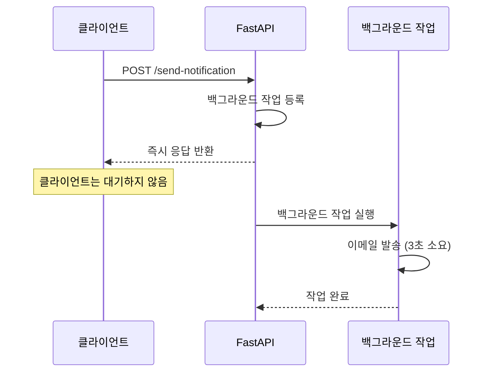
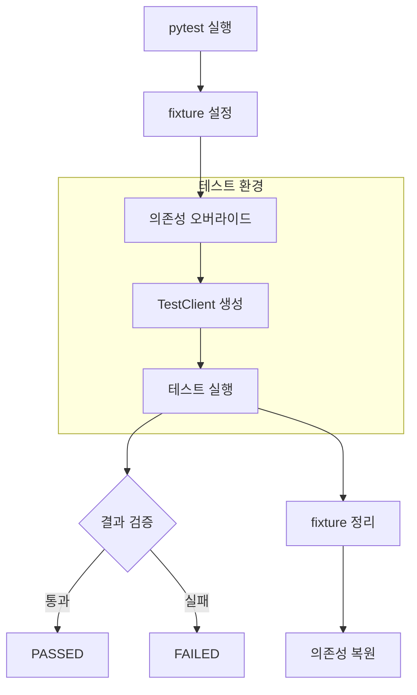

# 챕터 10: 백그라운드 작업과 테스트

## 학습 목표

이 챕터를 완료하면 다음을 할 수 있습니다:

1. BackgroundTasks를 활용하여 비동기 백그라운드 작업을 실행한다
2. 백그라운드 작업의 적절한 활용 사례를 이해한다
3. TestClient로 API 통합 테스트를 작성한다
4. pytest 프레임워크의 기본 사용법을 익힌다
5. 의존성 오버라이드를 활용한 테스트 기법을 구현한다

---

## 1. BackgroundTasks 사용법

FastAPI의 `BackgroundTasks`는 응답을 먼저 클라이언트에 반환한 후, 백그라운드에서 추가 작업을 실행합니다.

```python
from fastapi import BackgroundTasks

def send_email_notification(email: str, message: str):
    """이메일 발송 (시간이 오래 걸리는 작업)"""
    # 실제로는 SMTP 서버를 통해 이메일을 보냅니다
    import time
    time.sleep(3)  # 이메일 발송 시뮬레이션
    print(f"이메일 발송 완료: {email}")

@app.post("/send-notification")
async def send_notification(
    email: str,
    background_tasks: BackgroundTasks,
):
    # 백그라운드 작업 등록
    background_tasks.add_task(send_email_notification, email, "환영합니다!")

    # 즉시 응답 반환 (이메일은 백그라운드에서 발송)
    return {"message": "알림이 요청되었습니다"}
```

### BackgroundTasks 동작 흐름



### add_task() 사용법

```python
# 기본 사용법
background_tasks.add_task(함수, 인자1, 인자2)

# 키워드 인자 사용
background_tasks.add_task(함수, param1="값1", param2="값2")

# 여러 작업 등록 (순서대로 실행)
background_tasks.add_task(작업1, ...)
background_tasks.add_task(작업2, ...)
background_tasks.add_task(작업3, ...)
```

---

## 2. 백그라운드 작업 활용 사례

| 사례 | 설명 |
|------|------|
| 이메일 발송 | 회원가입 확인, 비밀번호 재설정 등 |
| 로그 기록 | 접근 로그, 감사 로그 파일에 기록 |
| 데이터 처리 | 업로드된 파일 가공, 이미지 리사이징 |
| 알림 전송 | 푸시 알림, SMS 발송 |
| 캐시 갱신 | 데이터 변경 후 캐시 업데이트 |
| 정리 작업 | 임시 파일 삭제, 만료된 데이터 정리 |

> **주의:** 무거운 작업(대량 데이터 처리, 동영상 인코딩 등)은 Celery 같은 전용 작업 큐를 사용하는 것이 좋습니다. `BackgroundTasks`는 가벼운 작업에 적합합니다.

---

## 3. TestClient 소개

FastAPI의 `TestClient`는 실제 HTTP 서버를 실행하지 않고도 API를 테스트할 수 있는 도구입니다.

```python
from fastapi.testclient import TestClient

# 앱 인스턴스를 TestClient에 전달
client = TestClient(app)

# GET 요청 테스트
response = client.get("/items/1")
assert response.status_code == 200
assert response.json()["id"] == 1

# POST 요청 테스트
response = client.post(
    "/items",
    json={"name": "새 아이템", "price": 1000},
)
assert response.status_code == 201
```

### TestClient 주요 메서드

| 메서드 | HTTP 메서드 | 예시 |
|--------|-----------|------|
| `client.get()` | GET | `client.get("/items")` |
| `client.post()` | POST | `client.post("/items", json={...})` |
| `client.put()` | PUT | `client.put("/items/1", json={...})` |
| `client.patch()` | PATCH | `client.patch("/items/1", json={...})` |
| `client.delete()` | DELETE | `client.delete("/items/1")` |

### 요청 옵션

```python
# JSON 본문
client.post("/items", json={"name": "test"})

# 쿼리 파라미터
client.get("/items", params={"page": 1, "size": 10})

# 헤더
client.get("/protected", headers={"Authorization": "Bearer 토큰"})

# 폼 데이터
client.post("/login", data={"username": "user", "password": "pass"})

# 파일 업로드
with open("test.txt", "rb") as f:
    client.post("/upload", files={"file": ("test.txt", f, "text/plain")})
```

---

## 4. pytest로 API 테스트 작성

pytest는 Python에서 가장 많이 사용되는 테스트 프레임워크입니다.

### 기본 테스트 구조

```python
# test_main.py
import pytest
from fastapi.testclient import TestClient
from main import app

client = TestClient(app)


class TestItemsAPI:
    """아이템 API 테스트"""

    def test_아이템_목록_조회(self):
        response = client.get("/items")
        assert response.status_code == 200
        data = response.json()
        assert isinstance(data, list)

    def test_아이템_생성(self):
        response = client.post(
            "/items",
            json={"name": "테스트 아이템", "price": 1000},
        )
        assert response.status_code == 201
        data = response.json()
        assert data["name"] == "테스트 아이템"
        assert data["price"] == 1000

    def test_존재하지_않는_아이템_조회(self):
        response = client.get("/items/99999")
        assert response.status_code == 404
```

### pytest fixture 활용

```python
import pytest

@pytest.fixture
def client():
    """테스트용 클라이언트"""
    return TestClient(app)

@pytest.fixture
def sample_item():
    """테스트용 샘플 아이템 데이터"""
    return {"name": "테스트 아이템", "price": 5000}

def test_아이템_생성(client, sample_item):
    response = client.post("/items", json=sample_item)
    assert response.status_code == 201
```

---

## 5. 의존성 오버라이드 (테스트용)

테스트에서는 실제 데이터베이스 대신 테스트용 데이터베이스를 사용해야 합니다. FastAPI의 `dependency_overrides`를 사용하면 의존성을 교체할 수 있습니다.

```python
from main import app, get_db

# 테스트용 DB 세션
def override_get_db():
    """테스트용 데이터베이스 세션"""
    test_db = TestSessionLocal()
    try:
        yield test_db
    finally:
        test_db.close()

# 의존성 교체
app.dependency_overrides[get_db] = override_get_db

client = TestClient(app)

# 테스트 완료 후 원래 의존성으로 복원
app.dependency_overrides.clear()
```

### 테스트 구조 다이어그램



---

## 주의사항

| 항목 | 설명 |
|------|------|
| BackgroundTasks 한계 | 프로세스가 종료되면 작업도 사라집니다 (Celery는 별도 프로세스) |
| 에러 처리 | 백그라운드 작업의 에러는 클라이언트에 전달되지 않으므로 로깅이 중요 |
| 테스트 격리 | 각 테스트는 독립적이어야 합니다 (데이터 공유 X) |
| fixture 범위 | `scope="session"`은 전체 테스트에서 한 번만 실행 |
| 비동기 테스트 | `async` 테스트에는 `pytest-asyncio`가 필요합니다 |
| 의존성 복원 | 테스트 후 반드시 `dependency_overrides.clear()`를 호출하세요 |

---

## 핵심 정리표

| 개념 | 설명 | 코드 |
|------|------|------|
| BackgroundTasks | 백그라운드 작업 | `background_tasks.add_task(func, args)` |
| TestClient | API 테스트 클라이언트 | `client = TestClient(app)` |
| assert | 결과 검증 | `assert response.status_code == 200` |
| fixture | 테스트 설정/해제 | `@pytest.fixture` |
| dependency_overrides | 의존성 교체 | `app.dependency_overrides[dep] = new_dep` |

---

## 필요 패키지

```bash
pip install fastapi uvicorn pytest httpx
```

> `httpx`는 `TestClient`가 내부적으로 사용하는 HTTP 클라이언트 라이브러리입니다.

---

## 다음 단계

이것으로 FastAPI 초중급 과정의 핵심 내용을 모두 학습했습니다. 다음 단계로는 아래 주제들을 공부하는 것을 추천합니다:

- **FastAPI 고급 기능**: WebSocket, 이벤트 핸들러, 커스텀 라우터
- **배포**: Docker 컨테이너화, CI/CD 파이프라인
- **성능 최적화**: 캐싱, 비동기 DB 드라이버, 로드 밸런싱
- **실전 프로젝트**: 인증 + DB + 파일 업로드를 결합한 종합 프로젝트
