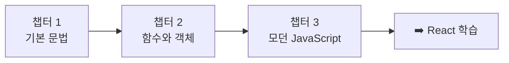

# JavaScript 기초 학습 커리큘럼 (Normal)

> **대상**: React 학습을 위해 JavaScript 기초가 필요한 개발 입문자
> **난이도**: 1-3/5
> **학습 목적**: React를 배우기 위한 JavaScript 필수 기초 다지기

> ⚠️ **이 자료는 React 학습을 위한 선행 학습 자료입니다.**
> 이 커리큘럼을 완료한 후 `react-normal/` 디렉토리의 React 학습으로 넘어가세요.

---

## 학습 로드맵

---

## 커리큘럼 개요

| 챕터 | 제목 | 난이도 | 핵심 키워드 |
|------|------|--------|------------|
| 01 | JavaScript 기본 문법 | ⭐ | 변수, 타입, 조건문, 반복문 |
| 02 | 함수와 객체 | ⭐⭐ | 함수, 객체, 배열, 배열 메서드 |
| 03 | 모던 JavaScript | ⭐⭐⭐ | ES6+, 비동기, 모듈 |

---

## 챕터 상세

### 챕터 01: JavaScript 기본 문법
- **학습 목표**: 변수 선언, 데이터 타입, 조건문, 반복문을 이해하고 사용할 수 있다
- **핵심 개념**: let/const, 원시 타입, 비교 연산자, if/else, for/while
- **섹션 구성**:
  - sec01-variables-types: 변수와 데이터 타입
  - sec02-control-flow: 조건문과 반복문
- **연습 문제**: 섹션별 1세트

### 챕터 02: 함수와 객체
- **학습 목표**: 함수를 정의하고 활용하며, 객체와 배열을 다룰 수 있다
- **핵심 개념**: 함수 선언/표현식, 화살표 함수, 객체 리터럴, 배열, map/filter/reduce
- **섹션 구성**:
  - sec01-functions: 함수 선언과 활용
  - sec02-objects-arrays: 객체와 배열
  - sec03-array-methods: 배열 메서드
- **연습 문제**: 섹션별 1세트

### 챕터 03: 모던 JavaScript
- **학습 목표**: ES6+ 문법, 비동기 처리, 모듈 시스템을 이해하고 활용할 수 있다
- **핵심 개념**: 구조 분해 할당, 스프레드 연산자, Promise, async/await, import/export
- **섹션 구성**:
  - sec01-es6-syntax: ES6+ 핵심 문법
  - sec02-async: 비동기 프로그래밍
  - sec03-modules: 모듈 시스템
- **연습 문제**: 섹션별 1세트

---

## 학습 방법 안내

1. 각 섹션의 `concept.md`를 먼저 읽습니다.
2. 코드 예제를 Node.js로 직접 실행해봅니다.
3. `exercise.md`의 문제를 읽고, `exercise.js`를 완성합니다.
4. 막히면 `solution.js`를 참고합니다.
5. `resources/glossary.md`에서 용어를 확인합니다.

---

## 참고 자료

- 공식 문서: [MDN JavaScript](https://developer.mozilla.org/en-US/docs/Web/JavaScript)
- 추가 학습 자료: `resources/references.md` 참조
- 용어 사전: `resources/glossary.md` 참조
