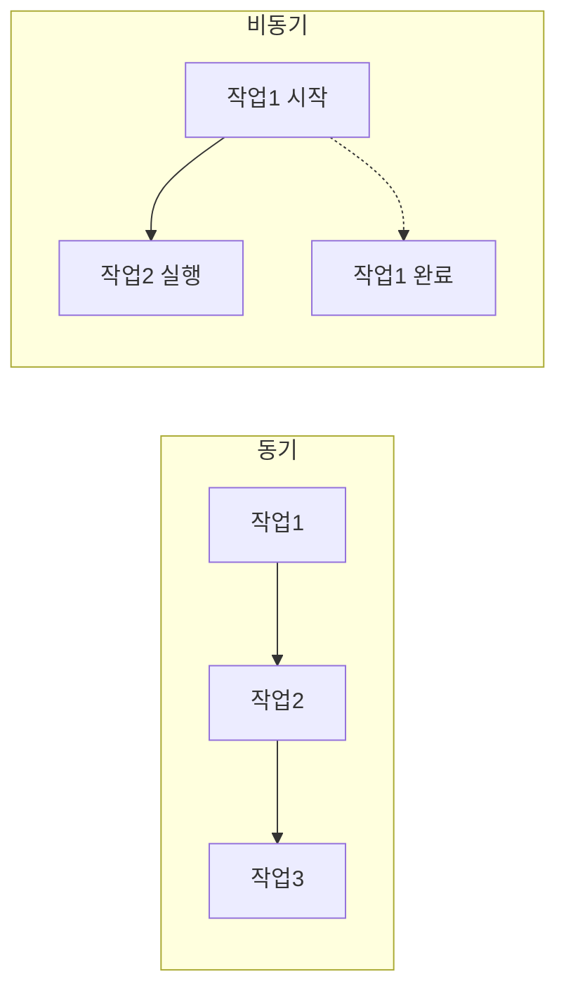

# 섹션 02: 비동기 프로그래밍

> **난이도**: ⭐⭐⭐ (3/5)
> **선수 지식**: 함수, 콜백 (ch02), ES6+ 문법 (sec01)

---

## 학습 목표

이 섹션을 마치면 다음을 할 수 있습니다:

- 동기와 비동기의 차이를 이해할 수 있다
- Promise를 생성하고 사용할 수 있다
- async/await로 비동기 코드를 작성할 수 있다
- 에러 처리를 할 수 있다

---

## 핵심 개념

### 동기 vs 비동기

```javascript
// 동기: 순서대로 실행, 이전 작업이 끝나야 다음 실행
console.log("1번");
console.log("2번");
console.log("3번");
// 출력: 1번, 2번, 3번

// 비동기: 기다리지 않고 다음 코드 실행
console.log("시작");
setTimeout(() => {
  console.log("2초 후 실행");
}, 2000);
console.log("끝");
// 출력: 시작, 끝, 2초 후 실행
```



### Promise

비동기 작업의 결과를 나타내는 객체입니다:

```javascript
// Promise 생성
const fetchData = new Promise((resolve, reject) => {
  setTimeout(() => {
    const success = true;
    if (success) {
      resolve({ id: 1, name: "데이터" }); // 성공
    } else {
      reject(new Error("데이터를 불러올 수 없습니다")); // 실패
    }
  }, 1000);
});

// Promise 사용
fetchData
  .then((data) => {
    console.log("성공:", data);
  })
  .catch((error) => {
    console.log("실패:", error.message);
  });
```

### async/await

Promise를 더 깔끔하게 사용하는 문법입니다:

```javascript
// async 함수는 항상 Promise를 반환
async function getData() {
  try {
    // await: Promise가 완료될 때까지 기다림
    const response = await fetch("https://jsonplaceholder.typicode.com/users/1");
    const data = await response.json();
    console.log(data.name);
  } catch (error) {
    console.log("에러:", error.message);
  }
}

getData();
```

> 💡 **React 연관**: React에서 API 호출할 때 async/await를 사용합니다.
> `useEffect(() => { async function load() { const data = await fetchAPI(); } load(); }, []);`

### 여러 Promise 동시 실행

```javascript
async function loadAllData() {
  try {
    // Promise.all: 모든 Promise가 완료될 때까지 기다림
    const [users, posts] = await Promise.all([
      fetch("https://jsonplaceholder.typicode.com/users").then(r => r.json()),
      fetch("https://jsonplaceholder.typicode.com/posts").then(r => r.json()),
    ]);
    console.log(`사용자: ${users.length}명, 글: ${posts.length}개`);
  } catch (error) {
    console.log("에러:", error.message);
  }
}
```

### 에러 처리

```javascript
async function safeFetch(url) {
  try {
    const response = await fetch(url);
    if (!response.ok) {
      throw new Error(`HTTP 에러: ${response.status}`);
    }
    return await response.json();
  } catch (error) {
    console.error("요청 실패:", error.message);
    return null; // 에러 시 null 반환
  }
}
```

---

## 코드로 이해하기

### 예제: 순차적 비동기 처리

```javascript
// 타이머를 Promise로 감싸기
function delay(ms) {
  return new Promise((resolve) => setTimeout(resolve, ms));
}

async function countdown(from) {
  for (let i = from; i > 0; i--) {
    console.log(i);
    await delay(1000); // 1초 대기
  }
  console.log("발사!");
}

countdown(3);
// 1초 간격으로: 3, 2, 1, 발사!
```

**실행 방법**:
```bash
node exercise.js
```

---

## 주의 사항

- ⚠️ `await`는 반드시 `async` 함수 안에서만 사용할 수 있습니다
- ⚠️ `async` 함수는 항상 Promise를 반환합니다
- ⚠️ 에러 처리를 빠뜨리면 "Unhandled Promise Rejection" 경고가 발생합니다
- 💡 `try/catch`로 비동기 에러를 처리하세요
- 💡 독립적인 여러 작업은 `Promise.all()`로 병렬 실행하면 효율적입니다

---

## 정리

| 개념 | 설명 | 예제 |
|------|------|------|
| Promise | 비동기 작업의 결과 | `new Promise((resolve, reject) => { })` |
| then/catch | Promise 결과 처리 | `.then(data => ...).catch(err => ...)` |
| async | 비동기 함수 선언 | `async function f() { }` |
| await | Promise 완료 대기 | `const data = await promise;` |
| Promise.all | 병렬 실행 | `await Promise.all([p1, p2])` |
| try/catch | 에러 처리 | `try { await f() } catch(e) { }` |

---

## 다음 단계

- ✅ `exercise.md`의 연습 문제를 풀어보세요.
- 📖 다음 섹션: **sec03-modules: 모듈 시스템**
- 🔗 참고 자료: [MDN - Promise](https://developer.mozilla.org/en-US/docs/Web/JavaScript/Reference/Global_Objects/Promise)
