# React 학습 커리큘럼 (Expert - 고급)

> **대상**: React 기본기를 갖추고 심화 학습이 필요한 시니어 프론트엔드 개발자
> **난이도**: ⭐⭐⭐ ~ ⭐⭐⭐⭐⭐ (3-5/5)
> **학습 목적**: 업무에서 React 아키텍처 설계 및 고급 패턴을 적용하기 위한 역량 확보

---

## 학습 로드맵

```mermaid
graph LR
    CH01[CH01<br/>React 내부 동작 원리] --> CH02[CH02<br/>고급 Hooks 패턴]
    CH02 --> CH03[CH03<br/>성능 최적화]
    CH03 --> CH04[CH04<br/>상태 관리 아키텍처]
    CH04 --> CH05[CH05<br/>TypeScript 심화]
    CH05 --> CH06[CH06<br/>테스팅 전략]
    CH06 --> CH07[CH07<br/>Server Components와 SSR]
    CH07 --> CH08[CH08<br/>설계 패턴과 아키텍처]
    CH08 --> CH09[CH09<br/>빌드와 배포 파이프라인]
    CH09 --> CH10[CH10<br/>엔터프라이즈 프로젝트]
```

---

## 커리큘럼 개요

| 챕터 | 제목 | 난이도 | 핵심 키워드 |
|------|------|--------|------------|
| 01 | React 내부 동작 원리 | ⭐⭐⭐ | Fiber, 재조정, 가상 DOM, 렌더 파이프라인 |
| 02 | 고급 Hooks 패턴 | ⭐⭐⭐ | useReducer, useSyncExternalStore, 커스텀 Hook 설계 |
| 03 | 성능 최적화 | ⭐⭐⭐⭐ | React.memo, useMemo, useCallback, React Compiler |
| 04 | 상태 관리 아키텍처 | ⭐⭐⭐⭐ | Redux Toolkit, Zustand, 상태 설계 원칙 |
| 05 | TypeScript와 React 심화 | ⭐⭐⭐⭐ | 제네릭 컴포넌트, 타입 추론, 유틸리티 타입 |
| 06 | 테스팅 전략 | ⭐⭐⭐⭐ | React Testing Library, MSW, 통합 테스트 |
| 07 | Server Components와 SSR | ⭐⭐⭐⭐⭐ | RSC, Next.js App Router, 스트리밍 SSR |
| 08 | 설계 패턴과 아키텍처 | ⭐⭐⭐⭐⭐ | Compound Components, Render Props, 관심사 분리 |
| 09 | 빌드와 배포 파이프라인 | ⭐⭐⭐⭐ | Vite, CI/CD, 번들 분석, 모니터링 |
| 10 | 엔터프라이즈 프로젝트: 대시보드 | ⭐⭐⭐⭐⭐ | 대규모 앱 아키텍처, 인증, 데이터 시각화 |

---

## 챕터 상세

### 📖 챕터 01: React 내부 동작 원리
- **학습 목표**: React의 Fiber 아키텍처와 재조정 알고리즘을 이해하고 렌더링 동작을 예측할 수 있다
- **핵심 개념**: Fiber 노드, 재조정(Reconciliation), 가상 DOM 비교, 커밋 단계
- **실습 내용**: 커스텀 렌더러 미니 구현으로 동작 원리 이해
- **연습 문제**: 3개

### 📖 챕터 02: 고급 Hooks 패턴
- **학습 목표**: 복잡한 상태 로직을 Hook으로 추상화하고 재사용 가능한 커스텀 Hook을 설계할 수 있다
- **핵심 개념**: useReducer 심화, useSyncExternalStore, useImperativeHandle, Hook 합성
- **실습 내용**: 고급 커스텀 Hook 라이브러리 구현
- **연습 문제**: 3개

### 📖 챕터 03: 성능 최적화
- **학습 목표**: React 앱의 성능 병목을 분석하고 체계적으로 최적화할 수 있다
- **핵심 개념**: React.memo, useMemo, useCallback, 코드 스플리팅, React Compiler
- **실습 내용**: 대규모 리스트 렌더링 최적화와 프로파일링
- **연습 문제**: 3개

### 📖 챕터 04: 상태 관리 아키텍처
- **학습 목표**: 프로젝트 규모에 맞는 상태 관리 전략을 선택하고 설계할 수 있다
- **핵심 개념**: Redux Toolkit, Zustand, 상태 정규화, 서버 상태 vs 클라이언트 상태
- **실습 내용**: TanStack Query와 Zustand를 조합한 상태 관리 구현
- **연습 문제**: 3개

### 📖 챕터 05: TypeScript와 React 심화
- **학습 목표**: TypeScript를 활용하여 타입 안전한 React 코드를 작성할 수 있다
- **핵심 개념**: 제네릭 컴포넌트, 조건부 타입, 유틸리티 타입, 타입 추론 극대화
- **실습 내용**: 타입 안전한 폼 라이브러리 구현
- **연습 문제**: 3개

### 📖 챕터 06: 테스팅 전략
- **학습 목표**: 단위/통합/E2E 테스트를 전략적으로 구성하고 테스트 가능한 코드를 작성할 수 있다
- **핵심 개념**: React Testing Library, MSW, 테스트 피라미드, 접근성 테스트
- **실습 내용**: API 연동 컴포넌트의 통합 테스트 작성
- **연습 문제**: 3개

### 📖 챕터 07: Server Components와 SSR
- **학습 목표**: React Server Components와 SSR 전략을 이해하고 Next.js App Router를 활용할 수 있다
- **핵심 개념**: RSC 아키텍처, 스트리밍 SSR, Suspense, 서버/클라이언트 경계
- **실습 내용**: Next.js App Router 기반 블로그 구현
- **연습 문제**: 3개

### 📖 챕터 08: 설계 패턴과 아키텍처
- **학습 목표**: 대규모 React 앱에서 사용되는 설계 패턴을 이해하고 적용할 수 있다
- **핵심 개념**: Compound Components, Render Props, HOC, 관심사 분리, Feature-Sliced Design
- **실습 내용**: 확장 가능한 UI 컴포넌트 라이브러리 설계
- **연습 문제**: 3개

### 📖 챕터 09: 빌드와 배포 파이프라인
- **학습 목표**: 프로덕션 수준의 빌드 설정과 CI/CD 파이프라인을 구성할 수 있다
- **핵심 개념**: Vite 설정, 번들 크기 분석, GitHub Actions, 에러 모니터링
- **실습 내용**: Vite + GitHub Actions CI/CD 파이프라인 구축
- **연습 문제**: 3개

### 📖 챕터 10: 엔터프라이즈 프로젝트 - 관리자 대시보드
- **학습 목표**: 지금까지 배운 모든 고급 개념을 종합하여 엔터프라이즈급 애플리케이션을 설계할 수 있다
- **핵심 개념**: 인증/인가, 데이터 시각화, 실시간 업데이트, 확장 가능한 아키텍처
- **실습 내용**: 관리자 대시보드 애플리케이션 설계 및 핵심 모듈 구현
- **연습 문제**: 5개

---

## 학습 방법 안내

1. 각 챕터의 `concept.md`를 먼저 읽습니다.
2. `practice/example-*.tsx` 코드를 직접 실행해봅니다.
3. `practice/exercise.md`의 문제를 풀어봅니다.
4. 막히면 `practice/solution.tsx`을 참고합니다.
5. `resources/glossary.md`에서 용어를 확인합니다.

---

## 참고 자료

- 공식 문서: https://react.dev
- 추가 학습 자료: `resources/references.md` 참조
- 용어 사전: `resources/glossary.md` 참조
