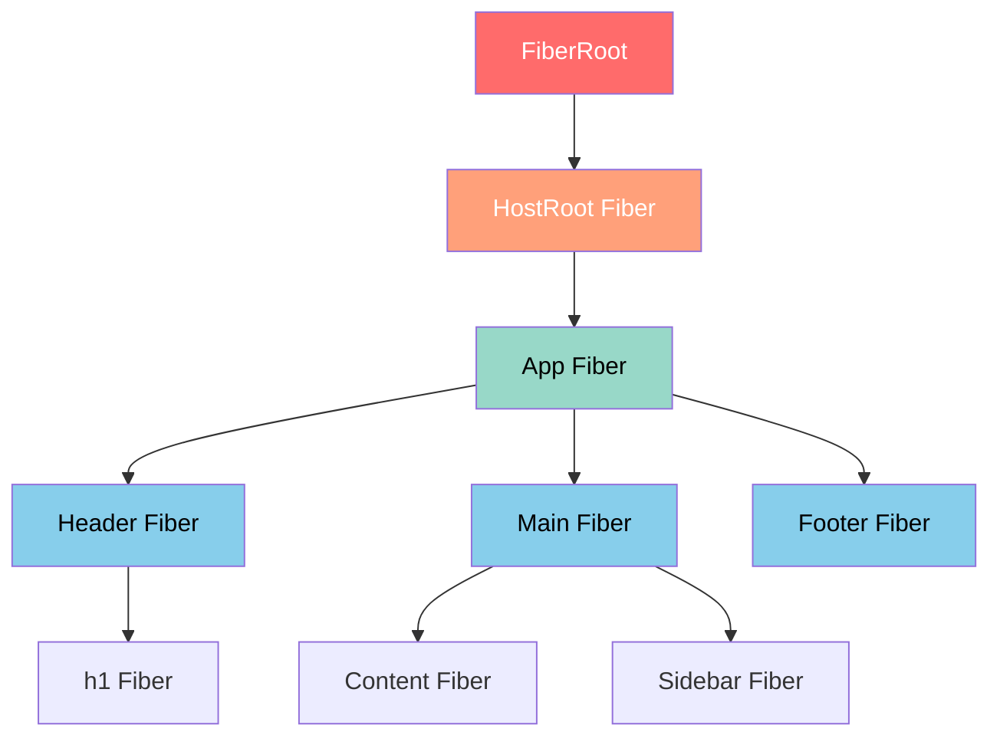
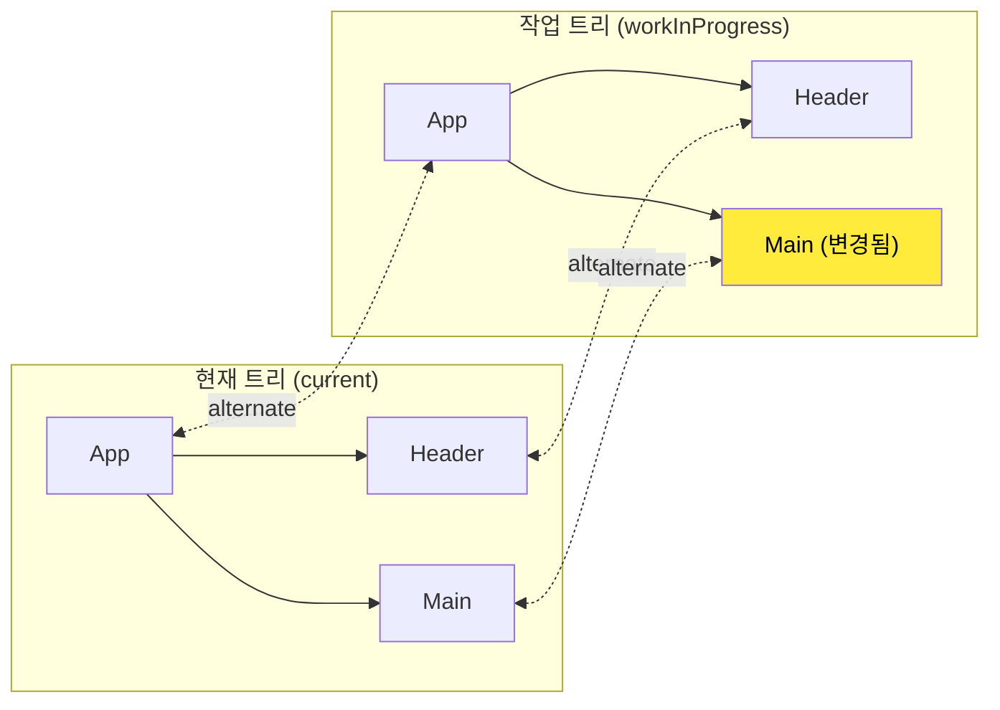
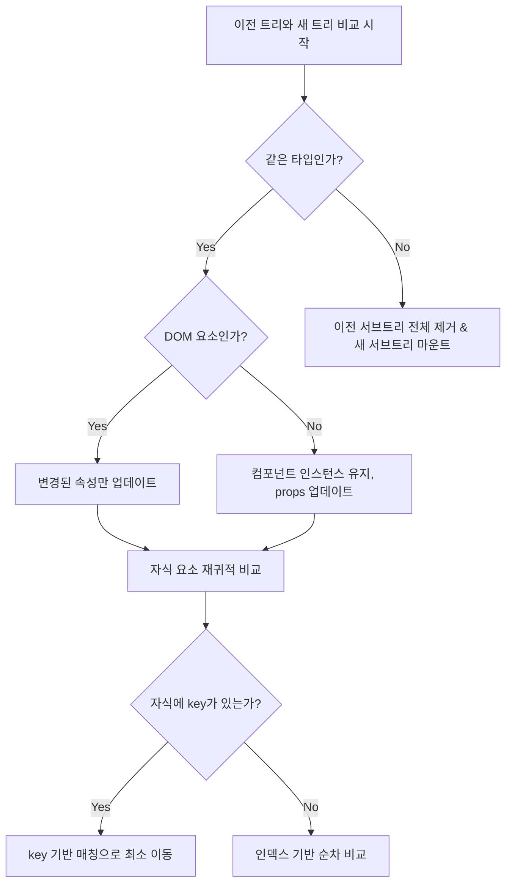
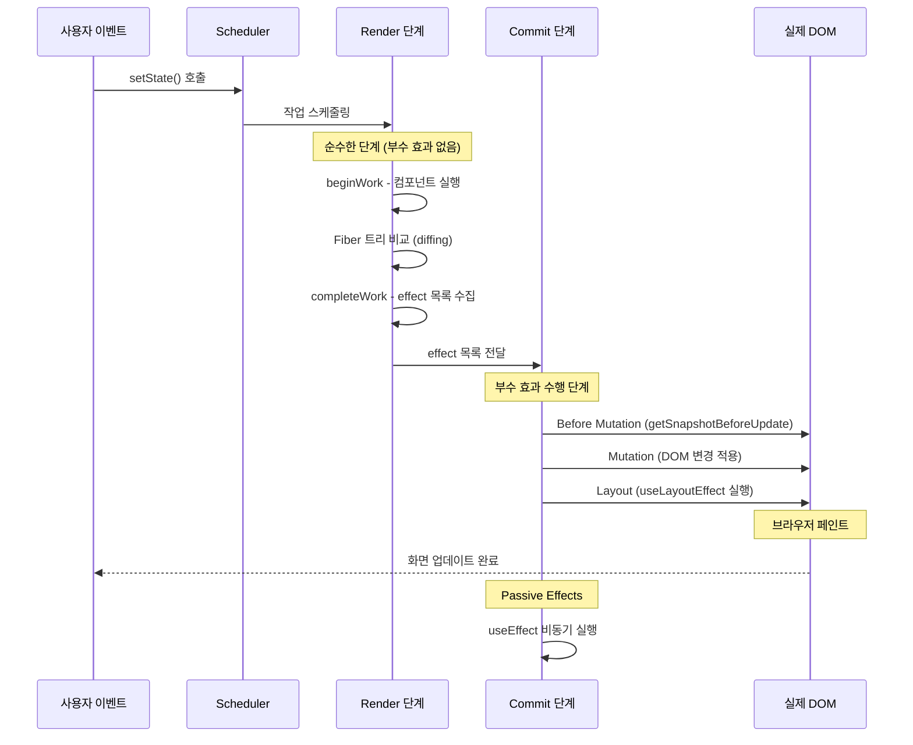

# 챕터 01: React 내부 동작 원리

> **난이도**: ⭐⭐⭐ (3/5)
> **예상 학습 시간**: 3~4시간
> **선수 지식**: React 기본 개념 (JSX, 컴포넌트, 상태, 생명주기), JavaScript 이벤트 루프

---

## 학습 목표

이 챕터를 마치면 다음을 할 수 있습니다:

- Fiber 아키텍처의 구조와 동작 방식을 설명할 수 있습니다.
- 재조정(Reconciliation) 알고리즘이 가상 DOM을 비교하는 과정을 이해합니다.
- Render 단계와 Commit 단계의 차이를 구분하고, 각 단계에서 어떤 작업이 수행되는지 파악합니다.
- 미니 렌더러를 구현하여 React의 핵심 동작 원리를 체득합니다.

---

## 핵심 개념

### 1. React Element와 가상 DOM

React에서 JSX를 작성하면, 이는 `React.createElement()` 호출로 변환됩니다. 이 함수가 반환하는 것이 바로 **React Element** — 즉, 가상 DOM 노드입니다.

```tsx
// JSX
const element = <div className="container"><h1>Hello</h1></div>;

// 컴파일 결과 (React 17+ JSX Transform)
const element = {
  type: 'div',
  props: {
    className: 'container',
    children: {
      type: 'h1',
      props: { children: 'Hello' },
    },
  },
};
```

React Element는 **불변(immutable)** 객체입니다. 상태가 변경되면 새로운 Element 트리가 생성되며, React는 이전 트리와 새 트리를 비교(diffing)하여 최소한의 DOM 변경을 수행합니다.

### 2. Fiber 아키텍처

React 16에서 도입된 **Fiber**는 React의 재조정 엔진을 완전히 재설계한 결과물입니다. 기존 Stack Reconciler는 재귀적으로 트리를 순회했기 때문에 중단이 불가능했지만, Fiber는 작업을 작은 단위(unit of work)로 분할하여 중단과 재개가 가능합니다.



**Fiber 노드의 핵심 속성:**

| 속성 | 설명 |
|------|------|
| `type` | 컴포넌트 타입 (함수, 클래스, 문자열 등) |
| `key` | 리스트에서의 고유 식별자 |
| `child` | 첫 번째 자식 Fiber |
| `sibling` | 다음 형제 Fiber |
| `return` | 부모 Fiber |
| `stateNode` | 실제 DOM 노드 또는 클래스 인스턴스 |
| `pendingProps` | 새로 들어온 props |
| `memoizedProps` | 이전 렌더링의 props |
| `memoizedState` | 이전 렌더링의 state (Hook의 연결 리스트) |
| `alternate` | 더블 버퍼링을 위한 반대편 Fiber |
| `effectTag` | 커밋 단계에서 수행할 작업 (Placement, Update, Deletion) |



### 3. 재조정(Reconciliation) 알고리즘

React의 Diffing 알고리즘은 O(n) 시간 복잡도를 달성하기 위해 두 가지 가정을 합니다:

1. **다른 타입의 엘리먼트는 다른 트리를 생성한다.**
2. **`key` prop으로 자식 요소의 안정적인 식별이 가능하다.**



**key가 중요한 이유 — 리스트 비교 시나리오:**

```tsx
// 이전 상태
<ul>
  <li>A</li>  // index 0
  <li>B</li>  // index 1
</ul>

// 새 상태 (맨 앞에 C 추가)
<ul>
  <li>C</li>  // index 0 — key 없으면 A→C로 "변경"으로 인식
  <li>A</li>  // index 1 — key 없으면 B→A로 "변경"으로 인식
  <li>B</li>  // index 2 — key 없으면 "새로 생성"으로 인식
</ul>
// key가 없으면 3개 모두 재렌더링. key가 있으면 C만 삽입.
```

### 4. Render 단계와 Commit 단계

React의 업데이트 과정은 크게 두 단계로 나뉩니다.



**Render 단계 (비동기, 중단 가능):**
- `beginWork`: 각 Fiber 노드를 처리하며, 컴포넌트 함수를 실행하거나 props를 비교합니다.
- `completeWork`: 하위 트리 처리가 끝난 후, 효과(effect) 목록을 상위로 전파합니다.
- 이 단계에서는 DOM을 직접 변경하지 않습니다.

**Commit 단계 (동기, 중단 불가):**
- `Before Mutation`: DOM 변경 전 스냅샷 캡처
- `Mutation`: 실제 DOM에 변경 사항 적용 (삽입, 수정, 삭제)
- `Layout`: `useLayoutEffect` 콜백 실행, ref 할당
- `Passive Effects`: `useEffect` 콜백이 비동기로 실행

### 5. 동시성 렌더링(Concurrent Rendering)

React 18에서 도입된 동시성 기능은 Fiber 아키텍처의 "중단 가능한 렌더링"을 활용합니다.

```mermaid
gantt
    title 동기 렌더링 vs 동시성 렌더링
    dateFormat X
    axisFormat %s

    section 동기 렌더링
    긴 렌더링 작업      :0, 300
    사용자 입력 차단됨    :crit, 0, 300

    section 동시성 렌더링
    렌더링 청크 1       :0, 50
    사용자 입력 처리     :milestone, 50, 50
    렌더링 청크 2       :60, 110
    렌더링 청크 3       :120, 170
```



**우선순위 레인(Priority Lanes):**
- `SyncLane`: 최고 우선순위 (클릭 이벤트)
- `InputContinuousLane`: 연속 입력 (드래그, 스크롤)
- `DefaultLane`: 일반 업데이트
- `TransitionLane`: `startTransition`으로 표시된 전환
- `IdleLane`: 최저 우선순위

---

## 코드로 이해하기

### 예제 1: 미니 React 렌더러 구현
> 📁 `practice/example-01.tsx` 파일을 참고하세요.

React의 핵심 동작인 Element 생성, Fiber 트리 구축, 재조정, DOM 커밋을 간소화한 미니 렌더러입니다.

```tsx
// 핵심: Fiber 노드 구조
interface MFiber {
  type: string | Function;
  props: Record<string, any>;
  dom: HTMLElement | Text | null;
  parent: MFiber | null;
  child: MFiber | null;
  sibling: MFiber | null;
  alternate: MFiber | null;
  effectTag?: 'PLACEMENT' | 'UPDATE' | 'DELETION';
  hooks?: any[];
}
```

**실행 방법**:
```bash
# 프로젝트 루트에서
npx ts-node practice/example-01.tsx
# 또는 브라우저 환경에서 테스트하려면:
# npx vite로 개발 서버를 띄운 후 index.html에 임포트
```

### 예제 2: 재조정 과정 시각화
> 📁 `practice/example-02.tsx` 파일을 참고하세요.

재조정 알고리즘이 어떻게 이전 트리와 새 트리를 비교하는지 로그로 확인하는 예제입니다.

```tsx
// 핵심: key 기반 비교 vs 인덱스 기반 비교
function reconcileChildren(
  wipFiber: MFiber,
  elements: MElement[]
): void {
  let oldFiber = wipFiber.alternate?.child ?? null;
  let index = 0;
  // ... 비교 로직
}
```

**실행 방법**:
```bash
npx tsx practice/example-02.tsx
```

---

## 주의 사항

- ⚠️ **`key`에 배열 인덱스 사용 금지**: 리스트 항목의 순서가 변경될 수 있는 경우, 인덱스를 key로 사용하면 재조정 알고리즘이 잘못된 비교를 수행하여 성능 저하와 버그를 유발합니다.
- ⚠️ **Render 단계에서 부수 효과 금지**: 컴포넌트 함수 본문에서 DOM 조작, API 호출 등의 부수 효과를 수행하면 안 됩니다. 동시성 모드에서 render가 여러 번 실행될 수 있습니다.
- 💡 **React DevTools Profiler 활용**: Fiber 트리의 실제 동작을 확인하려면 React DevTools의 Profiler 탭을 사용하세요. 각 커밋에서 어떤 컴포넌트가 렌더링되었는지 확인할 수 있습니다.
- 💡 **`React.StrictMode`는 Render 단계를 두 번 실행합니다**: 개발 모드에서 부수 효과가 순수하지 않은 코드를 조기에 발견하기 위함입니다.

---

## 정리

| 개념 | 설명 | 핵심 포인트 |
|------|------|-------------|
| React Element | `createElement()`가 반환하는 불변 객체 | UI의 스냅샷을 나타냄 |
| Fiber | 작업 단위를 나타내는 가변 객체 | `child`, `sibling`, `return`으로 연결 |
| 재조정 | 이전/새 트리 비교 알고리즘 | O(n) 시간 복잡도, key 기반 최적화 |
| Render 단계 | Fiber 트리 구축 및 비교 | 비동기, 중단 가능, 순수해야 함 |
| Commit 단계 | 실제 DOM에 변경 적용 | 동기, 중단 불가 |
| 동시성 렌더링 | 우선순위 기반 렌더링 스케줄링 | Lane 모델, 중단/재개 가능 |

---

## 다음 단계

- ✅ `practice/exercise.md`의 연습 문제를 풀어보세요.
- 📖 다음 챕터: **챕터 02 - 고급 Hooks 패턴**
- 🔗 참고 자료:
  - [React Fiber Architecture (Andrew Clark)](https://github.com/acdlite/react-fiber-architecture)
  - [React Source Code - ReactFiber.js](https://github.com/facebook/react/blob/main/packages/react-reconciler/src/ReactFiber.js)
  - [Building Your Own React (Rodrigo Pombo)](https://pomb.us/build-your-own-react/)
  - [React 공식 문서 - Reconciliation](https://react.dev/learn/preserving-and-resetting-state)
