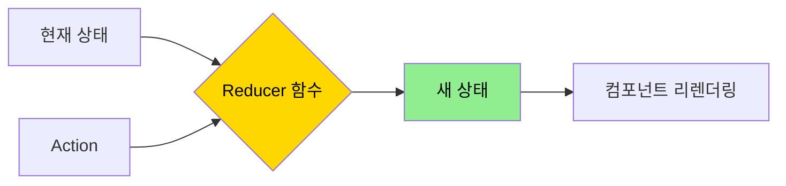
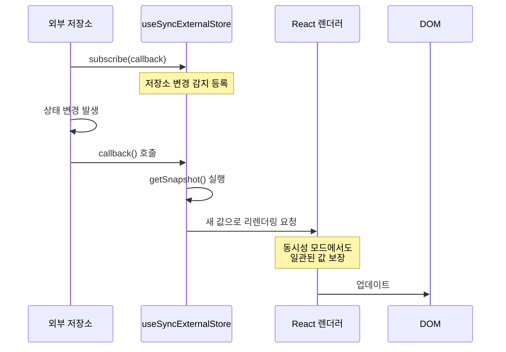
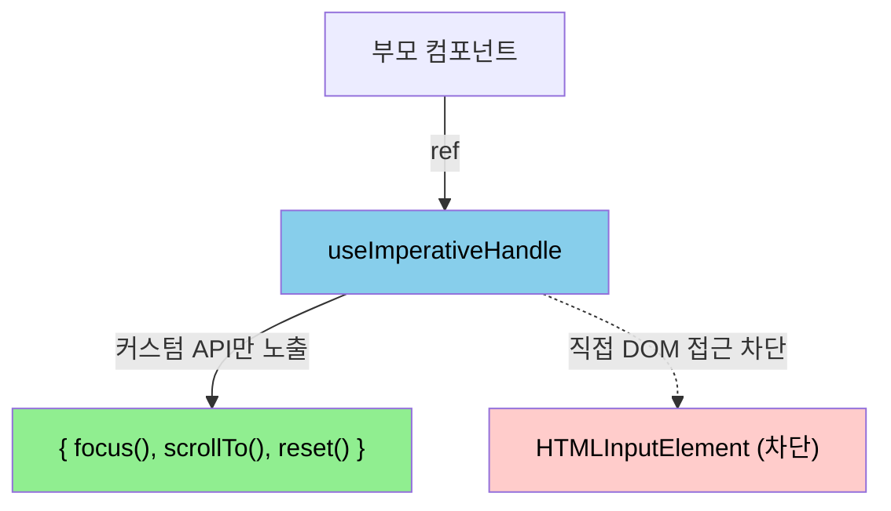
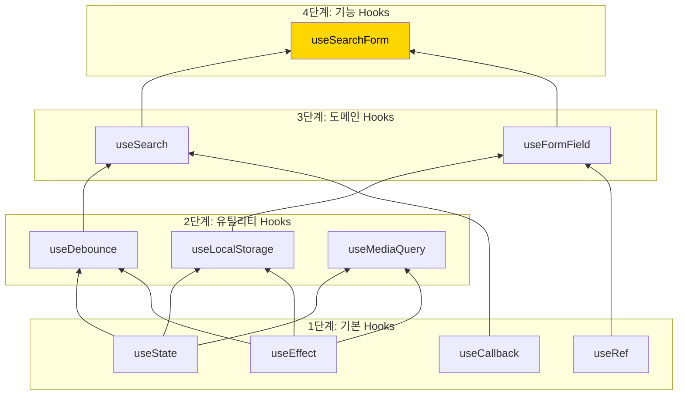
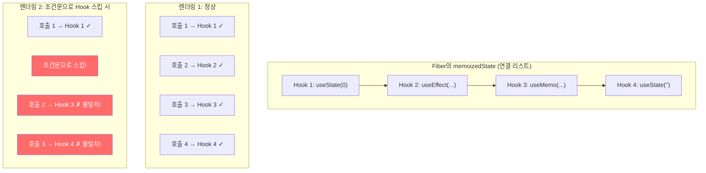

# 챕터 02: 고급 Hooks 패턴

> **난이도**: ⭐⭐⭐ (3/5)
> **예상 학습 시간**: 3~4시간
> **선수 지식**: 챕터 01 (React 내부 동작 원리), useState/useEffect 기본 사용법

---

## 학습 목표

이 챕터를 마치면 다음을 할 수 있습니다:

- `useReducer`를 사용하여 복잡한 상태 전이 로직을 관리할 수 있습니다.
- `useSyncExternalStore`를 활용하여 외부 상태 저장소와 React를 안전하게 연동할 수 있습니다.
- `useImperativeHandle`로 부모 컴포넌트에 세밀한 API를 노출할 수 있습니다.
- 여러 Hook을 합성(composition)하여 재사용 가능한 커스텀 Hook 라이브러리를 구축할 수 있습니다.

---

## 핵심 개념

### 1. useReducer 심화

`useReducer`는 `useState`의 대안으로, 상태 전이가 복잡하거나 여러 관련 상태를 함께 관리해야 할 때 유용합니다. Redux의 reducer 패턴과 동일한 원리입니다.



**언제 useReducer를 사용해야 하는가:**

| 상황 | useState | useReducer |
|------|----------|------------|
| 단순 값 토글 | ✅ | ❌ |
| 관련 없는 여러 상태 | ✅ | ❌ |
| 복잡한 상태 전이 | ❌ | ✅ |
| 여러 상태가 함께 변경 | ❌ | ✅ |
| 상태 변경 로직 테스트 | ❌ | ✅ |
| 이전 상태 기반 업데이트 | △ | ✅ |

**Discriminated Union으로 타입 안전한 Action 정의:**

```tsx
// 판별 유니온 타입으로 action 정의
type FormAction =
  | { type: 'SET_FIELD'; field: string; value: string }
  | { type: 'VALIDATE' }
  | { type: 'SUBMIT_START' }
  | { type: 'SUBMIT_SUCCESS'; data: ResponseData }
  | { type: 'SUBMIT_ERROR'; error: string }
  | { type: 'RESET' };

// reducer에서 switch 사용 시 타입 좁힘(narrowing) 자동 적용
function formReducer(state: FormState, action: FormAction): FormState {
  switch (action.type) {
    case 'SET_FIELD':
      return { ...state, [action.field]: action.value }; // field, value 자동 추론
    case 'SUBMIT_ERROR':
      return { ...state, error: action.error }; // error 자동 추론
    // ...
  }
}
```

### 2. useSyncExternalStore

React 18에서 추가된 `useSyncExternalStore`는 외부 저장소(Redux, MobX, 브라우저 API 등)를 React에 안전하게 연결하는 공식 API입니다. 동시성 렌더링에서 발생할 수 있는 **Tearing**(화면 불일치) 문제를 방지합니다.



**Tearing 문제란?**

동시성 렌더링에서 render가 중단/재개될 때, 외부 저장소의 값이 render 중간에 변경되면 같은 렌더링에서 서로 다른 값을 읽게 되는 현상입니다. `useSyncExternalStore`는 이를 방지합니다.

```tsx
const value = useSyncExternalStore(
  subscribe,    // (callback) => unsubscribe 함수
  getSnapshot,  // () => 현재 값 (클라이언트)
  getServerSnapshot  // () => 서버 렌더링 시 값 (SSR)
);
```

### 3. useImperativeHandle

`forwardRef`와 함께 사용하여, 부모 컴포넌트에서 자식의 ref로 접근할 때 노출할 API를 제어합니다. DOM 노드 전체를 노출하는 대신, 필요한 메서드만 선별적으로 제공할 수 있습니다.



```tsx
interface InputHandle {
  focus: () => void;
  scrollIntoView: () => void;
  getValue: () => string;
}

const CustomInput = forwardRef<InputHandle, InputProps>((props, ref) => {
  const inputRef = useRef<HTMLInputElement>(null);

  useImperativeHandle(ref, () => ({
    focus: () => inputRef.current?.focus(),
    scrollIntoView: () => inputRef.current?.scrollIntoView({ behavior: 'smooth' }),
    getValue: () => inputRef.current?.value ?? '',
  }), []);  // deps: 빈 배열 = 한 번만 생성

  return <input ref={inputRef} {...props} />;
});
```

### 4. Hook 합성 패턴

커스텀 Hook의 진정한 힘은 여러 Hook을 합성하여 새로운 추상화를 만드는 데 있습니다.



**Hook 합성의 핵심 원칙:**

1. **단일 책임**: 각 Hook은 하나의 관심사만 담당
2. **입력/출력 명확**: 매개변수와 반환값의 타입이 명확해야 함
3. **순수성 유지**: Hook 내부에서 외부 상태를 직접 변경하지 않음
4. **테스트 가능성**: 각 Hook이 독립적으로 테스트 가능해야 함

### 5. Hook 규칙의 내부 원리

React의 Hook 규칙 (`useXxx`를 최상위에서만 호출, 조건문/반복문 내 호출 금지)은 단순한 코딩 컨벤션이 아니라, Hook의 **내부 구현**에 기인합니다.



Hook은 Fiber 노드의 `memoizedState`에 **연결 리스트**로 저장되며, 렌더링마다 **호출 순서(인덱스)**로 매칭됩니다. 따라서 호출 순서가 변하면 잘못된 상태에 접근하게 됩니다.

---

## 코드로 이해하기

### 예제 1: 고급 커스텀 Hook 라이브러리
> 📁 `practice/example-01.tsx` 파일을 참고하세요.

유틸리티 Hook들을 합성하여 실용적인 커스텀 Hook 라이브러리를 구축합니다.

```tsx
// 핵심: Hook 합성의 예시
function useSearchForm<T>(searchFn: (query: string) => Promise<T[]>) {
  const [query, setQuery] = useDebounce('', 300);
  const { data, loading, error } = useAsync(() => searchFn(query), [query]);
  const history = useLocalStorage<string[]>('search-history', []);
  // ...
}
```

**실행 방법**:
```bash
npx tsx practice/example-01.tsx
```

### 예제 2: useSyncExternalStore로 외부 저장소 연동
> 📁 `practice/example-02.tsx` 파일을 참고하세요.

```tsx
// 핵심: 외부 저장소를 React와 안전하게 연동
function createStore<T>(initialState: T) {
  let state = initialState;
  const listeners = new Set<() => void>();

  return {
    getSnapshot: () => state,
    subscribe: (listener: () => void) => {
      listeners.add(listener);
      return () => listeners.delete(listener);
    },
    setState: (updater: (prev: T) => T) => {
      state = updater(state);
      listeners.forEach((l) => l());
    },
  };
}
```

**실행 방법**:
```bash
npx tsx practice/example-02.tsx
```

---

## 주의 사항

- ⚠️ **useReducer의 dispatch는 안정적인 참조입니다**: `useCallback`으로 감쌀 필요가 없습니다. React가 보장합니다.
- ⚠️ **useSyncExternalStore의 getSnapshot은 캐시된 값을 반환해야 합니다**: 매번 새 객체를 생성하면 무한 리렌더링이 발생합니다.
- ⚠️ **커스텀 Hook에서 조건부 Hook 호출 금지**: 커스텀 Hook 내부에서도 동일한 Hook 규칙이 적용됩니다.
- 💡 **useReducer + Context = 간이 Redux**: 작은 앱에서는 외부 라이브러리 없이 상태 관리가 가능합니다.
- 💡 **Hook은 함수입니다**: 클로저를 적극 활용하세요. 외부 변수를 캡처하여 유연한 동작을 구현할 수 있습니다.

---

## 정리

| 개념 | 설명 | 사용 시점 |
|------|------|-----------|
| useReducer | 복잡한 상태 전이 관리 | 상태 로직이 3개 이상의 action을 가질 때 |
| useSyncExternalStore | 외부 저장소 연동 | Redux, 브라우저 API, WebSocket 등 |
| useImperativeHandle | ref에 커스텀 API 노출 | 라이브러리 컴포넌트, 포커스/스크롤 제어 |
| Hook 합성 | 여러 Hook을 조합 | 재사용 가능한 로직 추상화 |
| Hook 규칙 | 최상위 호출, 순서 보장 | 모든 Hook 사용 시 필수 |

---

## 다음 단계

- ✅ `practice/exercise.md`의 연습 문제를 풀어보세요.
- 📖 다음 챕터: **챕터 03 - 성능 최적화**
- 🔗 참고 자료:
  - [React 공식 문서 - useReducer](https://react.dev/reference/react/useReducer)
  - [React 공식 문서 - useSyncExternalStore](https://react.dev/reference/react/useSyncExternalStore)
  - [React 공식 문서 - useImperativeHandle](https://react.dev/reference/react/useImperativeHandle)
  - [Tearing과 동시성 렌더링](https://github.com/reactwg/react-18/discussions/69)
