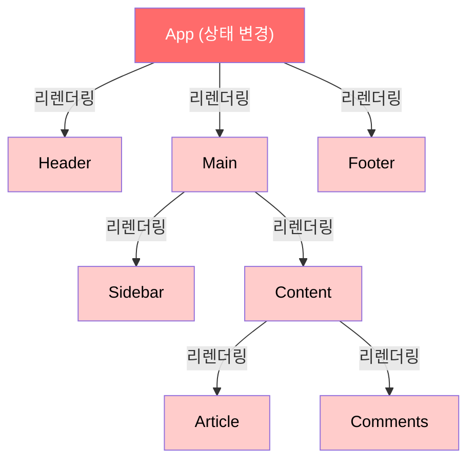
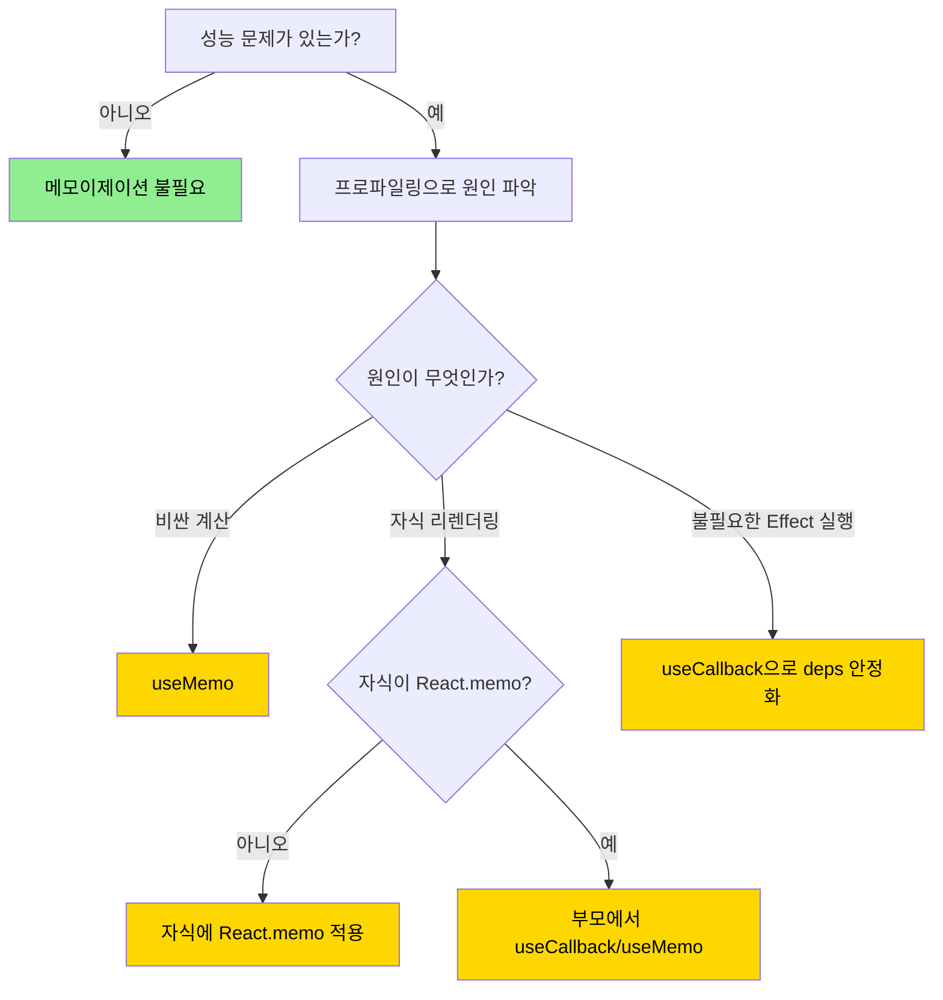
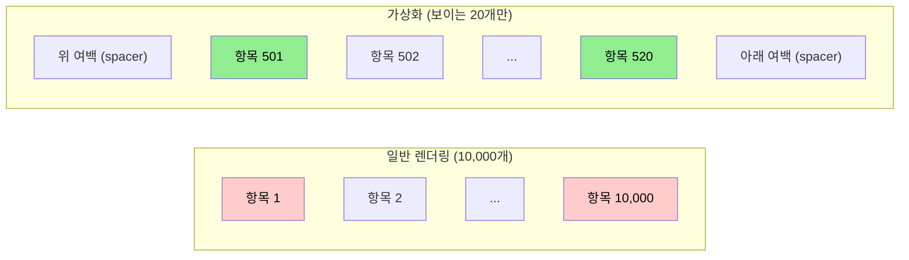
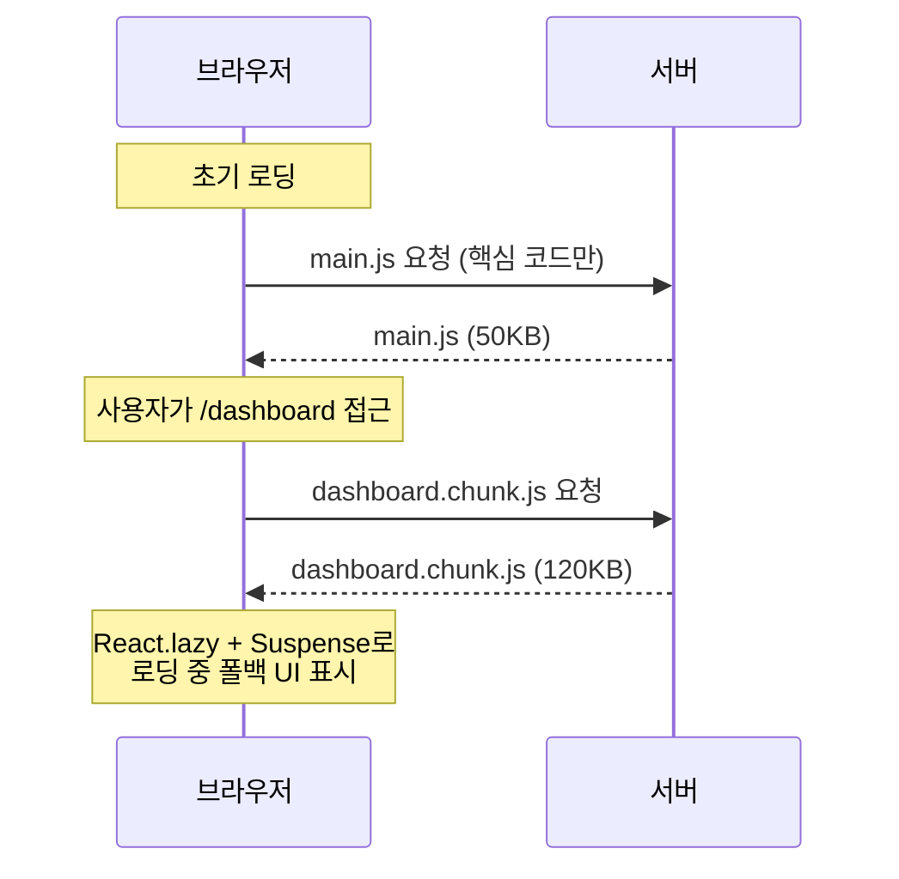
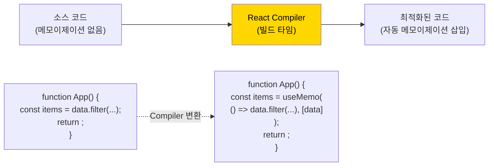

# 챕터 03: 성능 최적화

> **난이도**: ⭐⭐⭐⭐ (4/5)
> **예상 학습 시간**: 4~5시간
> **선수 지식**: 챕터 01 (React 내부 동작 원리), 챕터 02 (고급 Hooks 패턴)

---

## 학습 목표

이 챕터를 마치면 다음을 할 수 있습니다:

- `React.memo`, `useMemo`, `useCallback`의 동작 원리와 올바른 사용 시점을 판단할 수 있습니다.
- 가상화(Virtualization)를 적용하여 대규모 리스트를 효율적으로 렌더링할 수 있습니다.
- React DevTools Profiler를 사용하여 성능 병목 지점을 식별하고 해결할 수 있습니다.
- 코드 스플리팅과 지연 로딩으로 초기 번들 크기를 줄일 수 있습니다.
- React Compiler의 자동 메모이제이션 원리를 이해합니다.

---

## 핵심 개념

### 1. 불필요한 리렌더링 이해하기

React 컴포넌트는 다음 세 가지 경우에 리렌더링됩니다:

1. **자신의 상태(state)가 변경**되었을 때
2. **부모 컴포넌트가 리렌더링**되었을 때 (props가 같더라도!)
3. **구독 중인 Context 값이 변경**되었을 때



위 그림에서 App의 상태가 변경되면, **모든 하위 컴포넌트가 리렌더링**됩니다. Header, Footer가 App의 상태와 무관하더라도!

### 2. React.memo

`React.memo`는 컴포넌트를 감싸서 **props가 변경되지 않으면 리렌더링을 건너뛰게** 합니다. 얕은 비교(shallow comparison)를 사용합니다.

```tsx
// 기본 사용법
const MemoizedComponent = React.memo(function MyComponent({ name, count }: Props) {
  console.log('렌더링됨!');
  return <div>{name}: {count}</div>;
});

// 커스텀 비교 함수
const MemoizedList = React.memo(
  function ExpensiveList({ items }: { items: Item[] }) {
    return <ul>{items.map(/* ... */)}</ul>;
  },
  (prevProps, nextProps) => {
    // true를 반환하면 리렌더링 건너뜀
    return prevProps.items.length === nextProps.items.length &&
           prevProps.items.every((item, i) => item.id === nextProps.items[i].id);
  }
);
```

**React.memo가 실패하는 경우:**

```tsx
// 매번 새 객체/배열/함수 생성 → React.memo 무력화!
function Parent() {
  return (
    <MemoizedChild
      style={{ color: 'red' }}     // 매번 새 객체
      items={[1, 2, 3]}            // 매번 새 배열
      onClick={() => console.log()} // 매번 새 함수
    />
  );
}
```

### 3. useMemo와 useCallback

```mermaid
flowchart TD
    subgraph useMemo
        A["useMemo(fn, deps)"] --> B{deps 변경?}
        B -->|Yes| C[fn() 실행, 결과 캐시]
        B -->|No| D[캐시된 결과 반환]
    end

    subgraph useCallback
        E["useCallback(fn, deps)"] --> F{deps 변경?}
        F -->|Yes| G[새 fn 참조 캐시]
        F -->|No| H[캐시된 fn 참조 반환]
    end

    style C fill:#90ee90,color:#000
    style D fill:#87ceeb,color:#000
    style G fill:#90ee90,color:#000
    style H fill:#87ceeb,color:#000
```

**`useMemo` — 계산 결과 캐싱:**
```tsx
// 비용이 큰 계산 결과를 캐싱
const sortedItems = useMemo(
  () => items.sort((a, b) => a.price - b.price),
  [items]
);

// 참조 안정성 보장 (React.memo와 함께 사용)
const style = useMemo(
  () => ({ color: theme === 'dark' ? 'white' : 'black' }),
  [theme]
);
```

**`useCallback` — 함수 참조 캐싱:**
```tsx
// React.memo된 자식에게 전달하는 콜백
const handleClick = useCallback(
  (id: number) => {
    setSelectedId(id);
  },
  [setSelectedId]
);
```

**핵심 원칙: 메모이제이션은 공짜가 아닙니다!**

| 비용 | 설명 |
|------|------|
| 메모리 | 이전 값을 캐시에 유지 |
| 비교 연산 | deps 배열의 얕은 비교 (Object.is) |
| 코드 복잡성 | deps 관리, 클로저 이해 필요 |
| 디버깅 난이도 | 스테일 클로저(stale closure) 버그 가능 |

**언제 사용해야 하는가:**



### 4. 가상화(Virtualization)

수천 개의 항목이 있는 리스트를 모두 DOM에 렌더링하면 성능이 급격히 저하됩니다. 가상화는 **화면에 보이는 항목만** 렌더링하는 기법입니다.



**주요 가상화 라이브러리:**
- `@tanstack/react-virtual`: 가볍고 유연한 가상화
- `react-window`: 간단한 리스트/그리드 가상화
- `react-virtuoso`: 가변 높이 항목 지원

### 5. 코드 스플리팅과 지연 로딩



```tsx
// 라우트 단위 코드 스플리팅
const Dashboard = React.lazy(() => import('./pages/Dashboard'));
const Settings = React.lazy(() => import('./pages/Settings'));

function App() {
  return (
    <Suspense fallback={<PageSkeleton />}>
      <Routes>
        <Route path="/dashboard" element={<Dashboard />} />
        <Route path="/settings" element={<Settings />} />
      </Routes>
    </Suspense>
  );
}
```

### 6. React Compiler (React 19+)

React Compiler는 빌드 타임에 컴포넌트를 분석하여 **자동으로 메모이제이션을 삽입**합니다. 수동으로 `useMemo`, `useCallback`, `React.memo`를 사용할 필요가 줄어듭니다.



**React Compiler가 최적화하는 것:**
- 컴포넌트 자체의 메모이제이션 (React.memo 역할)
- JSX 표현식 내 객체/배열 리터럴의 캐싱
- 콜백 함수의 참조 안정화
- 계산 비용이 있는 표현식의 메모이제이션

**React Compiler의 전제 조건:**
- 컴포넌트가 **React의 규칙**을 따라야 합니다 (순수 렌더링, Hook 규칙)
- 부수 효과가 렌더링 중에 발생하면 최적화가 적용되지 않습니다

---

## 코드로 이해하기

### 예제 1: 대규모 리스트 최적화와 프로파일링
> 📁 `practice/example-01.tsx` 파일을 참고하세요.

10,000개 항목의 리스트를 단계적으로 최적화하는 과정을 보여줍니다.

```tsx
// 핵심: React.memo + useCallback + 가상화 조합
const VirtualizedProductList = memo(function ProductList({
  products,
  onSelect
}: Props) {
  const parentRef = useRef<HTMLDivElement>(null);
  const virtualizer = useVirtualizer({
    count: products.length,
    getScrollElement: () => parentRef.current,
    estimateSize: () => 60,
  });
  // ...
});
```

**실행 방법**:
```bash
npx tsx practice/example-01.tsx
```

### 예제 2: 코드 스플리팅과 지연 로딩 패턴
> 📁 `practice/example-02.tsx` 파일을 참고하세요.

```tsx
// 핵심: 프리로딩 + 에러 바운더리 + Suspense 조합
const preloadComponent = (factory: () => Promise<any>) => {
  let promise: Promise<any> | null = null;
  return {
    lazy: React.lazy(factory),
    preload: () => { promise = promise ?? factory(); return promise; },
  };
};
```

**실행 방법**:
```bash
npx tsx practice/example-02.tsx
```

---

## 주의 사항

- ⚠️ **과도한 메모이제이션은 역효과**: 모든 컴포넌트에 `React.memo`를 적용하면 오히려 비교 연산 비용이 증가합니다. **프로파일링 먼저, 최적화는 나중에**.
- ⚠️ **스테일 클로저(Stale Closure) 주의**: `useCallback`의 deps가 불완전하면 오래된 값을 참조하는 버그가 발생합니다.
- ⚠️ **`useMemo`는 의미적 보장이 아닙니다**: React는 메모리 압박 시 캐시를 삭제할 수 있습니다. 부수 효과를 `useMemo`에 넣지 마세요.
- 💡 **상태를 아래로 내리세요(Lift State Down)**: 상태를 사용하는 컴포넌트에 최대한 가깝게 배치하면, 메모이제이션 없이도 불필요한 리렌더링을 줄일 수 있습니다.
- 💡 **children 패턴**: `children`으로 전달된 JSX는 부모의 리렌더링에 영향받지 않습니다 (이미 생성된 Element이므로).

---

## 정리

| 기법 | 대상 | 사용 시점 | 주의점 |
|------|------|-----------|--------|
| React.memo | 컴포넌트 | props가 잘 안 변하는 무거운 컴포넌트 | 참조형 props 주의 |
| useMemo | 계산 결과 | 비용 큰 연산, 참조 안정성 필요 시 | deps 정확히 관리 |
| useCallback | 함수 | memo된 자식에 콜백 전달 시 | stale closure 주의 |
| 가상화 | 리스트/그리드 | 항목이 100개 이상일 때 | 가변 높이 처리 복잡 |
| 코드 스플리팅 | 라우트/모달 | 초기 번들 크기 감소 필요 시 | 프리로딩 전략 필요 |
| React Compiler | 전체 앱 | React 19+ 환경 | 순수 컴포넌트 전제 |

---

## 다음 단계

- ✅ `practice/exercise.md`의 연습 문제를 풀어보세요.
- 📖 다음 챕터: **챕터 04 - 상태 관리 아키텍처**
- 🔗 참고 자료:
  - [React 공식 문서 - 성능](https://react.dev/learn/render-and-commit)
  - [React Profiler 사용법](https://react.dev/reference/react/Profiler)
  - [TanStack Virtual 문서](https://tanstack.com/virtual/latest)
  - [React Compiler 소개](https://react.dev/learn/react-compiler)
  - [Why Did You Render?](https://github.com/welldone-software/why-did-you-render)
