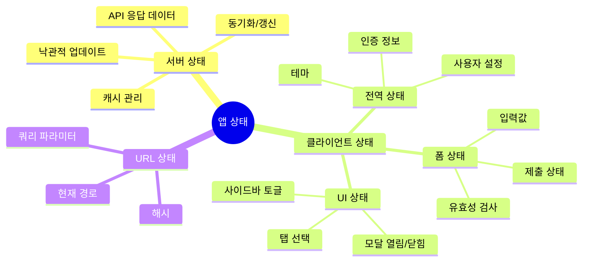
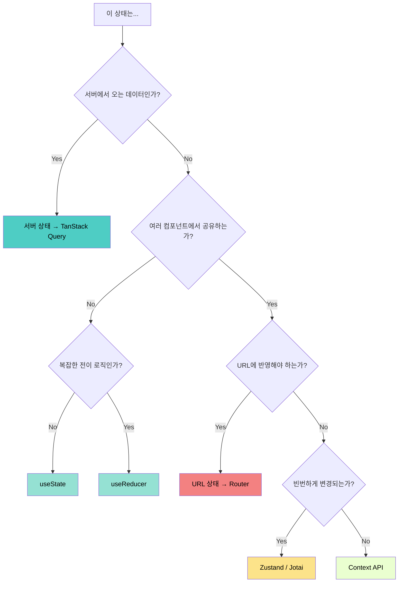
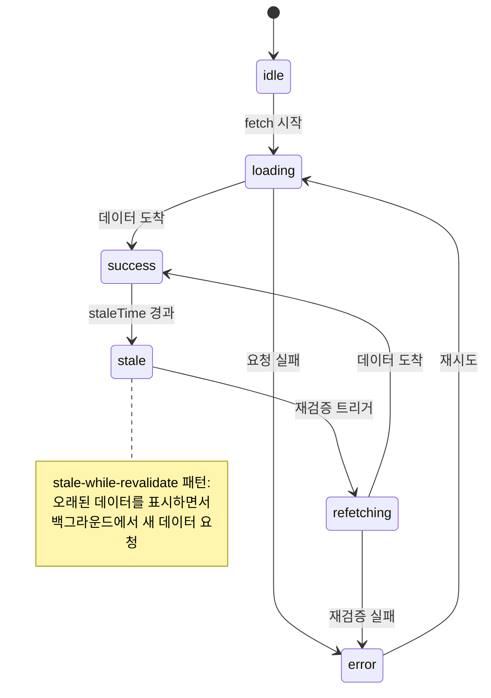
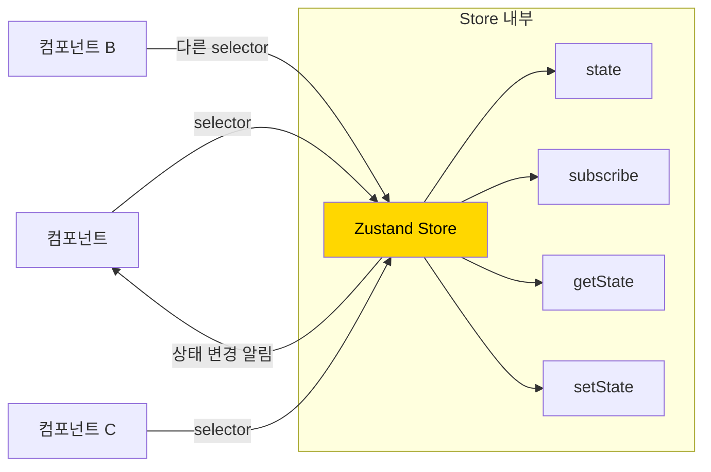
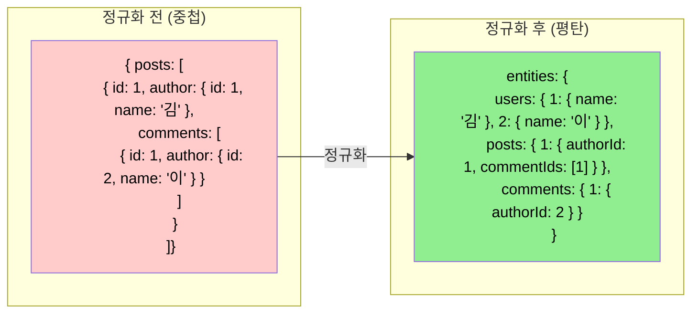
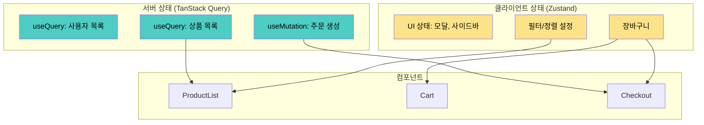

# 챕터 04: 상태 관리 아키텍처

> **난이도**: ⭐⭐⭐⭐ (4/5)
> **예상 학습 시간**: 4~5시간
> **선수 지식**: 챕터 02 (고급 Hooks 패턴), 챕터 03 (성능 최적화), Redux 기본 개념

---

## 학습 목표

이 챕터를 마치면 다음을 할 수 있습니다:

- 서버 상태와 클라이언트 상태를 구분하고 적절한 도구를 선택할 수 있습니다.
- Zustand의 내부 동작 원리를 이해하고 효과적으로 사용할 수 있습니다.
- TanStack Query(React Query)로 서버 상태를 관리할 수 있습니다.
- 상태를 정규화(normalize)하여 일관성과 성능을 보장할 수 있습니다.
- 앱의 규모에 맞는 상태 관리 아키텍처를 설계할 수 있습니다.

---

## 핵심 개념

### 1. 상태의 종류 분류

모든 상태가 같지는 않습니다. 상태의 특성에 따라 관리 전략이 달라져야 합니다.





### 2. 서버 상태 관리 — TanStack Query

서버 상태는 클라이언트 상태와 근본적으로 다릅니다:

| 특성 | 클라이언트 상태 | 서버 상태 |
|------|----------------|-----------|
| 소유자 | 클라이언트 | 서버 |
| 동기화 | 불필요 | 필수 (캐시 무효화) |
| 신선도 | 항상 최신 | 시간이 지나면 stale |
| 중복 요청 | 해당 없음 | 제거 필요 (deduplication) |
| 오프라인 | 직접 관리 | 캐시에서 제공 가능 |



**TanStack Query의 핵심 개념:**

```tsx
// useQuery: 데이터 조회
const { data, isLoading, error } = useQuery({
  queryKey: ['users', userId],        // 캐시 키
  queryFn: () => fetchUser(userId),    // 데이터 가져오기 함수
  staleTime: 5 * 60 * 1000,           // 5분간 fresh 상태 유지
  gcTime: 30 * 60 * 1000,             // 30분간 캐시 보관
});

// useMutation: 데이터 변경
const mutation = useMutation({
  mutationFn: updateUser,
  onSuccess: () => {
    queryClient.invalidateQueries({ queryKey: ['users'] });
  },
});
```

### 3. Zustand — 미니멀 상태 관리

Zustand는 단 300줄 내외의 코드로 구현된 경량 상태 관리 라이브러리입니다. Redux의 boilerplate 없이 비슷한 기능을 제공합니다.



**Zustand의 핵심 원리:**

```tsx
// 내부적으로 useSyncExternalStore를 사용합니다!
import { create } from 'zustand';

const useStore = create<State>((set, get) => ({
  count: 0,
  increment: () => set((state) => ({ count: state.count + 1 })),
  getDoubleCount: () => get().count * 2,
}));

// selector로 필요한 상태만 구독 (리렌더링 최적화)
function Counter() {
  const count = useStore((state) => state.count);
  const increment = useStore((state) => state.increment);
  // count가 변경될 때만 리렌더링됨
}
```

**Zustand vs Redux Toolkit vs Context:**

| 기능 | Context | Zustand | Redux Toolkit |
|------|---------|---------|---------------|
| 보일러플레이트 | 적음 | 매우 적음 | 중간 |
| 리렌더링 최적화 | 수동 (useMemo) | 자동 (selector) | 자동 (selector) |
| 미들웨어 | 없음 | 내장 | 내장 |
| DevTools | 없음 | 지원 | 지원 |
| 번들 크기 | 0KB | ~1KB | ~11KB |
| 비동기 처리 | 직접 구현 | 자유롭게 | 자유롭게 |
| 학습 곡선 | 낮음 | 낮음 | 중간 |

### 4. 상태 정규화(Normalization)

중첩된 데이터를 평탄화하여 **일관성**과 **업데이트 효율성**을 보장합니다.



**정규화의 이점:**
- 데이터 중복 제거 (사용자 정보가 한 곳에만 존재)
- 업데이트 시 한 곳만 변경 (이름 변경 시 모든 곳에 자동 반영)
- O(1) 조회 성능 (id로 즉시 접근)
- Redux Toolkit의 `createEntityAdapter`가 이를 자동화

### 5. TanStack Query + Zustand 조합 패턴



**각 도구의 역할:**
- **TanStack Query**: API 데이터 캐싱, 자동 갱신, 낙관적 업데이트
- **Zustand**: UI 상태, 사용자 선택, 장바구니 등 클라이언트 전용 상태
- **URL/Router**: 필터, 정렬, 페이지 번호 등 공유 가능한 상태

---

## 코드로 이해하기

### 예제 1: TanStack Query + Zustand 전자상거래 앱
> 📁 `practice/example-01.tsx` 파일을 참고하세요.

실제 전자상거래 앱의 상태 관리 아키텍처를 구현합니다.

```tsx
// 핵심: 서버 상태와 클라이언트 상태의 명확한 분리
// 서버 상태: TanStack Query
const { data: products } = useQuery({
  queryKey: ['products', { category, sort }],
  queryFn: () => fetchProducts({ category, sort }),
});

// 클라이언트 상태: Zustand
const addToCart = useCartStore((s) => s.addItem);
const cartItems = useCartStore((s) => s.items);
```

**실행 방법**:
```bash
npx tsx practice/example-01.tsx
```

### 예제 2: 상태 정규화와 셀렉터 패턴
> 📁 `practice/example-02.tsx` 파일을 참고하세요.

```tsx
// 핵심: 정규화된 상태와 파생 데이터(selector)
const selectPostWithAuthor = (state: NormalizedState, postId: string) => {
  const post = state.entities.posts[postId];
  const author = state.entities.users[post.authorId];
  return { ...post, author };
};
```

**실행 방법**:
```bash
npx tsx practice/example-02.tsx
```

---

## 주의 사항

- ⚠️ **서버 상태를 useState로 관리하지 마세요**: 캐싱, 갱신, 로딩 상태 등을 모두 직접 구현해야 합니다. TanStack Query가 이를 자동화합니다.
- ⚠️ **Context의 리렌더링 문제**: Context 값이 변경되면 구독하는 **모든** 컴포넌트가 리렌더링됩니다. 빈번하게 변경되는 상태에는 부적합합니다.
- ⚠️ **과도한 전역 상태 사용 금지**: "이 상태가 정말 전역이어야 하는가?"를 항상 질문하세요. 대부분의 상태는 로컬이면 충분합니다.
- 💡 **Zustand의 selector는 얕은 비교**: 객체를 반환하는 selector는 `shallow` 비교를 사용하세요.
- 💡 **TanStack Query의 queryKey 설계가 핵심**: 캐시 무효화의 정확성이 queryKey 구조에 달려있습니다.

---

## 정리

| 상태 유형 | 추천 도구 | 이유 |
|-----------|-----------|------|
| 서버 데이터 | TanStack Query | 캐싱, 자동 갱신, 중복 제거 |
| 전역 UI 상태 | Zustand | 가볍고 selector로 최적화 |
| 로컬 UI 상태 | useState / useReducer | 가장 단순 |
| URL 상태 | React Router | 공유/북마크 가능 |
| 폼 상태 | React Hook Form / Zod | 유효성 검사 통합 |
| 복잡한 전역 상태 | Redux Toolkit | DevTools, 미들웨어 생태계 |

---

## 다음 단계

- ✅ `practice/exercise.md`의 연습 문제를 풀어보세요.
- 📖 다음 챕터: **챕터 05 - TypeScript와 React 심화**
- 🔗 참고 자료:
  - [TanStack Query 공식 문서](https://tanstack.com/query/latest)
  - [Zustand GitHub](https://github.com/pmndrs/zustand)
  - [Redux Toolkit 공식 문서](https://redux-toolkit.js.org/)
  - [Kent C. Dodds - Application State Management](https://kentcdodds.com/blog/application-state-management-with-react)
