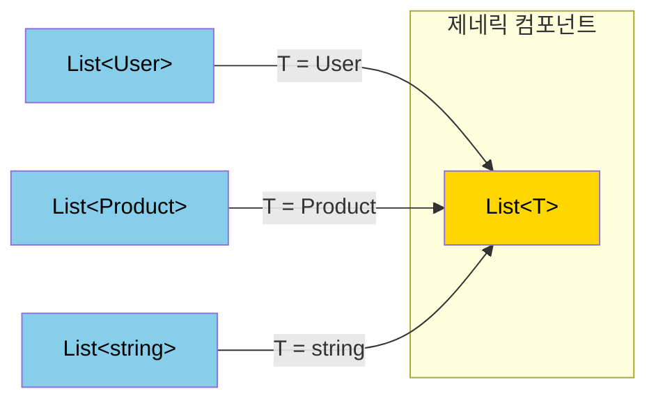
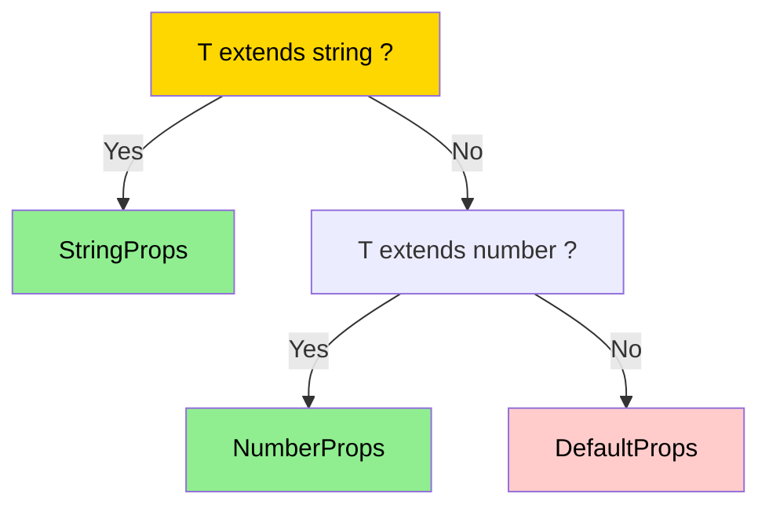
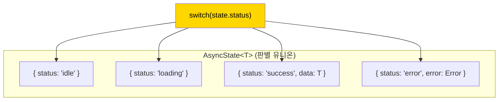
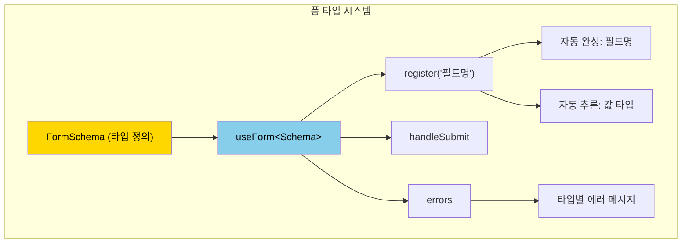

# 챕터 05: TypeScript와 React 심화

> **난이도**: ⭐⭐⭐⭐ (4/5)
> **예상 학습 시간**: 4~5시간
> **선수 지식**: TypeScript 기본 (인터페이스, 제네릭, 유니온), React 기본 (컴포넌트, props, hooks)

---

## 학습 목표

이 챕터를 마치면 다음을 할 수 있습니다:

- 제네릭 컴포넌트를 구현하여 타입 안전하면서도 유연한 API를 설계할 수 있습니다.
- 조건부 타입과 유틸리티 타입으로 복잡한 props 타입을 정의할 수 있습니다.
- 판별 유니온(Discriminated Union)으로 상태 머신을 타입 레벨에서 표현할 수 있습니다.
- 타입 추론을 최대한 활용하여 사용자에게 최소한의 타입 명시만 요구하는 API를 만들 수 있습니다.
- 타입 안전한 폼 라이브러리를 설계하고 구현할 수 있습니다.

---

## 핵심 개념

### 1. 제네릭 컴포넌트

제네릭 컴포넌트는 다양한 데이터 타입과 함께 동작하면서도 타입 안전성을 유지합니다. 리스트, 테이블, 셀렉트 등의 범용 컴포넌트에 필수적입니다.



```tsx
// 기본 제네릭 컴포넌트
interface ListProps<T> {
  items: T[];
  renderItem: (item: T, index: number) => React.ReactNode;
  keyExtractor: (item: T) => string | number;
  onItemClick?: (item: T) => void;
}

function List<T>({ items, renderItem, keyExtractor, onItemClick }: ListProps<T>) {
  return (
    <ul>
      {items.map((item, index) => (
        <li key={keyExtractor(item)} onClick={() => onItemClick?.(item)}>
          {renderItem(item, index)}
        </li>
      ))}
    </ul>
  );
}

// 사용: T는 자동 추론됨
<List
  items={users}                          // T = User (자동 추론)
  renderItem={(user) => <span>{user.name}</span>}  // user: User
  keyExtractor={(user) => user.id}       // user: User
  onItemClick={(user) => console.log(user.email)}   // user: User
/>
```

**forwardRef와 제네릭 조합:**

```tsx
// forwardRef는 제네릭과 바로 호환되지 않으므로 래퍼가 필요
function GenericForwardRef<T>(
  render: (props: T, ref: React.Ref<HTMLDivElement>) => React.ReactElement
) {
  return React.forwardRef<HTMLDivElement, T>(render);
}
```

### 2. 조건부 타입(Conditional Types)

TypeScript의 조건부 타입은 입력 타입에 따라 출력 타입이 달라지는 패턴을 표현합니다.



```tsx
// 기본 조건부 타입
type IsString<T> = T extends string ? true : false;

// 컴포넌트에서의 활용: 타입에 따라 다른 props
type InputProps<T extends 'text' | 'number' | 'select'> =
  T extends 'text' ? { type: 'text'; maxLength?: number } :
  T extends 'number' ? { type: 'number'; min?: number; max?: number } :
  T extends 'select' ? { type: 'select'; options: string[] } :
  never;

// infer를 사용한 타입 추출
type UnwrapPromise<T> = T extends Promise<infer U> ? U : T;
type ArrayElement<T> = T extends Array<infer E> ? E : never;
type ReturnTypeOf<T> = T extends (...args: any[]) => infer R ? R : never;
```

### 3. 판별 유니온(Discriminated Union)

판별 유니온은 공통 속성(discriminant)으로 타입을 좁히는(narrowing) 패턴입니다. React에서 상태 머신과 다형 컴포넌트에 핵심적으로 사용됩니다.



```tsx
// 비동기 상태를 판별 유니온으로 표현
type AsyncState<T> =
  | { status: 'idle' }
  | { status: 'loading' }
  | { status: 'success'; data: T }
  | { status: 'error'; error: Error };

function renderAsync<T>(
  state: AsyncState<T>,
  render: (data: T) => React.ReactNode
): React.ReactNode {
  switch (state.status) {
    case 'idle':
      return null;
    case 'loading':
      return <Spinner />;
    case 'success':
      return render(state.data);  // data가 T로 좁혀짐
    case 'error':
      return <ErrorMessage error={state.error} />;  // error가 Error로 좁혀짐
  }
}
```

### 4. 고급 유틸리티 타입

React에서 자주 사용하는 고급 타입 패턴들입니다.

```tsx
// 1. 컴포넌트 props에서 특정 prop 필수화
type RequiredProps<T, K extends keyof T> = T & Required<Pick<T, K>>;

// 2. 다형 컴포넌트의 "as" prop 타입
type PolymorphicComponentProps<
  E extends React.ElementType,
  P = {}
> = P & Omit<React.ComponentPropsWithRef<E>, keyof P> & {
  as?: E;
};

// 3. 깊은 Partial (중첩 객체도 optional)
type DeepPartial<T> = {
  [P in keyof T]?: T[P] extends object ? DeepPartial<T[P]> : T[P];
};

// 4. 타입 안전한 이벤트 핸들러 맵
type EventHandlerMap<T> = {
  [K in keyof T as K extends `on${string}` ? K : never]: T[K];
};

// 5. 경로 기반 타입 접근 (dot notation)
type PathValue<T, P extends string> =
  P extends `${infer K}.${infer Rest}`
    ? K extends keyof T
      ? PathValue<T[K], Rest>
      : never
    : P extends keyof T
      ? T[P]
      : never;
```

### 5. Template Literal Types

TypeScript 4.1+의 Template Literal Types는 문자열 기반 API에 강력한 타입 안전성을 제공합니다.

```tsx
// CSS 속성 타입
type CSSUnit = 'px' | 'em' | 'rem' | '%' | 'vh' | 'vw';
type CSSValue = `${number}${CSSUnit}`;

// 이벤트 이름 생성
type EventName<T extends string> = `on${Capitalize<T>}`;
// EventName<'click'> = 'onClick'

// 경로 기반 폼 필드 이름
type FormPath<T, Prefix extends string = ''> = {
  [K in keyof T & string]: T[K] extends object
    ? FormPath<T[K], `${Prefix}${K}.`>
    : `${Prefix}${K}`;
}[keyof T & string];
```

### 6. 타입 안전한 폼 패턴



```tsx
// 폼 스키마에서 모든 타입 정보를 추론
interface UserForm {
  name: string;
  age: number;
  email: string;
  address: {
    city: string;
    zipCode: string;
  };
}

// register('name') → 입력 타입이 string으로 제한
// register('age') → 입력 타입이 number로 제한
// register('address.city') → 중첩 경로도 타입 안전
```

---

## 코드로 이해하기

### 예제 1: 제네릭 컴포넌트 라이브러리
> 📁 `practice/example-01.tsx` 파일을 참고하세요.

다양한 제네릭 컴포넌트 패턴을 보여줍니다: List, Table, Select, Modal 등.

```tsx
// 핵심: 타입이 입력에서 출력까지 흘러감
function DataTable<T extends Record<string, any>>({
  data,
  columns,
  onRowClick,
}: DataTableProps<T>) {
  // T가 User이면 columns의 key도 User의 키로 제한됨
}
```

**실행 방법**:
```bash
npx tsx practice/example-01.tsx
```

### 예제 2: 타입 안전한 폼 라이브러리
> 📁 `practice/example-02.tsx` 파일을 참고하세요.

```tsx
// 핵심: 스키마에서 모든 타입 정보 추론
const form = useTypedForm<UserForm>({
  defaultValues: { name: '', age: 0, email: '' },
  validate: {
    name: (v) => v.length > 0 ? null : '이름을 입력하세요',
    email: (v) => v.includes('@') ? null : '유효한 이메일을 입력하세요',
  },
});
```

**실행 방법**:
```bash
npx tsx practice/example-02.tsx
```

---

## 주의 사항

- ⚠️ **과도한 타입 체조 피하기**: 타입이 코드보다 복잡해지면 `as` 단언이나 `any`를 임시로 사용하는 것이 나을 수 있습니다. 유지보수성이 우선입니다.
- ⚠️ **제네릭 남용 주의**: 모든 컴포넌트를 제네릭으로 만들 필요는 없습니다. 실제로 여러 타입과 함께 사용될 컴포넌트에만 적용하세요.
- ⚠️ **타입 추론을 깨뜨리지 마세요**: 명시적 타입 주석이 추론을 방해할 수 있습니다. TypeScript가 추론할 수 있으면 생략하세요.
- 💡 **`satisfies` 연산자 활용**: TypeScript 4.9+의 `satisfies`는 타입을 검사하면서도 추론된 타입을 유지합니다.
- 💡 **`as const`로 리터럴 타입 유지**: 객체/배열을 `as const`로 선언하면 넓은 타입 대신 리터럴 타입을 유지합니다.

---

## 정리

| 패턴 | 사용 시점 | 예시 |
|------|-----------|------|
| 제네릭 컴포넌트 | 범용 UI 컴포넌트 | `List<T>`, `Table<T>`, `Select<T>` |
| 조건부 타입 | 입력에 따라 출력 타입이 달라질 때 | `InputProps<'text' \| 'number'>` |
| 판별 유니온 | 상태 머신, 다형 데이터 | `AsyncState<T>`, `Action` |
| Template Literal | 문자열 패턴 기반 API | CSS 값, 이벤트 이름, 경로 |
| 유틸리티 타입 | 기존 타입의 변환 | `DeepPartial<T>`, `PathValue<T, P>` |
| 다형 컴포넌트 | HTML 요소를 유연하게 지정 | `<Button as="a" href="...">` |

---

## 다음 단계

- ✅ `practice/exercise.md`의 연습 문제를 풀어보세요.
- 📖 다음 과정: **챕터 06 - 서버 사이드 렌더링과 Next.js** (별도)
- 🔗 참고 자료:
  - [TypeScript 공식 핸드북 - 제네릭](https://www.typescriptlang.org/docs/handbook/2/generics.html)
  - [React TypeScript Cheatsheet](https://react-typescript-cheatsheet.netlify.app/)
  - [Total TypeScript (Matt Pocock)](https://www.totaltypescript.com/)
  - [type-challenges (TypeScript 타입 연습)](https://github.com/type-challenges/type-challenges)
