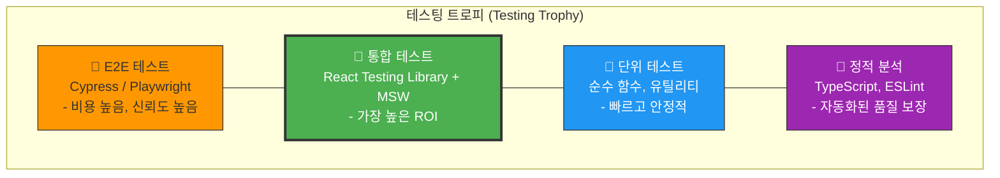
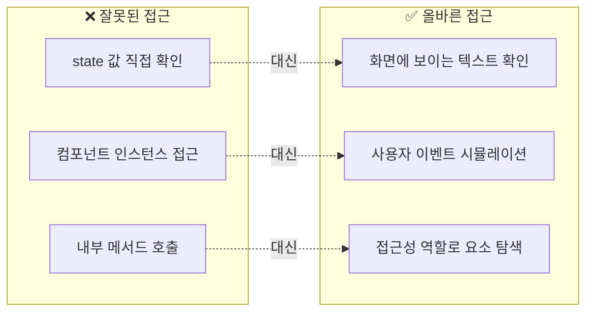
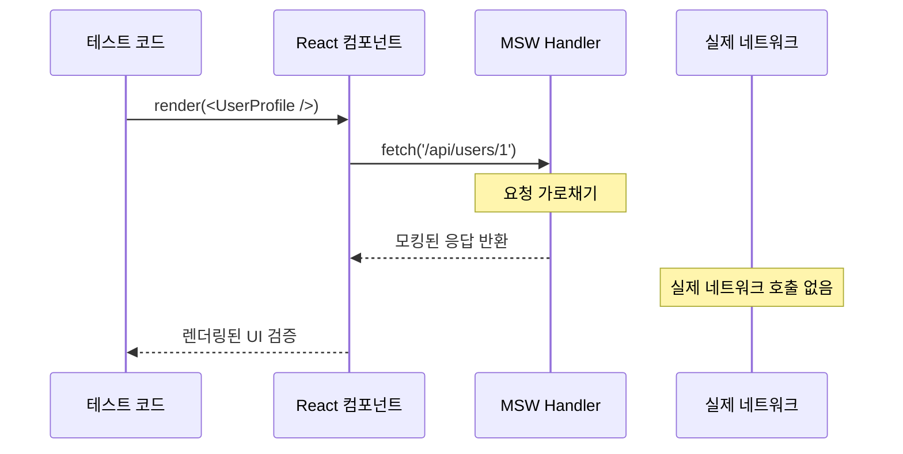
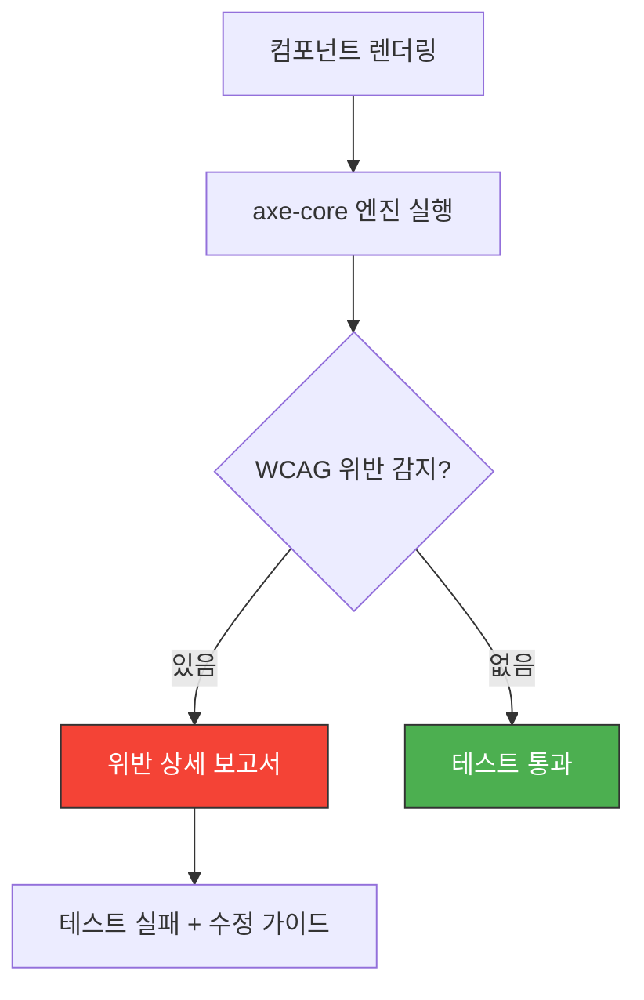
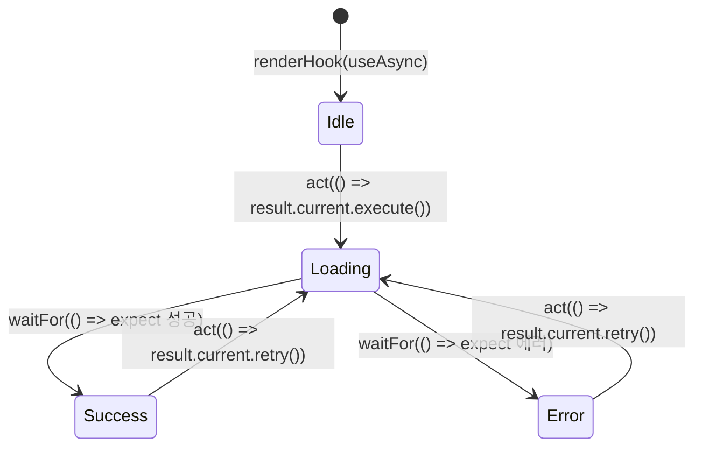

# 챕터 06: 테스팅 전략

> **난이도**: ⭐⭐⭐⭐ (4/5)
> **예상 학습 시간**: 6시간
> **선수 지식**: React 기본, TypeScript, 비동기 처리, API 통신 개념

---

## 학습 목표

이 챕터를 마치면 다음을 할 수 있습니다:

- React Testing Library의 철학을 이해하고 사용자 관점의 테스트를 작성할 수 있습니다.
- MSW(Mock Service Worker)를 활용하여 API 모킹 기반 통합 테스트를 구현할 수 있습니다.
- 테스트 피라미드 전략을 적용하여 효율적인 테스트 포트폴리오를 설계할 수 있습니다.
- 접근성(a11y) 테스트를 자동화하여 품질을 보장할 수 있습니다.
- 커스텀 훅과 비동기 로직에 대한 고급 테스트 패턴을 적용할 수 있습니다.

---

## 핵심 개념

### 1. 테스트 피라미드와 React 테스트 전략

전통적인 테스트 피라미드는 단위(Unit) → 통합(Integration) → E2E 순서로 테스트 비중을 가져갑니다. 그러나 React 생태계에서는 **테스팅 트로피(Testing Trophy)** 모델이 더 적합합니다. Kent C. Dodds가 제안한 이 모델은 **통합 테스트**에 가장 큰 비중을 둡니다.



**왜 통합 테스트가 핵심인가?**

- 단위 테스트만으로는 컴포넌트 간 상호작용을 검증할 수 없습니다.
- E2E 테스트는 느리고 불안정(flaky)합니다.
- 통합 테스트는 **사용자가 실제로 경험하는 동작**을 검증하면서도 빠릅니다.

### 2. React Testing Library의 핵심 철학

React Testing Library(이하 RTL)는 "구현 세부사항이 아닌 동작을 테스트하라"는 원칙을 따릅니다.



**쿼리 우선순위** (접근성 기반):

| 우선순위 | 쿼리 | 용도 |
|----------|-------|------|
| 1순위 | `getByRole` | 접근성 역할 기반 (button, heading 등) |
| 2순위 | `getByLabelText` | 폼 요소의 라벨 |
| 3순위 | `getByPlaceholderText` | 입력 필드 placeholder |
| 4순위 | `getByText` | 화면에 표시되는 텍스트 |
| 5순위 | `getByDisplayValue` | 입력 필드의 현재 값 |
| 6순위 | `getByAltText` | 이미지 alt 속성 |
| 7순위 | `getByTitle` | title 속성 |
| 최후수단 | `getByTestId` | data-testid (다른 방법이 없을 때만) |

### 3. MSW (Mock Service Worker)

MSW는 **서비스 워커 레벨**에서 네트워크 요청을 가로채는 API 모킹 도구입니다. fetch나 axios를 직접 모킹하는 것보다 훨씬 현실적인 테스트가 가능합니다.



**MSW의 장점:**

- 실제 HTTP 요청 흐름을 그대로 사용 (fetch/axios 코드 변경 불필요)
- 요청/응답 형태를 실제 API와 동일하게 유지
- 에러 시나리오, 지연 시나리오를 쉽게 시뮬레이션
- 브라우저와 Node.js 환경 모두 지원

### 4. 접근성(a11y) 테스트 자동화

접근성 테스트는 `jest-axe`(또는 `vitest-axe`)를 활용하여 WCAG 위반 사항을 자동으로 검출합니다.



### 5. 커스텀 훅 테스트

`renderHook`을 사용하면 커스텀 훅을 독립적으로 테스트할 수 있습니다. 비동기 훅의 경우 `waitFor`와 결합하여 상태 변화를 추적합니다.



---

## 코드로 이해하기

### 예제 1: RTL + MSW를 활용한 통합 테스트
> 📁 `practice/example-01.tsx` 파일을 참고하세요.

이 예제는 사용자 목록을 API에서 가져와 표시하는 컴포넌트와 그에 대한 통합 테스트를 보여줍니다.

```tsx
// 핵심 패턴: MSW 핸들러 설정
import { http, HttpResponse } from 'msw';

export const handlers = [
  http.get('/api/users', () => {
    return HttpResponse.json([
      { id: 1, name: '김철수', email: 'cs@test.com' },
      { id: 2, name: '이영희', email: 'yh@test.com' },
    ]);
  }),
];

// 핵심 패턴: 사용자 관점 테스트
test('사용자 목록을 로딩 후 표시한다', async () => {
  render(<UserList />);

  // 로딩 상태 확인
  expect(screen.getByRole('status')).toHaveTextContent('로딩 중...');

  // 데이터 로드 후 확인
  const users = await screen.findAllByRole('listitem');
  expect(users).toHaveLength(2);
  expect(screen.getByText('김철수')).toBeInTheDocument();
});
```

**실행 방법**:
```bash
# 프로젝트 초기화 (최초 1회)
npm create vite@latest testing-demo -- --template react-ts
cd testing-demo
npm install
npm install -D vitest @testing-library/react @testing-library/jest-dom @testing-library/user-event msw jsdom

# 테스트 실행
npx vitest run
```

### 예제 2: 커스텀 훅 테스트 + 접근성 테스트
> 📁 `practice/example-02.tsx` 파일을 참고하세요.

```tsx
// 핵심 패턴: renderHook으로 커스텀 훅 테스트
const { result } = renderHook(() => useDebounce('검색어', 300));

// 핵심 패턴: jest-axe로 접근성 자동 검사
const { container } = render(<SearchForm />);
const results = await axe(container);
expect(results).toHaveNoViolations();
```

**실행 방법**:
```bash
# 추가 의존성 설치
npm install -D vitest-axe

# 테스트 실행
npx vitest run --reporter=verbose
```

---

## 주의 사항

- ⚠️ **`getByTestId` 남용 금지**: `data-testid`는 최후의 수단입니다. 접근성 쿼리를 우선 사용하세요.
- ⚠️ **act 경고 무시 금지**: `act()` 관련 경고가 나타나면 비동기 업데이트가 올바르게 래핑되지 않은 것입니다. `waitFor`나 `findBy*`를 사용하세요.
- ⚠️ **fetch 직접 모킹 지양**: `jest.fn()`으로 fetch를 모킹하면 실제 HTTP 흐름을 테스트하지 못합니다. MSW를 사용하세요.
- 💡 **`screen.debug()`**: 테스트 디버깅 시 현재 DOM 상태를 콘솔에 출력합니다.
- 💡 **`logRoles()`**: 현재 DOM에서 사용 가능한 접근성 역할을 확인할 수 있습니다.
- 💡 **Testing Playground**: [testing-playground.com](https://testing-playground.com)에서 최적의 쿼리를 찾을 수 있습니다.

---

## 정리

| 개념 | 설명 | 예제 |
|------|------|------|
| 테스팅 트로피 | 통합 테스트 중심 전략 | RTL + MSW |
| RTL 쿼리 우선순위 | 접근성 기반 요소 탐색 | `getByRole('button')` |
| MSW | 서비스 워커 레벨 API 모킹 | `http.get('/api/users', handler)` |
| 접근성 테스트 | WCAG 자동 검증 | `expect(results).toHaveNoViolations()` |
| 커스텀 훅 테스트 | `renderHook`으로 독립 테스트 | `renderHook(() => useCustom())` |
| 비동기 테스트 | `waitFor` / `findBy*` 패턴 | `await screen.findByText('결과')` |

---

## 다음 단계

- ✅ `practice/exercise.md`의 연습 문제를 풀어보세요.
- 📖 다음 챕터: **챕터 07 - Server Components와 SSR**
- 🔗 참고 자료:
  - [React Testing Library 공식 문서](https://testing-library.com/docs/react-testing-library/intro/)
  - [MSW 공식 문서](https://mswjs.io/)
  - [Testing Trophy 블로그](https://kentcdodds.com/blog/the-testing-trophy-and-testing-classifications)
  - [jest-axe GitHub](https://github.com/nickcolley/jest-axe)
