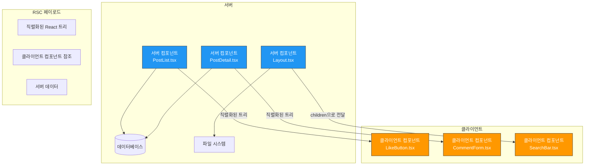
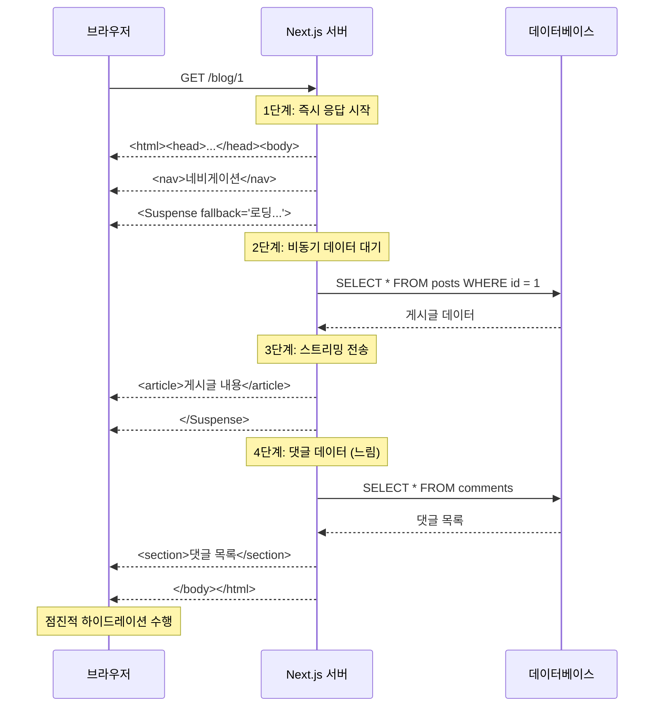
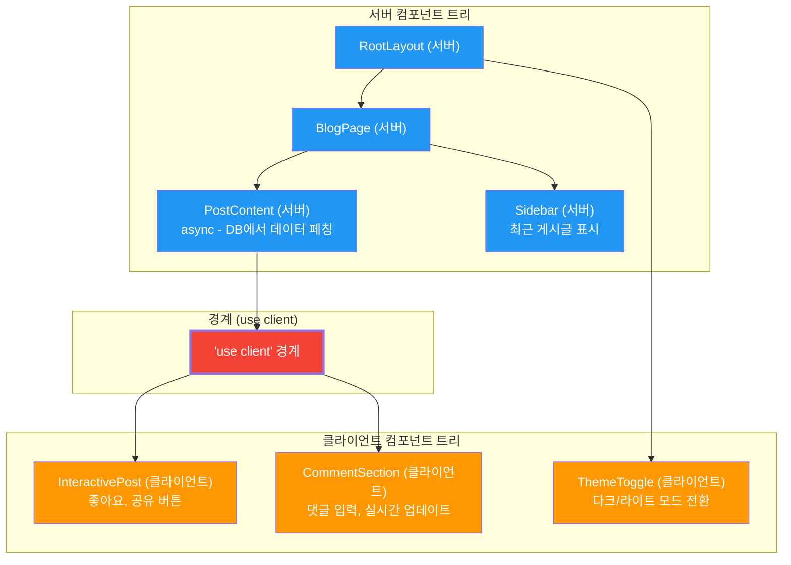
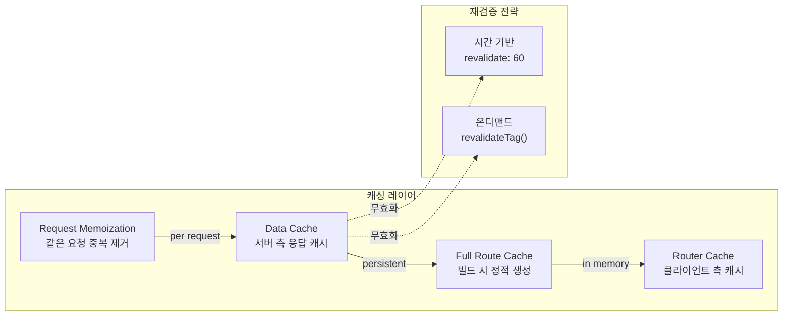
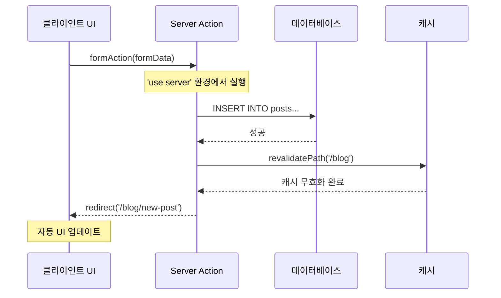

# 챕터 07: Server Components와 SSR

> **난이도**: ⭐⭐⭐⭐⭐ (5/5)
> **예상 학습 시간**: 8시간
> **선수 지식**: React 기본, Next.js 개념, 비동기 프로그래밍, 캐싱 전략

---

## 학습 목표

이 챕터를 마치면 다음을 할 수 있습니다:

- React Server Components(RSC)의 아키텍처와 렌더링 파이프라인을 이해할 수 있습니다.
- 서버 컴포넌트와 클라이언트 컴포넌트의 경계를 올바르게 설계할 수 있습니다.
- 스트리밍 SSR과 Suspense를 활용한 점진적 페이지 로딩을 구현할 수 있습니다.
- Next.js App Router 기반으로 데이터 페칭, 캐싱, 재검증 전략을 적용할 수 있습니다.
- 서버 액션(Server Actions)을 활용한 폼 처리와 뮤테이션을 구현할 수 있습니다.

---

## 핵심 개념

### 1. React Server Components(RSC) 아키텍처

RSC는 서버에서만 실행되는 컴포넌트입니다. 클라이언트로 JavaScript 번들을 전송하지 않으며, 데이터베이스나 파일 시스템에 직접 접근할 수 있습니다.



**RSC의 핵심 원칙:**

| 특성 | 서버 컴포넌트 | 클라이언트 컴포넌트 |
|------|--------------|-------------------|
| 실행 환경 | 서버만 | 서버 + 클라이언트 |
| JS 번들 | 포함 안 됨 | 포함됨 |
| `useState`/`useEffect` | 사용 불가 | 사용 가능 |
| 이벤트 핸들러 | 사용 불가 | 사용 가능 |
| DB/파일 직접 접근 | 가능 | 불가능 |
| `async/await` | 컴포넌트 레벨 가능 | 컴포넌트 레벨 불가 |
| 시리얼라이즈 | 가능해야 함 | 제약 없음 |

### 2. 스트리밍 SSR과 Suspense

전통적인 SSR은 전체 페이지를 한 번에 렌더링하여 응답합니다. 스트리밍 SSR은 **준비된 부분부터 점진적으로** 클라이언트에 전송합니다.



### 3. 서버/클라이언트 경계 설계

`'use client'` 지시어는 서버-클라이언트 경계를 정의합니다. 이 경계를 올바르게 설계하는 것이 RSC 아키텍처의 핵심입니다.



**경계 설계 원칙:**

1. **경계를 가능한 아래로 내려라**: 클라이언트 컴포넌트 영역을 최소화합니다.
2. **서버 컴포넌트를 클라이언트 컴포넌트의 children으로 전달하라**: Composition 패턴을 활용합니다.
3. **직렬화 가능한 props만 경계를 넘을 수 있다**: 함수, 클래스 인스턴스는 전달 불가합니다.

### 4. 데이터 페칭과 캐싱 전략

Next.js App Router에서의 데이터 페칭은 서버 컴포넌트 내에서 `async/await`로 직접 수행합니다.



### 5. Server Actions

Server Actions는 서버에서 실행되는 비동기 함수로, 폼 제출이나 데이터 뮤테이션에 사용됩니다.



---

## 코드로 이해하기

### 예제 1: Next.js App Router 기반 블로그 - 서버 컴포넌트
> 📁 `practice/example-01.tsx` 파일을 참고하세요.

```tsx
// app/blog/page.tsx - 서버 컴포넌트 (기본값)
export default async function BlogPage() {
  // 서버에서 직접 데이터 페칭 (DB, API 등)
  const posts = await fetchPosts();

  return (
    <main>
      <h1>블로그</h1>
      <Suspense fallback={<PostListSkeleton />}>
        <PostList posts={posts} />
      </Suspense>
    </main>
  );
}
```

**실행 방법**:
```bash
npx create-next-app@latest blog-demo --typescript --app --tailwind
cd blog-demo
npm run dev
```

### 예제 2: 클라이언트 컴포넌트와 Server Actions
> 📁 `practice/example-02.tsx` 파일을 참고하세요.

```tsx
// 서버 액션 정의
'use server';

export async function createPost(formData: FormData) {
  const title = formData.get('title') as string;
  await db.post.create({ data: { title } });
  revalidatePath('/blog');
  redirect('/blog');
}
```

**실행 방법**:
```bash
cd blog-demo
npm run dev
# http://localhost:3000/blog 에서 확인
```

---

## 주의 사항

- ⚠️ **서버 컴포넌트에서 hooks 사용 금지**: `useState`, `useEffect`, `useContext` 등은 클라이언트 컴포넌트에서만 사용 가능합니다.
- ⚠️ **'use client'는 전파된다**: 클라이언트 컴포넌트가 import하는 모든 모듈도 클라이언트 번들에 포함됩니다.
- ⚠️ **서버 컴포넌트에서 함수를 props로 전달 불가**: 직렬화할 수 없는 값은 서버→클라이언트 경계를 넘을 수 없습니다.
- 💡 **Composition 패턴 활용**: 서버 컴포넌트를 클라이언트 컴포넌트의 `children`으로 전달하면 서버에서 렌더링된 결과가 전달됩니다.
- 💡 **`loading.tsx` 활용**: 파일 기반 라우팅에서 자동으로 Suspense boundary를 생성합니다.
- 💡 **`error.tsx` 활용**: Error Boundary를 파일 레벨에서 자동 설정합니다. 반드시 `'use client'`로 선언해야 합니다.

---

## 정리

| 개념 | 설명 | 예제 |
|------|------|------|
| RSC | 서버에서만 실행되는 컴포넌트 | `async function Page()` |
| 'use client' | 서버-클라이언트 경계 선언 | 상호작용이 필요한 컴포넌트 |
| 스트리밍 SSR | 점진적 HTML 전송 | `<Suspense fallback>` |
| Server Actions | 서버 측 뮤테이션 함수 | `'use server'` + `formAction` |
| 데이터 캐싱 | 다층 캐시 전략 | `fetch(url, { next: { revalidate: 60 } })` |
| 재검증 | 캐시 무효화 | `revalidatePath()`, `revalidateTag()` |

---

## 다음 단계

- ✅ `practice/exercise.md`의 연습 문제를 풀어보세요.
- 📖 다음 챕터: **챕터 08 - 설계 패턴과 아키텍처**
- 🔗 참고 자료:
  - [Next.js App Router 공식 문서](https://nextjs.org/docs/app)
  - [React Server Components RFC](https://github.com/reactjs/rfcs/blob/main/text/0188-server-components.md)
  - [Server Actions 문서](https://nextjs.org/docs/app/building-your-application/data-fetching/server-actions-and-mutations)
  - [데이터 캐싱 전략](https://nextjs.org/docs/app/building-your-application/caching)
