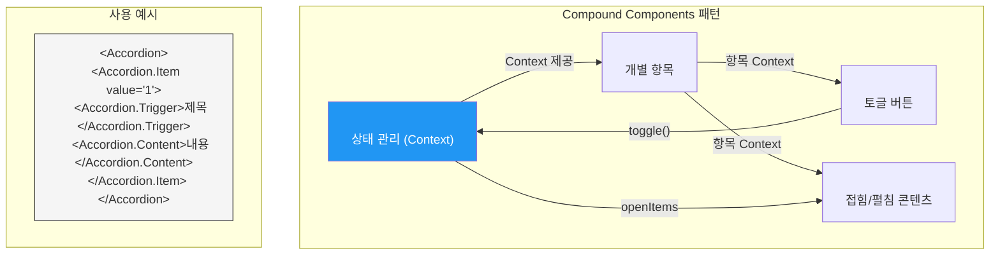
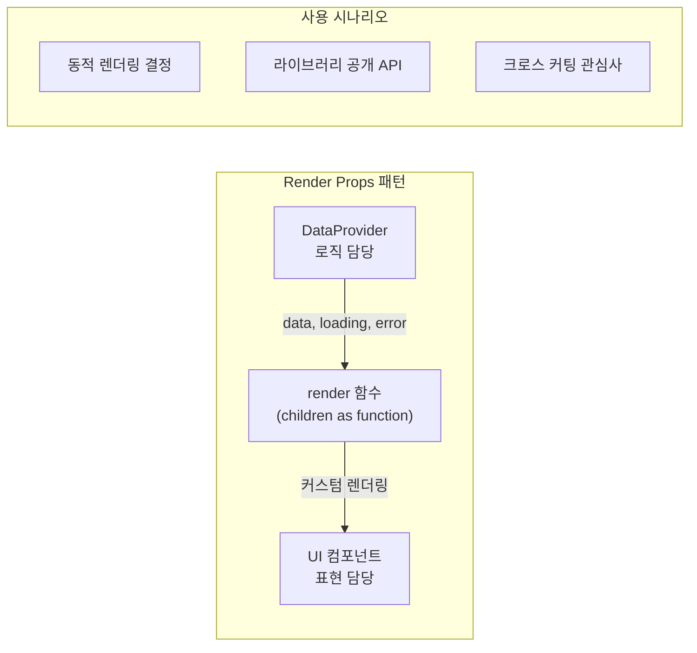
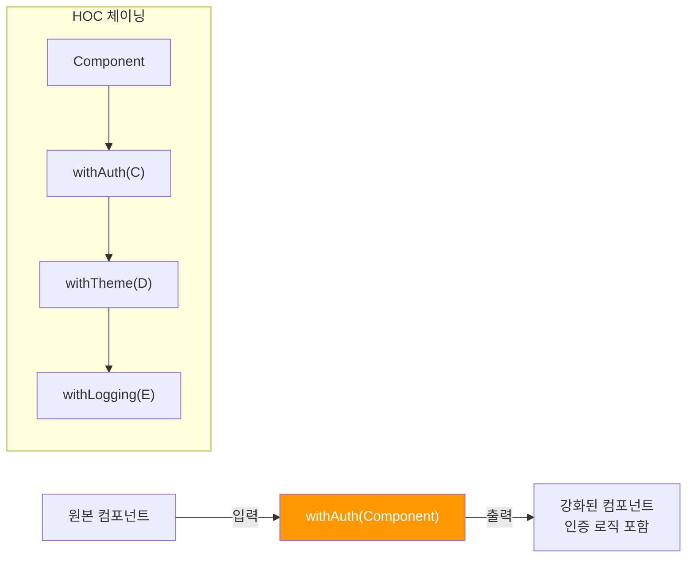
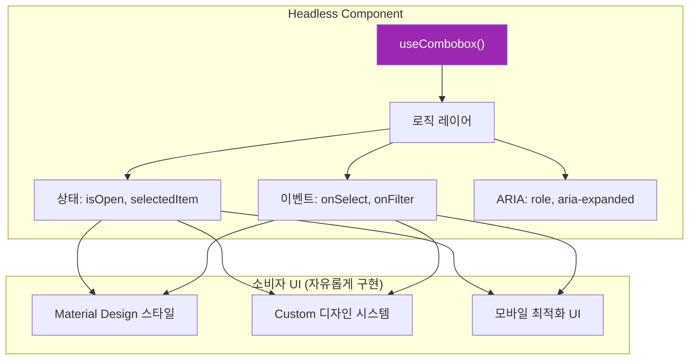
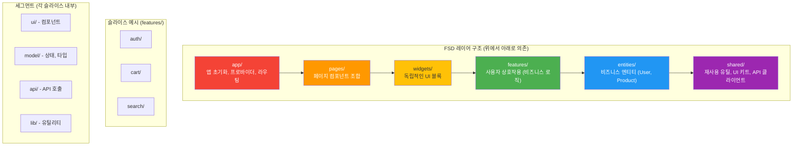

# 챕터 08: 설계 패턴과 아키텍처

> **난이도**: ⭐⭐⭐⭐⭐ (5/5)
> **예상 학습 시간**: 8시간
> **선수 지식**: React 고급 패턴, TypeScript 제네릭, 컴포넌트 합성

---

## 학습 목표

이 챕터를 마치면 다음을 할 수 있습니다:

- Compound Components 패턴으로 유연하고 선언적인 API를 설계할 수 있습니다.
- Render Props와 HOC 패턴의 적절한 사용 시나리오를 구분할 수 있습니다.
- Headless Component 패턴으로 로직과 UI를 완전히 분리할 수 있습니다.
- Feature-Sliced Design(FSD) 아키텍처로 대규모 프로젝트를 구조화할 수 있습니다.
- 확장 가능하고 타입 안전한 컴포넌트 라이브러리를 설계할 수 있습니다.

---

## 핵심 개념

### 1. Compound Components 패턴

Compound Components는 여러 컴포넌트가 **암묵적인 상태를 공유**하면서 함께 동작하는 패턴입니다. HTML의 `<select>`와 `<option>` 관계와 유사합니다.



**장점:**
- 선언적이고 직관적인 API
- 내부 구현이 캡슐화됨
- 컴포넌트 순서와 조합이 자유로움
- 관심사 분리가 명확함

### 2. Render Props 패턴

Render Props는 컴포넌트의 **렌더링 로직을 외부에서 주입**하는 패턴입니다. 훅이 등장하기 전에 가장 널리 사용되었으며, 현재도 특정 시나리오에서 유효합니다.



**언제 사용하는가?**
- 훅으로 해결하기 어려운 **조건부 렌더링** 로직
- 라이브러리에서 **최대한 유연한 API** 제공
- 여러 컴포넌트 간 **렌더링 위임**

### 3. Higher-Order Components (HOC)

HOC는 컴포넌트를 입력으로 받아 **새로운 컴포넌트를 반환**하는 함수입니다.



**현대적 사용처:**
- 인증/인가 가드
- 에러 바운더리 래핑
- 분석(Analytics) 추적
- 레이아웃 래핑

### 4. Headless Component 패턴

Headless Component는 **로직만 제공하고 UI는 소비자에게 맡기는** 패턴입니다. Radix UI, Headless UI, TanStack Table 등이 이 패턴을 사용합니다.



### 5. Feature-Sliced Design (FSD)

FSD는 대규모 프론트엔드 프로젝트를 위한 아키텍처 방법론입니다. **레이어(Layer)**, **슬라이스(Slice)**, **세그먼트(Segment)** 세 가지 축으로 코드를 구조화합니다.



**FSD 핵심 규칙:**

1. **단방향 의존성**: 상위 레이어만 하위 레이어를 참조할 수 있습니다.
2. **슬라이스 격리**: 같은 레이어의 슬라이스끼리는 직접 참조할 수 없습니다.
3. **공개 API**: 각 슬라이스는 `index.ts`를 통해서만 외부에 노출합니다.

---

## 코드로 이해하기

### 예제 1: Compound Components - 아코디언 컴포넌트
> 📁 `practice/example-01.tsx` 파일을 참고하세요.

```tsx
// 선언적이고 유연한 API
<Accordion type="single" defaultValue="item-1">
  <Accordion.Item value="item-1">
    <Accordion.Trigger>React란?</Accordion.Trigger>
    <Accordion.Content>
      UI를 구축하기 위한 JavaScript 라이브러리입니다.
    </Accordion.Content>
  </Accordion.Item>
</Accordion>
```

**실행 방법**:
```bash
npm create vite@latest patterns-demo -- --template react-ts
cd patterns-demo
npm install
npm run dev
```

### 예제 2: Headless Component + HOC 패턴
> 📁 `practice/example-02.tsx` 파일을 참고하세요.

```tsx
// Headless 훅 사용
const { isOpen, selectedItem, getToggleProps, getMenuProps } = useSelect({
  items: options,
  onSelect: handleSelect,
});

// HOC로 인증 가드 적용
const ProtectedDashboard = withAuth(DashboardPage, { requiredRole: 'admin' });
```

**실행 방법**:
```bash
cd patterns-demo
npm run dev
```

---

## 주의 사항

- ⚠️ **과도한 추상화 주의**: 패턴을 적용하기 전에 실제로 필요한지 판단하세요. YAGNI(You Aren't Gonna Need It) 원칙을 기억하세요.
- ⚠️ **HOC 남용 금지**: HOC를 3개 이상 중첩하면 디버깅이 매우 어려워집니다. 대부분 훅으로 대체 가능합니다.
- ⚠️ **FSD는 팀 합의가 필수**: 아키텍처 패턴은 팀 전체가 이해하고 합의해야 효과가 있습니다.
- 💡 **Compound Components는 Context가 핵심**: 암묵적 상태 공유를 위해 React Context를 활용합니다.
- 💡 **Headless 패턴은 라이브러리에 최적**: 다양한 디자인 시스템에서 재사용할 컴포넌트에 적합합니다.
- 💡 **패턴 선택 기준**: 단순함 > 가독성 > 유연성 > 성능 순서로 우선순위를 두세요.

---

## 정리

| 패턴 | 핵심 아이디어 | 사용 시나리오 |
|------|-------------|-------------|
| Compound Components | 암묵적 상태 공유 | Accordion, Tabs, Select |
| Render Props | 렌더링 위임 | 동적 UI, 라이브러리 API |
| HOC | 컴포넌트 강화 | 인증, 로깅, 테마 |
| Headless Component | 로직/UI 분리 | 디자인 시스템 독립 컴포넌트 |
| FSD | 레이어 기반 아키텍처 | 대규모 프로젝트 구조화 |

---

## 다음 단계

- ✅ `practice/exercise.md`의 연습 문제를 풀어보세요.
- 📖 다음 챕터: **챕터 09 - 빌드와 배포 파이프라인**
- 🔗 참고 자료:
  - [React 공식 문서 - 고급 패턴](https://react.dev/learn/passing-data-deeply-with-context)
  - [Radix UI (Compound Components)](https://www.radix-ui.com/)
  - [Headless UI](https://headlessui.com/)
  - [Feature-Sliced Design](https://feature-sliced.design/)
  - [Patterns.dev](https://www.patterns.dev/)
