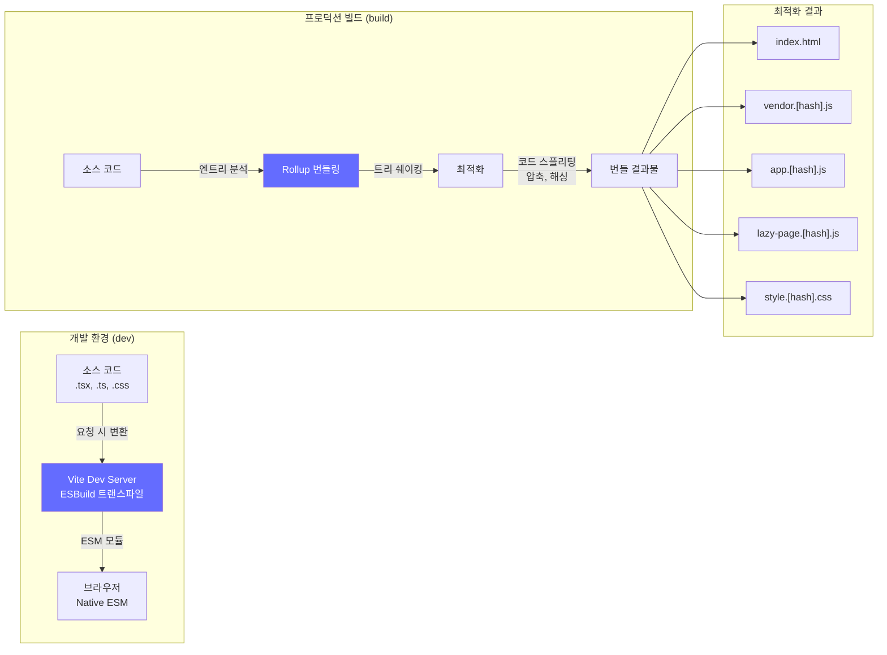
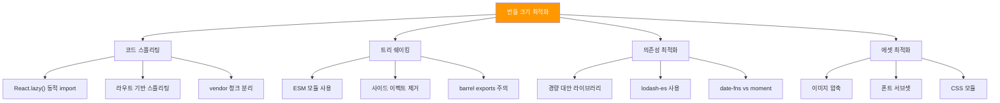
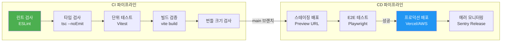
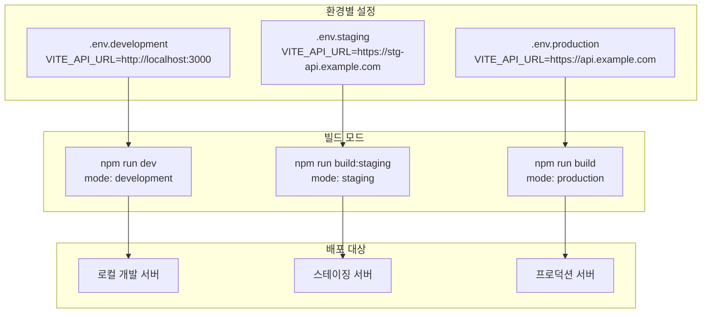
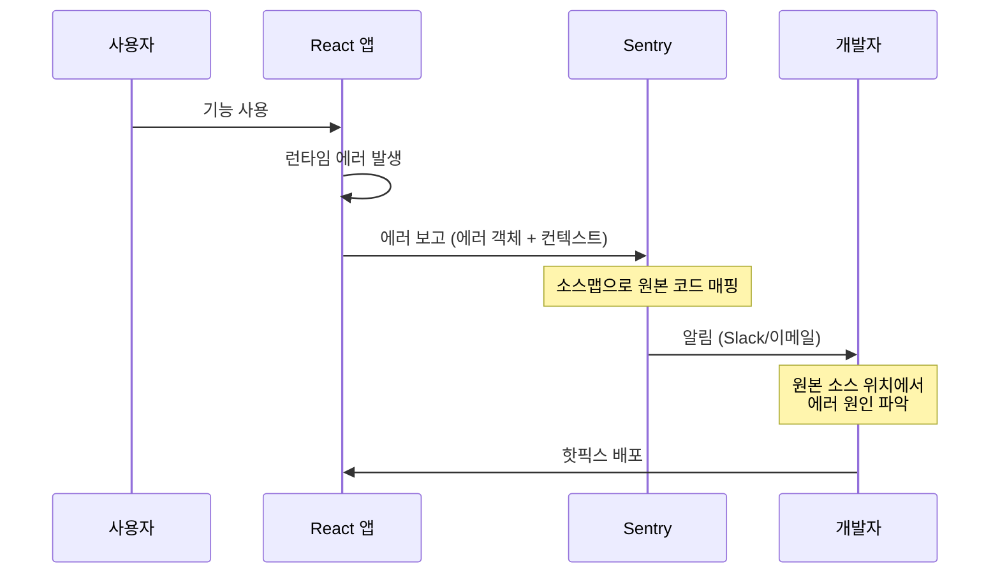

# 챕터 09: 빌드와 배포 파이프라인

> **난이도**: ⭐⭐⭐⭐ (4/5)
> **예상 학습 시간**: 6시간
> **선수 지식**: React 프로젝트 구조, 기본 CLI 명령어, Git 기본, YAML 문법

---

## 학습 목표

이 챕터를 마치면 다음을 할 수 있습니다:

- Vite의 빌드 시스템을 깊이 이해하고 최적화 설정을 적용할 수 있습니다.
- 번들 크기를 분석하고 코드 스플리팅, 트리 쉐이킹 전략을 적용할 수 있습니다.
- GitHub Actions로 CI/CD 파이프라인을 구축할 수 있습니다.
- 환경 변수 관리, 스테이징/프로덕션 배포 전략을 설계할 수 있습니다.
- Sentry 등을 활용한 에러 모니터링 시스템을 구축할 수 있습니다.

---

## 핵심 개념

### 1. Vite 빌드 시스템 이해

Vite는 개발 시 **ESM 기반 HMR**(Hot Module Replacement)로 즉각적인 피드백을 제공하고, 프로덕션 빌드 시 **Rollup**을 사용하여 최적화된 번들을 생성합니다.



**Vite 핵심 설정:**

| 설정 | 용도 | 기본값 |
|------|------|--------|
| `build.target` | 빌드 타겟 브라우저 | `modules` |
| `build.outDir` | 출력 디렉토리 | `dist` |
| `build.rollupOptions` | Rollup 고급 설정 | - |
| `build.chunkSizeWarningLimit` | 청크 크기 경고 한도 | 500kB |
| `build.sourcemap` | 소스맵 생성 | `false` |
| `build.minify` | 압축 도구 | `esbuild` |

### 2. 번들 크기 최적화 전략



### 3. GitHub Actions CI/CD 파이프라인



### 4. 환경 변수와 멀티 스테이지 배포



### 5. 에러 모니터링과 소스맵



---

## 코드로 이해하기

### 예제 1: Vite 최적화 설정 + 번들 분석
> 📁 `practice/example-01.tsx` 파일을 참고하세요.

```tsx
// vite.config.ts - 프로덕션 최적화 설정
export default defineConfig({
  build: {
    rollupOptions: {
      output: {
        manualChunks: {
          vendor: ['react', 'react-dom'],
          router: ['react-router-dom'],
          ui: ['@radix-ui/react-dialog'],
        },
      },
    },
  },
});
```

**실행 방법**:
```bash
npm create vite@latest deploy-demo -- --template react-ts
cd deploy-demo
npm install
npm install -D rollup-plugin-visualizer
npm run build
```

### 예제 2: GitHub Actions CI/CD 워크플로우
> 📁 `practice/example-02.tsx` 파일을 참고하세요.

```yaml
# .github/workflows/ci.yml
name: CI/CD Pipeline
on:
  push:
    branches: [main]
  pull_request:
    branches: [main]
```

**실행 방법**:
```bash
# GitHub 저장소에 push하면 자동으로 실행됩니다
git add .github/workflows/ci.yml
git commit -m "ci: add CI/CD pipeline"
git push origin main
```

---

## 주의 사항

- ⚠️ **소스맵을 프로덕션에 노출하지 마세요**: Sentry 등 모니터링 서비스에만 업로드하세요.
- ⚠️ **환경 변수에 비밀 키를 넣지 마세요**: `VITE_` 접두사가 붙은 변수는 클라이언트 번들에 포함됩니다.
- ⚠️ **번들 크기를 정기적으로 모니터링하세요**: CI에서 자동으로 검사하는 것이 가장 좋습니다.
- 💡 **`npm run build -- --mode staging`**: Vite에서 커스텀 모드를 사용하여 스테이징 빌드를 할 수 있습니다.
- 💡 **`rollup-plugin-visualizer`**: 번들 구성을 시각적으로 분석할 수 있습니다.
- 💡 **`vite-plugin-compression`**: gzip/brotli 압축 파일을 미리 생성할 수 있습니다.

---

## 정리

| 개념 | 설명 | 도구 |
|------|------|------|
| Vite 빌드 | ESBuild + Rollup 기반 빌드 | `vite build` |
| 코드 스플리팅 | 청크 단위 분리 로딩 | `React.lazy()`, `manualChunks` |
| 번들 분석 | 번들 구성 시각화 | `rollup-plugin-visualizer` |
| CI/CD | 자동화된 빌드/배포 | GitHub Actions |
| 환경 변수 | 환경별 설정 분리 | `.env.*` 파일, Vite 모드 |
| 에러 모니터링 | 프로덕션 에러 추적 | Sentry |

---

## 다음 단계

- ✅ `practice/exercise.md`의 연습 문제를 풀어보세요.
- 📖 다음 챕터: **챕터 10 - 엔터프라이즈 프로젝트: 관리자 대시보드**
- 🔗 참고 자료:
  - [Vite 공식 문서](https://vitejs.dev/)
  - [Rollup 공식 문서](https://rollupjs.org/)
  - [GitHub Actions 문서](https://docs.github.com/en/actions)
  - [Sentry React 문서](https://docs.sentry.io/platforms/javascript/guides/react/)
  - [번들 포비아](https://bundlephobia.com/)
