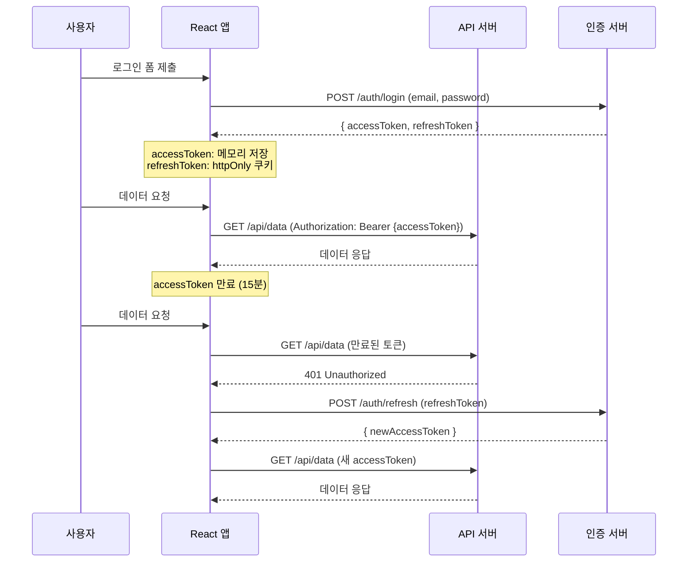
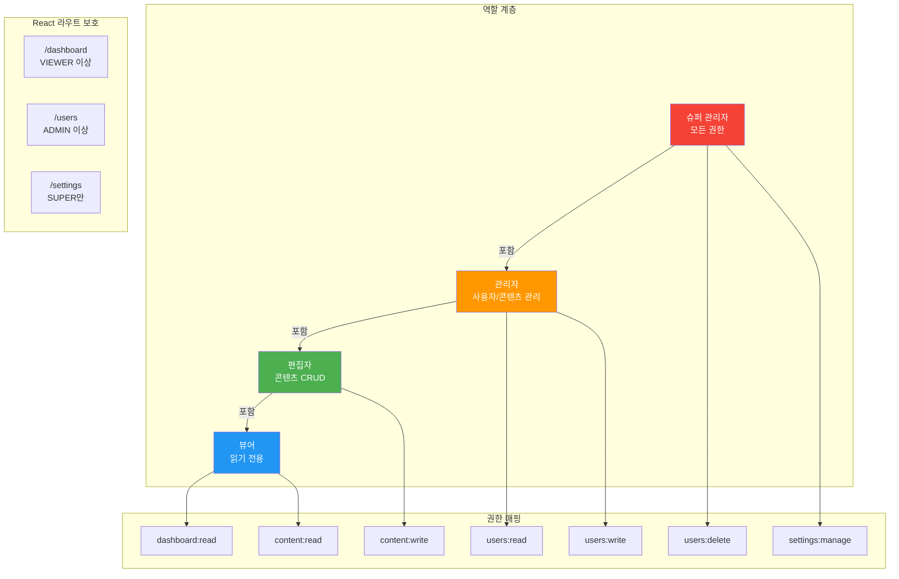
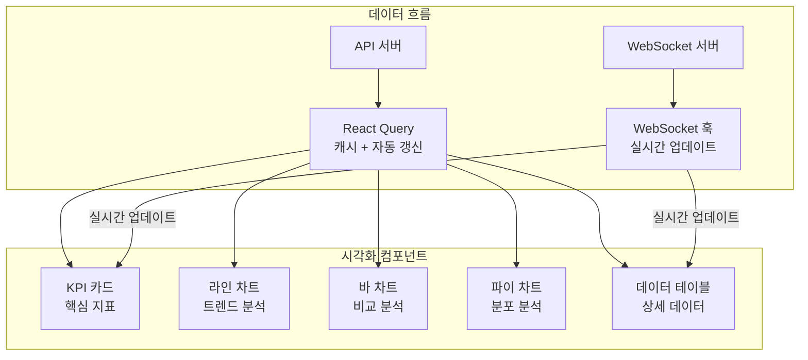
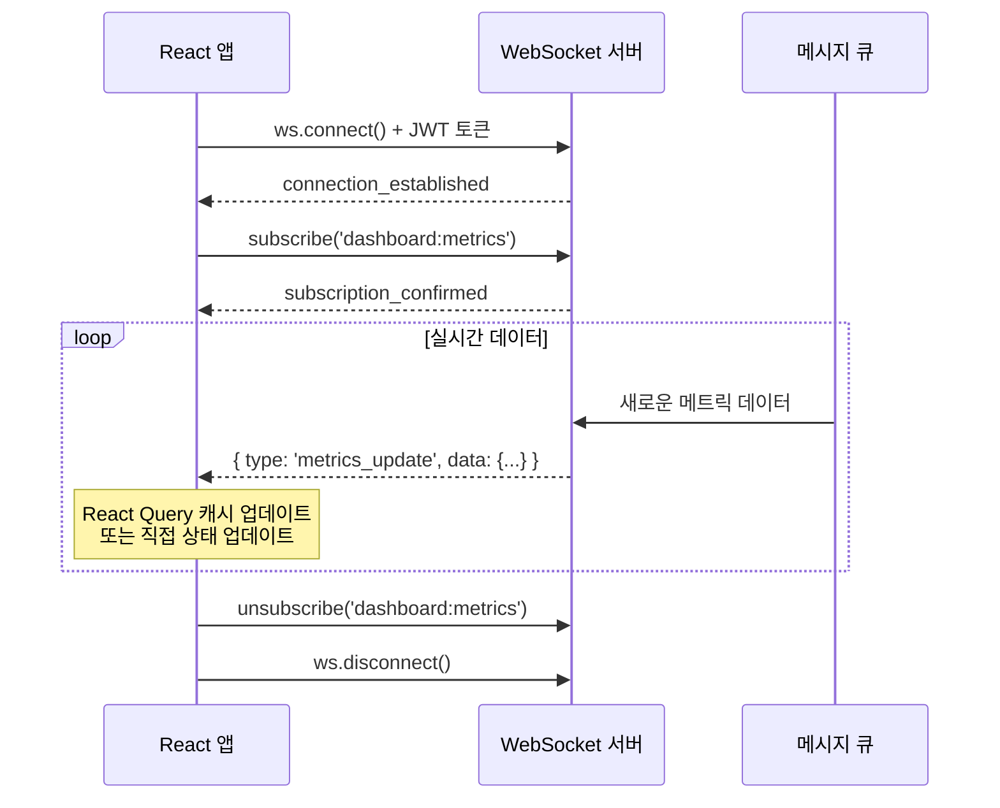
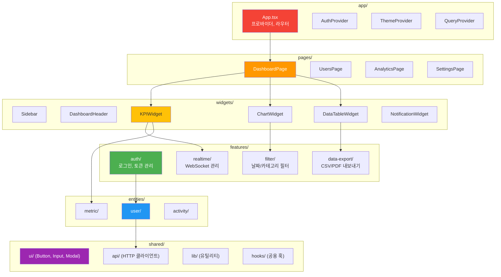

# 챕터 10: 엔터프라이즈 프로젝트 - 관리자 대시보드

> **난이도**: ⭐⭐⭐⭐⭐ (5/5)
> **예상 학습 시간**: 12시간
> **선수 지식**: 챕터 01~09의 모든 개념, REST API, WebSocket 기본

---

## 학습 목표

이 챕터를 마치면 다음을 할 수 있습니다:

- JWT 기반 인증/인가 시스템을 설계하고 구현할 수 있습니다.
- 역할 기반 접근 제어(RBAC)를 React 라우터와 통합할 수 있습니다.
- 대시보드 레이아웃에서 차트와 데이터 시각화를 구현할 수 있습니다.
- WebSocket을 활용한 실시간 데이터 업데이트를 구현할 수 있습니다.
- Feature-Sliced Design 기반으로 확장 가능한 대시보드 아키텍처를 설계할 수 있습니다.

---

## 핵심 개념

### 1. 인증/인가 시스템 아키텍처

JWT(JSON Web Token) 기반 인증은 엔터프라이즈 SPA에서 가장 널리 사용되는 패턴입니다. Access Token과 Refresh Token을 활용하여 보안과 사용자 경험을 모두 확보합니다.



**보안 원칙:**

| 토큰 | 저장 위치 | 만료 시간 | 용도 |
|------|----------|----------|------|
| Access Token | 메모리 (변수) | 15분 | API 요청 인증 |
| Refresh Token | httpOnly 쿠키 | 7일 | Access Token 갱신 |
| CSRF Token | 커스텀 헤더 | 세션 | CSRF 공격 방지 |

### 2. 역할 기반 접근 제어 (RBAC)



### 3. 대시보드 데이터 시각화



### 4. 실시간 업데이트 (WebSocket)



### 5. 확장 가능한 대시보드 아키텍처



---

## 코드로 이해하기

### 예제 1: 인증 시스템 + RBAC + 대시보드 레이아웃
> 📁 `practice/example-01.tsx` 파일을 참고하세요.

```tsx
// 핵심: 인증 상태 관리
const { user, login, logout, isAuthenticated } = useAuth();

// 핵심: 역할 기반 라우트 보호
<ProtectedRoute requiredPermission="dashboard:read">
  <DashboardPage />
</ProtectedRoute>
```

**실행 방법**:
```bash
npm create vite@latest admin-dashboard -- --template react-ts
cd admin-dashboard
npm install react-router-dom @tanstack/react-query zustand
npm install recharts date-fns
npm run dev
```

### 예제 2: 실시간 대시보드 + 데이터 시각화
> 📁 `practice/example-02.tsx` 파일을 참고하세요.

```tsx
// 핵심: WebSocket 훅
const { data, isConnected } = useWebSocket('ws://api/metrics', {
  onMessage: (data) => queryClient.setQueryData(['metrics'], data),
});

// 핵심: KPI 카드 + 실시간 업데이트
<KPICard title="활성 사용자" value={metrics.activeUsers} trend={+12.5} />
```

**실행 방법**:
```bash
cd admin-dashboard
npm run dev
# http://localhost:5173 에서 확인
```

---

## 주의 사항

- ⚠️ **Access Token을 localStorage에 저장하지 마세요**: XSS 공격에 취약합니다. 메모리(변수)에 저장하세요.
- ⚠️ **Refresh Token은 httpOnly 쿠키에 저장하세요**: JavaScript로 접근 불가능한 쿠키를 사용합니다.
- ⚠️ **권한 검사를 프론트엔드에만 의존하지 마세요**: 클라이언트 측 검사는 UX 목적이며, 실제 보안은 서버에서 수행해야 합니다.
- ⚠️ **WebSocket 재연결 로직을 반드시 구현하세요**: 네트워크 불안정 환경을 고려해야 합니다.
- 💡 **React Query와 WebSocket 결합**: WebSocket 메시지로 React Query 캐시를 직접 업데이트하면 일관된 데이터 흐름을 유지할 수 있습니다.
- 💡 **차트 라이브러리 lazy loading**: 차트 컴포넌트는 크기가 크므로 `React.lazy()`로 동적 로딩하세요.
- 💡 **대시보드 상태 URL 동기화**: 필터, 날짜 범위 등의 상태를 URL 파라미터로 관리하면 공유 가능한 대시보드를 만들 수 있습니다.

---

## 정리

| 개념 | 설명 | 구현 |
|------|------|------|
| JWT 인증 | Access/Refresh Token 기반 | `useAuth()` 훅 |
| RBAC | 역할 기반 접근 제어 | `ProtectedRoute`, `usePermission()` |
| 데이터 시각화 | 차트, KPI, 테이블 | Recharts, 커스텀 KPI 카드 |
| 실시간 업데이트 | WebSocket 기반 | `useWebSocket()` 훅 |
| 확장 아키텍처 | FSD 기반 구조화 | 레이어별 관심사 분리 |

---

## 다음 단계

- ✅ `practice/exercise.md`의 연습 문제를 풀어보세요.
- 📖 이 챕터는 **Expert 시리즈의 최종 챕터**입니다.
- 🔗 참고 자료:
  - [Recharts 공식 문서](https://recharts.org/)
  - [React Query 공식 문서](https://tanstack.com/query/)
  - [JWT 보안 모범 사례](https://auth0.com/docs/secure/tokens/json-web-tokens)
  - [OWASP 인증 가이드](https://cheatsheetseries.owasp.org/cheatsheets/Authentication_Cheat_Sheet.html)
  - [WebSocket API](https://developer.mozilla.org/ko/docs/Web/API/WebSocket)

---

## 축하합니다!

Expert 레벨 10개 챕터를 모두 마쳤습니다. 이 과정을 통해 다음 역량을 갖추게 되었습니다:

1. **React 내부 동작** 이해 (가상 DOM, 재조정 알고리즘)
2. **고급 훅 패턴** 활용 (커스텀 훅, 최적화 훅)
3. **성능 최적화** 전략 (메모이제이션, 가상화, 코드 스플리팅)
4. **상태 관리 아키텍처** 설계 (Zustand, React Query, 전역/서버 상태)
5. **TypeScript 고급 활용** (제네릭, 조건부 타입, 유틸리티 타입)
6. **테스팅 전략** 수립 (RTL, MSW, 접근성 테스트)
7. **Server Components와 SSR** 구현 (RSC, 스트리밍, Server Actions)
8. **설계 패턴과 아키텍처** 적용 (Compound, Headless, FSD)
9. **빌드와 배포 파이프라인** 구축 (Vite, GitHub Actions, 모니터링)
10. **엔터프라이즈 프로젝트** 완성 (인증, 시각화, 실시간, 확장 아키텍처)
