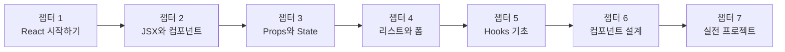

# React 학습 커리큘럼 (Normal)

> **대상**: JavaScript 기초를 마친 프론트엔드 입문자
> **난이도**: 1-3/5
> **학습 목적**: React의 핵심 개념을 이해하고 간단한 웹 애플리케이션을 만들 수 있다

> ⚠️ **선행 학습**: `javascript-normal/` 디렉토리의 JavaScript 기초 자료를 먼저 완료하세요.

---

## 학습 로드맵

---

## 커리큘럼 개요

| 챕터 | 제목 | 난이도 | 핵심 키워드 |
|------|------|--------|------------|
| 01 | React 시작하기 | ⭐ | React 소개, 개발 환경, Vite |
| 02 | JSX와 컴포넌트 | ⭐ | JSX 문법, 함수 컴포넌트 |
| 03 | Props와 State | ⭐⭐ | props, useState, 이벤트 |
| 04 | 리스트와 폼 | ⭐⭐ | map, key, 폼 입력 |
| 05 | Hooks 기초 | ⭐⭐ | useEffect, useRef |
| 06 | 컴포넌트 설계 패턴 | ⭐⭐⭐ | 컴포넌트 분리, 커스텀 Hook |
| 07 | 실전 프로젝트 | ⭐⭐⭐ | API 연동, Todo 앱 |

---

## 챕터 상세

### 챕터 01: React 시작하기
- **학습 목표**: React가 무엇인지 이해하고 개발 환경을 설정할 수 있다
- **핵심 개념**: 선언적 UI, 컴포넌트 기반 아키텍처, Virtual DOM
- **섹션 구성**:
  - sec01-what-is-react: React 소개와 핵심 철학
  - sec02-dev-setup: Vite로 프로젝트 생성 및 구조 이해
- **연습 문제**: 섹션별 1세트

### 챕터 02: JSX와 컴포넌트
- **학습 목표**: JSX 문법을 사용하여 React 컴포넌트를 작성할 수 있다
- **핵심 개념**: JSX 표현식, 조건부 렌더링, 컴포넌트 작성
- **섹션 구성**:
  - sec01-jsx: JSX 문법 이해
  - sec02-components: 함수 컴포넌트 만들기
- **연습 문제**: 섹션별 1세트

### 챕터 03: Props와 State
- **학습 목표**: 컴포넌트 간 데이터를 전달하고 상태를 관리할 수 있다
- **핵심 개념**: props 전달, useState, 이벤트 핸들링
- **섹션 구성**:
  - sec01-props: Props로 데이터 전달
  - sec02-state-events: State와 이벤트 처리
- **연습 문제**: 섹션별 1세트

### 챕터 04: 리스트와 폼
- **학습 목표**: 리스트를 렌더링하고 사용자 입력을 처리할 수 있다
- **핵심 개념**: map으로 리스트 렌더링, key, 제어 컴포넌트
- **섹션 구성**:
  - sec01-list-rendering: 리스트 렌더링과 key
  - sec02-form-handling: 폼 입력 처리
- **연습 문제**: 섹션별 1세트

### 챕터 05: Hooks 기초
- **학습 목표**: useEffect와 useRef를 이해하고 사용할 수 있다
- **핵심 개념**: 사이드 이펙트, 의존성 배열, DOM 참조
- **섹션 구성**:
  - sec01-useeffect: useEffect로 사이드 이펙트 관리
  - sec02-useref-other-hooks: useRef와 기타 Hooks
- **연습 문제**: 섹션별 1세트

### 챕터 06: 컴포넌트 설계 패턴
- **학습 목표**: 컴포넌트를 적절히 분리하고 커스텀 Hook을 만들 수 있다
- **핵심 개념**: 컴포넌트 합성, children, 커스텀 Hook
- **섹션 구성**:
  - sec01-component-composition: 컴포넌트 분리와 합성
  - sec02-custom-hooks: 커스텀 Hook 만들기
- **연습 문제**: 섹션별 1세트

### 챕터 07: 실전 프로젝트
- **학습 목표**: API를 연동하고 완전한 Todo 앱을 만들 수 있다
- **핵심 개념**: fetch, 로딩/에러 상태, CRUD
- **섹션 구성**:
  - sec01-api-integration: API 연동
  - sec02-todo-app: Todo 앱 만들기
- **연습 문제**: 섹션별 1세트

---

## 학습 방법 안내

1. 각 섹션의 `concept.md`를 먼저 읽습니다.
2. 코드 예제를 직접 실행해봅니다.
3. `exercise.md`의 문제를 읽고, `exercise.jsx`를 완성합니다.
4. 막히면 `solution.jsx`를 참고합니다.
5. `resources/glossary.md`에서 용어를 확인합니다.

---

## 참고 자료

- 공식 문서: [React 공식 문서](https://react.dev/)
- 추가 학습 자료: `resources/references.md` 참조
- 용어 사전: `resources/glossary.md` 참조
