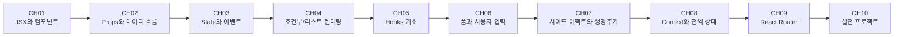

# React 학습 커리큘럼 (Normal - 초중급)

> **대상**: React를 처음 시작하거나 기본기를 다지고 싶은 프론트엔드 개발자
> **난이도**: ⭐ ~ ⭐⭐⭐ (1-3/5)
> **학습 목적**: 업무에서 React를 활용하기 위한 실무 기초 역량 확보

---

## 학습 로드맵

---

## 커리큘럼 개요

| 챕터 | 제목 | 난이도 | 핵심 키워드 |
|------|------|--------|------------|
| 01 | JSX와 컴포넌트 | ⭐ | JSX, 함수형 컴포넌트, 중첩 |
| 02 | Props와 데이터 흐름 | ⭐ | props, children, 단방향 데이터 흐름 |
| 03 | State와 이벤트 | ⭐⭐ | useState, 이벤트 핸들링, 리렌더링 |
| 04 | 조건부/리스트 렌더링 | ⭐⭐ | 조건부 렌더링, map, key |
| 05 | Hooks 기초 | ⭐⭐ | useEffect, useRef, 커스텀 Hook |
| 06 | 폼과 사용자 입력 | ⭐⭐ | 제어 컴포넌트, 비제어 컴포넌트, 유효성 검사 |
| 07 | 사이드 이펙트와 생명주기 | ⭐⭐ | useEffect 심화, 클린업, 의존성 배열 |
| 08 | Context와 전역 상태 | ⭐⭐⭐ | useContext, Context API, props drilling 해결 |
| 09 | React Router를 이용한 라우팅 | ⭐⭐⭐ | 라우팅, 중첩 라우트, 동적 경로 |
| 10 | 실전 프로젝트: 할 일 관리 앱 | ⭐⭐⭐ | CRUD, 종합 실습, 상태 관리 통합 |

---

## 챕터 상세

### 📖 챕터 01: JSX와 컴포넌트
- **학습 목표**: React 컴포넌트를 만들고 JSX 문법으로 UI를 구성할 수 있다
- **핵심 개념**: JSX 문법, 함수형 컴포넌트, 컴포넌트 중첩, 컴포넌트 트리
- **실습 내용**: 프로필 카드 컴포넌트 만들기
- **연습 문제**: 3개

### 📖 챕터 02: Props와 데이터 흐름
- **학습 목표**: Props를 통해 컴포넌트 간 데이터를 전달하고 재사용 가능한 컴포넌트를 만들 수 있다
- **핵심 개념**: props 전달, 구조 분해 할당, children prop, 기본값 설정
- **실습 내용**: 재사용 가능한 Button/Card 컴포넌트 구현
- **연습 문제**: 3개

### 📖 챕터 03: State와 이벤트
- **학습 목표**: useState로 상태를 관리하고 이벤트에 반응하는 인터랙티브 UI를 만들 수 있다
- **핵심 개념**: useState Hook, 이벤트 핸들러, 상태 업데이트와 리렌더링
- **실습 내용**: 카운터 앱과 토글 UI 구현
- **연습 문제**: 4개

### 📖 챕터 04: 조건부/리스트 렌더링
- **학습 목표**: 조건에 따라 다른 UI를 보여주고 배열 데이터를 리스트로 렌더링할 수 있다
- **핵심 개념**: 삼항 연산자, && 연산자, map(), key 속성
- **실습 내용**: 상품 목록과 필터링 UI 구현
- **연습 문제**: 3개

### 📖 챕터 05: Hooks 기초
- **학습 목표**: React의 주요 내장 Hook을 이해하고 적절히 활용할 수 있다
- **핵심 개념**: useEffect, useRef, 커스텀 Hook 만들기
- **실습 내용**: 데이터 페칭 Hook과 타이머 구현
- **연습 문제**: 3개

### 📖 챕터 06: 폼과 사용자 입력
- **학습 목표**: React에서 폼을 다루는 두 가지 방식을 이해하고 유효성 검사를 구현할 수 있다
- **핵심 개념**: 제어 컴포넌트, 비제어 컴포넌트(useRef), 폼 이벤트 처리
- **실습 내용**: 회원가입 폼 구현
- **연습 문제**: 3개

### 📖 챕터 07: 사이드 이펙트와 생명주기
- **학습 목표**: useEffect의 동작 원리를 이해하고 API 호출, 타이머 등 사이드 이펙트를 관리할 수 있다
- **핵심 개념**: useEffect 의존성 배열, 클린업 함수, 비동기 처리
- **실습 내용**: API 데이터 페칭과 실시간 검색
- **연습 문제**: 3개

### 📖 챕터 08: Context와 전역 상태
- **학습 목표**: Context API로 props drilling 문제를 해결하고 전역 상태를 관리할 수 있다
- **핵심 개념**: createContext, useContext, Provider 패턴, useReducer
- **실습 내용**: 테마 전환 기능과 인증 상태 관리
- **연습 문제**: 3개

### 📖 챕터 09: React Router를 이용한 라우팅
- **학습 목표**: SPA에서 페이지 전환을 구현하고 동적 라우팅을 설정할 수 있다
- **핵심 개념**: BrowserRouter, Route, Link, useParams, useNavigate
- **실습 내용**: 다중 페이지 블로그 레이아웃 구현
- **연습 문제**: 3개

### 📖 챕터 10: 실전 프로젝트 - 할 일 관리 앱
- **학습 목표**: 지금까지 배운 모든 개념을 종합하여 완성도 있는 애플리케이션을 만들 수 있다
- **핵심 개념**: CRUD 구현, 컴포넌트 분리, 상태 관리, 라우팅 통합
- **실습 내용**: 전체 기능을 갖춘 할 일 관리 애플리케이션
- **연습 문제**: 5개

---

## 학습 방법 안내

1. 각 챕터의 `concept.md`를 먼저 읽습니다.
2. `practice/example-*.jsx` 코드를 직접 실행해봅니다.
3. `practice/exercise.md`의 문제를 풀어봅니다.
4. 막히면 `practice/solution.jsx`을 참고합니다.
5. `resources/glossary.md`에서 용어를 확인합니다.

---

## 참고 자료

- 공식 문서: https://react.dev
- 추가 학습 자료: `resources/references.md` 참조
- 용어 사전: `resources/glossary.md` 참조
