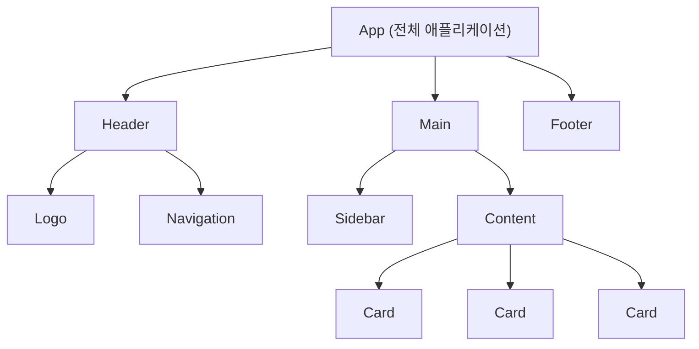
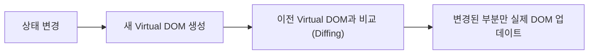

# 섹션 01: React란 무엇인가

> **난이도**: ⭐ (1/5)
> **선수 지식**: JavaScript 기초

---

## 학습 목표

이 섹션을 마치면 다음을 할 수 있습니다:

- React가 무엇이고 왜 사용하는지 설명할 수 있다
- 선언적 UI와 명령적 UI의 차이를 이해할 수 있다
- 컴포넌트 기반 아키텍처의 장점을 이해할 수 있다

---

## 핵심 개념

### React란?

React는 **사용자 인터페이스를 만들기 위한 JavaScript 라이브러리**입니다.

핵심 특징:
- **선언적(Declarative)**: "어떻게" 만들지가 아니라 "무엇을" 보여줄지 기술합니다
- **컴포넌트 기반(Component-Based)**: UI를 독립적인 조각으로 나누어 관리합니다
- **한 번 배워서 어디서든(Learn Once, Write Anywhere)**: 웹, 모바일(React Native), 데스크톱 등 다양한 플랫폼에서 사용합니다

### 선언적 UI vs 명령적 UI

```javascript
// 명령적 (Imperative) — DOM을 직접 조작
// "어떻게" 만드는지 단계별로 지시
const button = document.createElement("button");
button.textContent = "클릭: 0";
button.addEventListener("click", () => {
  const count = parseInt(button.textContent.split(": ")[1]) + 1;
  button.textContent = `클릭: ${count}`;
});
document.body.appendChild(button);
```

```jsx
// 선언적 (Declarative) — React 방식
// "무엇을" 보여줄지 기술
function Counter() {
  const [count, setCount] = useState(0);
  return <button onClick={() => setCount(count + 1)}>클릭: {count}</button>;
}
```

선언적 UI의 장점:
- 코드가 읽기 쉽습니다
- 현재 상태만 보면 UI가 어떤 모습인지 알 수 있습니다
- 버그를 찾기 쉽습니다

### 컴포넌트 기반 아키텍처

React에서는 UI를 **컴포넌트**라는 독립적인 조각으로 나눕니다:



각 컴포넌트는:
- **독립적**: 자체 로직과 모습을 가집니다
- **재사용 가능**: 같은 컴포넌트를 여러 곳에서 사용할 수 있습니다
- **조합 가능**: 작은 컴포넌트를 조합하여 복잡한 UI를 만듭니다

### Virtual DOM

React는 **Virtual DOM(가상 DOM)**을 사용하여 효율적으로 화면을 업데이트합니다:



- 전체 페이지를 다시 그리지 않고, **변경된 부분만** 업데이트합니다
- 개발자는 "이 상태일 때 화면이 이렇게 보여야 한다"만 정의하면 됩니다
- React가 알아서 최적의 방법으로 DOM을 업데이트합니다

---

## 코드로 이해하기

### 예제: 가장 간단한 React 컴포넌트

```jsx
// React 컴포넌트는 "함수"입니다
// 이 함수는 화면에 표시할 내용(JSX)을 반환합니다
function HelloWorld() {
  return <h1>안녕하세요, React!</h1>;
}
```

### 예제: 데이터를 표시하는 컴포넌트

```jsx
function UserProfile() {
  const user = {
    name: "김철수",
    age: 28,
    hobbies: ["코딩", "독서", "게임"],
  };

  return (
    <div>
      <h2>{user.name}</h2>
      <p>나이: {user.age}세</p>
      <ul>
        {user.hobbies.map((hobby) => (
          <li key={hobby}>{hobby}</li>
        ))}
      </ul>
    </div>
  );
}
```

---

## 주의 사항

- ⚠️ React는 프레임워크가 아니라 **라이브러리**입니다. 라우팅, 상태 관리 등은 별도의 라이브러리를 사용합니다.
- ⚠️ React를 배우기 전에 JavaScript 기초(특히 ES6+ 문법)를 먼저 익히세요.
- 💡 React 공식 문서(react.dev)는 매우 잘 만들어져 있으므로 자주 참고하세요.

---

## 정리

| 개념 | 설명 |
|------|------|
| React | UI를 만드는 JavaScript 라이브러리 |
| 선언적 UI | "무엇을" 보여줄지 기술하는 방식 |
| 컴포넌트 | UI의 독립적이고 재사용 가능한 조각 |
| Virtual DOM | 효율적인 DOM 업데이트를 위한 가상 표현 |

---

## 다음 단계

- 📖 다음 섹션: **sec02-dev-setup: 개발 환경 설정**
- 🔗 참고 자료: [React 공식 문서 - 빠른 시작](https://react.dev/learn)
