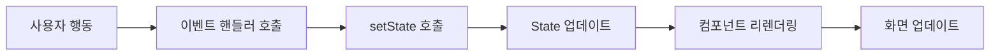
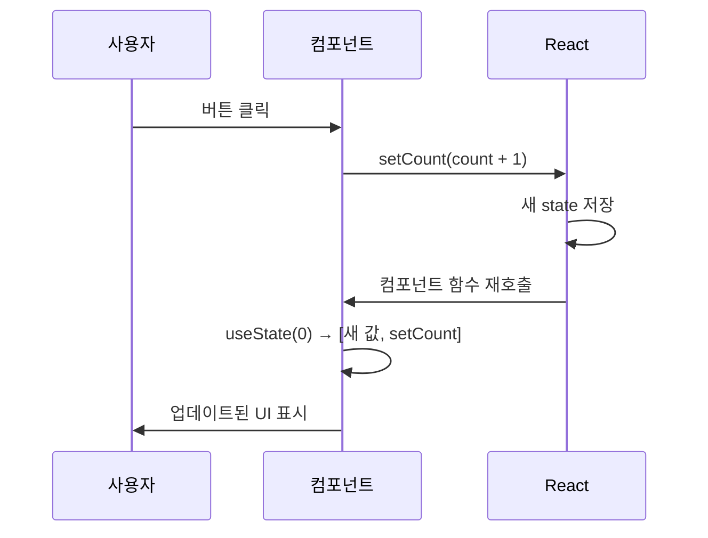

# 섹션 02: State와 이벤트 처리

> **난이도**: ⭐⭐ (2/5)
> **선수 지식**: Props (sec01), JavaScript 클로저, 배열/객체 불변 업데이트

---

## 학습 목표

이 섹션을 마치면 다음을 할 수 있습니다:

- useState 훅의 동작 원리를 이해하고 사용할 수 있다
- 상태 업데이트가 리렌더링을 유발하는 과정을 설명할 수 있다
- 객체와 배열 상태를 불변(immutable) 방식으로 업데이트할 수 있다
- onClick, onChange 등 이벤트 핸들러를 작성할 수 있다

---

## 핵심 개념

### State란?

State는 **컴포넌트 내부에서 관리하는 변경 가능한 데이터**입니다. State가 변경되면 React는 해당 컴포넌트를 **다시 렌더링**합니다.



### Props vs State

| 특성 | Props | State |
|------|-------|-------|
| 소유자 | 부모 컴포넌트 | 현재 컴포넌트 |
| 변경 가능 여부 | 읽기 전용 | 변경 가능 |
| 변경 방법 | 부모가 새 값 전달 | setState 함수 호출 |
| 변경 시 | 리렌더링 | 리렌더링 |

### useState 기본 사용법

`useState`는 React에서 상태를 선언하는 훅(Hook)입니다:

```jsx
import { useState } from "react";

function Counter() {
  // useState(초기값) → [현재값, 업데이트함수] 반환
  const [count, setCount] = useState(0);

  return (
    <div>
      <p>카운트: {count}</p>
      <button onClick={() => setCount(count + 1)}>+1</button>
      <button onClick={() => setCount(count - 1)}>-1</button>
      <button onClick={() => setCount(0)}>초기화</button>
    </div>
  );
}
```

### 상태 업데이트의 동작 원리



**핵심 포인트:**
- `setState`를 호출하면 React가 컴포넌트 함수를 **다시 실행**합니다
- 다시 실행될 때 `useState`는 **업데이트된 값**을 반환합니다
- 같은 이벤트 핸들러 내에서 `setState`를 여러 번 호출해도 **즉시 반영되지 않습니다** (배치 처리)

### 함수형 업데이트

이전 상태를 기반으로 업데이트할 때는 **함수형 업데이트**를 사용합니다:

```jsx
function Counter() {
  const [count, setCount] = useState(0);

  const handleTripleIncrement = () => {
    // 잘못된 방법 — 세 번 호출해도 1만 증가
    // setCount(count + 1);
    // setCount(count + 1);
    // setCount(count + 1);

    // 올바른 방법 — 이전 상태를 기반으로 업데이트
    setCount((prev) => prev + 1);
    setCount((prev) => prev + 1);
    setCount((prev) => prev + 1);
  };

  return <button onClick={handleTripleIncrement}>+3</button>;
}
```

### 객체 상태 업데이트 (불변성 유지)

객체 상태를 업데이트할 때는 **새 객체를 만들어야** 합니다:

```jsx
function UserProfile() {
  const [user, setUser] = useState({
    name: "김철수",
    age: 28,
    email: "kim@example.com",
  });

  const updateName = (newName) => {
    // 잘못된 방법 — 직접 수정 (React가 변경을 감지하지 못함)
    // user.name = newName;
    // setUser(user);

    // 올바른 방법 — 스프레드 연산자로 새 객체 생성
    setUser({ ...user, name: newName });
    // 또는 함수형 업데이트
    // setUser((prev) => ({ ...prev, name: newName }));
  };

  return (
    <div>
      <p>{user.name} ({user.age}세)</p>
      <button onClick={() => updateName("이영희")}>이름 변경</button>
    </div>
  );
}
```

### 배열 상태 업데이트 (불변성 유지)

배열도 마찬가지로 **새 배열을 만들어야** 합니다:

```jsx
function TodoList() {
  const [todos, setTodos] = useState([
    { id: 1, text: "React 공부", done: false },
    { id: 2, text: "운동하기", done: true },
  ]);

  // 추가: 스프레드 또는 concat
  const addTodo = (text) => {
    const newTodo = { id: Date.now(), text, done: false };
    setTodos([...todos, newTodo]);
  };

  // 삭제: filter
  const removeTodo = (id) => {
    setTodos(todos.filter((todo) => todo.id !== id));
  };

  // 수정: map
  const toggleTodo = (id) => {
    setTodos(
      todos.map((todo) =>
        todo.id === id ? { ...todo, done: !todo.done } : todo
      )
    );
  };

  return (
    <ul>
      {todos.map((todo) => (
        <li key={todo.id}>
          <span style={{ textDecoration: todo.done ? "line-through" : "none" }}>
            {todo.text}
          </span>
          <button onClick={() => toggleTodo(todo.id)}>토글</button>
          <button onClick={() => removeTodo(todo.id)}>삭제</button>
        </li>
      ))}
    </ul>
  );
}
```

**배열 불변 업데이트 패턴 요약:**

| 연산 | 사용 금지 (원본 수정) | 사용 권장 (새 배열 생성) |
|------|----------------------|------------------------|
| 추가 | `push`, `unshift` | `[...arr, item]`, `concat` |
| 삭제 | `splice`, `pop` | `filter` |
| 수정 | `arr[i] = x` | `map` |
| 정렬 | `sort`, `reverse` | `[...arr].sort()` |

### 이벤트 처리

React의 이벤트 핸들러는 camelCase로 작성합니다:

```jsx
function EventExamples() {
  const [text, setText] = useState("");
  const [isHovered, setIsHovered] = useState(false);

  // 클릭 이벤트
  const handleClick = () => {
    alert("클릭!");
  };

  // 입력 이벤트 — event 객체에서 값 추출
  const handleChange = (event) => {
    setText(event.target.value);
  };

  // 폼 제출 이벤트 — 기본 동작 방지
  const handleSubmit = (event) => {
    event.preventDefault(); // 페이지 새로고침 방지
    alert(`입력값: ${text}`);
  };

  return (
    <form onSubmit={handleSubmit}>
      <input
        value={text}
        onChange={handleChange}
        placeholder="입력하세요"
      />
      <button type="submit">전송</button>
      <div
        onMouseEnter={() => setIsHovered(true)}
        onMouseLeave={() => setIsHovered(false)}
        style={{ backgroundColor: isHovered ? "yellow" : "white" }}
      >
        {isHovered ? "마우스 위에 있음" : "마우스를 올려보세요"}
      </div>
    </form>
  );
}
```

### 자주 사용하는 이벤트 핸들러

| 이벤트 | 설명 | 예제 |
|--------|------|------|
| `onClick` | 클릭 | `<button onClick={fn}>` |
| `onChange` | 입력 값 변경 | `<input onChange={fn}>` |
| `onSubmit` | 폼 제출 | `<form onSubmit={fn}>` |
| `onKeyDown` | 키보드 누름 | `<input onKeyDown={fn}>` |
| `onMouseEnter` | 마우스 진입 | `<div onMouseEnter={fn}>` |
| `onMouseLeave` | 마우스 이탈 | `<div onMouseLeave={fn}>` |
| `onFocus` | 포커스 획득 | `<input onFocus={fn}>` |
| `onBlur` | 포커스 상실 | `<input onBlur={fn}>` |

---

## 코드로 이해하기

### 예제: 장바구니

```jsx
function ShoppingCart() {
  const [items, setItems] = useState([]);

  const addItem = (product) => {
    // 이미 있는 상품이면 수량 증가, 없으면 추가
    const existing = items.find((item) => item.id === product.id);
    if (existing) {
      setItems(
        items.map((item) =>
          item.id === product.id
            ? { ...item, quantity: item.quantity + 1 }
            : item
        )
      );
    } else {
      setItems([...items, { ...product, quantity: 1 }]);
    }
  };

  const totalPrice = items.reduce(
    (sum, item) => sum + item.price * item.quantity,
    0
  );

  return (
    <div>
      <h2>장바구니 ({items.length}개 상품)</h2>
      {items.map((item) => (
        <div key={item.id}>
          {item.name} x {item.quantity} = {item.price * item.quantity}원
        </div>
      ))}
      <p>총액: {totalPrice.toLocaleString()}원</p>
    </div>
  );
}
```

---

## 주의 사항

- ⚠️ State를 **직접 수정하지 마세요**. 반드시 `setState` 함수를 사용해야 합니다.
- ⚠️ 이벤트 핸들러에 함수를 **호출하지 말고 전달**하세요: `onClick={handleClick}` (O), `onClick={handleClick()}` (X)
- ⚠️ 객체/배열 상태는 반드시 **새 참조**를 만들어야 리렌더링됩니다.
- 💡 연관된 상태는 **하나의 객체**로 묶는 것이 관리하기 편합니다.
- 💡 상태가 복잡해지면 `useReducer` 훅을 고려하세요 (이후 챕터에서 다룹니다).

---

## 정리

| 개념 | 설명 | 예제 |
|------|------|------|
| useState | 상태 선언 훅 | `const [v, setV] = useState(0)` |
| setState | 상태 업데이트 | `setV(newValue)` |
| 함수형 업데이트 | 이전 상태 기반 업데이트 | `setV(prev => prev + 1)` |
| 불변 업데이트 | 새 객체/배열 생성 | `{...obj, key: val}` |
| 이벤트 핸들러 | 사용자 행동 처리 | `onClick={handleClick}` |

---

## 다음 단계

- ✅ `exercise.md`의 연습 문제를 풀어보세요.
- 📖 다음 챕터: **ch04** (추가 예정)
- 🔗 참고 자료:
  - [React 공식 문서 - State: 컴포넌트의 메모리](https://react.dev/learn/state-a-components-memory)
  - [React 공식 문서 - 이벤트에 응답하기](https://react.dev/learn/responding-to-events)
  - [React 공식 문서 - 객체 State 업데이트하기](https://react.dev/learn/updating-objects-in-state)
  - [React 공식 문서 - 배열 State 업데이트하기](https://react.dev/learn/updating-arrays-in-state)
