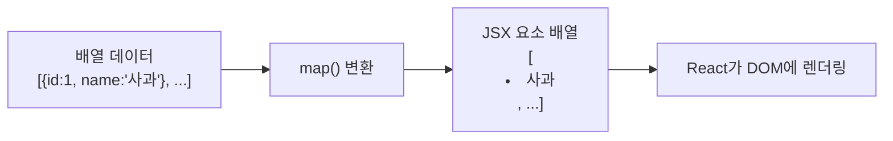
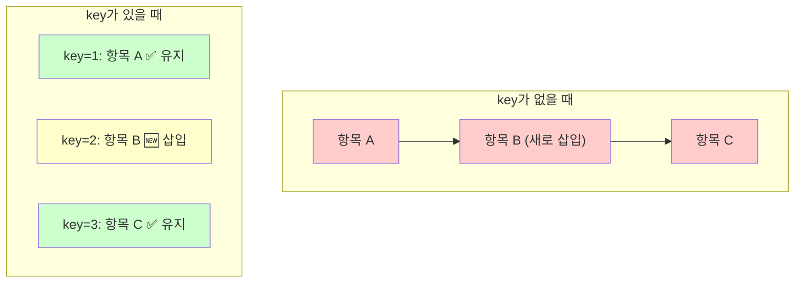
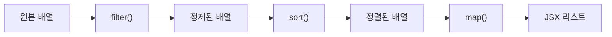

# 섹션 01: 리스트 렌더링

> **난이도**: ⭐⭐ (2/5)
> **선수 지식**: JavaScript 배열 메서드(map, filter, sort), React 기초(JSX, 컴포넌트)

---

## 학습 목표

이 섹션을 마치면 다음을 할 수 있습니다:

- `map()`을 사용하여 배열 데이터를 JSX 요소 리스트로 변환할 수 있다
- `key` prop의 역할과 올바른 사용법을 이해할 수 있다
- 필터링, 정렬된 리스트를 렌더링할 수 있다
- 중첩된 리스트를 구조화하여 렌더링할 수 있다

---

## 핵심 개념

### 배열을 리스트로 변환하기

React에서 리스트를 렌더링하려면 JavaScript의 `map()` 메서드를 사용하여 배열의 각 항목을 JSX 요소로 변환합니다.



```jsx
// 기본적인 리스트 렌더링
function FruitList() {
  const fruits = ["사과", "바나나", "오렌지"];

  return (
    <ul>
      {fruits.map((fruit, index) => (
        <li key={index}>{fruit}</li>
      ))}
    </ul>
  );
}
```

핵심 포인트:
- `map()`은 원본 배열을 변경하지 않고 **새 배열을 반환**합니다
- JSX 안에서 `{}`를 사용하여 JavaScript 표현식을 삽입합니다
- 각 요소에는 반드시 `key` prop이 필요합니다

### key prop의 중요성

`key`는 React가 **리스트의 각 항목을 고유하게 식별**하기 위해 사용하는 특수한 prop입니다.



```jsx
// 올바른 key 사용: 데이터의 고유 ID를 사용
function UserList() {
  const users = [
    { id: 1, name: "김철수" },
    { id: 2, name: "이영희" },
    { id: 3, name: "박민수" },
  ];

  return (
    <ul>
      {users.map((user) => (
        <li key={user.id}>{user.name}</li>
      ))}
    </ul>
  );
}
```

**key를 올바르게 사용해야 하는 이유:**

| key 사용 방식 | 결과 |
|---------------|------|
| 고유 ID 사용 (권장) | React가 정확히 어떤 항목이 변경되었는지 알 수 있음 |
| index 사용 (비권장) | 항목 순서가 바뀌면 불필요한 리렌더링, 상태 혼란 발생 |
| key 미사용 | 콘솔 경고 발생, 성능 저하 |

### 필터링과 정렬

렌더링 전에 `filter()`나 `sort()`를 사용하여 데이터를 가공할 수 있습니다.



```jsx
// 필터링 + 정렬 후 렌더링
function ActiveUserList() {
  const users = [
    { id: 1, name: "김철수", active: true },
    { id: 2, name: "이영희", active: false },
    { id: 3, name: "박민수", active: true },
  ];

  // 활성 사용자만 필터링 후 이름 순 정렬
  const activeUsers = users
    .filter((user) => user.active)
    .sort((a, b) => a.name.localeCompare(b.name));

  return (
    <ul>
      {activeUsers.map((user) => (
        <li key={user.id}>{user.name}</li>
      ))}
    </ul>
  );
}
```

### 중첩 리스트

배열 안에 배열이 있는 중첩 구조도 `map()`을 중첩하여 렌더링할 수 있습니다.

```jsx
// 중첩 리스트 렌더링
function CategoryList() {
  const categories = [
    {
      id: "c1",
      name: "과일",
      items: [
        { id: "i1", name: "사과" },
        { id: "i2", name: "바나나" },
      ],
    },
    {
      id: "c2",
      name: "채소",
      items: [
        { id: "i3", name: "당근" },
        { id: "i4", name: "시금치" },
      ],
    },
  ];

  return (
    <div>
      {categories.map((category) => (
        <section key={category.id}>
          <h2>{category.name}</h2>
          <ul>
            {category.items.map((item) => (
              <li key={item.id}>{item.name}</li>
            ))}
          </ul>
        </section>
      ))}
    </div>
  );
}
```

---

## 코드로 이해하기

### 예제: 완전한 리스트 컴포넌트

실무에서 자주 사용하는 패턴을 모두 포함한 예제입니다.

```jsx
function TodoList() {
  const [todos, setTodos] = useState([
    { id: 1, text: "React 배우기", done: false },
    { id: 2, text: "운동하기", done: true },
    { id: 3, text: "책 읽기", done: false },
  ]);

  const [filter, setFilter] = useState("all"); // "all", "active", "done"

  // 필터링 로직
  const filteredTodos = todos.filter((todo) => {
    if (filter === "active") return !todo.done;
    if (filter === "done") return todo.done;
    return true;
  });

  return (
    <div>
      {/* 필터 버튼 */}
      <button onClick={() => setFilter("all")}>전체</button>
      <button onClick={() => setFilter("active")}>미완료</button>
      <button onClick={() => setFilter("done")}>완료</button>

      {/* 리스트 렌더링 */}
      <ul>
        {filteredTodos.map((todo) => (
          <li key={todo.id}>
            <span style={{ textDecoration: todo.done ? "line-through" : "none" }}>
              {todo.text}
            </span>
          </li>
        ))}
      </ul>

      {/* 빈 리스트 처리 */}
      {filteredTodos.length === 0 && <p>표시할 항목이 없습니다.</p>}
    </div>
  );
}
```

### 예제: 리스트와 map()의 JavaScript 동작 원리

```javascript
// React 없이 JavaScript만으로 이해하기
const products = [
  { id: 1, name: "노트북", price: 1200000 },
  { id: 2, name: "마우스", price: 50000 },
  { id: 3, name: "키보드", price: 80000 },
];

// map()은 새 배열을 반환
const productNames = products.map((p) => p.name);
// ["노트북", "마우스", "키보드"]

// 체이닝: filter 후 map
const expensiveNames = products
  .filter((p) => p.price > 70000)
  .map((p) => `${p.name} (${p.price.toLocaleString()}원)`);
// ["노트북 (1,200,000원)", "키보드 (80,000원)"]
```

---

## 주의 사항

- **key에 배열 index 사용을 피하세요**: 항목의 순서가 바뀌거나 항목이 삭제/추가될 때 문제가 발생합니다. 반드시 데이터의 **고유 ID**를 사용하세요.
- **key는 형제 요소 사이에서만 고유하면 됩니다**: 전역적으로 고유할 필요는 없습니다.
- **map() 안에서 너무 복잡한 로직을 넣지 마세요**: 복잡한 항목은 별도의 컴포넌트로 분리하세요.
- **빈 배열 처리를 잊지 마세요**: 데이터가 없을 때 사용자에게 적절한 메시지를 보여주세요.
- **원본 배열을 직접 변경하지 마세요**: `sort()`는 원본 배열을 변경하므로, 정렬 시 `[...array].sort()`로 복사본을 사용하세요.

---

## 정리

| 개념 | 설명 |
|------|------|
| map() | 배열을 JSX 요소 배열로 변환하여 리스트 렌더링 |
| key prop | React가 각 항목을 식별하기 위한 고유 식별자 |
| filter() | 조건에 맞는 항목만 선택하여 렌더링 |
| sort() | 배열을 정렬하여 순서를 변경 (복사 후 사용) |
| 중첩 리스트 | map() 안에서 map()을 사용하여 다단계 구조 렌더링 |
| 빈 리스트 처리 | 조건부 렌더링으로 데이터 없음 상태를 표시 |

---

## 다음 단계

- 다음 섹션: **sec02-form-handling: 폼 처리**
- 참고 자료: [React 공식 문서 - 리스트 렌더링](https://react.dev/learn/rendering-lists)
