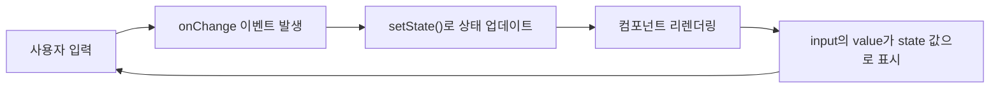
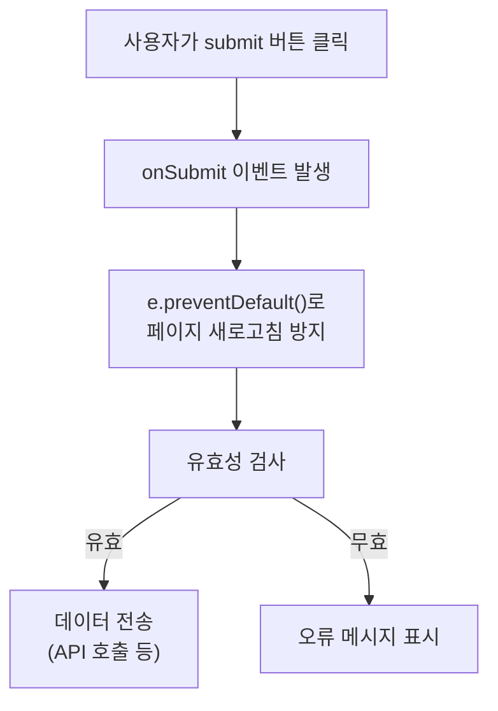
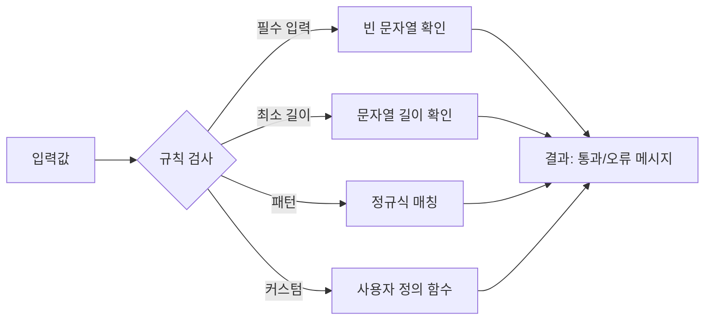

# 섹션 02: 폼 처리

> **난이도**: ⭐⭐ (2/5)
> **선수 지식**: React 기초(JSX, state, 이벤트 핸들링), HTML 폼 요소

---

## 학습 목표

이 섹션을 마치면 다음을 할 수 있습니다:

- 제어 컴포넌트(Controlled Component)의 개념과 동작 원리를 이해할 수 있다
- 텍스트 입력, 셀렉트 박스, 체크박스 등 다양한 폼 요소를 처리할 수 있다
- 폼 제출을 처리하고 기본 동작을 방지할 수 있다
- 기본적인 유효성 검사를 구현할 수 있다

---

## 핵심 개념

### 제어 컴포넌트 (Controlled Component)

React에서 폼을 처리하는 핵심 패턴은 **제어 컴포넌트**입니다. 입력 요소의 값을 React의 state로 관리하여, **state가 "유일한 진실의 원천(Single Source of Truth)"**이 되도록 합니다.



```jsx
// 제어 컴포넌트: React state가 입력값을 제어
function ControlledInput() {
  const [name, setName] = useState("");

  return (
    <input
      type="text"
      value={name}               // state 값을 표시
      onChange={(e) => setName(e.target.value)}  // 입력 시 state 업데이트
    />
  );
}
```

**제어 컴포넌트 vs 비제어 컴포넌트:**

| 구분 | 제어 컴포넌트 | 비제어 컴포넌트 |
|------|---------------|----------------|
| 값 관리 | React state | DOM 자체 |
| 값 접근 | state 변수 | ref.current.value |
| 실시간 검증 | 가능 | 어려움 |
| 추천 여부 | React 권장 | 특수한 경우에만 |

### 다양한 입력 요소 처리

#### 텍스트 입력 (text, textarea)

```jsx
function TextInputs() {
  const [formData, setFormData] = useState({
    username: "",
    bio: "",
  });

  // 하나의 핸들러로 여러 입력 처리
  const handleChange = (e) => {
    const { name, value } = e.target;
    setFormData((prev) => ({
      ...prev,
      [name]: value,  // 계산된 속성명 사용
    }));
  };

  return (
    <form>
      <input
        type="text"
        name="username"
        value={formData.username}
        onChange={handleChange}
      />
      <textarea
        name="bio"
        value={formData.bio}
        onChange={handleChange}
      />
    </form>
  );
}
```

#### 셀렉트 박스 (select)

```jsx
function SelectInput() {
  const [color, setColor] = useState("red");

  return (
    <select value={color} onChange={(e) => setColor(e.target.value)}>
      <option value="red">빨강</option>
      <option value="green">초록</option>
      <option value="blue">파랑</option>
    </select>
  );
}
```

#### 체크박스 (checkbox)

```jsx
function CheckboxInput() {
  const [agreed, setAgreed] = useState(false);

  return (
    <label>
      <input
        type="checkbox"
        checked={agreed}       // value 대신 checked 사용
        onChange={(e) => setAgreed(e.target.checked)}  // value 대신 checked 사용
      />
      약관에 동의합니다
    </label>
  );
}
```

### 폼 제출 처리



```jsx
function LoginForm() {
  const [formData, setFormData] = useState({
    email: "",
    password: "",
  });
  const [errors, setErrors] = useState({});

  const handleSubmit = (e) => {
    e.preventDefault();  // 페이지 새로고침 방지 (필수!)

    // 유효성 검사
    const newErrors = {};
    if (!formData.email) newErrors.email = "이메일을 입력하세요";
    if (!formData.password) newErrors.password = "비밀번호를 입력하세요";

    if (Object.keys(newErrors).length > 0) {
      setErrors(newErrors);
      return;
    }

    // 검증 통과 시 제출 로직
    console.log("제출:", formData);
  };

  return (
    <form onSubmit={handleSubmit}>
      <input
        type="email"
        value={formData.email}
        onChange={(e) => setFormData({ ...formData, email: e.target.value })}
      />
      {errors.email && <span>{errors.email}</span>}

      <input
        type="password"
        value={formData.password}
        onChange={(e) => setFormData({ ...formData, password: e.target.value })}
      />
      {errors.password && <span>{errors.password}</span>}

      <button type="submit">로그인</button>
    </form>
  );
}
```

### 유효성 검사 기초

유효성 검사는 사용자 입력이 올바른지 확인하는 과정입니다.



```jsx
// 유효성 검사 함수 예시
function validateField(value, rules) {
  if (rules.required && !value.trim()) {
    return "필수 입력 항목입니다";
  }
  if (rules.minLength && value.length < rules.minLength) {
    return `최소 ${rules.minLength}자 이상 입력하세요`;
  }
  if (rules.pattern && !rules.pattern.test(value)) {
    return rules.patternMessage || "올바른 형식이 아닙니다";
  }
  return null; // 오류 없음
}
```

---

## 코드로 이해하기

### 예제: 완전한 회원가입 폼

```jsx
function SignupForm() {
  const [formData, setFormData] = useState({
    username: "",
    email: "",
    password: "",
    agreeTerms: false,
    role: "user",
  });

  const [errors, setErrors] = useState({});

  const handleChange = (e) => {
    const { name, type, value, checked } = e.target;
    setFormData((prev) => ({
      ...prev,
      [name]: type === "checkbox" ? checked : value,
    }));
  };

  const validate = () => {
    const newErrors = {};

    if (!formData.username.trim()) {
      newErrors.username = "사용자명을 입력하세요";
    } else if (formData.username.length < 2) {
      newErrors.username = "2자 이상 입력하세요";
    }

    if (!formData.email.includes("@")) {
      newErrors.email = "올바른 이메일 형식이 아닙니다";
    }

    if (formData.password.length < 8) {
      newErrors.password = "비밀번호는 8자 이상이어야 합니다";
    }

    if (!formData.agreeTerms) {
      newErrors.agreeTerms = "약관에 동의해야 합니다";
    }

    return newErrors;
  };

  const handleSubmit = (e) => {
    e.preventDefault();
    const newErrors = validate();

    if (Object.keys(newErrors).length === 0) {
      console.log("회원가입 데이터:", formData);
    } else {
      setErrors(newErrors);
    }
  };

  return (
    <form onSubmit={handleSubmit}>
      <input name="username" value={formData.username} onChange={handleChange} />
      <input name="email" type="email" value={formData.email} onChange={handleChange} />
      <input name="password" type="password" value={formData.password} onChange={handleChange} />
      <select name="role" value={formData.role} onChange={handleChange}>
        <option value="user">일반 사용자</option>
        <option value="admin">관리자</option>
      </select>
      <label>
        <input name="agreeTerms" type="checkbox" checked={formData.agreeTerms} onChange={handleChange} />
        약관 동의
      </label>
      <button type="submit">가입</button>
    </form>
  );
}
```

### 예제: 폼 상태 관리의 JavaScript 동작 원리

```javascript
// React 없이 JavaScript만으로 제어 컴포넌트 패턴 이해하기

// 상태 객체 (React의 state에 해당)
let formState = { username: "", email: "" };

// setter 함수 (React의 setState에 해당)
function updateField(fieldName, value) {
  formState = { ...formState, [fieldName]: value };
  return formState;
}

// 유효성 검사 (순수 함수로 작성)
function validate(data) {
  const errors = {};
  if (!data.username) errors.username = "필수";
  if (!data.email.includes("@")) errors.email = "이메일 형식 오류";
  return errors;
}
```

---

## 주의 사항

- **`e.preventDefault()`를 잊지 마세요**: 폼 제출 시 페이지가 새로고침되는 기본 동작을 방지해야 합니다.
- **체크박스는 `value`가 아닌 `checked`를 사용합니다**: `e.target.checked`로 체크 상태를 읽습니다.
- **state를 직접 변경하지 마세요**: 항상 `setState`(또는 `setFormData`)를 통해 업데이트해야 합니다.
- **유효성 검사는 프론트엔드와 백엔드 모두에서 수행하세요**: 프론트엔드 검증만으로는 보안이 불충분합니다.
- **너무 많은 state를 개별로 관리하지 마세요**: 관련된 폼 필드는 하나의 객체 state로 묶어서 관리하는 것이 좋습니다.

---

## 정리

| 개념 | 설명 |
|------|------|
| 제어 컴포넌트 | React state로 입력값을 관리하는 패턴 |
| onChange | 입력값이 변경될 때 호출되는 이벤트 핸들러 |
| e.preventDefault() | 폼 제출 시 페이지 새로고침 방지 |
| 유효성 검사 | 사용자 입력이 규칙에 맞는지 확인하는 과정 |
| 계산된 속성명 | `[name]: value`로 동적으로 객체 키를 설정 |

---

## 다음 단계

- 다음 챕터: **ch05-hooks: Hooks 기초**
- 참고 자료: [React 공식 문서 - 입력 업데이트](https://react.dev/learn/updating-objects-in-state)
