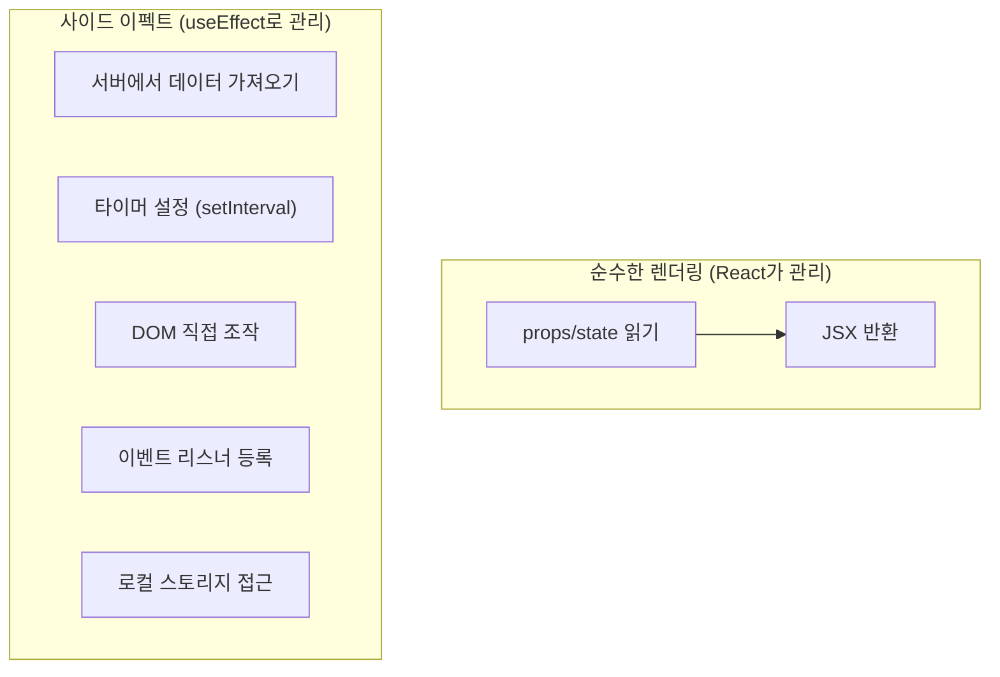
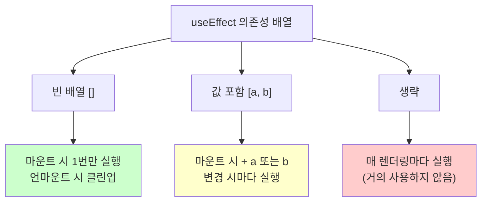
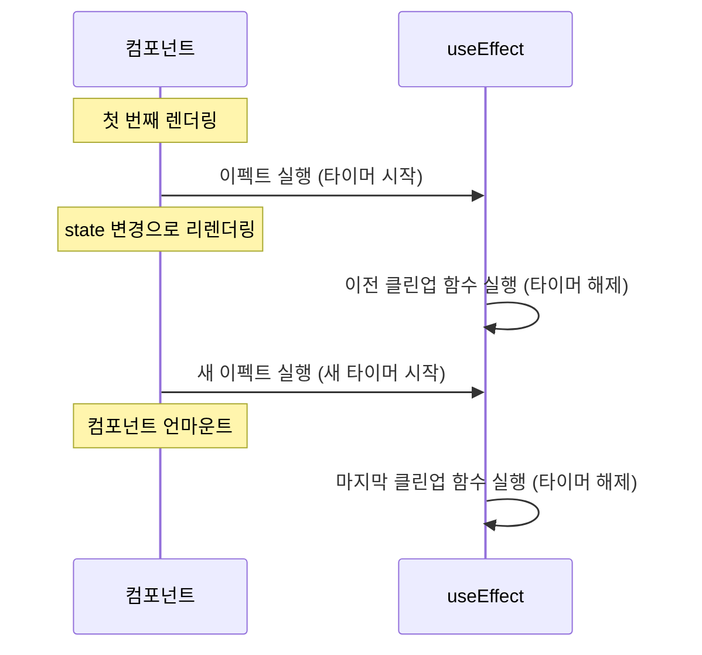

# 섹션 01: useEffect

> **난이도**: ⭐⭐ (2/5)
> **선수 지식**: React 기초(컴포넌트, state), JavaScript 비동기 처리(Promise)

---

## 학습 목표

이 섹션을 마치면 다음을 할 수 있습니다:

- 사이드 이펙트(Side Effect)가 무엇인지 설명할 수 있다
- useEffect의 문법과 동작 방식을 이해할 수 있다
- 의존성 배열의 세 가지 형태(빈 배열, 값 포함, 생략)를 구분하여 사용할 수 있다
- 클린업 함수의 역할과 필요성을 이해할 수 있다
- 데이터 가져오기, 타이머, 이벤트 리스너 등 일반적인 패턴을 구현할 수 있다

---

## 핵심 개념

### 사이드 이펙트란?

React 컴포넌트의 **주요 역할은 UI를 렌더링**하는 것입니다. 그 외에 컴포넌트가 수행하는 모든 작업을 **사이드 이펙트(부수 효과)**라고 합니다.



**사이드 이펙트의 대표적인 예:**
- 서버에서 데이터 가져오기 (API 호출)
- 타이머 설정 (setTimeout, setInterval)
- DOM 직접 조작 (document.title 변경 등)
- 이벤트 리스너 등록/해제 (window.addEventListener)
- 외부 라이브러리 연동
- 로컬 스토리지 읽기/쓰기

### useEffect 기본 문법

```jsx
useEffect(() => {
  // 여기서 사이드 이펙트를 수행
  console.log("이펙트 실행!");

  return () => {
    // 클린업 함수 (선택사항)
    console.log("정리 작업 수행!");
  };
}, [의존성1, 의존성2]); // 의존성 배열
```

### 의존성 배열의 세 가지 형태

의존성 배열은 useEffect가 **언제 다시 실행될지**를 결정합니다.



#### 1. 빈 의존성 배열: `[]`

컴포넌트가 **처음 마운트될 때 한 번만** 실행됩니다.

```jsx
// 컴포넌트가 화면에 나타날 때 한 번만 데이터를 가져옴
useEffect(() => {
  fetchUserData();
}, []); // 빈 배열 → 마운트 시 1회만 실행
```

#### 2. 값이 있는 의존성 배열: `[dep1, dep2]`

지정된 값이 **변경될 때마다** 실행됩니다.

```jsx
// userId가 변경될 때마다 해당 사용자의 데이터를 다시 가져옴
useEffect(() => {
  fetchUserData(userId);
}, [userId]); // userId가 바뀔 때마다 실행
```

#### 3. 의존성 배열 생략

**매 렌더링마다** 실행됩니다. 거의 사용하지 않습니다.

```jsx
// 매 렌더링 시마다 실행 (주의: 성능 문제 가능)
useEffect(() => {
  console.log("렌더링 완료");
}); // 의존성 배열 자체가 없음
```

### 클린업 함수

useEffect 안에서 반환하는 함수를 **클린업 함수**라고 합니다. 이전 이펙트를 정리하는 역할을 합니다.



```jsx
// 타이머 예제: 클린업 함수로 타이머를 정리
useEffect(() => {
  const timerId = setInterval(() => {
    console.log("틱!");
  }, 1000);

  // 클린업 함수: 컴포넌트가 사라지거나 이펙트가 다시 실행될 때 호출
  return () => {
    clearInterval(timerId); // 타이머 해제 → 메모리 누수 방지
  };
}, []);
```

**클린업이 필요한 경우:**
- `setInterval` / `setTimeout` → `clearInterval` / `clearTimeout`
- `addEventListener` → `removeEventListener`
- WebSocket 연결 → 연결 해제
- 구독(subscription) → 구독 해제

### 일반적인 useEffect 패턴

#### 패턴 1: 데이터 가져오기

```jsx
function UserProfile({ userId }) {
  const [user, setUser] = useState(null);
  const [loading, setLoading] = useState(true);
  const [error, setError] = useState(null);

  useEffect(() => {
    let cancelled = false; // 클린업용 플래그

    async function loadUser() {
      try {
        setLoading(true);
        const response = await fetch(`/api/users/${userId}`);
        const data = await response.json();

        if (!cancelled) { // 컴포넌트가 아직 마운트 상태일 때만 업데이트
          setUser(data);
          setError(null);
        }
      } catch (err) {
        if (!cancelled) {
          setError(err.message);
        }
      } finally {
        if (!cancelled) {
          setLoading(false);
        }
      }
    }

    loadUser();

    return () => {
      cancelled = true; // 언마운트 시 업데이트 방지
    };
  }, [userId]);

  if (loading) return <p>로딩 중...</p>;
  if (error) return <p>오류: {error}</p>;
  return <h1>{user.name}</h1>;
}
```

#### 패턴 2: 이벤트 리스너

```jsx
function WindowSize() {
  const [size, setSize] = useState({ width: window.innerWidth, height: window.innerHeight });

  useEffect(() => {
    const handleResize = () => {
      setSize({ width: window.innerWidth, height: window.innerHeight });
    };

    window.addEventListener("resize", handleResize);

    // 클린업: 이벤트 리스너 제거
    return () => {
      window.removeEventListener("resize", handleResize);
    };
  }, []);

  return <p>창 크기: {size.width} x {size.height}</p>;
}
```

#### 패턴 3: 문서 제목 변경

```jsx
function PageTitle({ title }) {
  useEffect(() => {
    document.title = title;
  }, [title]); // title이 바뀔 때마다 실행

  return <h1>{title}</h1>;
}
```

---

## 코드로 이해하기

### 예제: useEffect의 실행 순서 이해

```jsx
function EffectDemo() {
  const [count, setCount] = useState(0);

  console.log("1. 렌더링"); // 매 렌더링마다 실행

  useEffect(() => {
    console.log("2. 이펙트 실행 (count:", count, ")");

    return () => {
      console.log("3. 클린업 (이전 count:", count, ")");
    };
  }, [count]);

  return <button onClick={() => setCount(count + 1)}>카운트: {count}</button>;
}

// 실행 순서:
// [첫 렌더링]     → "1. 렌더링" → "2. 이펙트 실행 (count: 0)"
// [버튼 클릭]     → "1. 렌더링" → "3. 클린업 (이전 count: 0)" → "2. 이펙트 실행 (count: 1)"
// [다시 버튼 클릭] → "1. 렌더링" → "3. 클린업 (이전 count: 1)" → "2. 이펙트 실행 (count: 2)"
```

### 예제: useEffect 동작의 JavaScript 시뮬레이션

```javascript
// useEffect의 핵심 개념을 JavaScript로 이해하기

// 의존성이 변경되었는지 확인하는 함수
function depsChanged(prevDeps, nextDeps) {
  if (!prevDeps) return true; // 첫 실행
  if (prevDeps.length !== nextDeps.length) return true;
  return prevDeps.some((dep, i) => dep !== nextDeps[i]);
}

// useEffect 시뮬레이션
let prevDeps = null;
let cleanupFn = null;

function simulateEffect(callback, deps) {
  const shouldRun = deps === undefined || depsChanged(prevDeps, deps);

  if (shouldRun) {
    // 이전 클린업 실행
    if (cleanupFn) cleanupFn();
    // 새 이펙트 실행
    cleanupFn = callback();
    prevDeps = deps;
  }
}
```

---

## 주의 사항

- **의존성 배열에 사용하는 모든 값을 포함하세요**: 이펙트 안에서 참조하는 state나 props는 반드시 의존성 배열에 넣어야 합니다. 빠뜨리면 오래된 값(stale value)을 참조하는 버그가 발생합니다.
- **useEffect 안에서 직접 async 함수를 쓰지 마세요**: useEffect의 콜백 자체를 async로 만들면 안 됩니다. 대신 내부에 async 함수를 정의하고 호출하세요.
- **무한 루프에 주의하세요**: 이펙트 안에서 의존성에 포함된 state를 업데이트하면 무한 루프가 발생할 수 있습니다.
- **클린업 함수를 잊지 마세요**: 타이머, 이벤트 리스너, 구독 등은 반드시 클린업해야 메모리 누수를 방지합니다.
- **빈 의존성 배열 `[]`과 의존성 배열 생략은 완전히 다릅니다**: `[]`는 마운트 시 1번, 생략은 매 렌더링마다 실행됩니다.

---

## 정리

| 개념 | 설명 |
|------|------|
| 사이드 이펙트 | 렌더링 외에 컴포넌트가 수행하는 작업 (API 호출, 타이머 등) |
| useEffect | 사이드 이펙트를 안전하게 수행하기 위한 Hook |
| 의존성 배열 | 이펙트가 다시 실행되는 조건을 지정 |
| `[]` (빈 배열) | 마운트 시 1번만 실행 |
| `[a, b]` | a 또는 b가 변경될 때 실행 |
| 생략 | 매 렌더링마다 실행 (비권장) |
| 클린업 함수 | 이전 이펙트를 정리하는 함수 (메모리 누수 방지) |

---

## 다음 단계

- 다음 섹션: **sec02-useref-other-hooks: useRef와 기타 Hooks**
- 참고 자료: [React 공식 문서 - useEffect](https://react.dev/reference/react/useEffect)
