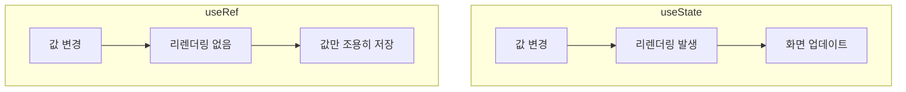
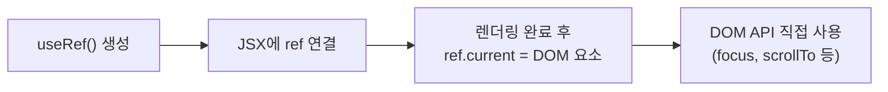
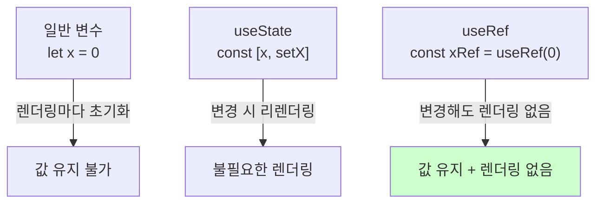
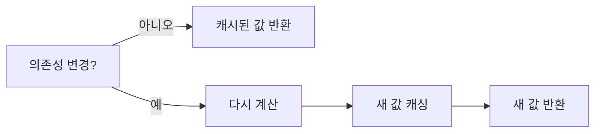

# 섹션 02: useRef와 기타 Hooks

> **난이도**: ⭐⭐ (2/5)
> **선수 지식**: React 기초(컴포넌트, state), useEffect

---

## 학습 목표

이 섹션을 마치면 다음을 할 수 있습니다:

- useRef로 DOM 요소에 직접 접근하는 방법을 이해할 수 있다
- useRef를 사용하여 렌더링과 무관한 값을 저장할 수 있다
- useMemo로 계산 비용이 높은 값을 캐싱하는 방법을 이해할 수 있다
- useCallback으로 함수를 메모이제이션하는 기초 개념을 이해할 수 있다

---

## 핵심 개념

### useRef란?

`useRef`는 **렌더링 사이에 값을 유지하면서도 변경 시 리렌더링을 유발하지 않는** Hook입니다. 두 가지 주요 용도가 있습니다:

1. **DOM 요소에 직접 접근** (포커스, 스크롤, 크기 측정 등)
2. **렌더링과 무관한 값 저장** (이전 값, 타이머 ID, 카운터 등)



```jsx
// useRef 기본 문법
const myRef = useRef(initialValue);

// 값 읽기
console.log(myRef.current); // initialValue

// 값 쓰기 (리렌더링 없음!)
myRef.current = newValue;
```

### useRef로 DOM 접근하기

React는 기본적으로 선언적으로 UI를 관리하지만, 때로는 DOM 요소에 **직접 접근**해야 하는 경우가 있습니다.



```jsx
// DOM 접근 예제: 입력 필드에 자동 포커스
function AutoFocusInput() {
  const inputRef = useRef(null);

  useEffect(() => {
    // 컴포넌트가 마운트되면 입력 필드에 포커스
    inputRef.current.focus();
  }, []);

  return <input ref={inputRef} placeholder="자동으로 포커스됩니다" />;
}
```

**DOM 접근이 필요한 대표적인 경우:**
- 입력 필드에 포커스 설정
- 특정 요소로 스크롤
- 요소의 크기나 위치 측정
- 외부 라이브러리(차트, 지도 등) 연동
- 미디어 재생/일시정지

```jsx
// 스크롤 예제
function ScrollToBottom() {
  const bottomRef = useRef(null);

  const scrollToBottom = () => {
    bottomRef.current.scrollIntoView({ behavior: "smooth" });
  };

  return (
    <div>
      <button onClick={scrollToBottom}>맨 아래로 이동</button>
      {/* ... 많은 콘텐츠 ... */}
      <div ref={bottomRef} />
    </div>
  );
}
```

### useRef로 값 저장하기

useRef는 DOM 접근뿐만 아니라 **렌더링에 영향을 주지 않는 값을 저장**하는 데도 사용됩니다.



```jsx
// 이전 값 추적 패턴
function Counter() {
  const [count, setCount] = useState(0);
  const prevCountRef = useRef(0);

  useEffect(() => {
    // 현재 값을 ref에 저장 (다음 렌더링에서 "이전 값"으로 사용)
    prevCountRef.current = count;
  });

  return (
    <div>
      <p>현재: {count}, 이전: {prevCountRef.current}</p>
      <button onClick={() => setCount(count + 1)}>증가</button>
    </div>
  );
}
```

```jsx
// 타이머 ID 저장 패턴
function StopWatch() {
  const [seconds, setSeconds] = useState(0);
  const timerIdRef = useRef(null); // 타이머 ID를 ref에 저장

  const start = () => {
    timerIdRef.current = setInterval(() => {
      setSeconds((s) => s + 1);
    }, 1000);
  };

  const stop = () => {
    clearInterval(timerIdRef.current); // ref에서 타이머 ID 읽기
  };

  return (
    <div>
      <p>{seconds}초</p>
      <button onClick={start}>시작</button>
      <button onClick={stop}>정지</button>
    </div>
  );
}
```

### useMemo: 값 메모이제이션

`useMemo`는 **계산 비용이 높은 값을 캐싱**하여 불필요한 재계산을 방지합니다.



```jsx
function FilteredList({ items, filter }) {
  // items나 filter가 변경될 때만 필터링을 다시 수행
  // 다른 state 변경으로 리렌더링되어도 이전 결과를 재사용
  const filteredItems = useMemo(() => {
    console.log("필터링 실행!"); // 의존성이 같으면 이 로그가 출력되지 않음
    return items.filter((item) => item.name.includes(filter));
  }, [items, filter]);

  return (
    <ul>
      {filteredItems.map((item) => (
        <li key={item.id}>{item.name}</li>
      ))}
    </ul>
  );
}
```

**useMemo 사용이 적합한 경우:**
- 대량 데이터 필터링/정렬
- 복잡한 계산 (수학 연산, 데이터 변환)
- 새 참조를 만들면 하위 컴포넌트가 불필요하게 리렌더링되는 경우

### useCallback: 함수 메모이제이션

`useCallback`은 **함수 자체를 메모이제이션**합니다. useMemo가 값을 캐싱한다면, useCallback은 함수를 캐싱합니다.

```jsx
function Parent() {
  const [count, setCount] = useState(0);

  // useCallback 없이: 매 렌더링마다 새 함수 생성
  // const handleClick = () => console.log("클릭!");

  // useCallback 사용: 의존성이 변경될 때만 새 함수 생성
  const handleClick = useCallback(() => {
    console.log("클릭!", count);
  }, [count]);

  return <ChildComponent onClick={handleClick} />;
}
```

**useCallback은 useMemo의 특수한 형태입니다:**
```jsx
// 이 두 코드는 동일합니다
const memoizedFn = useCallback(fn, deps);
const memoizedFn = useMemo(() => fn, deps);
```

---

## 코드로 이해하기

### 예제: state vs ref 비교

```jsx
function StateVsRef() {
  const [stateCount, setStateCount] = useState(0);
  const refCount = useRef(0);

  const incrementState = () => {
    setStateCount(stateCount + 1); // 리렌더링 발생 → 화면 업데이트
  };

  const incrementRef = () => {
    refCount.current += 1; // 리렌더링 없음 → 화면 변화 없음
    console.log("ref:", refCount.current); // 콘솔에서만 확인 가능
  };

  return (
    <div>
      <p>state: {stateCount}</p>
      <p>ref: {refCount.current}</p> {/* 다른 이유로 리렌더링 될 때만 업데이트 */}
      <button onClick={incrementState}>State 증가</button>
      <button onClick={incrementRef}>Ref 증가</button>
    </div>
  );
}
```

### 예제: useRef와 useMemo의 JavaScript 동작 원리

```javascript
// useRef 시뮬레이션
function createRef(initialValue) {
  return { current: initialValue };
}

const myRef = createRef(0);
myRef.current = 42; // 값 변경 (렌더링 없음)
console.log(myRef.current); // 42

// useMemo 시뮬레이션
function createMemo(computeFn, deps) {
  let cachedValue = null;
  let cachedDeps = null;

  return function getValue() {
    const depsChanged = !cachedDeps || deps.some((d, i) => d !== cachedDeps[i]);
    if (depsChanged) {
      cachedValue = computeFn();
      cachedDeps = [...deps];
    }
    return cachedValue;
  };
}
```

---

## 주의 사항

- **ref 변경은 리렌더링을 유발하지 않습니다**: ref.current를 바꿔도 화면이 업데이트되지 않습니다. 화면에 표시해야 하는 값은 state를 사용하세요.
- **렌더링 중에 ref.current를 읽거나 쓰지 마세요**: ref는 이벤트 핸들러나 useEffect 안에서 사용하세요.
- **useMemo를 남용하지 마세요**: 모든 값에 useMemo를 쓰면 오히려 메모리를 낭비합니다. 실제로 비용이 높은 계산에만 사용하세요.
- **useCallback은 성능 최적화용입니다**: 기본적으로 필요하지 않습니다. React.memo와 함께 사용할 때 효과가 있습니다.
- **ref의 초기값과 null 확인**: DOM ref의 경우 초기값이 null이므로, 접근 전에 null 체크가 필요할 수 있습니다.

---

## 정리

| 개념 | 설명 |
|------|------|
| useRef | 렌더링 사이에 값을 유지하는 Hook (변경 시 리렌더링 없음) |
| ref.current | ref가 저장하는 실제 값에 접근하는 속성 |
| DOM ref | JSX의 ref 속성을 통해 실제 DOM 요소에 접근 |
| useMemo | 계산 비용이 높은 값을 캐싱하는 Hook |
| useCallback | 함수 참조를 캐싱하는 Hook (useMemo의 함수 버전) |

---

## 다음 단계

- 다음 챕터: **ch06-component-design: 컴포넌트 설계 패턴**
- 참고 자료: [React 공식 문서 - useRef](https://react.dev/reference/react/useRef)
- 참고 자료: [React 공식 문서 - useMemo](https://react.dev/reference/react/useMemo)
