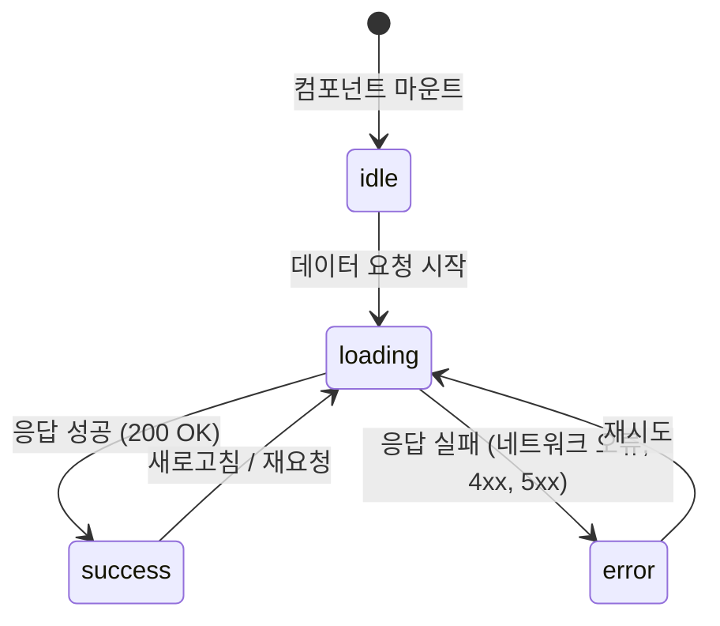

# 섹션 01: API 연동

## 난이도: ★★★☆☆ (3/5)

## 학습 목표

이 섹션을 마치면 다음을 할 수 있습니다:

- fetch API를 사용하여 외부 서버에서 데이터를 가져올 수 있다
- 로딩, 성공, 에러 상태를 구분하여 관리할 수 있다
- useEffect 안에서 데이터 페칭을 올바르게 수행할 수 있다
- 사용자에게 적절한 UI 피드백(로딩 스피너, 에러 메시지, 빈 상태)을 제공할 수 있다

---

## 1. 핵심 개념

### 1.1 왜 API 연동이 필요한가?

대부분의 실제 웹 애플리케이션은 서버에서 데이터를 가져와 화면에 표시합니다. 예를 들어:

- 쇼핑몰: 상품 목록을 서버에서 불러옴
- SNS: 게시글, 댓글을 서버에서 가져옴
- 날씨 앱: 기상 정보 API에서 데이터를 받아옴

React에서는 **fetch API**와 **useEffect**를 조합하여 데이터를 가져옵니다.

### 1.2 fetch API 기초

`fetch`는 브라우저에 내장된 HTTP 요청 함수입니다.

```jsx
// 기본 사용법
const response = await fetch("https://api.example.com/data");
const data = await response.json();
```

**주요 특징:**
- `fetch()`는 **Promise**를 반환합니다
- `response.json()`으로 JSON 데이터를 파싱합니다
- HTTP 에러(404, 500 등)에서도 `fetch`는 reject되지 않으므로 `response.ok`를 확인해야 합니다

```jsx
const response = await fetch("https://api.example.com/data");

if (!response.ok) {
  throw new Error(`HTTP 에러: ${response.status}`);
}

const data = await response.json();
```

### 1.3 데이터 페칭의 세 가지 상태

API 호출에는 항상 **세 가지 상태**가 존재합니다:

```
┌──────┐    요청 시작    ┌─────────┐    성공    ┌─────────┐
│ idle │ ──────────────→ │ loading │ ────────→ │ success │
└──────┘                 └─────────┘           └─────────┘
                              │
                              │ 실패
                              ▼
                         ┌─────────┐
                         │  error  │
                         └─────────┘
```

| 상태 | 의미 | UI 표시 |
|------|------|---------|
| idle | 아직 요청 전 | 초기 화면 또는 빈 화면 |
| loading | 데이터를 가져오는 중 | 로딩 스피너, "로딩 중..." 메시지 |
| success | 데이터를 성공적으로 받음 | 데이터 목록 또는 상세 화면 |
| error | 요청이 실패함 | 에러 메시지, 재시도 버튼 |

---

## 2. 상세 설명

### 2.1 데이터 페칭 흐름 다이어그램



### 2.2 useEffect에서 데이터 페칭하기

React에서 데이터를 가져올 때는 **useEffect** 안에서 수행합니다. 컴포넌트가 화면에 나타난 후(마운트) 데이터를 요청하는 것이 일반적인 패턴입니다.

```jsx
import { useState, useEffect } from "react";

function UserList() {
  // 세 가지 상태를 각각 관리
  const [users, setUsers] = useState([]);       // 데이터
  const [loading, setLoading] = useState(false); // 로딩 상태
  const [error, setError] = useState(null);      // 에러 정보

  useEffect(() => {
    // 데이터 페칭 함수 정의
    async function fetchUsers() {
      setLoading(true);  // 로딩 시작
      setError(null);    // 이전 에러 초기화

      try {
        const response = await fetch("https://jsonplaceholder.typicode.com/users");

        if (!response.ok) {
          throw new Error(`HTTP 에러: ${response.status}`);
        }

        const data = await response.json();
        setUsers(data);   // 데이터 저장
      } catch (err) {
        setError(err.message);  // 에러 저장
      } finally {
        setLoading(false);  // 로딩 종료 (성공/실패 모두)
      }
    }

    fetchUsers();
  }, []);  // 빈 의존성 배열: 마운트 시 한 번만 실행

  // 상태에 따른 조건부 렌더링 (아래에서 상세 설명)
}
```

**중요한 포인트:**
- `useEffect` 안에서 직접 `async` 함수를 사용할 수 없으므로, 내부에 `async` 함수를 정의하고 호출합니다
- `finally` 블록에서 `setLoading(false)`를 호출하면 성공/실패 모두 로딩이 종료됩니다
- 빈 의존성 배열 `[]`은 컴포넌트 마운트 시 한 번만 실행한다는 의미입니다

### 2.3 상태에 따른 조건부 렌더링

데이터 페칭 결과에 따라 **다른 UI**를 보여주는 것이 핵심입니다.

```jsx
function UserList() {
  const [users, setUsers] = useState([]);
  const [loading, setLoading] = useState(false);
  const [error, setError] = useState(null);

  // ... useEffect 생략 ...

  // 1. 로딩 중일 때
  if (loading) {
    return <div className="loading">로딩 중...</div>;
  }

  // 2. 에러가 발생했을 때
  if (error) {
    return (
      <div className="error">
        <p>오류 발생: {error}</p>
        <button onClick={() => fetchUsers()}>다시 시도</button>
      </div>
    );
  }

  // 3. 데이터가 비어있을 때
  if (users.length === 0) {
    return <div className="empty">사용자가 없습니다.</div>;
  }

  // 4. 데이터가 있을 때
  return (
    <ul>
      {users.map((user) => (
        <li key={user.id}>{user.name} - {user.email}</li>
      ))}
    </ul>
  );
}
```

### 2.4 통합 상태 관리 패턴

로딩, 에러, 데이터를 **하나의 객체**로 관리하면 코드가 더 깔끔해집니다.

```jsx
function UserList() {
  const [state, setState] = useState({
    status: "idle",  // "idle" | "loading" | "success" | "error"
    data: null,
    error: null,
  });

  useEffect(() => {
    async function fetchData() {
      setState({ status: "loading", data: null, error: null });

      try {
        const response = await fetch("https://jsonplaceholder.typicode.com/users");
        if (!response.ok) throw new Error(`HTTP ${response.status}`);
        const data = await response.json();
        setState({ status: "success", data, error: null });
      } catch (err) {
        setState({ status: "error", data: null, error: err.message });
      }
    }

    fetchData();
  }, []);

  // status 기반 조건부 렌더링
  switch (state.status) {
    case "idle":
      return <div>대기 중</div>;
    case "loading":
      return <div>로딩 중...</div>;
    case "error":
      return <div>오류: {state.error}</div>;
    case "success":
      return state.data.length === 0
        ? <div>데이터가 없습니다</div>
        : <ul>{state.data.map(u => <li key={u.id}>{u.name}</li>)}</ul>;
  }
}
```

이 패턴의 장점:
- **상태가 항상 일관적**: loading인데 에러가 남아있는 등의 버그를 방지
- **하나의 setState 호출**로 모든 상태를 한번에 업데이트
- **switch 문**으로 가독성 좋은 렌더링 분기

---

## 3. 흔한 실수와 주의사항

### 실수 1: useEffect에서 직접 async 사용

```jsx
// 잘못된 코드 (useEffect 콜백 자체를 async로 만들면 안 됨)
useEffect(async () => {
  const data = await fetch("/api/users");
  // ...
}, []);

// 올바른 코드 (내부에 async 함수를 정의하고 호출)
useEffect(() => {
  async function fetchData() {
    const data = await fetch("/api/users");
    // ...
  }
  fetchData();
}, []);
```

**이유:** useEffect의 반환값은 클린업 함수여야 합니다. `async` 함수는 Promise를 반환하므로 React가 예상하지 못하는 동작이 발생합니다.

### 실수 2: response.ok를 확인하지 않음

```jsx
// 잘못된 코드 (HTTP 에러를 놓침)
const response = await fetch("/api/data");
const data = await response.json();  // 404일 때도 실행됨

// 올바른 코드
const response = await fetch("/api/data");
if (!response.ok) {
  throw new Error(`서버 에러: ${response.status}`);
}
const data = await response.json();
```

### 실수 3: 언마운트된 컴포넌트에서 상태 업데이트

```jsx
// 메모리 누수 위험이 있는 코드
useEffect(() => {
  fetch("/api/data")
    .then(res => res.json())
    .then(data => setUsers(data));  // 컴포넌트가 이미 사라졌다면?
}, []);

// 안전한 코드: AbortController 사용
useEffect(() => {
  const controller = new AbortController();

  fetch("/api/data", { signal: controller.signal })
    .then(res => res.json())
    .then(data => setUsers(data))
    .catch(err => {
      if (err.name !== "AbortError") {
        setError(err.message);
      }
    });

  // 클린업: 컴포넌트 언마운트 시 요청 취소
  return () => controller.abort();
}, []);
```

---

## 4. 일반적인 UI 패턴

### 4.1 로딩 스피너

```jsx
function LoadingSpinner() {
  return (
    <div className="spinner-container">
      <div className="spinner"></div>
      <p>데이터를 불러오는 중...</p>
    </div>
  );
}
```

### 4.2 에러 메시지와 재시도

```jsx
function ErrorMessage({ message, onRetry }) {
  return (
    <div className="error-container">
      <p>오류가 발생했습니다: {message}</p>
      {onRetry && <button onClick={onRetry}>다시 시도</button>}
    </div>
  );
}
```

### 4.3 빈 상태

```jsx
function EmptyState({ message }) {
  return (
    <div className="empty-container">
      <p>{message || "표시할 데이터가 없습니다."}</p>
    </div>
  );
}
```

---

## 5. 연습문제 안내

`exercise.jsx` 파일에서 다음 문제를 풀어보세요:

1. **데이터 페칭 상태 관리** - idle, loading, success, error 상태를 관리하는 함수 구현
2. **비동기 데이터 페칭** - 비동기 함수를 실행하고 결과/에러를 관리하는 함수 구현
3. **데이터 표시 로직** - 상태에 따라 적절한 메시지를 반환하는 함수 구현

---

## 6. 핵심 요약

| 개념 | 설명 |
|------|------|
| fetch API | 브라우저 내장 HTTP 요청 함수, Promise 반환 |
| 데이터 페칭 상태 | idle → loading → success 또는 error |
| useEffect 패턴 | 내부에 async 함수 정의 후 호출 |
| response.ok | HTTP 상태 코드 확인 (200-299이면 true) |
| 조건부 렌더링 | 상태에 따라 로딩/에러/빈 화면/데이터 표시 분기 |
| AbortController | 언마운트 시 요청을 취소하여 메모리 누수 방지 |

> **다음 섹션 예고:** sec02-todo-app에서는 이 API 연동 패턴과 함께 CRUD 기능, 필터링 등을 결합하여 완전한 Todo 앱을 만들어봅니다.
