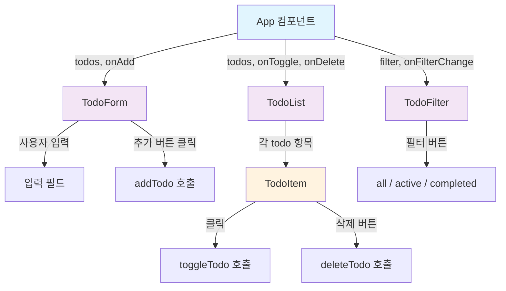
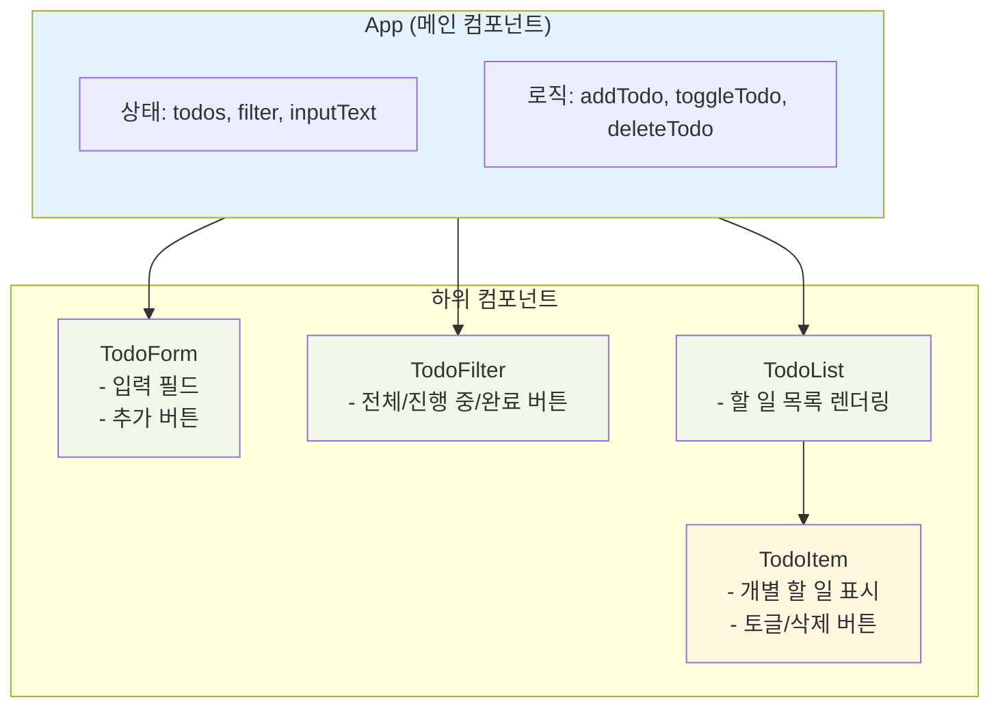

# 섹션 02: Todo 앱 만들기

## 난이도: ★★★☆☆ (3/5)

## 학습 목표

이 섹션을 마치면 다음을 할 수 있습니다:

- Todo 앱의 요구사항을 분석하고 상태 구조를 설계할 수 있다
- CRUD(생성, 읽기, 수정, 삭제) 기능을 불변 상태 업데이트로 구현할 수 있다
- 필터링(전체, 진행 중, 완료) 기능을 구현할 수 있다
- 컴포넌트를 적절히 분리하고 데이터 흐름을 설계할 수 있다

---

## 1. 핵심 개념

### 1.1 Todo 앱이 좋은 학습 프로젝트인 이유

Todo 앱은 간단해 보이지만, 실무에서 필요한 대부분의 패턴을 포함하고 있습니다:

| 기능 | 실무 대응 |
|------|-----------|
| 추가 (Create) | 폼 제출, 새 데이터 생성 |
| 읽기 (Read) | 목록 표시, 데이터 렌더링 |
| 수정 (Update) | 상태 토글, 내용 수정 |
| 삭제 (Delete) | 항목 제거, 데이터 정리 |
| 필터링 | 검색, 카테고리 분류 |

### 1.2 요구사항 정리

우리가 만들 Todo 앱의 기능:

1. **할 일 추가**: 텍스트를 입력하고 추가 버튼을 누르면 새 할 일이 생성됨
2. **완료 토글**: 할 일을 클릭하면 완료/미완료 상태가 전환됨
3. **할 일 삭제**: 삭제 버튼을 누르면 해당 할 일이 제거됨
4. **필터링**: 전체(all), 진행 중(active), 완료(completed) 필터로 목록을 걸러볼 수 있음

---

## 2. 상태 구조 설계

### 2.1 Todo 항목의 구조

```jsx
// 하나의 할 일 항목
const todo = {
  id: 1,            // 고유 식별자 (자동 증가)
  text: "React 공부하기",  // 할 일 내용
  completed: false,  // 완료 여부
};
```

### 2.2 앱 전체 상태

```jsx
// 앱에서 관리할 상태들
const [todos, setTodos] = useState([]);        // 할 일 목록
const [filter, setFilter] = useState("all");   // 현재 필터
const [inputText, setInputText] = useState(""); // 입력 필드 값
```

### 2.3 데이터 흐름 다이어그램



---

## 3. CRUD 구현 (불변 상태 업데이트)

React에서 상태를 업데이트할 때는 **원본 배열을 직접 수정하지 않고, 새 배열을 만들어야** 합니다. 이것이 **불변 업데이트(Immutable Update)** 패턴입니다.

### 3.1 Create (추가)

```jsx
function addTodo(text) {
  // 스프레드 연산자로 기존 배열을 복사하고, 새 항목을 추가
  const newTodo = { id: nextId++, text, completed: false };
  setTodos((prev) => [...prev, newTodo]);
}
```

**핵심:** `[...prev, newTodo]`는 기존 배열의 모든 요소를 펼치고 마지막에 새 항목을 추가한 **새 배열**을 만듭니다.

### 3.2 Read (읽기)

```jsx
// 단순히 todos 배열을 렌더링
{todos.map((todo) => (
  <TodoItem key={todo.id} todo={todo} />
))}
```

### 3.3 Update (수정 - 완료 토글)

```jsx
function toggleTodo(id) {
  // map으로 새 배열을 만들면서, 해당 id의 항목만 completed를 반전
  setTodos((prev) =>
    prev.map((todo) =>
      todo.id === id
        ? { ...todo, completed: !todo.completed }  // 해당 항목만 변경
        : todo  // 나머지는 그대로
    )
  );
}
```

**핵심:** `map`은 항상 새 배열을 반환합니다. 조건부로 특정 항목만 수정하고 나머지는 그대로 유지합니다.

### 3.4 Delete (삭제)

```jsx
function deleteTodo(id) {
  // filter로 해당 id를 제외한 새 배열 생성
  setTodos((prev) => prev.filter((todo) => todo.id !== id));
}
```

**핵심:** `filter`는 조건에 맞는 요소만 포함하는 **새 배열**을 반환합니다.

---

## 4. 필터링 구현

### 4.1 필터 상태와 필터링 로직

```jsx
const [filter, setFilter] = useState("all");

// 현재 필터에 따라 표시할 할 일 목록을 계산
function getFilteredTodos() {
  switch (filter) {
    case "active":
      return todos.filter((todo) => !todo.completed);
    case "completed":
      return todos.filter((todo) => todo.completed);
    case "all":
    default:
      return todos;
  }
}
```

### 4.2 필터 버튼 UI

```jsx
function TodoFilter({ filter, onFilterChange }) {
  const filters = [
    { key: "all", label: "전체" },
    { key: "active", label: "진행 중" },
    { key: "completed", label: "완료" },
  ];

  return (
    <div className="filters">
      {filters.map((f) => (
        <button
          key={f.key}
          className={filter === f.key ? "active" : ""}
          onClick={() => onFilterChange(f.key)}
        >
          {f.label}
        </button>
      ))}
    </div>
  );
}
```

---

## 5. 컴포넌트 분리

### 5.1 컴포넌트 구조



### 5.2 각 컴포넌트의 책임

| 컴포넌트 | 역할 | 받는 props |
|----------|------|-----------|
| App | 상태 관리, 로직 보유, 하위 컴포넌트 조합 | 없음 (최상위) |
| TodoForm | 새 할 일 입력 UI | onAdd |
| TodoFilter | 필터 버튼 UI | filter, onFilterChange |
| TodoList | 할 일 목록 렌더링 | todos, onToggle, onDelete |
| TodoItem | 개별 할 일 표시 | todo, onToggle, onDelete |

---

## 6. 전체 코드 워크스루

### 6.1 App 컴포넌트 (전체 조합)

```jsx
import { useState } from "react";

function App() {
  const [todos, setTodos] = useState([]);
  const [filter, setFilter] = useState("all");
  let nextId = 1;

  // 추가
  function addTodo(text) {
    if (text.trim() === "") return;  // 빈 입력 방지
    setTodos((prev) => [...prev, { id: nextId++, text, completed: false }]);
  }

  // 토글
  function toggleTodo(id) {
    setTodos((prev) =>
      prev.map((t) => (t.id === id ? { ...t, completed: !t.completed } : t))
    );
  }

  // 삭제
  function deleteTodo(id) {
    setTodos((prev) => prev.filter((t) => t.id !== id));
  }

  // 필터링된 목록
  const filteredTodos = todos.filter((todo) => {
    if (filter === "active") return !todo.completed;
    if (filter === "completed") return todo.completed;
    return true;
  });

  return (
    <div className="todo-app">
      <h1>할 일 목록</h1>
      <TodoForm onAdd={addTodo} />
      <TodoFilter filter={filter} onFilterChange={setFilter} />
      <TodoList
        todos={filteredTodos}
        onToggle={toggleTodo}
        onDelete={deleteTodo}
      />
    </div>
  );
}
```

### 6.2 TodoForm 컴포넌트

```jsx
function TodoForm({ onAdd }) {
  const [text, setText] = useState("");

  function handleSubmit(e) {
    e.preventDefault();       // 폼 기본 동작(새로고침) 방지
    onAdd(text);              // 부모에게 추가 요청
    setText("");              // 입력 필드 초기화
  }

  return (
    <form onSubmit={handleSubmit}>
      <input
        value={text}
        onChange={(e) => setText(e.target.value)}
        placeholder="할 일을 입력하세요"
      />
      <button type="submit">추가</button>
    </form>
  );
}
```

### 6.3 TodoItem 컴포넌트

```jsx
function TodoItem({ todo, onToggle, onDelete }) {
  return (
    <li className={todo.completed ? "completed" : ""}>
      <span onClick={() => onToggle(todo.id)}>
        {todo.completed ? "✅" : "⬜"} {todo.text}
      </span>
      <button onClick={() => onDelete(todo.id)}>삭제</button>
    </li>
  );
}
```

---

## 7. 흔한 실수와 주의사항

### 실수 1: 배열을 직접 수정 (Mutation)

```jsx
// 잘못된 코드 - 원본 배열을 직접 수정
function addTodo(text) {
  todos.push({ id: nextId++, text, completed: false });
  setTodos(todos);  // React가 변경을 감지하지 못함!
}

// 올바른 코드 - 새 배열을 생성
function addTodo(text) {
  setTodos((prev) => [...prev, { id: nextId++, text, completed: false }]);
}
```

**이유:** React는 이전 상태와 새 상태의 **참조(reference)**를 비교합니다. 같은 배열 객체를 넘기면 변경이 감지되지 않아 화면이 업데이트되지 않습니다.

### 실수 2: key를 인덱스로 사용

```jsx
// 좋지 않은 코드 - 삭제/정렬 시 문제 발생
{todos.map((todo, index) => (
  <TodoItem key={index} todo={todo} />
))}

// 올바른 코드 - 고유한 id 사용
{todos.map((todo) => (
  <TodoItem key={todo.id} todo={todo} />
))}
```

### 실수 3: 불변 업데이트에서 중첩 객체 처리

```jsx
// 잘못된 코드 - 중첩 객체를 직접 수정
todo.completed = !todo.completed;

// 올바른 코드 - 스프레드로 새 객체 생성
const updatedTodo = { ...todo, completed: !todo.completed };
```

---

## 8. 연습문제 안내

`exercise.jsx` 파일에서 다음을 구현하세요:

- `createTodoApp()` 함수를 만들어 Todo 앱의 핵심 CRUD 로직을 구현합니다
- `addTodo`, `toggleTodo`, `deleteTodo`, `getTodos`, `getFilteredTodos` 메서드를 구현합니다
- React의 `useState` 없이 클로저로 상태를 관리하여, 상태 업데이트 로직 자체에 집중합니다

---

## 9. 핵심 요약

| 개념 | 설명 |
|------|------|
| CRUD | Create(추가), Read(읽기), Update(수정), Delete(삭제) |
| 불변 업데이트 | 원본 배열을 수정하지 않고 새 배열을 만들어 상태 변경 |
| 추가 패턴 | `[...prev, newItem]` - 스프레드로 기존 복사 후 추가 |
| 수정 패턴 | `prev.map(item => 조건 ? {...item, 변경} : item)` |
| 삭제 패턴 | `prev.filter(item => item.id !== targetId)` |
| 필터링 | switch/if로 조건에 맞는 항목만 표시 |
| 컴포넌트 분리 | 관심사에 따라 Form, List, Item, Filter로 분리 |

> **프로젝트 완성:** 이 챕터의 두 섹션을 모두 마치면 API 연동 + CRUD + 필터링을 갖춘 완전한 React 앱을 만들 수 있는 역량을 갖추게 됩니다.
